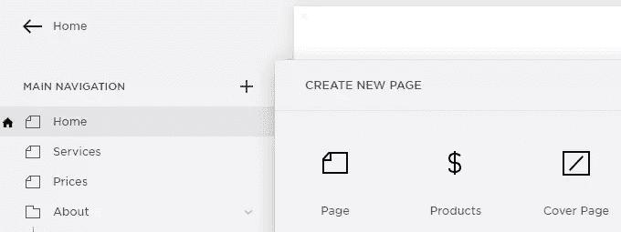
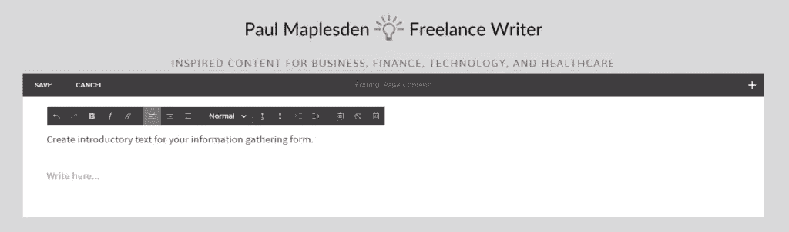
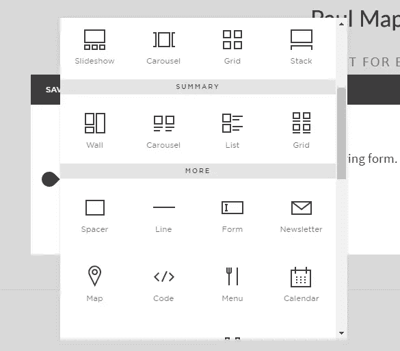
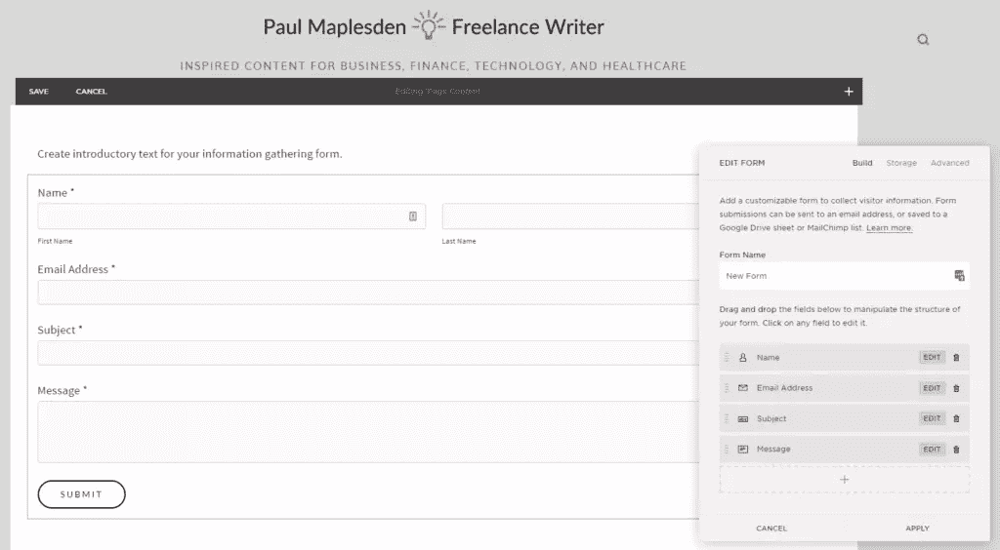
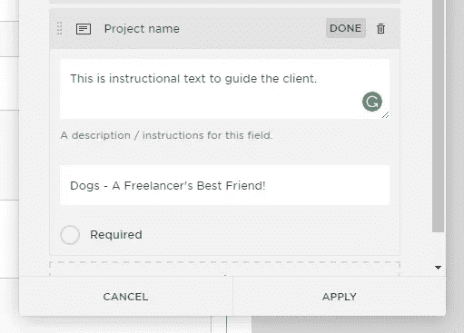
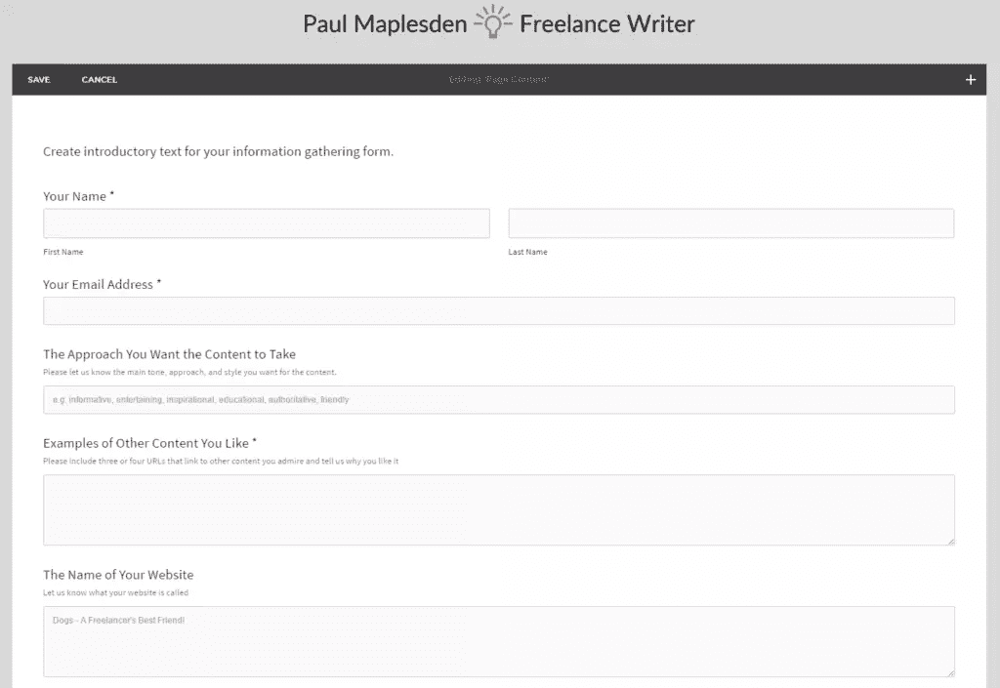
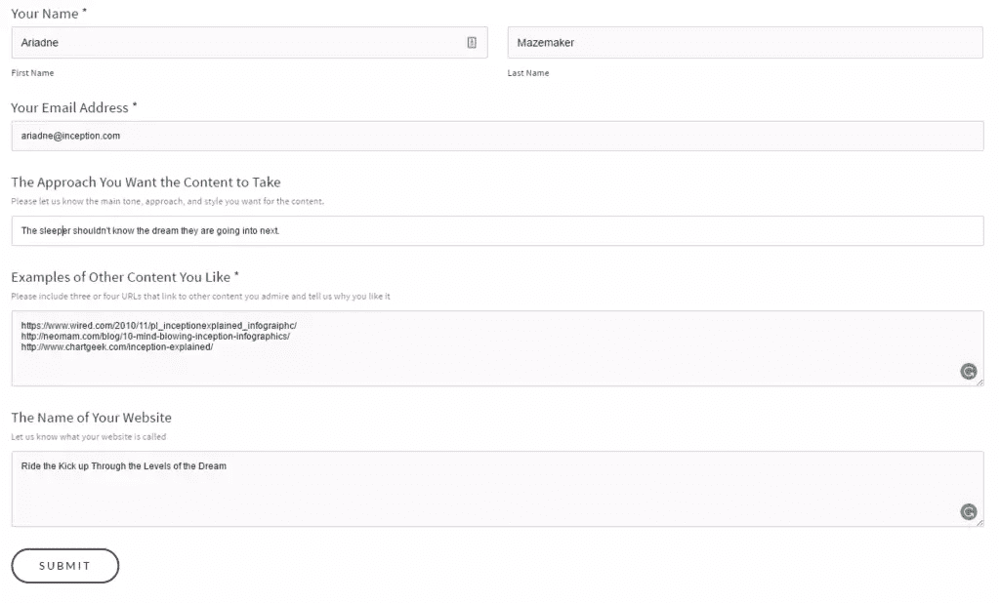
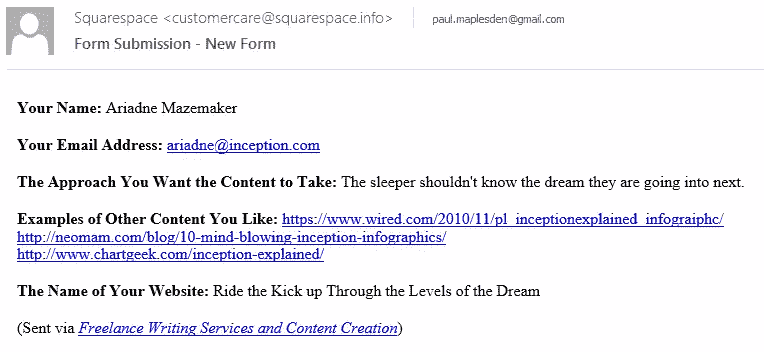

# 如何使用 Squarespace 表单创建完美的客户合同

> 原文：<https://www.sitepoint.com/how-to-create-perfect-client-contracts-using-squarespace-forms/>

*本文由 [Squarespace](http://bit.ly/2mVzpUI) 赞助。感谢您对使 SitePoint 成为可能的合作伙伴的支持。*

增强你的客户与你的业务互动的方式让你创造更好、更深、更有价值的客户关系。在竞争日益激烈的环境中，与客户建立信任对你的成功和长寿至关重要。你与客户的每一个接触点都是一个更好地了解他们、增强信任并最终让他们满意的机会。

这从客户第一次联系你开始，一直持续到入职，让你参与工作、沟通、范围界定、交付等等。这听起来很费力，但是 Squarespace 网站让整个过程变得更容易。

Squarespace 有一个易于使用的表单生成器，可以让您从客户那里收集重要信息。您可以将 Squarespace 表单与内置的 Google Docs 和 G Suite(以前的 Google Apps)集成在一起，使创建重要文档和管理客户关系变得轻而易举。

## 向客户展示专业形象的重要性

客户和顾客希望受到尊重、礼貌和专业的对待。这包括提供你要为他们做什么的文件。清晰、简洁的文档有助于:

*   消除混淆和歧义。
*   定义你要做的事情的范围——包括时间、预算和质量。
*   准确地陈述你将如何工作以及你将做什么。
*   确保每个人都努力达成共识。

这对所有类型的文档都有帮助，包括:

*   **合同**—定义你和客户如何合作的条款和条件。
*   提议——提供工作，解释你要做什么，要花多少钱，他们什么时候可以交货，以及其他各种各样的方面。
*   **工作说明书(SoW)**—类似于建议书，是一份正式文件，一旦客户聘用了你，你就与他们分享。
*   **项目细节和文件**—你为客户建造的项目的规格、要求和各种其他因素。
*   **简报**—关于你和客户将如何开展工作的各个方面的简报。这对自由职业者非常有用，尤其是设计师、作家和其他创意人员。

Squarespace 表单生成器可以在所有这些方面帮助你。

## 通过 Squarespace 表单收集信息如何帮助您和您的客户

你可能想知道为什么你要建立一个从客户那里收集信息的表格，而不是通过电话交谈，或者通过电子邮件、Skype 或 Slack 讨论事情。需要注意的是，表单并不是要取代其他的交流方式，但是使用 Squarespace 的表单生成器有几个很大的优势。

### 你可以问所有正确的问题

你可以收集所有你需要的问题，并以清晰一致的方式呈现给客户。你不需要记得通过其他交流方式询问具体的问题，因为一切都可以通过 Squarespace 表单获得。

### 你会得到一致、可靠、有效的答案

如果你以正确的方式提问，你可以获得高质量的、一致的信息。这使得整理您的合同、建议书、工作说明书或其他文档变得更加容易。它还使确定潜在工作的范围和提供价值定价变得更加容易。这会减少你和客户之间的任何模糊和混乱。

### 它指导和帮助客户思考他们的需求

问正确的问题有助于集中客户的注意力。当他们回答问题时，他们可以明确他们需要什么。在线表格也让客户在他们自己的时间回答，所以他们可以给答案适当的关注。

### 它确保您在正确的级别捕获正确的信息

在双向对话中，当涉及到需求收集时，很难保持在正确的轨道上。在线表单解决了这个问题，让您可以在正确的级别准确地获取正确的信息。

### 它减少了客户的摩擦

一份好的在线表格，以及你可以从答案中创建的文档，会给你的客户留下深刻印象。你可以生产高质量的产品，减少摩擦，建立信任，让你的工作关系有一个好的开始。

## 如何收集创建有效文档所需的信息

在你开始在 Squarespace 网站上使用表单构建器之前，花点时间规划一下你的表单是很重要的。这将使构建表单本身变得更加容易。

### 第一步。建立要创建的文档类型

对于不同类型的文件，你会问不同的问题——一份合同会有不同于建议书或项目简介的要求。首先要确切了解您将为哪种类型的文档收集信息。

### 第二步。创建一个没有任何客户端信息的文档版本

接下来，您将编写一个没有客户信息的文档版本。这将是进入所有此类文档的标准文本，带有占位符，用于输入客户、项目和工作特定信息的区域。这将让你确切地了解你需要从客户那里得到什么信息来完成这份文件。

### 第三步。准确理解你需要收集什么信息并写下问题

现在您有了一个基本的文档，仔细检查每个占位符，并考虑您需要收集来完成每个占位符的客户信息。当你知道你需要什么信息时，你就可以写问题来收集这些数据。例如，如果文档中有一个最终完成日期，您可以问这样一个问题:“您需要这项工作在什么时候完成？”

将每个需要客户信息的占位符和区域与特定问题对应起来。

### 第四步。测试文档

现在，您已经有了占位符和每个占位符的客户问题，请浏览这些问题，确保它们能够以合适的方式得到回答。您应该能够将客户的回答集成到文档中，而不需要太多的手工操作或猜测。如果你做不到这一点，调整问题，让他们引导客户向你提供具体、有用的信息。

## 在 Squarespace 中构建您的表单

结合 Squarespace 的直观设计，您的准备工作将使构建表单变得快速而简单。以下是如何做到这一点。

### 第一步。为表单创建一个 Squarespace 页面

你需要在你的 Squarespace 网站上为每个信息收集表单设置一个独特的页面。这将减少客户的困惑，意味着您可以将他们发送到一个特定的页面来收集他们的需求。要在 Squarespace 中创建新页面:

1.  登录您的 Squarespace 帐户。如果你还没有 Squarespace 网站，[今天就开始免费试用](http://bit.ly/2mVzpUI)。当您决定订阅时，请务必使用优惠券“SITEPOINT ”,首次购买可享受 10%的优惠。
2.  在左侧的主菜单中，单击“页面”
3.  接下来转到“主导航”。点击+号，从弹出的菜单中选择“页面”。
    
4.  给页面命名，选择一个布局，然后点击“开始编辑”

### 第二步。向页面添加非表单元素

在创建表单之前，您需要添加任何非表单元素，如标题、介绍和结尾文本，以及您需要的任何其他内容。您可以使用标准的 Squarespace web 构建界面来实现这一点。

### 第三步。开始向页面添加表单元素

接下来，您将使用已经创建的问题添加表单元素。以下是如何做到这一点。

1.  选择要在页面上插入表单的位置，然后单击 Squarespace insert 小部件。
2.  Scroll down and under “MORE” click “Form”

    

3.  Squarespace will insert a default form.

    

4.  命名表单。
5.  删除现有字段。
6.  添加您需要的字段。当您单击底部的+号时，您可以选择要插入的字段类型。选择与您正在收集的信息最相关的类型。
    
7.  插入字段后，将您的问题作为表单字段名称粘贴进去。添加任何描述和占位符文本，使客户更容易填写信息。然后选择这是否为必填字段。
    
8.  继续操作，直到插入所有需要的字段。
    
9.  完成后，点击“保存”

## 第四步。测试你的表格

现在您已经创建了您的表单，请访问您的 live 网站上的页面并输入一些测试信息。点击“提交”, Squarespace 将默认把信息通过电子邮件发送给你。

如果您喜欢从电子邮件中提取信息并将其集成到您的文档中，那么就大功告成了，您只需将相关信息复制并粘贴到主控文档的占位符部分即可。或者，您也可以将 Squarespace 的表单生成器与 Google Docs / G 套件集成。

## 将您的表单与 Google Docs / Drive 和 G Suite 集成

Squarespace 的特点是集成了 Google Docs / Drive 和 G Suite(以前的 Google Apps)。这意味着您可以从表单中收集数据，保存到 Google Drive 中，并在那里进行处理。您将需要一个新的 G Suite 帐户，当您有一个帐户时，您可以使用它来存储表单数据，如下所示。

1.  在 Squarespace 表单选项中(通过在 Squarespace 中编辑表单来访问)，可以单击 storage 选项卡。然后选择要将表单存储连接到的位置，您可以从电子邮件地址(默认)、新的 Mailchimp 列表或 Google 表单中进行选择。
2.  假设您选择了 Google Drive，表单将自动在新的 Google 表单中保存响应。
3.  一旦您将表单连接到 Google Drive，您将需要登录您的 Google 帐户。Squarespace 将继续安装，包括要求您指定一个 Google 工作表来存储提交的内容。
4.  你可以[告诉 Google Sheets 在收到表单提交时给你发邮件](https://support.google.com/docs/answer/91588?hl=en)。
5.  一旦你完成了这些，试着提交一些测试，这样你就可以仔细检查每件事是否都如预期的那样工作。

你可以在这里找到将 Squarespace 表单连接到 Google Drive、Mailchimp 和另一个电子邮件地址[的全部细节。](http://bit.ly/2mOARsC)

一旦你设置了谷歌集成，你就可以将谷歌表单中的信息复制粘贴到你的文档中，然后再发送给客户端。

## 将客户信息整合到您的文档中

现在，您已经设置了从客户端收集信息并存储表单提交的所有技术，您需要将信息传输到您的文档中。在真实的客户面前测试几次你的表格，确保你以正确的方式提问，他们也以正确的方式回答。一定要完善你的表格，尽量减少你和客户的工作量。

一旦你相信了你所获得的数据的质量，就像建立一个好的、可靠的工作流程来将数据从你的电子邮件或谷歌表单转移到最终文档中一样简单。一旦你完成了这些，你就可以将文档发送给客户并开始你的工作。

我们希望这对您有所帮助。请记住:

1.  塑造专业形象至关重要。
2.  你可以通过以正确的方式与客户互动来做到这一点。
3.  Squarespace 提供了一个易于使用的表单生成器，让您收集客户信息。
4.  然后，您可以在合同、建议书、工作说明书、简报、项目说明或其他文档中使用该客户信息。
5.  使用表单来收集信息会使您和客户的事情变得更容易，减少混乱，让您收集一致、可靠的数据，并帮助客户考虑他们的需求。
6.  在构建表单之前，考虑一下需要问的问题和需要获取的数据。
7.  在 Squarespace 中构建并测试您的表单。
8.  如果需要，将您的表单与 Google Sheets 集成。
9.  将你获得的数据整合到你的正式文档中，然后发送给客户。

Squarespace 让创建专业、漂亮的网站变得容易。他们有全天候的友好客户支持和 14 天的免费试用。试用后，在结账时使用 code SITEPOINT，您的第一笔订单可享受 10%的折扣。

## 分享这篇文章