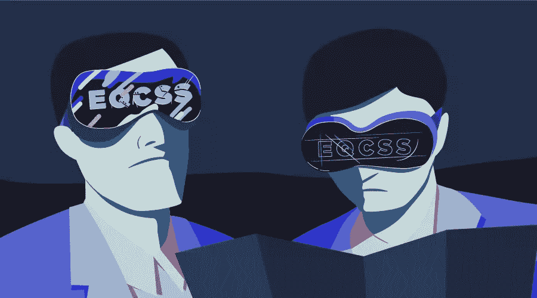

# 我们如何构建 EQCSS &为什么您也应该尝试构建自己的聚合填充

> 原文：<https://www.sitepoint.com/how-we-built-eqcss-why-you-should-try-building-your-own-polyfills-too/>



## 背景故事

2013 年，我在创建一个响应式 web 应用程序的前端，该应用程序有大量数据要显示。我使用`@media`查询做了很多响应设计，但是当我发现自己试图在另一个布局中重用一个布局中的组件时，我希望我的响应断点对应于元素的宽度，而不是浏览器的宽度。

这是 CSS 目前做不到的，所以我从一个模板到另一个模板复制粘贴了很多样式，主要只是改变了断点。我搜索了现有的解决方法，主要是工具和 JavaScript 插件，以帮助我自动化这个过程或为我输出重复的代码——但这些似乎都不是解决问题的完美方案。

我听说过 [Less](http://lesscss.org) ，这是一个 CSS 预处理器，可以让你编写包含额外功能的 CSS，比如标准 CSS 不包含的变量和函数。你可以在你的网站上添加一个小的 JavaScript 插件，允许浏览器读取这个非标准的 CSS，你所有的非标准代码会神奇地转换成浏览器理解的样式。我开始想知道是否有一种方法可以用同样的方式扩展 CSS 来解决我的问题！

### 插件的诞生

在这个过程中的某个地方，我遇到了一个叫马克西姆的令人惊讶的有创造力的程序员。我曾经是 Maxime 过去的一些项目的忠实粉丝，他对 CSS 和 JavaScript 的知识和理解远远超过我。有一天，当我在思考我在 CSS 方面的挑战时，我给他发了以下消息:

> 我需要一种编写 CSS 样式的方法，它可以让我:
> 
> *   基于元素的当前宽度指定不同的样式
> *   基于元素的当前高度指定不同的样式
> *   始终保持元素在其父元素内垂直居中
> *   始终保持元素在其父元素内水平居中
> *   根据元素的文本长度指定不同的样式
> *   根据元素包含的子元素数量指定不同的样式
> *   额外收获:允许我使用`<`选择器在 DOM 中向上导航
> 
> 如果我有一个这样的图书馆，我相信我可以设计出真正防弹和牢不可破的布局。我需要`@element`个查询！
> 
> 有没有可能以一种编写 CSS 的人看起来很熟悉的方式来编写这些样式，但却被 JavaScript 读取和执行？
> 
> JavaScript 是否能够解析文本(可能称为`.jss`文件或`<script type="text/jss">`，我可以在其中编写 CSS 块，但是用特殊的`@element`查询来包装它们，JavaScript 可以读取这些查询，并将计算出的样式应用到页面上？
> 
> ```
> @element('.widget-box', min-height: 500px) {
>   .widget-box {
>     background: red;
>   }
>   .widget-box a {
>     font-size: 18pt;
>   }
> }
> ```
> 
> 或者
> 
> ```
> @element('#username', min-length: 20) {
>   #username {
>     font-size: 8pt;
>   }
>   #username < label {
>     border: 1px solid red;
>   }
> }
> ```
> 
> 为了真正有用，对于已经知道 CSS 但不知道 JavaScript 的人来说，需要有一个小的学习曲线。他们应该能够将 JavaScript 库添加到一个站点，并编写自定义样式，让它在不需要任何自定义 JavaScript 的情况下工作。我猜这更像是一个聚合填充而不是插件: )
> 
> 这样的事情有可能吗？
> 
> -汤米 2014 年 12 月 5 日

我不确定我会得到什么样的回答。我已经试着自己开发了一些插件，但并不成功。作为一名 JavaScript 初学者，我能够自己构建的东西非常有限，我试图自己创建的所有解决方案最终都增加了更多的工作。对于一个真正有价值的解决方案，它应该*减少我的总体工作量*并使其更容易开发——它应该*消除约束*，而不是增加它们！

很快，我得到了马克西姆的回复:

> 你所有问题的答案都是肯定的。有可能。:)
> 
> 我在你的描述中没有看到一个任务，而是三个:
> 
> 您希望扩展 CSS 功能来做媒体查询还没有做的事情:根据元素的大小或文本内容的长度对元素应用某种样式
> 
> 您希望扩展 CSS 选择器来添加父选择器。
> 
> 您希望通过添加一种将任何内容垂直对齐到任何内容的方法来扩展常规的与流相关的 css 属性。这是 CSS 的三大圣杯，你把标准定得很高，:D
> 
> -麦希穆斯，2014 年 12 月 5 日

在接下来的几周里，通过往返于加拿大、法国和美国的电子邮件，马克西姆和我研究出了这种新语法的样子。我们用一种还不存在的语言编写和分享代码，讨论潜在的问题和解决方法，最终，他根据我认为我需要的东西，构建了 EQCSS JavaScript 插件的第[个版本](http://staticresource.com/jss.html)。

很快，我就能把这个插件用在我正在开发的网站上，到 2015 年 1 月，它首次用于生产。在接下来的几个月里，我们继续对它进行试验，添加新功能，改进支持和性能。自从最初编写插件以来，我已经学习了足够多的 JavaScript，能够排除故障、修复、维护，甚至添加我自己的新特性。

## 我为什么构建一个插件

当我想到我为什么花费这么多时间和精力来创建这样一个解决方案的原因时，我认为有几个不同的动机。第一个是我想要一个解决我每天在工作中面临的问题的方法；一些我可以立即使用的东西，从我使用它的第一天起就开始节省我的时间。

另一个动机是发现网络作为一个平台有多大的可塑性。有没有可能自己修改和扩展一种基本的 web 语言(CSS)并添加新的特性呢？你能做到什么程度？

这些理由足以让我开始，但现在我们有了一个可以与其他解决方案竞争的解决方案，还有额外的动机:我们能否改进我们的解决方案，并提出一个更标准化的方法来解决类似的问题，以便每个人都能受益？

## 构建插件的挑战

在创建这个项目时，我遇到了许多挑战。有些是语法本身，有些是编写插件，有些是在不同浏览器改变特性时保持对不同浏览器的支持，还有一些是在人类领域，帮助人们理解概念并充分利用插件提供的功能。

### 语法挑战

我们面临的一些语法挑战是试图将所有的语法限制在一种语言中:CSS。我们不希望用户必须向他们的 HTML 标记添加任何额外的内容，以便他们在 CSS 中编写的代码能够正常工作，并且我们希望避免用户需要自己编写自定义 JavaScript 来开始。

另一个挑战是设计足够有表现力的语法来处理我们需要立即支持的用例，同时提供足够的灵活性来允许用户根据需要编写他们自己的附加功能。在测试和添加新功能时，这种额外的灵活性对我们来说是一种好处，因为原型可以通过用插件编写自定义代码来生成，这种方式可以紧密地转换为需要添加到插件中以扩展它的代码。这个插件可以用来为自己设计新特性的原型，由于我们引入了这种额外的灵活性，我们添加新特性的速度已经提高了。

当发明任何新的语言特性时，就像我们对 CSS 所做的那样，重要的是以一种面向未来的方式设计您的语法，以防将来类似名称的特性被添加到语言中，而与您的实现不同。使用我们的插件，自定义语法可以从 CSS 中读取，但语法也可以作为一个单独的脚本类型直接从插件中加载，浏览器不会试图读取 CSS。由于这种自定义脚本类型，我们语法中的新术语可以与包含类似术语的其他语言共存于同一个代码库中，而不会相互冲突。

### 插件挑战

当我们试图构建一个插件时(我以前从来没有这么大规模地做过)，我们的目标之一是希望保持文件大小合理地小，并且保持源代码足够简单，以允许任何人根据他们的需要阅读、编辑和扩展插件。对我来说，我们添加的功能能够在 Internet Explorer 8 中工作也很重要。这需要的特定于 IE8 的代码量最终构成了整个代码库的很大一部分，但是我们能够以这样一种方式构建插件，即所有特定于 IE8 的代码都可以被隔离到它自己的文件中。这个附加文件只需要包含在需要 IE8 支持的项目中，在不需要 IE8 支持的项目中可以安全地省略。

### 浏览器挑战

当设计一个需要在网络浏览器中工作的插件时，你开始将网络浏览器视为移动的目标。我们最初在 Chrome、Safari、Firefox 和 Internet Explorer 中构建并测试了该插件，最初是 Internet Explorer 的遗留版本对该插件施加了最严格的限制。但在 2016 年初，在该插件投入生产一年后，我们收到了一份错误报告，称在新版 Firefox 中，一些带有该插件的页面出现了重大性能问题！我们没有改变任何代码——但是在调查了这个 bug 的不同 Firefox 版本后，Firefox 对页面滚动事件的看法似乎有所改变，它在我们的插件中触发了很多次不必要的重新计算。

修复 Firefox 的建议解决方案是在我们的插件中添加一个反跳机制——一段可以设置重新计算频率上限的代码。这将解决我们在 Firefox 中的问题，但在某种程度上影响了插件在所有浏览器中的工作方式，可能会带来不可预见的问题。更糟糕的是，在测试 Firefox 预发布版本的解决方案时，这个问题似乎在离发布还有几个月的 Firefox 版本中并不存在。知道其他人在使用我们的插件是很有压力的，除非我们发布一个补丁，否则世界各地的 Firefox 用户将会在几个月内看到一个降级的体验。最后，经过大量测试后，我们发布了一个补丁，增加了去抖动机制，为 Firefox 用户修复了错误，并提高了其他浏览器的性能。

### 模块挑战

最初，我们构建的插件像一个聚合填充(或一个垫片)一样工作。它被设计成直接在浏览器中运行，这使得它很容易在 CDN 上运行。没过多久，我们就开始收到 Webpack 用户的请求，他们正在使用 JavaScript 模块构建项目，并且想要一个如此打包的插件版本。令人欣慰的是，我们能够用来自 UMD 模块模板的代码包装现有的插件，将它变成一个模块。这个插件现在可以被像 Webpack 和 Browserify 这样的模块加载器加载。就像以前一样，如果你在模块加载器之外加载插件(比如直接在浏览器中链接到文件),插件仍然会像以前一样将自己附加到全局对象(浏览器),并正常运行。

### 文档挑战

构建新插件的最后一个挑战是寻找(或创建)词汇，让你可以谈论这些新概念如何工作，以及其他人如何从他们的项目中受益。随着时间的推移，通过与他人交流、编写规范、文档和许多文章，这种差距正在被弥合，但任何处理新技术或概念的插件在开始时都会面临类似的沟通差距。

## 你为什么要这样做呢？

在我有了构建插件的经验之后，我比以往任何时候都更加热衷于再次做同样的事情！感觉就像是*变魔术*去做一些你认为不可能的事情，体验那些面临同样问题的开发人员在意识到他们的问题最终如何解决时的反应是非常有益的。

与社区分享您的解决方案是一个双赢的局面。

*   每个人都从阅读您的代码和在工作中使用您的技术中受益
*   您将受益于将来有一个标准化的参考资料作为起点
*   通常，其他人会建议一些功能，并报告您遗漏的边缘案例，以帮助您改进解决方案

没有坏处！一旦你有了一个解决方案，如果是像我这样的语言特性，你可以通过为新特性编写一个规范来继续前进，并开始提议将它包含在该语言的标准中。

一旦你有了一个插件，你可以做的其他事情是利用这个解决方案来研究新的想法或概念，或者使用你的插件作为进一步插件实验的跳板。自从创建我的插件来解决我对元素查询的主要需求以来，我已经能够使用 [EQCSS](http://elementqueries.com/) 增强的能力和灵活性来研究和试验其他领域的 CSS 解决方案。我已经做了类似于[纵横比](http://codepen.io/collection/DjzJJx/)(CSS 目前没有属性的东西)和扩展 CSS 中的[属性选择器](http://codepen.io/tomhodgins/pen/KaKPOJ)的方法的实验，还有很多其他想法。

在这些实验之外，[新的插件正在被创建](https://github.com/tomhodgins/aspect-ratio-spec/)，希望它们也能被用来探索和发现更多的想法。

## 我唯一的遗憾是

在经历了这次变革之后，唯一痛苦的事情是意识到我们在最前沿的浏览器中得到的每一个功能都是我们在 IE8 中得到的。这意味着在 IE8 发布以来的这些年里*已经有可能做到这一切*，但是直到几个开源开发者合作并花了几周时间来构建一个插件，它才被完成。

如果我对整个过程有一点遗憾的话，那就是这个想法没有早点出现！如果有人在几年前就努力创建这样的插件，我们可能已经用这种方式建立网站很多年了。

## 展望未来

那么这对现在的意味着什么呢？有哪些解决方案*在今天*已经成为可能，并且不需要太多工作就能实现，但现在还不存在？如果你对某件事情有一个解决方案的想法，探索它并尝试构建它是有意义的，宜早不宜迟！

在这次经历之后，我对 web 开发的整个看法发生了变化，这种感觉让你早上从床上跳起来，对你睡觉时可能创建的、现在并不存在的东西感到兴奋。

所以我会问你:你面临什么挑战，你有什么解决这些挑战的想法？

## 分享这篇文章