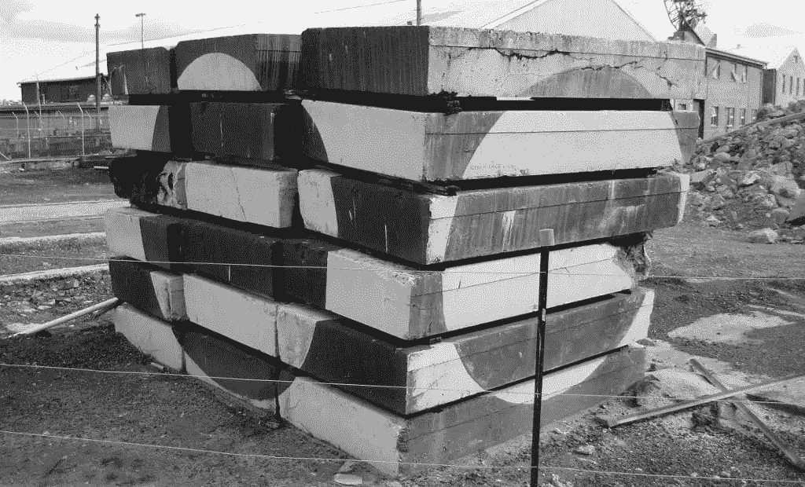
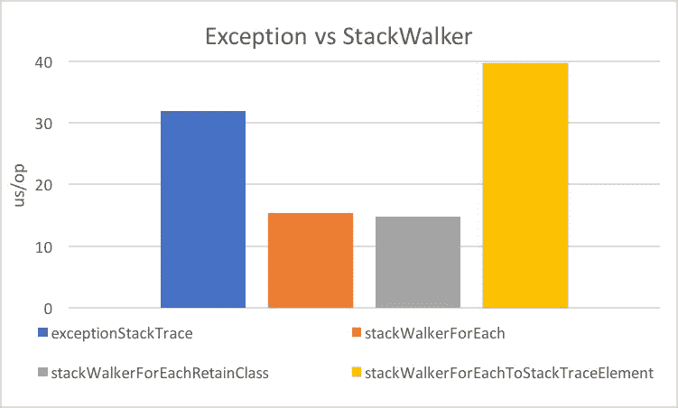
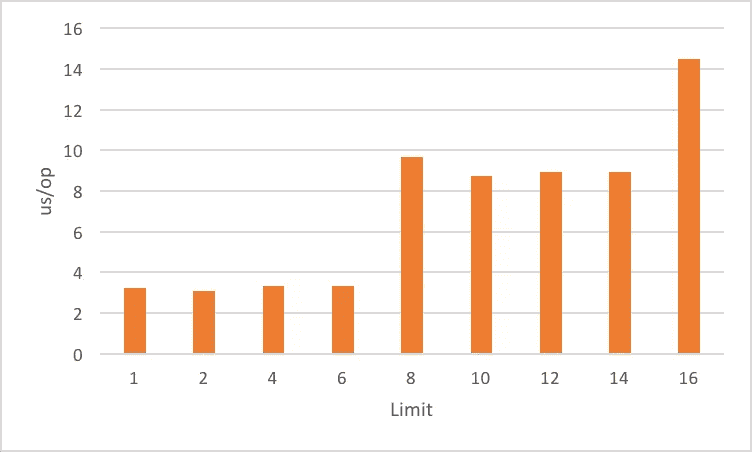
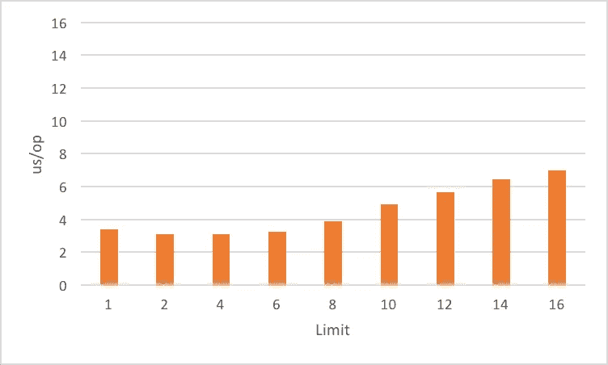
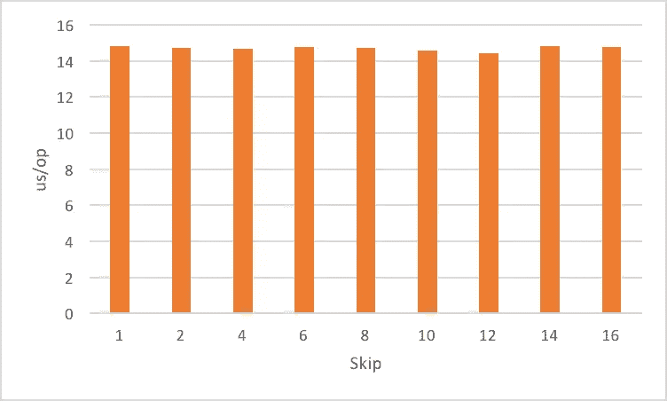

# 深入探究 Java 9 的堆栈审核 API

> 原文：<https://www.sitepoint.com/deep-dive-into-java-9s-stack-walking-api/>

### 目录 

*   谁给我打电话了？
*   [StackWalker 基础知识](#stackwalkerbasics)
*   [获得堆栈审核器](#gettingastackwalker)
*   [forEach 方法](#theforeachmethod)
*   [走到底](#walkthewalk)
*   [高级 StackWalker](#advancedstackwalker)
*   为什么采用一个函数而不是仅仅返回流？
*   [getCallerClass 方法](#thegetcallerclassmethod)
*   [堆栈框架](#thestackframe)
*   [stack walker 选项](#thestackwalkeroptions)
*   [框架可见性选项](#framevisibilityoptions)
*   [保留类引用](#retainclassreference)
*   [性能](#performance)
*   [异常 vs StackWalker](#exceptionvsstackwalker)
*   [部分堆栈捕获](#partialstackcapture)
*   [结论](#conclusion)
*   [评论](#comments)

作为 [Java 9](https://www.sitepoint.com/ultimate-guide-to-java-9/) 的一部分发布的[堆栈审核 API](http://openjdk.java.net/jeps/259) ，提供了一种访问执行堆栈的有效方式。(执行堆栈代表方法调用链——它从线程的`public static void main(String[])`方法或 run 方法开始，包含每个被调用但尚未返回的方法的框架，并在`StackWalker`调用的执行点结束。)在本文中，我们将探索堆栈审核 API 的不同功能，然后看看它的性能特征。

这篇文章需要 Java 的工作知识，特别是 lambda 表达式和[流](https://www.sitepoint.com/java-8-streams-filter-map-reduce/)。

## 谁给我打电话了？

有些情况下，您需要知道是谁调用了您的方法。例如，进行安全检查或识别资源泄漏的来源。每个方法调用都在堆栈上创建一个框架，Java 允许代码访问堆栈，所以它可以分析它。

在 Java 9 之前，大多数人访问堆栈信息的方式是通过实例化一个`Throwable`并使用它来获取堆栈跟踪。

```
StackTraceElement[] stackTrace = new Throwable().getStackTrace(); 
```

这种方法是可行的，但是它非常昂贵而且不实用。它捕获所有的帧——除了隐藏的帧——即使您只需要前 2 帧，并且不允许您访问声明该方法的实际的`Class`实例。要得到这个类，你需要扩展 [`SecurityManager`](http://download.java.net/java/jdk9/docs/api/index.html?java/lang/SecurityManager.html) ，它有一个受保护的方法 [`getClassContext`](http://download.java.net/java/jdk9/docs/api/java/lang/SecurityManager.html#getClassContext--) ，这个方法将返回一个数组`Class`。

为了解决这些缺点[，Java 9](http://openjdk.java.net/projects/jdk9/) 引入了新的堆栈审核 API(与 [JEP 259](http://openjdk.java.net/jeps/259) )。我们现在将探索 API 的不同功能，然后看看它的性能特征。

## `StackWalker`基础知识

Java 9 附带了一个新类型`StackWalker`，它提供了对堆栈的访问。我们现在将了解如何获取实例以及如何使用它来执行简单的堆栈审核。

### 得到一个`StackWalker`

使用静态`getInstance`方法可以很容易地访问`StackWalker`:

```
StackWalker stackWalker1 =
        StackWalker.getInstance();
StackWalker stackWalker2 =
        StackWalker.getInstance(RETAIN_CLASS_REFERENCE);
StackWalker stackWalker3 =
        StackWalker.getInstance(
               Set.of(RETAIN_CLASS_REFERENCE, SHOW_HIDDEN_FRAMES));
StackWalker stackWalker4 =
        StackWalker.getInstance(Set.of(RETAIN_CLASS_REFERENCE), 32); 
```

不同的调用允许您指定一个[选项](#thestackwalkeroptions)或一组选项，以及要捕获的帧数的[估计大小](#impactoflimitandestimatedsize)——我将在下面进一步讨论。

一旦你有了你的`StackWalker`,你可以使用下面的方法访问堆栈信息。

### `forEach`法

[`forEach`](http://download.java.net/java/jdk9/docs/api/java/lang/StackWalker.html#forEach-java.util.function.Consumer-) 方法会将所有未过滤的帧转发到指定的`Consumer<StackFrame>`回调。例如，要打印帧，您需要:

```
stackWalker.forEach(System.out::println); 
```

### 走完`walk`

[`walk`](http://download.java.net/java/jdk9/docs/api/java/lang/StackWalker.html#walk-java.util.function.Function-) 方法采用一个函数来获取堆栈帧流并返回所需的结果。它有以下签名(加上一些通配符，我删除了它们，使其更具可读性):

```
<T> T walk(Function<Stream<StackWalker.StackFrame>, T> function) 
```

你可能会问为什么它不直接返回`Stream`？让我们稍后再回到那个。首先，我们将看看如何使用它。例如，要收集一个`List`中的帧，您应该编写:

```
// collect the frames
List<StackWalker.StackFrame> frames = stackWalker.walk(
        frames -> frames.collect(Collectors.toList())); 
```

要计算它们:

```
// count the number of frames
long nbFrames = stackWalker.walk(
        // the lambda returns a long
        frames -> frames.count()); 
```

使用`walk`方法的一个很大的优点是，因为堆栈审核 API 延迟评估帧，所以使用`limit`操作符实际上减少了被恢复的帧的数量。下面的代码将检索前两个帧，正如我们将[在后面](#impactoflimit)看到的，这比捕获整个堆栈要便宜得多。

```
List<StackWalker.StackFrame> caller = stackWalker.walk(
        frames -> frames
                .limit(2)
                .collect(Collectors.toList())); 
```



[由](https://www.flickr.com/photos/roryrory/2759678880 "Source on Flickr")[罗里海德](https://www.flickr.com/photos/roryrory/ "Author on Flickr")在 [CC-BY-SA 2.0](https://creativecommons.org/licenses/by-sa/2.0/ "Link to Licence") 下发布/SitePoint 在同一许可下改变了着色和视野并共享

## 高级`StackWalker`

了解了如何获得 stack walker 以及如何使用它来访问框架的基础知识后，现在是时候转向更高级的主题了。

### 为什么取一个`Function`而不是只返回`Stream`？

当讨论堆栈时，最容易把它想象成一个稳定的数据结构，JVM 只在顶部变异，当方法进入或退出时，或者添加或删除单个的帧。然而，这并不完全正确。相反，你应该把栈看作是 VM 可以随时重构的东西(包括正在执行的代码中间)以提高性能。

因此，为了让 walker 看到一致的堆栈，API 需要确保堆栈在构建帧时是稳定的。只有在控制调用堆栈的情况下，它才能做到这一点，这意味着您对流的处理必须发生在对 API 的调用的*内。这就是为什么流不能被返回，而必须在对`walk`的调用中被遍历。(此外，`walk`回调是从 JVM 本地函数执行的，正如你在`StackStreamFactory`和`doStackWalk`上的`walk`的注释中看到的。)*

如果你试图通过[传递一个标识函数](https://github.com/arnaudroger/site-point-01_stackwalker/blob/master/src/main/java/org/github/arnaudroger/StackWalkerBadIdea.java#L17)来泄漏流，一旦你试图处理它，它就会抛出一个`IllegalStateException`。

```
Stream<StackWalker.StackFrame> doNotDoThat =
        stackWalker.walk(frames -> frames);
doNotDoThat.count(); // throws an IllegalStateException 
```

### `getCallerClass`法

为了使常见的情况快速而简单，`StackWalker`提供了一种优化的方法来获取调用者类。

```
Class<?> callerClass = StackWalker
        .getInstance(RETAIN_CLASS_REFERENCE)
        .getCallerClass() 
```

这个调用比通过`Stream`进行等效调用更快，也比使用`SecurityManager`更快(更多细节参见[基准](https://github.com/arnaudroger/site-point-01_stackwalker/blob/master/src/main/java/org/github/arnaudroger/StackWalkerGetCallerClass.java)

### `StackFrame`

方法`forEach`和`walk`将在流中传递 [StackFrame](http://download.java.net/java/jdk9/docs/api/index.html?java/lang/StackWalker.StackFrame.html) 实例或者传递给消费者回调。该类允许直接访问:

*   **字节码索引**:当前字节码指令相对于方法开始的索引。
*   **类名**:声明被调用方法的类名。
*   **声明类**:声明被调用方法的类的`Class`对象(你不能只使用`Class.forName(frame.getClassName())`，因为你可能没有权限`ClassLoader`；仅当使用了 [RETAIN_CLASS_REFERENCE](http://download.java.net/java/jdk9/docs/api/java/lang/StackWalker.Option.html#RETAIN_CLASS_REFERENCE) 时才可访问。)
*   **方法名**:被调用方法的名称。
*   **是否本机**:方法是否本机。

它还提供了对文件名和行号的惰性访问，但这将创建一个`StackTraceElement`，它将把调用委托给它。创造`StackTraceElement`是[昂贵的](#exceptionvsstackwalker)，并且被推迟到第一次需要的时候。`toString`方法也委托给了`StackTraceElement`。

## StackWalker 选项

现在我们`walk`走完了，让我们看看不同的`StackWalker` [选项](http://download.java.net/java/jdk9/docs/api/java/lang/StackWalker.Option.html)的影响。因为它们中的一些处理具有特殊属性的帧，所以普通的调用层次结构不足以演示它们。因此，我们将不得不做一些更奇特的事情，在这种情况下，使用反射来创建一个更复杂的堆栈。

我们将研究由以下调用层次结构产生的帧:

```
public static void delegateViaReflection(Runnable task)
        throws Exception {
    StackWalkerOptions
        .class
        .getMethod("runTask", Runnable.class)
        .invoke(null, task);
}

public static void runTask(Runnable task) {
    task.run();
} 
```

`Runnable task`将是使用`StackWalker::forEach`打印堆栈的λ。执行堆栈包含了`delegateViaReflection`的反射代码和一个与 lambda 表达式相关的隐藏框架。

### 框架可见性选项

默认情况下，堆栈审核器将跳过隐藏和反射帧。

```
delegateViaReflection(() -> StackWalker
        .getInstance()
        .forEach(System.out::println)); 
```

这就是为什么我们只在自己的代码中看到帧:

> org . github . arnudroger . stack walk options . lambda $ main $ 0(stack walk erooptions . Java:15)org . github . arnudroger . stack walk erooptions . run task(stack walk erooptions . Java:10)org . github . arnudroger . stack walk erooptions . delegate areflection(stack walk erooptions . Java:6)org . github . arnudroger . stack walk erooptions . main(stack walk erooptions . Java:15)

使用 [`SHOW_REFLECT_FRAMES`](https://github.com/arnaudroger/site-point-01_stackwalker/blob/master/src/main/java/org/github/arnaudroger/StackWalkerOptions.java#L18) 选项，我们将看到反射帧，但隐藏帧仍被跳过:

```
delegateViaReflection(() -> StackWalker
        .getInstance(Option.SHOW_REFLECT_FRAMES)
        .forEach(System.out::println)
); 
```

> org . github . arnaud Roger . stackwalkeroptions . lambda $ main $ 1(stackwalkeroptions . Java:18)
> org . github . arnaud Roger . stackwalkeroptions . runtask(stackwalkeroptions . Java:10)
> **Java . base/JDK . internal . reflect . nativemethodaccessorimpl . invoke 0(Native Method)**
> Java . base/JDK . internal . reflect . nativemethodaccessorimpl . invoke(nativemethodaccessrimp

最后，用 [`SHOW_HIDDEN_FRAMES`](https://github.com/arnaudroger/site-point-01_stackwalker/blob/master/src/main/java/org/github/arnaudroger/StackWalkerOptions.java#L21) 输出所有的倒影和隐藏帧:

```
delegateViaReflection(() -> StackWalker
        .getInstance(Option.SHOW_HIDDEN_FRAMES)
        .forEach(System.out::println)
); 
```

> org . github . arnaud Roger . stackwalkeroptions . Lambda $ main $ 2(stackwalkeroptions . Java:21)
> **org . github . arnaud Roger . stackwalkeroptions $ $ Lambda $ 11/968514068 . run(未知来源)**
> org . github . arnaud Roger . stackwalkeroptions . runtask(stackwalkeroptions . Java:10)
> **Java . base/JDK . nativemethod internal . reflect**

### 保留类引用

默认情况下，如果您试图访问`getDeclaringClass`方法，它将抛出一个`UnsupportedOperationException`:

```
delegateViaReflection(() -> StackWalker
        .getInstance()
        .forEach(frame -> System.out.println(
                "declaring class = "
                // throws UnsupportedOperationException
                + frame.getDeclaringClass()))); 
```

您需要添加 [`RETAIN_CLASS_REFERENCE`](http://download.java.net/java/jdk9/docs/api/java/lang/StackWalker.Option.html#RETAIN_CLASS_REFERENCE) 选项来访问它。

```
delegateViaReflection(() -> StackWalker
        .getInstance(Option.RETAIN_CLASS_REFERENCE)
        .forEach(frame -> System.out.println(
                "declaring class = "
                + frame.getDeclaringClass()))); 
```

## 表演

新 API 的一个主要原因是提高性能，所以看一看并对其进行基准测试是有意义的。下面的基准测试是用 Java 微基准测试工具 [JMH](http://openjdk.java.net/projects/code-tools/jmh/) 创建的，它是一个很好的工具，可以在没有不相关的编译器优化(例如，死代码消除)的情况下测试小代码片段，从而使数字产生偏差。查看[GitHub 库](https://github.com/arnaudroger/site-point-01_stackwalker)中关于如何运行它的代码和指令。

### `Exception`对`StackWalker`

在这个[基准测试](https://github.com/arnaudroger/site-point-01_stackwalker/blob/master/src/main/java/org/github/arnaudroger/StackWalkerVsExceptionBenchmark.java)中，我们比较了通过 [`Throwable`](https://github.com/arnaudroger/site-point-01_stackwalker/blob/master/src/main/java/org/github/arnaudroger/StackWalkerVsExceptionBenchmark.java#L31) 和通过 [`StackWalker`](https://github.com/arnaudroger/site-point-01_stackwalker/blob/master/src/main/java/org/github/arnaudroger/StackWalkerVsExceptionBenchmark.java#L39) 获取堆栈的性能。为了公平竞争，我们使用`StackWalker::forEach`，从而强制创建所有帧(因为使用`Throwable`做同样的事情)。对于新的 API，我们还区分了在`StackFrame`上操作和创建更昂贵的`StackTraceElement`。



我们可以看到:

*   只要不实例化`StackTraceElement`,`StackWalker`比异常更快。
*   实例化一个`StackTraceElement`是相当昂贵的，所以要小心`getFileName`、`getLineNumber`和`toString`。
*   获得对声明类的访问是没有成本的，这只是一个访问检查。

### 部分堆栈捕获

当捕获整个堆栈时,`StackWalker`已经更快了，但是如果我们只获取堆栈帧的一部分呢？我们希望帧的惰性评估能够进一步提高性能。为了探索这一点，我们在它交给我们的流上使用了`StackWalker::walk`和`Stream::limit`。

#### `limit`的影响

让我们来看一个基准测试，它将[捕获具有不同限制的堆栈](https://github.com/arnaudroger/site-point-01_stackwalker/blob/master/src/main/java/org/github/arnaudroger/StackWalkerLimitBenchmark.java):

```
StackWalker
    .getInstance()
    .walk(frames -> {
            frames.limit(limit).forEach(b::consume);
            return null;
        }); 
```

(`b::consume`中的`b`是 JMH 级，[中的`Blackhole`](http://hg.openjdk.java.net/code-tools/jmh/file/ed0a5f40acfb/jmh-samples/src/main/java/org/openjdk/jmh/samples/JMHSample_09_Blackholes.java#l93) 。它确保某些事情确实发生了，以防止死代码的消除，但要迅速，以防止扭曲的结果。)

结果如下:



似乎有一个阈值效应，成本在 8 和 16 增加。如果你看看`walk`是如何实现的，这并不奇怪。如果未指定估计大小，则`StackWalker`获取初始批次为 8 的帧，并在所有帧消耗完后获取另一批次的帧。

#### `limit`的影响和估计大小

如果我们指定估计的大小，我们能使调用更高效吗？我们将需要增加 2 到限制，因为前两个帧是保留的。我们还需要使用`SHOW_HIDDEN_FRAMES`选项，因为即使我们跳过隐藏和反射帧，它们也会占据一个位置。[基准](https://github.com/arnaudroger/site-point-01_stackwalker/blob/master/src/main/java/org/github/arnaudroger/StackWalkerLimitWithEstimatedSizeBenchmark.java)中的`StackWalker`调用如下:

```
int estimatedSize = limit + 2;
StackWalker
    .getInstance(Set.of(SHOW_HIDDEN_FRAMES), estimatedSize)
    .walk(frames -> {
            frames.limit(limit).forEach(b::consume);
            return null;
        }); 
```

正如您在这里看到的，阈值效应消失了:



#### `skip`的影响

如果`limit`降低了捕获的成本，那么`skip`有帮助吗？[另一个基准](https://github.com/arnaudroger/site-point-01_stackwalker/blob/master/src/main/java/org/github/arnaudroger/StackWalkerSkipBenchmark.java)检查`skip`对不同价值观的影响:

```
StackWalker
    .getInstance()
    .walk(frames -> {
            frame.skip(skip).forEach(b::consume);
            return null;
        }); 
```



正如你所料，`StackWalker`仍然必须走过跳过的帧，这没有任何好处。

## 结论

正如我们所见，堆栈审核 API 提供了一种简单的方法来访问当前的执行堆栈，只需编写:

```
StackWalker.getInstance().walk(frames -> ...); 
```

其核心特征是:

*   默认行为排除隐藏和反射帧，但选项允许包含它们
*   API 公开了声明类，这在过去是很难访问的
*   当您避免实例化`StackTraceElement`——包括`getLineNumber`、`getFileName`、`toString`——时，这比使用`Throwable`要快得多
*   通过使用`Stream.limit`减少恢复的帧数，可以进一步提高性能

## 分享这篇文章