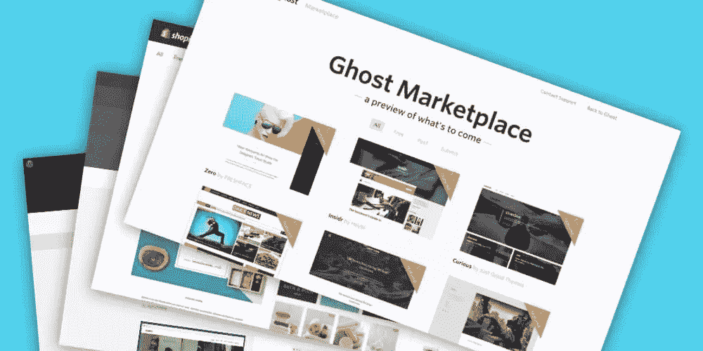
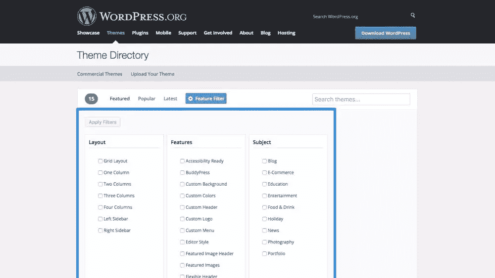
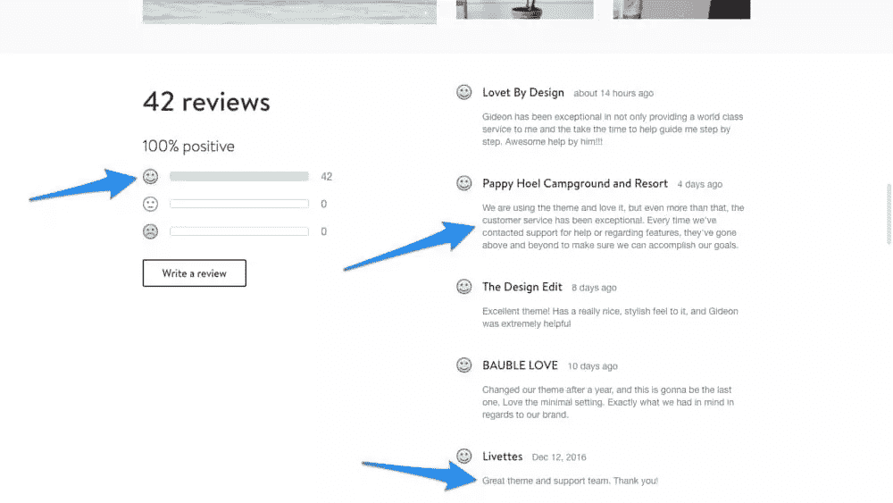

# 如何设计和销售主题(成功)

> 原文：<https://www.sitepoint.com/how-to-designing-and-selling-themes-with-success/>

> "设计主题，你还能靠这个赚钱吗？"

当然，当主题**设计得很好**，**被吹捧为高要求的客户群**，并且**的客户即使在销售后也受到很好的对待**，他们当然可以创造收入。但是你需要一个*计划*；你需要了解顾客的需求，以及他们在哪里购物来满足这些需求。先说主题创作的三个阶段:销售、设计、维护。

## 在哪里销售主题

大多数主题创作者无法赚取足够的收入，因为他们寻求的客户基础并不存在；他们渴望尝试新奇的潮流，这决定了他们主题的结果。如果你想知道为什么“销售”先于“设计”，那是因为你需要发现需求在哪里，然后提供那些客户正在寻找的东西。

避免试图设计“有史以来最美丽的主题”并默认上传到网上最大的市场。大型主题市场关注的是排名前 5%的卖家。如果你目前还不是，让你的主题在其他 95%的卖家中被发现是一件困难的工作。你就像大海捞针。

### 寻找需求

尽管广泛展开你的翅膀没有坏处，但营销需要时间，许多主题创作者选择“每个人”作为他们的目标人群(即上传到最大和最过饱和的市场)，浪费了很多时间。

首先看看 CMS 市场，比如 [WordPress](https://wordpress.org/themes/) 。普通的 HTML/CSS 主题很好，但是它们不适合 CMS 工作量很大(客户不喜欢额外的工作！)是将 HTML 转换成可用的 CMS 主题所必需的，所以不要让普通的 HTML 版本成为主题的焦点。

WordPress 实际上驱动了大约 25%的互联网，所以客户群肯定是存在的，但是*需求*存在吗？有无穷无尽的 WordPress 主题可供选择，*有很多竞争，所以为什么不调整你的焦点呢？*

如果你正在创建一个电子商务主题，你可以在 [Shopify marketplace](https://themes.shopify.com/) 上出售，或者你可以直接在 [Ghost marketplace](http://marketplace.ghost.org/themes/free/) 上出售博客主题。他们有更多的顾客吗？不，但是*竞争越少——市场越大，就越难在竞争中胜出。*

大多数寻找主题的客户会首先转向他们 CMS 自己的市场，因为所有列出的主题都是专门为 CMS 构建的；**那就是需求所在**。

大多数市场都有搜索过滤器——WordPress 也有——查看哪些类别缺少高质量的主题，或者使用已建立的社区来找出哪些类型的主题需求量大。

## 设计和编码主题

我们将跳过那些显而易见的建议，我告诉你带有文档化代码(对于基于代码的主题)和适当命名的层(对于 UI 工具包)的干净布局是必须的；让我们来关注一下你设计可用主题的整体方法。

### 灵活性

灵活性是构建特殊主题的关键。客户明白主题是卖给其他客户的，他们也明白你的主题可能不是 100%适合他们的需求——他们至少会想调整一下。如果你的主题不能轻易修改，它成功的机会很小。顾客需要在购买前了解这一点，所以你要精心设计一个描述来激发顾客对主题的信心，同时还要有一些主题文档，当顾客陷入困境时可以参考。

### 实体模型与 UI 套件

虽然这些术语主要适用于设计资源，但是它们也可以应用于编码主题，并且它们对应于你应该走多远来演示你的主题的用法。简而言之，UI 工具包由组成你的设计的单个元素组成(复选框、下拉列表等)，而模型是布局的一个完整的例子(有时是额外的变化)。

你应该尝试多少种变化？或者你应该简单地创建一个 UI 工具包，让客户添加他们自己的独特性？因为不同客户的熟练程度不同，所以最好两者都提供一点:客户可以构建自己的布局的分段 UI 工具包，或者客户可以调整一两件事情的完整示例。

*提示:如果你编写你的主题而不是仅仅提供一个设计文件，试试类似于 [Bootstrap](http://getbootstrap.com/) 的东西，在那里文档和类样式已经被定义了，你只需要在 Bootstrap 基础主题上创建视觉样式。*

## 维护文档并提供客户支持

你已经创建了一个主题，你已经把它上传到一个(或几个)市场，你甚至已经做了一些销售。你的工作已经完成了——还是已经完成了？维护主题和提供持续的客户支持实际上和设计主题本身一样重要。

当决定一个主题时，客户几乎肯定会阅读评论，看看以前的买家对它有什么看法。

### 文档和常见问题

从一开始，随着你的主题随着时间的推移而扩展，创建并维护一个文档(或者至少是一个简明的 FAQ ),以便大多数客户在需要帮助时可以参考它，而不必等待你的回复。

### 客户支持

回答关于主题的问题并提供客户支持是将感兴趣的买家转化为付费客户并获得评论的绝佳方式，这最终也会带来更多的付费客户。倾听顾客的要求也有助于你更多地了解他们的需求(即需求)，这将有助于塑造你主题的未来。

## 结论

设计、编码和销售主题可能会很有趣，但重要的是要记住，这种体验并不是为自己建造一个视觉游乐场。设计应该解决*问题*，所以倾听你的顾客和**他们的**需求。如果你想尝试网页设计的下一个大趋势，把它留给你的周末项目吧！

但最重要的是，玩得开心。

## 分享这篇文章