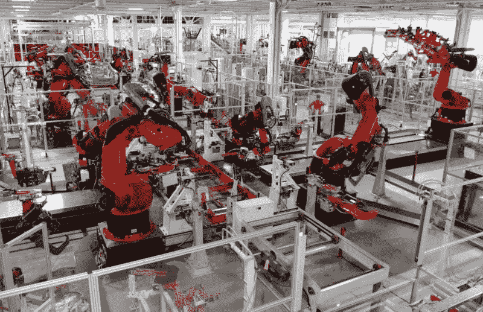
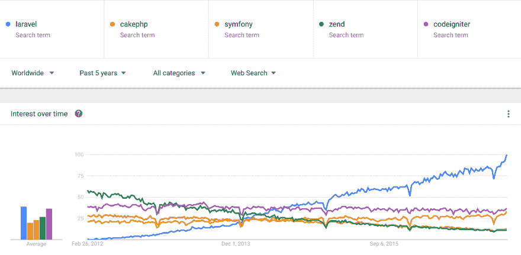

# 2017 年 PHP MVC 框架状态

> 原文：<https://www.sitepoint.com/the-state-of-php-mvc-frameworks-in-2017/>

*本文首发于 [ZenOfCoding](http://zenofcoding.com/2017/02/27/the-state-of-php-mvc-frameworks-in-2017-laravel-symfony-codeigniter-cakephp-zend/) ，经作者允许在此转载。*

* * *

一个简单的问题促使我坐下来写这篇文章，作为我大约一年前的文章的后续。

问:对今天的事情有什么想法吗？(2017 . 2 . 24)

**答:**“我要说，在这一点上，这很大程度上取决于拉腊维尔和 Symfony 说到 PHP 框架。我感觉用 CakePHP，Zend，CodeIgniter，Yii 等没有什么具体的价值。如果你开始一个新项目。

只有当你已经知道这些框架或者有习惯使用它们的开发人员时，我才能找到使用它们的理由。

当真正的开发开始时，你必须能够找到工具、插件和常见问题的答案。有了 Laravel 和 Symfony 社区以及新“模块”或功能的不断开发，您永远不会觉得自己落后了。单单是 Laracasts(即使你不在 Laravel 开发)简直太棒了。

无论是与诸如 iron.io 或其他 SaaS 提供商的服务集成、对各种数据源的支持，还是像 [Homestead](https://www.sitepoint.com/quick-tip-get-homestead-vagrant-vm-running/) 这样的本地开发环境，这些框架和支持模块都更加向前驱动。

Lumen 称赞 Laravel 的快速 API 开发是当今快速应用程序开发和原型制作的一个很好的方法。这并不是说它在某种程度上限制了(构建)更大的应用程序。

然而，总的来说，我们肯定会看到向基于容器的架构的转变，在这种架构中，MVC 扮演的角色要少得多。这一切都是关于微服务、编排和将应用程序构建为“功能”(即 AWS Lambda 和类似的服务)。也许是时候复习你的 Node/JS 和 GoLang 技能了:)”

虽然我对这个答案总体上感到满意，但我不禁想到，详细阐述其中一些要点，并重新审视事物的现状将是一个好主意。

在我进入像“GoLang”这样的奇怪话题之前，让我们实际上后退一步，看一下 PHP MVC 框架世界在 2017 年的趋势。

我想说，我们在过去观察到的趋势仍然存在。Laravel 仍在向前推进，而大多数其他人都在落后。Symfony 的受欢迎程度略有上升，可能是因为期待已久的 Symfony 3 的发布。

(我尝试了更具体的搜索来进行比较，比如“CakePHP 3”或“ZF2”，但是这些搜索并没有产生具有统计意义的趋势)。

今年我加入了 CodeIgniter，因为它非常受欢迎，这是显而易见的。我收到了许多关于 CodeIgniter 的问题，以及我对它在 PHP MVC 社区中的地位的看法…
长话短说，CI 仍然没有参与竞争，因为它不是一个真正的 MVC 框架。除了 POPO 的有组织的收藏，我不知道该叫它什么

让我们直接引用他们手册上的话:

> CodeIgniter 对 MVC 有一个相当宽松的方法，因为不需要模型。如果您不需要额外的分离，或者发现维护模型比您想要的更复杂，您可以忽略它们，并使用控制器和视图最小化地构建您的应用程序。

当谈到建立一个框架时，我完全不同意这种方法。也许这是一个不错的样板文件，因此 CodeIgniter 很受欢迎，但是框架必须执行一些规则，否则最终的产品会变成一堆杂乱的代码，包装成某种“模式”。

继续，Symfony 3 在开发者体验、依赖注入和许多其他特性方面给我们带来了一些不错的改进。像许多 PHP 同行一样，它现在提供了一个微框架。相比之下，ZF3 提供了一系列的改进，比如对 PHP7 的支持(最终),甚至是它自己的微框架……但是就像他们的手册所说的:

> 对于 Zend Framework 2 MVC 用户来说，区别是微妙的…

我真的希望他们会说，差异是巨大的，有一些伟大的架构改进，美妙的新模块，可以帮助你以现代的方式开发东西。唉，ZF3 在很大程度上仍然与 ZF2 非常相似。

## 长话短说

以下是我对当今 PHP 开发框架的看法:

1.  Symfony 或 Laravel，取决于您的需求
2.  其余的

毫无疑问，拉勒维尔抢尽了风头。可用的信息量、Laracasts、世界范围的开发人才、简单的模式实现、集成的测试工具集、Lumen 中雄辩的轻量级版本形式的活动记录实现、使用 Homestead(vagger)的本地开发使这个框架在新的和经验丰富的开发人员中真正脱颖而出。

然而雄辩的模型可能会变得难以驾驭，规模相当大，可能会创建太多的 Laravel 服务(不要与微服务混淆)，人们开始考虑不属于的存储库模式实现[。这样一个庞然大物就诞生了。](https://bosnadev.com/2015/03/07/using-repository-pattern-in-laravel-5/)

如果您对活动记录模式不太适应，并且需要增加存储库的灵活性，或者您可能会看到太多您喜欢的匿名函数，那么请使用 Symfony + Doctrine。我认为 Symfony 是通向单片应用的门户吗？在某种程度上，是的。然而，它可能是最优雅的一个。

总的来说，我不认为这是去年的巨大变化。尽管如此，我们需要看一看更大的图片:一个适当设计的应用程序不仅仅是 MVC 它是关于基础设施、部署管道、分离架构的。所有这些都可以在一个 MVC 栈中实现，但是需要特别小心以避免整体性。

## 微服务的出现

之前我提到了微服务的兴起，以及提高 GoLang 或节点技能的需要。的确，即使在 PHP MVC 的文章中，如果不提及一个明显发生的向面向微服务架构(MOA)的转变，那也是愚蠢的；它的势头越来越大，你不会相信的。

虽然这两个概念并不相互排斥，但没有理由试图在两者之间寻找相似之处，因为它们确实代表了不同的、尽管是交叉的哲学。

[举个例子](http://blog.danielcorreia.net/practical-docker-apache-php-and-mysql-cakephp-example/)，把你的 MVC 应用放在一个容器里，把 MySQL 放在另一个容器里，然后把它们链接在一起，不一定代表一个合适的 MOA。
这当然是一个更好的方法，事实上比试图安装 MAMP、XAMPP 或任何其他你需要的东西来让你的本地机器为应用服务要好得多。

此外，它可能会解决一些问题，例如跨不同平台(开发人员)运行本地环境的容易性，在某些情况下，可能还会解决部署策略的问题，但您会被应用程序层/容器中的 MVC 模块所困扰。

## 巨石的毁灭

这种“破坏”就是微服务的全部。虽然 MVC 通过提供一种可靠的方法来分离关注点，解决了你的代码结构和组织，但是容器/服务/MOA 进一步扩展了这个概念。

现在，您不是仅仅将您的视图从您的模型中分离出来，而是将应用程序的每个“块”或逻辑单元分离到一个单独的服务中，旨在正确处理其自身的职责。

如果你的 MVC 应用有一个“搜索”控制器、动作和相关的模型方法，那么我们已经有了一个整体应用的例子。

相比之下，使用 MOA 方法，我们可以为每一个处理单元提供服务。举个例子:

*   路由器服务
*   请求服务
*   咨询服务
*   数据源服务
*   响应服务

等等，难道所有这些“服务”不都是 MVC 堆栈的一部分吗？嗯，是的，没错。他们是我们的基石。

有了 MOA，每项服务都在自己的环境中运行，作为开发人员，但更多的是作为架构师，我们可以自由地设计解决特定需求的最佳方法。

例如，如果我要在 Laravel 环境中编写一个图像处理服务，我可能会使用 PHP-GD2 扩展之类的东西，这可能不是处理图像的最有效方式。一个处理我的图像处理需求的 C++服务，可能会快很多，而且在规模上肯定更健壮。更详细地说，我们现在可以将图像处理服务的输出发送给数据存储服务、CloudStorage 服务和队列电子邮件服务。

用一堆 cron 作业，可能还有几个独立的 MVC 应用程序和定制脚本来解决同样的挑战，这是我们过去(即 2 年前)的做法。是时候前进了。

## 可量测性

这是问题的开始(或结束，取决于你的方向)。一方面，很难扩展一个整体，如果你在同一个 MVC 堆栈中构建越来越多的逻辑，你可能会被一个非常复杂的结构良好的应用程序卡住。

另一方面，如果你用多种语言构建了一千个微服务，你如何管理这些混乱呢？

[有](https://thehftguy.com/2016/11/01/docker-in-production-an-history-of-failure/) [不止一个](http://www.heavybit.com/library/blog/realities-of-docker-in-production/) [灾难](https://techbeacon.com/containers-reality-check-why-theyre-still-not-production-ready)已经[上报](http://sirupsen.com/production-docker/)。

有各种各样的容器编排工具(如 Kubernetes、Swarm、Mesos)、容器部署服务(如 GKE 和 AWS ECS)，但是很少有企业采用 Docker 架构。在使用 Docker 或其他容器技术(如 GKE)构建基础设施方面，肯定有成功的案例。这些故事中的大部分来自有能力在架构师、开发人员、数据库管理员和工程师身上花费资源的公司。尽管如此，就目前的情况来看，关于如何部署一个精心设计的优雅的 MOA，仍有无数的争论。在这种情况下，一种尺寸肯定不适合所有人，有许多方法可以解决你的挑战。

无论哪种方式，你都不能独自解决这个问题(DevOps FTW！)，直到你达到一个相对大的规模，这个问题才真正需要解决。也许现在不是过度设计的时候。

今天(以及那些处理不太复杂或流量需求的应用程序)的一个折中方案是将许多典型的服务卸载给第三方提供商。现在几乎所有东西都可以作为服务提供。后台作业、图像处理、身份验证、数据分析、日志记录、电子邮件发送、队列系统不需要构建在同一个 MVC 堆栈中，而是架构师应该考虑哪些内容可以以较低的月成本卸载到 SaaS 系统(即 Algolia 的搜索)，或者可能是在某个多云空间运行的定制 docker 服务，该服务可以处理烦人的图像处理。

我想这里的要点是，你不应该首先跳入一个重新架构的项目，不要抛弃你今天拥有的一切，并在任何可以想象的地方发布 docker 群。有一些方法可以逐步推出一个改进的基础，方法是分离可能的东西，了解系统中的瓶颈，并将关注点分离的概念应用到这些问题领域。

## 结论

2017 年将为我们带来更多基于容器和 MOA 的对话和生产部署。我关于 Docker 的观点和漫谈，使用 GoLang 或 Node，并不意味着 PHP 正在“死亡”或任何类似的事情…我觉得作为开发人员，我们需要保持在事物的前沿，所以如果微服务是它所在的地方，那么为什么不学习 GoLang 呢？它非常适合(由于占用空间小、速度快和并行处理)开发小型容器化应用程序。Node 和 GoLang 很有趣，因为它们允许您构建小服务，这些服务都是一个更大部落的一部分，将它们链接在一起，如果您愿意，可以将它们作为一大群 Docker 容器发布。然而，所有这些令人惊叹的、前沿的解决方案和语言并不意味着 PHP 不再相关或者已经“死亡”。我们肯定会在一段时间内构建 MVC 栈和 API 端点。

MOA 还没有解决的一个问题是，虽然容器帮助我们消除了后端的整体性，但我们仍然面临着前端层、UI 或视图的许多架构问题。我们可以构建一个非常健壮的后端应用程序，但最终它会以 JSON 响应，而 JSON 必须以某种方式呈现在客户端应用程序中。如果最终的响应对象来自一个简单的 PHP，比如说，Lumen 驱动的端点(URL ),或者一个由消息接口解耦的决策和处理单元组成的管弦乐队，这有关系吗？事实上，这在很大程度上取决于您的需求和应用程序的要求。

今年，学习 Laravel 关注 Docker、GoLang，并明确关注部署渠道。从本地到生产应该比以前更加顺畅，尤其是在构建你的 MVC 应用的时候。

## 分享这篇文章