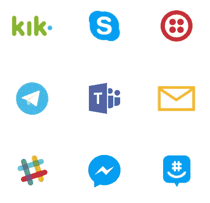
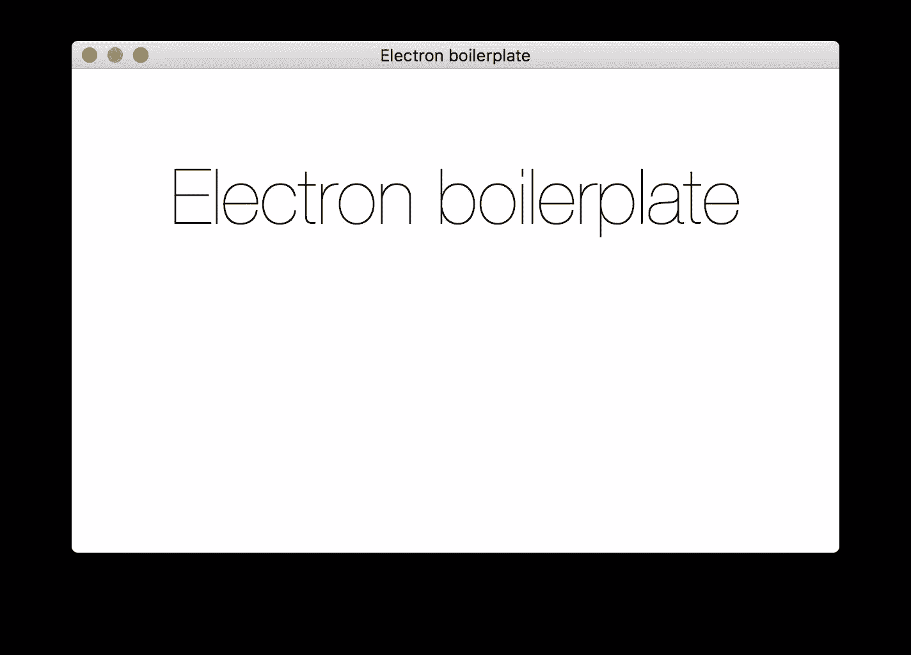
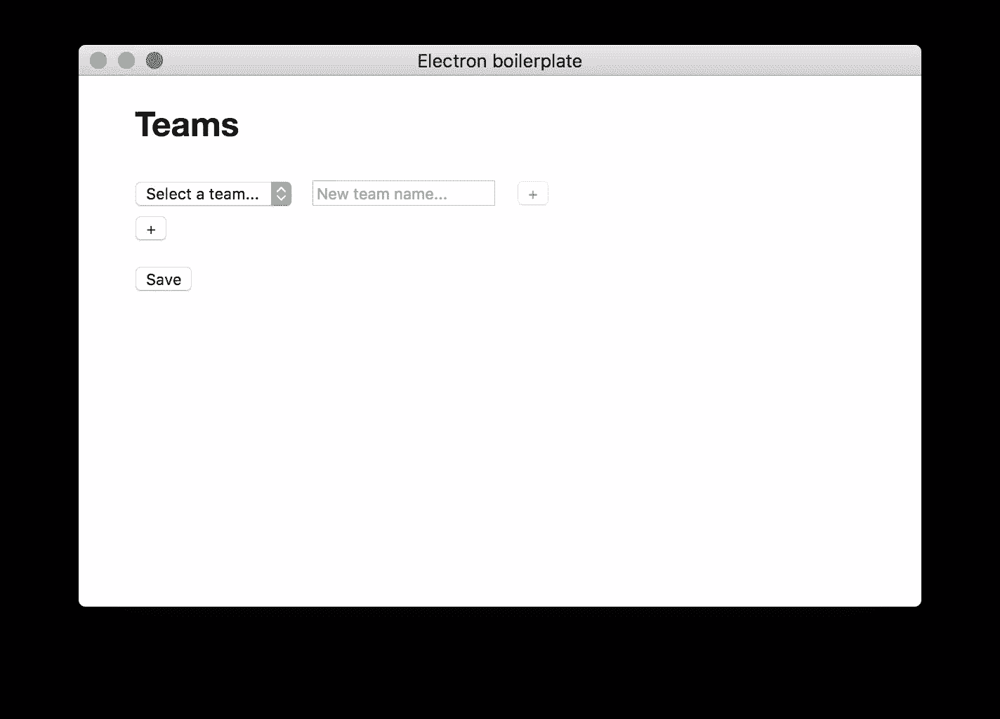
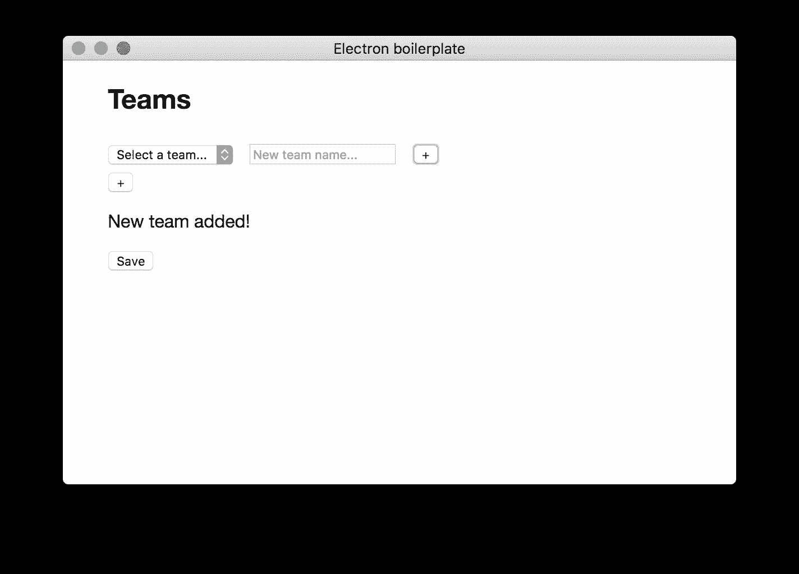
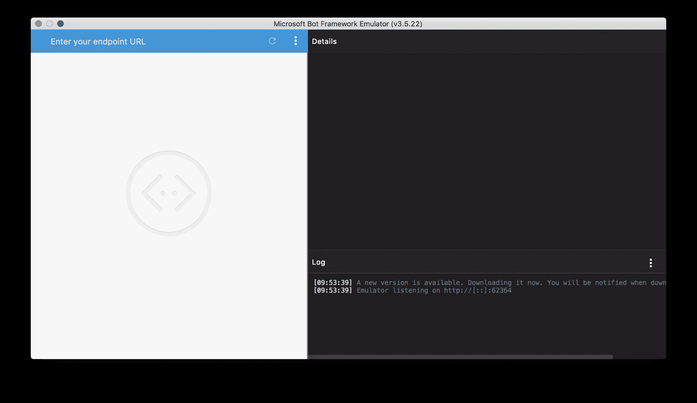
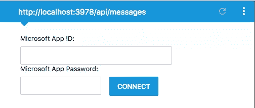
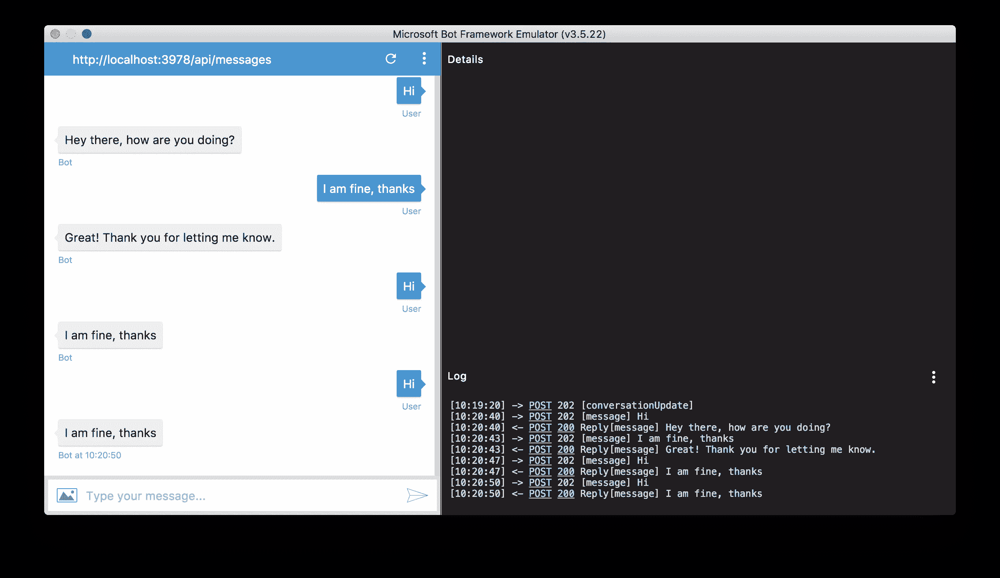
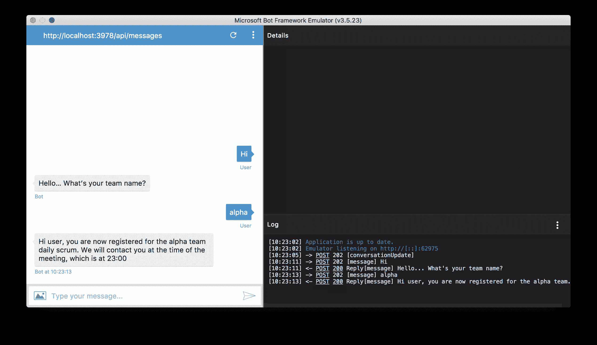
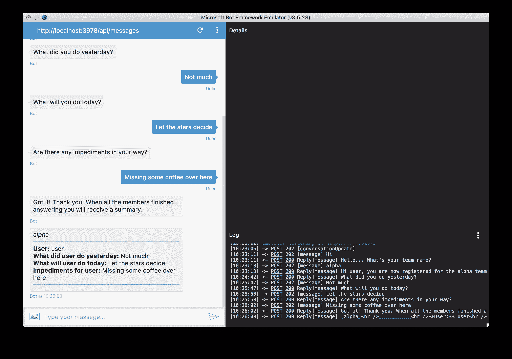

# 用电子制作 Skype 机器人&微软机器人框架

> 原文：<https://www.sitepoint.com/skype-bot-electron-microsoft-bot-framework/>


聊天机器人越来越受欢迎。脸书正致力于为构建信使机器人提供一个[框架，这将允许企业主完全在脸书的信息应用内建立他们的客户支持。](https://developers.facebook.com/docs/messenger-platform)[订购披萨](https://venturebeat.com/2016/09/15/dominos-now-lets-you-order-pizza-through-a-facebook-messenger-bot-in-the-u-s/)，安排下一次看医生，或者只是想在[找到下一次旅行最便宜的航班？](https://join.skype.com/bot/57bfbc6f-1556-46fc-b4fa-41ea57b26df6)在你的信息应用中找到一个机器人联系人，询问你需要什么，就像你询问你朋友列表中的人类联系人一样。

脸书消息产品副总裁 David Marcus 在 11 月的 Web Summit 上发表了一篇关于脸书参与聊天机器人的演讲，很明显，脸书有一个宏大的计划，让客户和企业主不仅能够将客户支持集成到 Messenger 聊天中，还能集成一些你通常会在网页或应用程序中看到的交互(例如，点餐、配置下一次购车等)。)。

在本教程中，我们将使用[电子](http://electron.atom.io/)和[微软机器人框架](https://dev.botframework.com/) (MBF)来创建一个用于日常 scrum 会议的 Skype 机器人。

## 外面是什么？

从技术角度来看，目前最流行的框架似乎是微软的机器人框架，它允许你将你的机器人与基本上所有流行的聊天工具连接起来。



但是还有其他的选择:

*   脸书的 [Messenger 平台](https://developers.facebook.com/docs/messenger-platform/product-overview)(仅限 Facebook Messenger)。
*   潘多拉机器人平台
*   Imperson 的[对话机器人](http://imperson.com/)
*   API . ai

## 关于我们的机器人

我们将创建配置 GUI，用于创建 scrum 团队和使用 electronic 添加成员，然后使用 MBF 创建一个机器人，它将读取配置并向所有添加的用户提示三个 scrum 每日会议问题。当每个人都提供了答案时，机器人将向团队中的所有参与者发送会议摘要。

### 橄榄球机器人？


不。我们不做橄榄球机器人。对于那些不熟悉 scrum 的人，这里有一个**TL；博士**:

Scrum 是一种方法论，它由敏捷开发过程(例如软件开发团队)的预定义规则和最佳实践组成，特别适用于大约 3-6 人的团队(非常粗略，变化很大)。这些规则/最佳实践可以包括如下内容(同样，非常粗略，并且变化很大，因为每个团队都根据自己的需要进行了一些调整):

*   任务是如何创建的，它们应该指定什么
*   根据以前完成任务所需的时间，计算团队多快能够交付产品的迭代。
*   每个团队成员的明确角色
    *   **产品负责人**:发号施令的人；与正在开发的产品的客户交谈，并根据客户的需求创建用户故事(任务的别出心裁的名称),然后开发人员可以自由选择这些故事
    *   开发人员:技术人员
    *   Scrum master :坐在你的脖子后面，确保整个团队遵守 Scrum 规则
*   喜欢团队交流，尤其是面对面的交流
*   **团队应该召开的会议**
    *   多久开一次会
    *   这些会议应该讨论什么

其中一个会议是每日 scrum 会议。通常在早上做的第一件事是，每个团队成员向团队的其他成员提供他们前一天工作的最新情况以及已经取得的进展。此外，每个团队成员都会透露他们今天的计划，最后但同样重要的是，任何障碍，尤其是那些会阻碍任务进一步发展的障碍。

每天的 scrum 会议通常是“现场”进行的，但是对于不同时区和/或不同地点的远程团队来说，这可能会造成问题。这就是我们正在制造的机器人的用武之地。

## 配置器 GUI

先决条件:

*   节点 JS
*   npm
    *   [botbuilder](https://www.npmjs.com/package/botbuilder)
    *   [重新定义](https://www.npmjs.com/package/restify)
    *   [fs-extra](https://www.npmjs.com/package/fs-extra)
*   JavaScript (ES6)
*   超文本标记语言
*   约曼发电机
    *   [发电机-电子](https://github.com/sindresorhus/generator-electron)

bot 和 configurator 的所有代码都可以在文章附带的库中找到。

### 样板文件

如果你对电子不熟悉，看一下这篇文章可能是个好主意，这篇文章描述了电子的基础知识以及它迅速流行的原因。[许多新出现的桌面应用程序都在使用 Electron](http://electron.atom.io/apps/) (例如 Slack，Visual Studio Code)。

为了设置样板代码，我们将使用一个 [Yeoman 生成器](https://github.com/sindresorhus/generator-electron)。

转到您希望项目驻留的文件夹，并运行以下命令

```
npm install -g yo generator-electron 
```

这将在您的机器上全局安装电子软件包。从这一点开始，你可以在任何你喜欢的地方调用电子发生器，这是我们的下一步:

```
yo electron 
```

这将为您提供运行“Hello World”电子应用程序所需的所有文件。它会自动运行`npm install`,所以一旦 Yeoman 完成，你就可以运行:

```
npm start 
```

您应该会看到一个新的应用程序窗口弹出。



### 入口点

[`index.js`](https://github.com/sitepoint-editors/scrum-bot/blob/master/index.js) 是申请的切入点。我建议你打开这个文件，自己看看发生了什么。

```
function createMainWindow() {
  const win = new electron.BrowserWindow({
    width: 600,
    height: 400
  });

  win.loadURL(`file://${__dirname}/index.html`);
  win.on('closed', onClosed);

  return win;
} 
```

通过调用 [BrowserWindow](https://github.com/electron/electron/blob/master/docs/api/browser-window.md#class-browserwindow) 类的构造函数，`createMainWindow()`将创建主窗口，在这里你可以提供一些窗口选项，如宽度、高度、背景颜色、[等等](https://github.com/electron/electron/blob/master/docs/api/browser-window.md#class-browserwindow)。

在这个函数中需要注意的一点是 [`win.loadURL`](https://github.com/electron/electron/blob/master/docs/api/browser-window.md#class-browserwindow) 方法。为什么这很重要？这里我们可以看到，app 的内容其实不是别的，只是一个 HTML 文件！没有魔法，也没有新的功能或框架来学习制作桌面应用程序。它所需要的是网络开发者的专业知识，从而使我们所有的网络开发者也成为桌面应用开发者！

```
const app = electron.app;

app.on("window-all-closed", () => {
  // ...
});

app.on('activate', () => {
  // ...
});

app.on('ready', () => {
  // ...
}); 
```

电子为我们提供了事件的回调，完整列表见[此处](http://electron.atom.io/docs/api/app/#events)。

*   *就绪*——如果你熟悉 jQuery，`ready`事件应该类似于`jQuery(document).ready()`。

*   *Activate*–Activate 在每次应用程序窗口获得焦点时发出。

*   *windows-all-closed*–当应用程序的所有窗口都关闭时触发，这使它成为进行任何清理的地方。小心这一点，因为在某些情况下[会被*而不是*调用](http://electron.atom.io/docs/all/#event-window-all-closed)(例如，如果你从代码中调用`app.quit()`，或者如果用户按下 Cmd + Q)。

### 应用程序逻辑

入口点文件`index.js`包含应用程序启动和退出的特定代码，更多地用于全局设置。我们没有把应用程序逻辑放在这里。正如我们已经看到的，应用程序本身只不过是一个 HTML 文件。因此，让我们前往`index.html`并为我们的配置器 GUI 添加一些元素。

```
<!doctype html>
<html>
  <head>
    <meta charset="utf-8">
    <title>Electron boilerplate</title>
    <link rel="stylesheet" href="index.css">
  </head>
  <body>
    <div class="container">
      <section class="main">
        <h2>Teams</h2>
        <div>
          <select id="teams">
            <option>Select a team...</option>
          </select>
          <input type="text" id="newTeamName" placeholder="New team name..."/>
          <button id="addTeam" disabled type="button">+</button>
        </div>

        <div id="members"></div>
        <button id="addMember" type="button">+</button>

        <p id="message"></p>
        <button id="save" type="button">Save</button>

      </section>
      <footer></footer>
    </div>
    <script src="app.js"></script>
  </body>
</html> 
```

用这段代码替换当前的 HTML 文件。在主体的最后，我们添加了对`app.js`脚本的引用，这是我们的 app 逻辑所在。请记住，电子窗口只不过是一个嵌入其中的浏览器窗口，因此在开发过程中，您可以使用标准的快捷方式来重新运行代码(F5、Ctrl + R)和打开类似 Chrome 的开发工具(F12)。

在项目的根目录下添加一个新文件，命名为`app.js`，将[中的代码粘贴到这里](https://github.com/sitepoint-editors/scrum-bot/blob/master/app.js)。这里没有什么新的东西，只是旧的 JavaScript。

对于持久化数据，我们将使用一个简单的 JSON 文件，这足以满足我们的需求。如果您想要扩展应用程序，这必须用数据库解决方案来代替。

有一个添加新团队的按钮，然后我们可以在每个团队中添加成员。每个成员在 Skype 上用他们的用户名来表示。后来，当我们开始制作机器人本身时，你会看到机器人模拟器内置了一个聊天客户端，用于测试。这个用户的用户名是*用户*。

此外，我们可以通过从下拉列表中选择团队名称来加载团队。在每个团队的底部，有一个输入框，代表我们应该召开每日 scrum 会议的时间。我们将把这个值保存为时间戳，它表示从午夜到会议时间的秒数。

现在让我们启动配置器，尝试添加一个团队和一个名为“user”的用户。






现在，我们可以从下拉列表中选择已添加的团队，并向其中添加一些用户。

> **重要提示:**你必须添加用户名为*用户*的用户，因为模拟器不能更改名称，这是硬编码的名称。为了让机器人在测试时识别我们，它必须是*用户*。

将时间设置为 00:00(或其他时间)，点击*保存*。

检查你的`teams.json`文件，这应该是它的内容:

```
{
  "alpha": {
    "members": {
      "user": {},
      "almir bijedic": {}
    },
    "time": 0
  }
} 
```

这将在以后被机器人使用。

## 机器人


### 微软机器人框架

MBF SDK 有两个版本:C#和 Node.js。我们将使用 Node 版本。该机器人通过一个 [REST API](https://docs.botframework.com/en-us/skype/chat/#rest-api) 工作，你可以手动调用，或者使用提供的开源 [SDK](https://github.com/Microsoft/BotBuilder) 。在本教程中，我们将使用 SDK，因为它更快。如果您需要将机器人与现有应用程序集成，或者如果您由于某种原因无法使用 Node.js/C#，那么调用带有自定义函数的 API**可能是一个更好的选择。**

对于本地测试 bot，有两个选项:

1.  使用[控制台连接器](https://docs.botframework.com/en-us/node/builder/chat-reference/classes/_botbuilder_d_.consoleconnector)，它允许你通过命令行与机器人对话，或者
2.  使用带有 [*restify*](http://restify.com/) (或其他东西)的 [ChatConnector](https://docs.botframework.com/en-us/node/builder/chat-reference/classes/_botbuilder_d_.chatconnector.html) 类来运行本地服务器，并运行由微软提供的 bot 模拟器，该模拟器充当本地机器上的虚拟用户。

我们将选择第二个选项，也就是说，“更真实”。

### 路线

构建聊天机器人的主要类叫做 [`UniversalBot`](https://docs.botframework.com/en-us/node/builder/chat/UniversalBot/) 。值得一提的是， [`UniversalCallBot`](https://docs.botframework.com/en-us/node/builder/calling/UniversalBot/#navtitle) 也是存在的，它允许你打电话，但我们不会在本教程中讨论。此外，聊天机器人的目的是让用户无需打电话就能进行互动，因为我们似乎更喜欢发短信而不是打电话。

为了确定机器人将如何回答来自用户的传入消息，我们使用 routes。这与传统的 web 应用程序非常相似，例如:

```
// bot is an instance of UniversalBot
bot.dialog("/", function (session) {
  session.send("Hello World");
}); 
```

注意这里的`bot`是`UniversalBot`类的一个实例。

这将在每次用户向机器人发送任何消息时向用户发回“Hello World”。

`bot.dialog()`有两个参数:路由，以及当路由激活时要执行的功能。在瀑布模型对话框的情况下(瀑布将在下一节中解释)，第二个参数可以是函数的一个*数组*，然后一个接一个地执行，从而与用户交互。

#### 初始设置

现在是尝试这个的好时机。回到你的电子项目，在里面添加一个名为`bot`的新文件夹。在那个文件夹中运行`npm init`并填写基本信息，你唯一需要输入的是作为入口点的`app.js`，和作为启动脚本的`node app.js`。完成后，在`bot`文件夹的根目录下创建一个新文件`app.js`。

现在我们需要为我们的机器人安装依赖项。

```
npm install --save botbuilder restify fs-extra 
```

接下来，转到我们在`bot`文件夹中创建的`app.js`文件，并包含我们需要的库。

```
// app.js

var restify = require("restify"),
  builder = require("botbuilder"),
  fse = require("fs-extra"); 
```

我们需要创建一个 *restify* 服务器，它将监听某个端口上的传入连接。

```
// app.js

// Setup Restify Server
var server = restify.createServer();
server.listen(process.env.port || process.env.PORT || 3978, function () {
  console.log("%s listening to %s", server.name, server.url);
}); 
```

现在我们将把 *restify* 服务器连接到 MBF bot REST 服务。

```
// Create chat bot
var connector = new builder.ChatConnector({
  appId: process.env.MICROSOFT_APP_ID,
  appPassword: process.env.MICROSOFT_APP_PASSWORD
});
var bot = new builder.UniversalBot(connector);
server.post("/api/messages", connector.listen()); 
```

您可以使用 Node 的`MICROSOFT_APP_ID`和`MICROSOFT_APP_PASSWORD`环境变量来提供您的登录凭证。这用于根据 Microsoft Bot 目录进行身份验证。

> **注意:**替代*聊天连接器*的是*控制台连接器*，它会在运行的应用程序的控制台中请求输入。这种方法不需要我们稍后将要安装的模拟器

最后但同样重要的是，在根路由上添加一个简单的对话框，它将只输出“Hello World！给用户。

```
bot.dialog("/", function(session) {
  session.send("Hello World!");
}); 
```

让我们从全局的角度来看看这一切是如何工作的，因为这可能有点令人困惑，我们在这里用`ChatConnector`做什么，以及我们为什么需要 restify 服务器。


用户将您的机器人添加为 Skype 联系人。

1.  用户从 Skype 客户端向机器人发送消息。该消息被发送到 Skype 的服务器，然后被路由到您之前注册的机器人。
2.  在注册过程中，您为 bot 提供了一个 https 端点，它指向运行 bot 代码的服务器。因此，Skype 的服务器会将消息转发到您的 restify 服务器，并附上消息的所有详细信息。
3.  ChatConnector 从 restify 服务器接收这个请求，并相应地处理它(如您所愿)。
4.  然后，Bot 框架 SDK 根据您的需求生成响应，并将其发送回服务器。在注册过程中，您指定了一个应用程序 ID 和密码，这是您的 bot 访问 Skype 服务器所必需的。bot 收到了 REST API 的位置以及步骤#2 中的消息。
5.  Skype 的服务器会识别该响应并将消息转发给用户。

为了测试我们刚刚制作的这个简单的机器人，我们必须下载并安装模拟器，它既充当客户端 Skype 应用程序(用户)，也充当 Skype REST API 服务器，这是上图的左侧部分。

前往[模拟器页面](https://docs.botframework.com/en-us/tools/bot-framework-emulator/)，下载、安装并运行它。



现在我们需要给模拟器提供运行 bot 代码的端点。

回到 bot 文件夹并运行`npm start`。您应该会看到类似这样的内容:

```
restify listening to http://[::]:3978 
```

您可以通过提供一个`PORT`节点环境变量或者通过在文件开头更改硬编码的回退值 3978 来更改这个端口。

这是本地主机上端口 3978 上的一个端点。让我们把它放入仿真器。此外，不要忘记我们正在监听 */api/messages* 路线。



将 Microsoft 应用 ID 和密码留空；因为我们正在本地运行测试，所以不需要这样做。点击*连接*。

现在你可以试试这个机器人。你总是会收到 Hello World 消息，因为这是我们目前为止配置的全部内容。


我们需要一个比这更聪明的机器人。在接下来的部分中，我们将实施以下路线:

*   **`/`**–根对话路由只有在已经注册的用户在 scrum 会议间隙向机器人发送消息时才会使用。我们添加它的唯一目的是向用户显示正在发生的事情，即使我们没有参加 scrum 会议或注册，机器人仍然在监听。
*   **`/firstRun`**–我们需要以某种方式注册用户并保存他们的地址，以便以后能够向他们发送消息。
*   **`/dailyScrumDialog`**——将有一个与`setInterval()`一起运行的计时器，它将检查所有团队的每日站立会议的时间。如果有一个团队的会议时间到了，查找所有向机器人注册的用户(注册是指已经在配置器中添加到团队中的用户，他们也已经将机器人添加为 Skype 上的联系人，并且他们已经向机器人发送了至少一条消息)。
*   **`/report`**–这里最简单的对话框，仅用于向团队所有成员发送会议报告。这将由与`setInterval()`一起运行的另一个函数触发，检查团队的每个成员是否已经回答完三个问题。如果是，将每个人的答案发给每个团队成员。

### 瀑布

瀑布是最基本的机器人对话类型。它确实像它听起来那样:它向下流动，没有回去。我们将一个函数数组作为第二个参数传递给机器人的`dialog`函数。每个功能都将被依次执行，前提是上一步有提示。

`builder.Prompts.text(session, "Message to send")`是请求用户输入的主要方式。在用户响应之后，执行数组中的下一个函数。这次它有两个参数:会话对象和包含用户消息的结果对象。

```
bot.dialog("/", [
  function (session) {
    builder.Prompts.text(session, "Hey there, how are you doing?");
  },
  function (session, results) {
    console.log(results.response); // This will print out whatever the user sent as a message
    session.send("Great! Thank you for letting me know.")
  }
]); 
```

用新的根对话框替换以前的根对话框，并试用它。

注意，我们还可以保存和持久化用户数据。

```
bot.dialog("/", [
  function (session) {
    if (session.userData.howIsHe) {
      session.send(session.userData.howIsHe);
    } else {
      builder.Prompts.text(session, "Hey there, how are you doing?");
    }
  },
  function (session, results) {
    session.userData.howIsHe = results.response;
    session.send("Great! Thank you for letting me know.")
  }
]); 
```

运行该命令将保存用户的响应，然后在下一条消息中向他们发送响应。



### 对话堆栈

正如已经暗示的，机器人通过对话组织聊天。当与用户的对话开始时，机器人将默认对话框推到堆栈顶部。然后，我们可以使用下列功能之一来重新路由到其他对话和/或结束它们。

#### session.beginDialog(route，args，next)

该函数停止当前对话框，将指定路线的对话框添加到堆栈顶部，一旦新调用的对话框完成，它将返回到前一个对话框中调用`beginDialog()`的点。

#### session.endDialog()

当我们调用`endDialog()`时，当前对话框从堆栈中弹出，我们返回到堆栈中的下一个对话框。

#### session . enddialogwithresult(args)

与`endDialog()`相同，不同之处在于我们可以传入一些变量供调用对话框(堆栈中的下一个对话框)使用。

#### session.replaceDialog(route，args，next)

万一我们*不想*在新对话框完成后返回到之前的对话框，我们可以用`replaceDialog()`代替`beginDialog()`。

#### session.cancelDialog(dialogId，replaceWithId，replaceWithArgs)

取消对话框会导致对话框弹出堆栈(取消)，直到到达具有所提供 ID 的对话框，然后对话框也被取消，控制权返回给原始调用方。然后，调用者还可以检查`results.resumed`变量来检测取消。

此外，也可以通过提供对话的 ID 来代替返回给原始调用者。

#### session.endConversation()

这是取消所有对话框的便捷方式。这基本上就像调用`session.cancelDialog(0)` (0 是堆栈上第一个对话框的 ID，因此所有的对话框都将被取消)。当您还想为用户清除会话数据时，这很方便。

### 首次运行中间件

在用户启动与机器人的对话之前，机器人不能与 Skype 用户(或任何其他聊天平台——别忘了 MBF 使用多个聊天客户端)交谈。有道理不是吗？主要是为了避免垃圾邮件。

为了能够启动对话，我们需要用户的地址(一个包含用户 ID 和会话 ID 的对象，等等)，因此，我们需要某种第一次运行的逻辑来存储用户的地址以备后用。

MBF 为我们提供了一个中间件，我们可以用它来指示一条路线，在对话第一次开始时，我们希望将用户指引到这条路线。

```
var version = 1.0;
bot.use(builder.Middleware.firstRun({ version: version, dialogId: "*:/firstRun" })); 
```

这将引导第一次注册的用户到“firstRun”路线，然后我们必须定义它。

```
bot.dialog("/firstRun", [
  function (session, args) {
    if (session.userData.user && session.userData.team) {
      session.userData["BotBuilder.Data.FirstRunVersion"] = version;
      session.replaceDialog("/dailyScrum");
    } else {
      builder.Prompts.text(session, "Hello... What's your team name?");
    }
  },
  function (session, results) {
    // We'll save the users name and send them an initial greeting. All
    // future messages from the user will be routed to the root dialog.
    var teams = readTeamsFromFile();
    var providedTeamName = results.response.toLowerCase();
    var user = session.message.user.name.toLowerCase();
    if (teams[providedTeamName] && Object.keys(teams[providedTeamName].members).indexOf(user) > -1) {
      teams[providedTeamName].members[user].address = session.message.address;
      writeTeamsToFile(teams);
      session.userData.user = user;
      session.userData.team = providedTeamName;
      session.send("Hi %s, you are now registered for the %s team daily scrum. We will contact you at the time of the meeting, which is at %s", user, providedTeamName, timeToString(teams[providedTeamName].time));
    } else {
      session.send("Wrong team! Try again :D (%s)", user);
      session.replaceDialog("/firstRun");
    }
  }
]);

function readTeamsFromFile() {
  return fse.readJsonSync("./data/teams.json");
}

function writeTeamsToFile(teams) {
  fse.outputJsonSync("./data/teams.json", teams);
}

function timeToString(time) {
  return pad(parseInt(time / 60 / 60 % 24)) + ":" + pad(parseInt(time / 60) % 60)
}

function pad(num) {
  var s = "0" + num;
  return s.substr(s.length - 2);
} 
```

我们在第二个参数数组中提供了两个函数，它们将被顺序调用。在用户对第一个请求做出响应后，第二个请求被调用。在本例中，我们提示用户输入带有`builder.Prompts.text(session, message))`的名称，然后在下一个例子中，我们通过搜索带有团队名称的 JSON 来处理所提供的团队名称。如果找到了团队名称，我们将用户名添加到 JSON 中，并发送一条消息通知用户他现在已经注册了，并将在 scrum 时间得到提示。

除了*/首次运行*对话框，我们还有一些帮助功能。

`readTeamsFromFile()`将从 JSON teams 文件中返回一个 JSON 对象。

`writeTeamsTofile()`将一个对象作为参数(在我们的例子中是 teams JSON)并将它写回磁盘。

`timeToString`将一个 UNIX 时间戳作为参数，并将解析后的时间作为字符串返回。

`pad`用于向字符串追加额外的零(例如，1 小时 3 分钟应该是 01:30，而不是 1:30)。

将前面的两个代码片段添加到我们的`bot/app.js`中，连同下面的代码包括来自 npm 的`fs-extra`库，让我们试一试。

```
var restify = require("restify"),
  builder = require("botbuilder"),
  fse = require("fs-extra"); 
```

在通过仿真器发送消息之前，一定要退出仿真器并重新启动(仿真器的*删除用户数据*功能有 bug)。



现在你可以进入`data/teams.json`文件，你会看到我们将模拟器用户的地址保存为一个对象。

```
{
  "alpha": {
    "members": {
      "user": {
        "address": {
          "id": "3hk7agejfgehaaf26",
          "channelId": "emulator",
          "user": {
            "id": "default-user",
            "name": "User"
          },
          "conversation": {
            "id": "5kaf6861ll4a7je6"
          },
          "bot": {
            "id": "default-bot"
          },
          "serviceUrl": "http://localhost:54554",
          "useAuth": false
        }
      }
    },
    "time": 0
  }
} 
```

我们还应该对根对话框做一些更有意义的事情。一旦用户完成了`/firstRun`，我们应该输出某种消息让用户知道正在发生什么。

```
bot.dialog("/", function(session) {
  // this is a hack in order to avoid this issue
  // https://github.com/Microsoft/BotBuilder/issues/1837
  if (!session.userData.team || !session.userData.user) {
    session.replaceDialog("/firstRun");
  } else {
    session.send("Hello there, it's not yet scrum time. I'll get back to you later.");
  }
}); 
```

### 中间件

第一次运行中间件和其他任何中间件一样，只是一个普通的中间件，默认情况下在框架中实现。我们还可以创建一个定制的中间件功能。在与 Skype 用户聊天的过程中，对话 ID 可能会改变，因此我们希望更新从该用户收到的每条消息的地址(其中包含对话 ID)。每个消息都将传递该地址，所以让我们将它添加到我们的`app.js`中

```
bot.use({
  botbuilder: function (session, next) {
    if (session.userData.team && session.userData.user) {
      var teams = readTeamsFromFile();
      teams[session.userData.team].members[session.userData.user].address = session.message.address;
      writeTeamsToFile(teams);
    }
    next();
  }
}); 
```

我们通过使用`UniversalBot`类的`use`函数来添加一个中间件。它必须包含一个带有`botbuilder`键的对象，其值是一个带有两个参数的函数:会话和`next`函数。

我们通过检查会话的 userData 对象中是否设置了 team 和 user 变量来检查它是否是一个已经注册的用户。如果是，用新的地址更新 JSON 文件中的地址。

### 计时器

下一步是添加一个功能，每隔 x 秒检查是否有团队的每日 scrum 会议时间到了。在会议即将召开的情况下，如果我们有地址(用户已通过“/firstRun”注册)，通过发起与团队每个成员的对话，开始“/dailyScrum”路线。如果没有地址，那么不幸的是，我们必须跳过这个用户，只有在第一次运行完成时才提示他们。

```
setInterval(function() {
  var teams = readTeamsFromFile();
  Object.keys(teams).forEach(function(team) {
    if (shouldStartScrum(team)) {
      teamsTmp[team] = { members: {} };
      Object.keys(teams[team].members).forEach(function(member) {
        if (teams[team].members[member].address) {
          bot.beginDialog(teams[team].members[member].address, "/dailyScrum", {team, member});
        }
      });
    }
  });
}, 3 * 1000);

function shouldStartScrum(team) {
  var teams = readTeamsFromFile();
  if (teams[team].time < 24 * 60 * 60 && getTimeInSeconds() > teams[team].time) {
    var nextTime = Math.round(new Date().getTime()/1000) - getTimeInSeconds() + 24 * 60 * 60 + teams[team].time;
    teams[team].time = nextTime;
    writeTeamsToFile(teams);
    return true;
  } else if (Math.round(new Date().getTime()/1000) > teams[team].time) {
    var nextTime = 24 * 60 * 60 + teams[team].time;
    teams[team].time = nextTime;
    writeTeamsToFile(teams);
    return true;
  }

  return false;
}

function getTimeInSeconds() {
  var d = new Date();
  return d.getHours() * 60 * 60 + d.getMinutes() * 60;
} 
```

我们还必须在文件的顶部添加`teamsTmp`全局变量，以便在内存中保存团队每个成员的答案，用于生成报告。

```
var teamsTmp = {}; 
```

请注意`shouldStartScrum`函数，它检查时间戳是否在 JSON 文件中，该文件充当电子配置器和 bot 之间的存储和链接。我不建议在生产环境中使用它。这只是为了本教程的目的，做一个简单的调度程序，以显示 Bot 框架的功能。

### 每日 scrum 对话

根据我们到目前为止所学的一切，添加另一个瀑布式对话框并在一行中包含三个问题，并将每个答案的数据保存到一个临时变量中是非常简单的，这样以后我们就可以生成一个报告。这是将由先前创建的计时器启动的对话。

```
/* Add a dailyScrum dialog, which is called when it's a time for a daily scrum meeting, prompting the user in a waterfall fashion dialog */
bot.dialog("/dailyScrum", [
  // 1st question of the daily
  function (session) {
    builder.Prompts.text(session, "What did you do yesterday?");
  },

  /* After the users answer the 1st question, the waterfall dialog progresses to the next function, with the 2nd question, but checking that the input for the previous question was not an empty string. If yes return the user to the first question by calling replaceDialog */
  function(session, results) {
    if (results.response.length > 0) {
      teamsTmp[session.userData.team].members[session.userData.user] = { q1: results.response };
      builder.Prompts.text(session, "What will you do today?");
    } else {
      session.send("It can't be that you did nothing %s! Let's try this again.", session.userData.user);
      session.replaceDialog("/dailyScrum");
    }
  },

  // 3rd question
  function(session, results) {
    teamsTmp[session.userData.team].members[session.userData.user].q2 = results.response ;
    builder.Prompts.text(session, "Are there any impediments in your way?");
  },

  /* Finalize and schedule a report for the user. After the user has answered the third and last daily scrum question, set the isDone variable for that user to true */
  function(session, results) {
    teamsTmp[session.userData.team].members[session.userData.user].q3 = results.response;
    teamsTmp[session.userData.team].members[session.userData.user].isDone = true;
    session.send("Got it! Thank you. When all the members finished answering you will receive a summary.");

    /* If the user is the first to finish for the team, create a checker function for the whole team, which
    will periodically check whether everyone from the team finished, if yes, send all the users in the team
    a report */
    if (!teamsTmp[session.userData.team].checker) {
      teamsTmp[session.userData.team].checker = setInterval(function() {
        if (isEverybodyDone(session.userData.team)) {
          teamsTmp[session.userData.team].isDone = true;
          clearInterval(teamsTmp[session.userData.team].checker);
          var teams = fse.readJsonSync("./data/teams.json");
          Object.keys(teamsTmp[session.userData.team].members).forEach(function(member) {
            bot.beginDialog(teams[session.userData.team].members[member].address, "/report", { report: createReport(session.userData.team) });
          });

          session.endDialog();
        }
      }, 1000);
    }

    session.endDialog();

  }
]);

function isEverybodyDone(team) {
  var everybodyDone = true;

  Object.keys(teamsTmp[team].members).forEach(function (x) {
    if (!teamsTmp[team].members[x].isDone) {
      everybodyDone = false;
    }
  });

  return everybodyDone;
}

function createReport(team) {
  // change to members
  var report = "_"+ team + "_<br />";
  report += "___________<br />";

  Object.keys(teamsTmp[team].members).forEach(function(member) {
    report += "**User:** " + member + "<br />";
    report += "**What did " + member + " do yesterday:** " + teamsTmp[team].members[member].q1 + "<br />";
    report += "**What will " + member + " do today:** " + teamsTmp[team].members[member].q2 + "<br />";
    report += "**Impediments for " + member + ":** " + teamsTmp[team].members[member].q3 + "<br />";
    report += "___________<br />";
  });

  return report;
} 
```

要格式化信息，您可以使用降价。

将它添加到所有内容的前面，在第`bot.use(builder.Middleware.firstRun ...`行之前

请注意，在每日 scrum 对话框的末尾，我们添加了另一个函数`setInterval()`，当团队的第一个成员完成时，它将开始跟踪团队中的其他人是否完成了回答。当每个人都完成后，它开始与每个团队成员的新对话，并向他们发送生成的报告，我们将把它添加为最后的对话路径。

```
bot.dialog("/report", function(session, args) {
  session.send(args.report);
  session.endDialog();
}); 
```

注意，我们将报告作为参数传递给 begin dialog 函数，然后我们可以从调用的对话框中的 args 参数再次读取它。

### 演示

是时候试试这个了。我建议您退出并重新启动模拟器和 bot 脚本，以确保用户数据被重置，并且脚本中的最新代码正在运行。

此外，在 JSON 文件中更改 scrum 的时间，这样可以确保会议被触发，而不是等待之前保存的下一次时间。

试着对机器人说些什么，它会提示你输入你的队名。


可能发生的情况是，当启动模拟器或类似的东西时，scrum 的时间已经“过去”,所以如果模拟器没有立即提示您问题，将时间(直接在 JSON 文件中或通过电子配置器)设置为 0，它将强制机器人开始今天的另一个会议。

一旦你改变了这个，你应该会得到一个 3 步瀑布式每日 scrum 对话框的提示。



为了对多个用户进行测试，我们必须将它部署在能够通过 SSL 提供服务的服务器上，因为这是 Microsoft Bot 目录的要求。

## 后续步骤

我们只是真正触及了 MBF 的皮毛。下面是一些值得进一步研究的事情，让你的机器人更上一层楼。

### 路易斯

微软机器人框架提供的远不止这些。一些有趣的事情包括 [LUIS(语言理解智能服务)](https://docs.botframework.com/en-us/node/builder/guides/understanding-natural-language/#luis)，它使用从 Cortana 和 BING 获得的数据来产生试图理解用户想要说什么的 AI。

### 意图对话框

一个稍微简单一点的例子是意图对话框，它类似于我们使用的普通对话框，但是它们的第一个参数不是路由，而是正则表达式。基于正则表达式，您可以尝试发现用户的意图，并为识别的意图做一些特定的事情。例如:

```
// example from https://docs.botframework.com/en-us/node/builder/chat/IntentDialog/
var intents = new builder.IntentDialog();
bot.dialog("/", intents);

intents.matches(/^echo/i, [
  function (session) {
    builder.Prompts.text(session, "What would you like me to say?");
  },
  function (session, results) {
    session.send("Ok... %s", results.response);
  }
]); 
```

我发现微软提供的回购示例非常有用:

https://github.com/Microsoft/BotBuilder-Samples

## 这是所有的乡亲

我们已经介绍了电子、Scrum、bot 框架的对话堆栈、瀑布型对话、消息传输中间件的基础知识，以及如何在没有用户初始请求的情况下随机启动与用户的对话。

感谢您遵循本教程。未来我们会看到越来越多的聊天机器人(希望不会太多？！).如果您有任何意见、建议或问题，请在下面留下您的评论。

*这篇文章由[维尔丹·索蒂奇](https://www.sitepoint.com/author/vildansoftic/)和[卡米洛·雷耶斯](https://www.sitepoint.com/author/creyes/)进行了同行评审。感谢 SitePoint 的所有同行评审员使 SitePoint 的内容尽可能做到最好！*

## 分享这篇文章