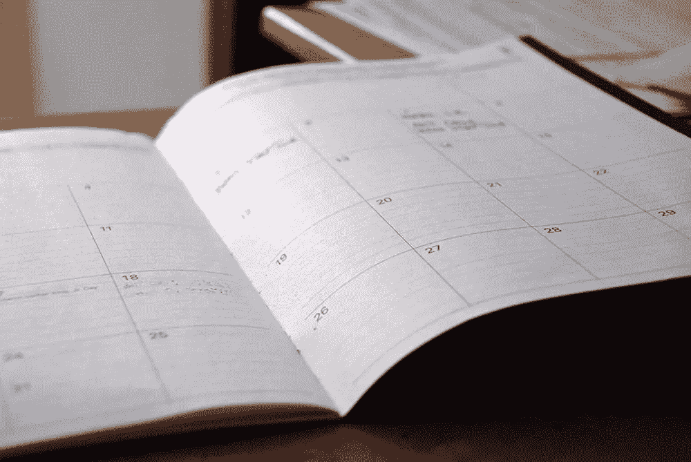

# 给紧张的自由职业者的 7 个日程安排提示

> 原文：<https://www.sitepoint.com/7-scheduling-tips-for-stressed-out-freelancers/>

如果有什么比没有工作更糟糕的话，那就是太多的工作和太多紧迫的截止日期。工作超负荷会让任何人的生活变得痛苦——但是作为一名自由职业者，你对自己承担多少工作以及如何分配工作更有发言权。

良好的时间安排是你事业成功和身心健康的关键。

## 1.估计你能做多少工作

成功制定合理时间表的第一步是(正确地)估计你能做多少工作。如果你不知道自己的极限，你就无法制定时间表。虽然这肯定会因周而异，但你需要对一周有多少小时用于工作有一个大致的概念。

例如，你能一周工作 50、60 或 70 个小时而仍然高效吗？或者你有其他任务要考虑，比如家庭/个人事务或健康问题，这些都大大减少了你每周可用的时间？

接下来，您需要决定如何在项目之间划分时间表。你可能试图以高薪管理 70 小时的困难项目(知道你不可能永远保持这种状态)。也许你的目标是每周花 10 到 20 个小时在困难的、有利可图的项目上，剩下的时间花在不太费力但利润可能更低的项目上。

当然，可供你选择的项目在很大程度上决定了你最终要做什么——但是知道自己的极限，并清楚地知道如何分配工作，将会让你做出明智的决定。

## 2.拒绝那些会让你超负荷的项目

拒绝一个有利可图的项目可能很难，但是除非你别无选择，否则不做某些项目会更好。

例如，我不接全职项目或需要每天投入的项目。我过去做过几次，压力太大了——就像一份没有福利的朝九晚五的工作。

我也避免接我不太熟悉的项目。这些任务需要更多的研究，即使有大量的研究，最终结果也远非完美。这样做简直是低效。

有时候，促使你放弃一项工作的不是项目，而是客户。我猜你听说过“你方的计划不周并不构成我方的紧急情况”？有些客户非常混乱，和他们一起工作会打乱你的日程安排。如果你找到了这样的客户，你最好摆脱他们——没有这样的客户不可避免地给你的生活带来的额外压力，你会过得更好。

## 3.了解你最有效率的时间

人不是机器人(至少现在不是！)而你的效率是随时间波动的。一天中有你工作最好的时候，也有令人厌烦的时候。如果你从事的是一份朝九晚五的工作，你对此没有多少控制权，但作为一名自由职业者，你可以根据让你表现最佳的因素进行优化。

如果你现在还没有发现它们，试着找到你最有效率的时间，然后安排重要的任务。你最有效率的时间可能是早上、晚上或者晚上——你只需要花几天时间关注你什么时候最有效率。

## 4.考虑季节变化

有相当多的外部因素会影响你的时间表，比如工作时间。虽然这不是一成不变的，但是每个行业都有工作机会减少的季节。

例如，夏天通常是缓慢的。大多数人(包括客户)都在度假，或者只是想在酷热中生存下来，工作是他们最不想做的事情。

我也注意到感恩节到一月中旬是典型的死亡季节。然而，几年前我有一个在 12 月 31 日晚上开始的项目。我们在这个不合时宜的时候结束了谈判，尽管几天后实际工作自然开始了。虽然圣诞节前后事情会放缓，但你不一定需要放弃找工作。

季节变化因行业而异，而且不是恒定的。我的一个朋友是一名摄像师，对他来说，春末、整个夏天以及从感恩节到一月中旬是一年中最忙的时候——在这些时间里，他几乎都在埋头工作。

面对季节变化，你无能为力。你能做的最好的事情就是在这些时间里计划一些休息或者做你自己的项目。这样，如果有好的演出出现，你可以马上接受。

## 5.为紧急情况留有余地

即使你不再接计划能力差的客户，紧急情况还是会发生。而且经常会有一些任务花费的时间比你的初步估计要长。如果你的日程排得满满的，处理紧急事件几乎是不可能的。这就是为什么你需要为意想不到的工作留出至少 5%到 10%的时间。

如果你对什么都不安排感到不舒服，你可以安排一些填充项目，比如你自己的项目，如果有必要的话，你可以毫无问题地删除它们。还有，休息永远是一种选择。

## 6.不要忘记安排休息

我们有时会被工作冲昏头脑，以至于忘记为家人、朋友或自己安排休息和时间。如果你想保持你的健康和与你的朋友和家人的良好关系，不要忽视他们。在你繁忙的日程中留出一些时间来做这些。记住那句老话:只工作不玩耍，聪明的孩子也变傻。

## 7.向其他自由职业者学习

作为一名自由职业者，你的时间表是由你决定的。当你读到其他自由职业者
[的日程安排](https://www.sitepoint.com/freelancer-schedules/)时，这很有帮助，因为你可以从他们身上学到很多东西。

不是所有的事情都适用于你，但是你可以通过这种方式获得很多想法和建议。我从这样的文章中学到了很多，用这种方式学习技巧比辛苦的学习要有趣得多。

## 结论

无论你的日程安排技巧有多好，也不总是能避免超负荷。然而，使用我在这篇文章中给你的简单建议，我相信你可以大大减少你生活中的工作混乱和压力。

## 分享这篇文章