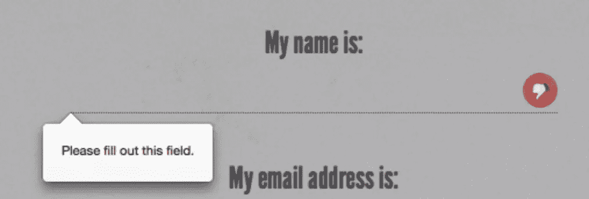
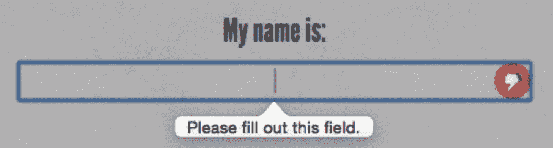
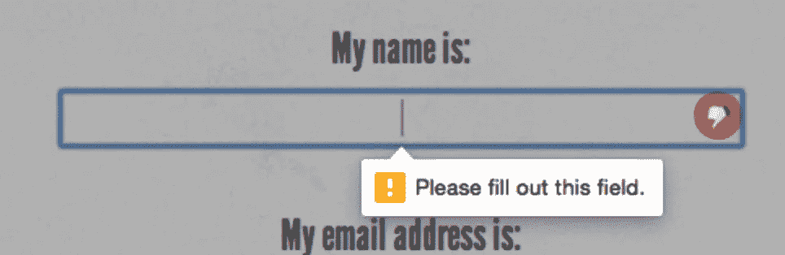

# HTML5 表单属性(第 1 部分)

> 原文：<https://www.sitepoint.com/html5-form-attributes-part-1/>

以下是我们的书的摘录，由 Alexis Goldstein、Louis Lazaris 和 Estelle Weyl 撰写的《真实世界的 CSS3，第二版。世界各地的商店都有出售，或者你可以在这里买到电子书。

### `required`属性

Boolean `required`属性告诉浏览器，只有填写了有问题的字段，才提交表单。显然，这意味着字段不能为空，但这也意味着，根据其他属性或字段的类型，只接受某些类型的值。在本章的后面，我们将讨论让浏览器知道表单中需要什么样的数据的不同方法。

如果必填字段为空，表单将无法提交。Opera、Firefox、Internet Explorer 10+和 Chrome 向用户提供错误消息；例如，“请填写此字段”或“您必须指定一个值”，如果留空。

### 注意:是时候聚焦了

快速复习的时间到了:当用户用鼠标单击字段，用手指在触摸设备上点击字段，用键盘切换到字段，或者单击或触摸与表单元素相关联的标签时，表单元素就会被聚焦。对于输入元素，用键盘打字会将数据输入到该元素中。

在 JavaScript `focus`事件术语中，`focus`事件将在表单元素上获得焦点时触发，而`blur`事件将在 *失去* 焦点时触发。

在 CSS 中，`:focus`伪类可用于样式化当前具有焦点的元素。

除了`button`、`submit`、`image`、`range`、 `color`和`hidden`之外，`required`属性对任何输入类型都有效，这些输入类型通常都有默认值，因此该属性是多余的。和我们到目前为止看到的其他布尔属性一样，语法要么是简单的`required`，要么是`required="required"`(如果使用 XHTML 语法的话)。

让我们将`required`属性添加到注册表单中。我们会将姓名、电子邮件地址、密码和订阅开始日期字段设置为必填字段:

```
<ul>
  <li>
    <label for="register-name">My name is:</label>
    <input type="text" id="register-name" name="name" required aria-
↵required="true">
  </li>
  <li>
    <label for="email">My email address is:</label>
    <input type="text" id="email" name="email" required aria-
↵required="true">
  </li>
  <li>
    <label for="url">My website is located at:</label>
    <input type="text" id="url" name="url">
  </li>
  <li> 
    <label for="password">I would like my password to be:</label>
    <p>(at least 6 characters, no spaces)</p>
    <input type="password" id="password" name="password" required 
↵aria-required="true">
  </li>
  <li>
    <label for="rating">On a scale of 1 to 10, my knowledge of 
↵HTML5 is:</label>
    <input type="text" name="rating" type="range">
  </li>
  <li>
    <label for="startdate">Please start my subscription on:
↵</label>
    <input type="text" id="startdate" name="startdate" required aria
↵-required="true">
  </li>
  <li>
    <label for="quantity">I would like to receive <input 
↵type="text" name="quantity" id="quantity"> copies of <cite> 
↵The HTML5 Herald</cite></label>
  </li>
  <li>
    <label for="upsell">Also sign me up for <cite>The CSS3 
↵Chronicle</cite></label>
    <input type="checkbox" id="upsell" name="upsell" 
↵value="CSS Chronicle">
  </li>
  <li>
    <input type="submit" id="register-submit" value="Send Post 
↵Haste">
  </li>
</ul>
```

### 注:提高可访问性

您可以包含 WAI-ARIA 属性`aria-required="true"`以提高可访问性；然而，由于大多数浏览器和屏幕阅读器现在都支持`required`属性，这很快就没有必要了。WAI-ARIA 简介见附录 B。

图 4.1、图 4.2 和图 4.3 显示了当您试图提交表单时`required`属性的行为。



图 4.1。Firefox 中的必填字段验证消息



图 4.2。它在歌剧中的样子…



图 4.3。…在谷歌浏览器中

#### 设置必填表单字段的样式

您可以使用`:required`伪类来设计必需的表单元素，使用`:optional`伪类来设计可选的表单元素(或者使用否定伪类`:not(:required)`)。您还可以分别使用`:valid`和`:invalid`伪类来设计有效和无效字段的样式。使用这些伪类和一点 CSS 魔法，您可以向视力正常的用户提供视觉提示，指示哪些字段是必需的，并为成功的数据输入提供反馈:

```
input {
  background-position: 0% 50%;
  background-repeat: no-repeat;
  padding-left: 15px;
}
input:required {
  background-image: url('img/required.png');
}
input:focus:invalid { 
  background-image: url('img/invalid.png');
} 
input:focus:valid { 
  background-image: url('img/valid.png');
}
```

我们将背景图像(星号)添加到必填表单字段。我们不能在`input`中包含生成的内容，因为它们被替换或者是空元素，所以我们使用背景图片来代替。我们还为有效和无效字段添加了单独的背景图像。只有当表单元素获得焦点时，这种变化才是明显的，以避免表单看起来过于混乱。

### 警告:Firefox 将样式应用于无效元素

请注意，Firefox 将自己的样式应用于无效元素(红色阴影)，如前面的图 4.1 所示。您可能希望使用以下 CSS 来移除原生投影:

```
:invalid { box-shadow: none; }
```

### 提示:针对旧浏览器的目标样式

IE8 和 IE9 等较老的浏览器不支持`:required`伪类，但是您仍然可以使用属性选择器提供目标样式:

```
input:required,
input[required] {
  background-image: url('img/required.png');
}
```

您还可以在不支持 HTML5 表单验证的浏览器中使用该属性作为表单验证的挂钩。您的 JavaScript 代码可以检查无值输入中是否存在`required`属性，如果发现，就不提交表单。

### `placeholder`属性

属性允许在表单元素中显示一个简短的提示——空间允许——告诉用户应该在该字段中输入什么类型的数据。当字段获得焦点并且用户输入至少一个字符时，占位符文本会消失，当值为 null 时，占位符文本会重新出现。多年来，开发人员已经用 JavaScript 提供了类似的功能——添加一个临时值，然后在焦点上清除该值——但是在 HTML5 中，placeholder 属性允许它在不需要 JavaScript 的情况下自然发生，并且一直存在，直到输入一个值。

对于*html 5 先驱报*的注册表单，我们将在网站 URL 和开始日期字段放置一个`placeholder`:

```
<li>
  <label for="url">My website is located at:</label>
  <input type="text" id="url" name="url" 
↵ placeholder="e.g. http://example.com">
</li>
…
<li>
  <label for="startdate">Please start my subscription on:</label>
  <input type="text" id="startdate" name="startdate" required 
↵aria-required="true" >
</li>
```

在 Internet Explorer 中，因为`placeholder`属性只在 IE10 中得到支持，并且因为一旦用户输入数据，占位符文本就会消失，所以您不应该依赖它作为通知用户需求的唯一方式。如果您的提示超出了字段的大小，请在输入的 title 属性、标签或 input 元素旁边的文本中描述这些要求。一些开发人员建议添加“例如”作为占位符文本的一部分，以表明它是占位符文本，而不是实际的预填充数据。

从 Safari 4、Chrome 10、Opera 11.1、Firefox 4、Android 2.3 和 Internet Explorer 10 开始的所有浏览器都支持`placeholder`属性，尽管最初的`placeholder`实现移除了焦点上的占位符文本，而不是数据输入。

#### JavaScript 的多填充支持

像本章中的其他内容一样，即使在处理缺乏支持的旧浏览器时，包含`placeholder`属性也不会有什么坏处。

与`required`属性一样，您可以利用`placeholder`属性及其值让旧版本的 Internet Explorer 表现得好像它们支持它一样——这一切都是通过使用一点 JavaScript polyfill 魔法实现的。

你应该这样做:首先，使用 JavaScript 来确定哪些浏览器不受支持。然后，在这些浏览器中，使用一个函数来创建一个伪占位符。该函数需要确定哪些表单字段包含`placeholder`属性，然后临时获取该属性的内容并用该文本替换空值属性。

然后您需要设置两个事件处理程序:一个在焦点上清除字段的值，另一个在模糊时替换`placeholder`的值，如果表单控件的值仍然是空字符串。如果您确实使用了这个技巧，请确保您的占位符属性的值不是用户可能实际输入的值，或者使用“例如”先行词来表示占位符是一个示例，而不是一个有效值。此外，在提交表单时，记得清除伪占位符。否则，你会有很多“(XXX) XXX-XXXX”的提交！

让我们看一个使用`placeholder`属性逐步增强表单元素的示例 JavaScript 片段。

这是我们的占位符多填充:

```
<script> // check if supported
  if(!Modernizr.input.placeholder) {
  // get all the form controls with the placeholder attribute
  var fcToCheck = document.querySelectorAll("*[placeholder]"),
      frmsToCheck = document.querySelectorAll('form'),
      i, count;

  // loop through form controls with placeholder attribute,
  // copy placeholder value into value, clearing on focus and
  // resetting, if empty, on blur
  for(var i = 0, count = fcToCheck.length; i < count; i++) {
    if(fcToCheck[i].value == "") {
      fcToCheck[i].value = fcToCheck[i].getAttribute("placeholder");
      fcToCheck[i].classList.add('placeholder');
      fcToCheck[i].addEventListener('focus', function() {
          if (this.value==this.getAttribute("placeholder")) {
            this.value = '';
            this.classList.remove('placeholder');
        }
      });
      fcToCheck[i].addEventListener('blur', function() {
        if (this.value == '') {
            this.value = this.getAttribute("placeholder");
            this.classList.add('placeholder');
        }
      });
    }
  }

  for(i = 0, count = frmsToCheck.length; i < count; i++) {

    frmsToCheck[i].addEventListener('submit', function(e) {
      var i, count, plcHld;

    // first do all the checking for required
    // element and form validation.
    // Only remove placeholders before final submission
      plcHld = this.querySelectorAll('[placeholder]');
      for(i = 0, count = plcHld.length; i < count; i++){
        //if the placeholder still equals the value
        if(plcHld[i].value == plcHld[i].getAttribute(
↵'placeholder')){
          // don't submit if required
          if(plcHld[i].hasAttribute('required')) {
            // create error messaging
            plcHld[i].classList.add('error');
            e.preventDefault();
          } else {
            // if not required, clear value before submitting.
            plcHld[i].value = '';
          }
        } else {
            // remove legacy error messaging
            plcHld[i].classList.remove('error');
        }
      }
    });
  } </script>
```

关于这个脚本要注意的第一点是，我们使用了 [Modernizr](http://www.modernizr.com/) JavaScript 库来检测对`placeholder`属性的支持。在附录 A 中有更多关于 Modernizr 的信息，但是现在理解它为浏览器中给定的 HTML5 和 CSS3 特性的出现提供了大量的`true`或`false`属性就足够了。在这种情况下，我们使用的属性是不言自明的。如果浏览器支持`placeholder`，则`Modernizr.input.placeholder`为`true`，如果不支持，则为`false`。

如果我们已经确定不存在`placeholder`支持，我们用一个`placeholder`属性获取页面上的所有元素。对于它们中的每一个，我们检查其值是否为空，然后用`placeholder`属性的值替换该值。在这个过程中，我们将`placeholder`类添加到元素中，因此您可以在 CSS 中减轻字体的颜色，或者使它看起来更像本机占位符。当用户关注带有仿占位符的输入时，脚本清除该值并删除该类。当用户移开焦点时，脚本检查是否有值。如果没有，我们就重新添加占位符文本和类。

在提交表单之前，我们需要检查是否有任何表单控件的值与它们的`placeholder`属性相匹配。在这个场景中，我们还可以检查当表单被提交时，任何必需的输入是否仍然有`placeholder`类。如果需要表单控件，我们会添加错误消息并阻止表单提交。如果表单控件不是必需的，我们在提交之前清除仍然存在的占位符值，只有在没有必需元素阻止表单提交时才清除这些值。

在向表单添加重置按钮之前，请确定您的用户是否希望放弃他们的所有工作。如果答案是肯定的，并且您包含了一个重置按钮，请注意，如果用户单击重置按钮，我们的仿占位符将会消失，但是`placeholder`类将会保留，因为我们在 polyfill 中使用该值。

这是 HTML5 聚合填充的一个很好的例子:我们使用 JavaScript 只为那些没有本机支持的浏览器提供支持，我们通过利用已经存在的 HTML5 元素和属性来实现这一点，而不是求助于 JavaScript 中的附加类或硬编码值。

虽然`placeholder`属性可能不是 polyfill 最重要的属性，但它是一个很好的例子，说明我们如何在 poly fill 支持所有新属性的同时简化表单验证脚本，同时保持内容层和表示层之间的分离。

## 分享这篇文章