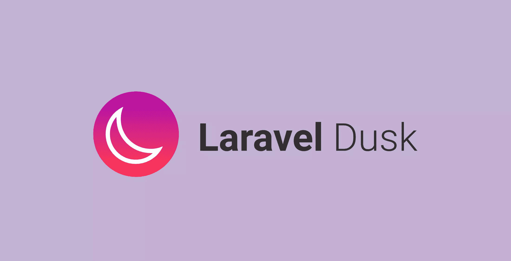
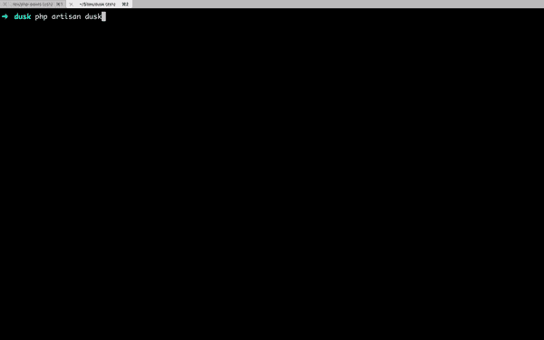
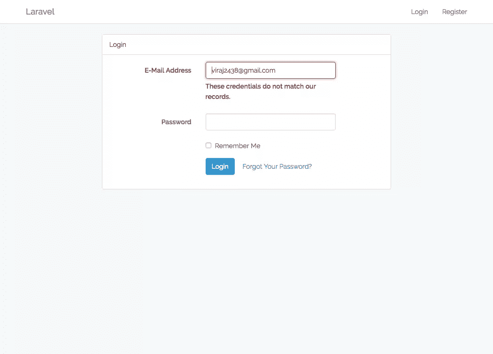
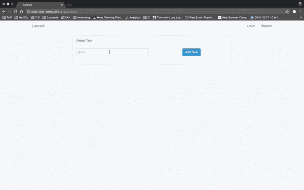
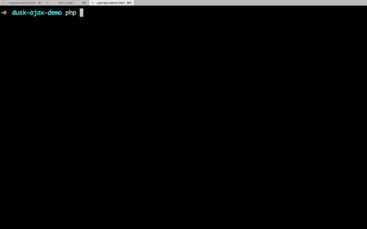
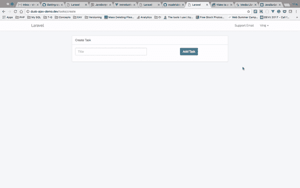

# laravel dust–直观简单的浏览器测试！

> 原文：<https://www.sitepoint.com/laravel-dusk-intuitive-and-easy-browser-testing-for-all/>

*这篇文章由[尤尼斯·拉菲](https://www.sitepoint.com/author/yrafie)同行评审。感谢 SitePoint 的所有同行评审员使 SitePoint 的内容尽可能做到最好！*

* * *

JavaScript 应用程序的端到端测试，尤其是单页面应用程序，一直是一个挑战。为此，Laravel 最近发布了 5.4 版本，其中包含一个新的测试库: [Dusk](https://laravel.com/docs/5.4/dusk) 。



随着[黄昏](https://laravel.com/docs/5.4/dusk)的发布，Laravel 希望给它的用户一个用于浏览器测试的通用 API。它配备了默认的 [ChromeDriver](https://sites.google.com/a/chromium.org/chromedriver/home) ，如果我们需要支持其他浏览器，我们可以使用 Selenium。它仍然会有这个通用的测试 API 来满足我们的需求。

本教程将假设您正在启动一个新的 Laravel 5.4 应用程序。

## 装置

```
composer require laravel/dusk 
```

这将通过 [Composer](https://www.sitepoint.com/php-dependency-management-with-composer/) 安装软件包的最新稳定版本。

接下来，我们需要在我们的应用程序中注册`DuskServiceProvider`。我们可以通过几种方式做到这一点:

### 方法 1

我们可以将它包含在我们的`config/app.php`文件的`providers`数组中。

```
...

App\Providers\RouteServiceProvider::class,
Laravel\Dusk\DuskServiceProvider::class,
... 
```

这种方法的问题是`DuskServiceProvider`将在我们的应用程序中为所有环境注册。我们不需要`Dusk`在我们的生产环境中可用和注册。我们可以用第二种方法避免这种情况。

### 方法 2

针对特定环境在`AppServiceProvider`类中注册`DuskServiceProvider`:

```
namespace App\Providers;

use Illuminate\Support\ServiceProvider;
use Laravel\Dusk\DuskServiceProvider;

class AppServiceProvider extends ServiceProvider
{
    /**
     * Register any application services.
     *
     * @return void
     */
    public function register()
    {
        if ($this->app->environment('local', 'testing', 'staging')) {
           $this->app->register(DuskServiceProvider::class);
        }
    }
} 
```

接下来，完成安装过程:

```
php artisan dusk:install 
```

将提供一个类和目录的基本框架。如果我们打开`tests`目录，我们可以看到一个新的`Browser`目录，其中有用于`Dusk`测试的必要支架。

## 我们的第一个测试

首先，我们将使用 Laravel 的预建身份验证机制搭建一个身份验证工作流。

```
php artisan make:auth 
```

现在让我们创建我们的第一个黄昏测试:

```
php artisan dusk:make LoginTest 
```

上面的命令将在我们的`Browser`目录中创建一个`LoginTest`类。

```
class LoginTest extends DuskTestCase
{
    /**
     * A Dusk test example.
     *
     * @return void
     */
    public function test_I_can_login_successfully()
    {
        $this->browse(function ($browser) {
            $browser->visit('/login')
                    ->type('email', 'viraj@virajkhatavkar.com')
                    ->type('password', 'secret')
                    ->press('Login')
                    ->assertSee('You are logged in!');
        });
    }
} 
```

在上面的测试用例中，我们检查用户是否可以成功登录系统，并看到一个带有欢迎消息的主页。

*注意:为了使这个测试成功，我们需要在数据库中有一个实际的用户。在本演示中，我们已经在数据库中用上述凭证配置了一个用户。*

让我们现在执行我们的黄昏测试:

```
php artisan dusk 
```

如果您在数据库中有一个具有正确凭证的用户条目，您可以看到下面的输出:

```
PHPUnit 5.7.6 by Sebastian Bergmann and contributors.

..                                                                  2 / 2 (100%)

Time: 4.71 seconds, Memory: 10.00MB

OK (2 tests, 2 assertions) 
```

## 失败的测试

当测试失败时，`PHPUnit`会向我们抛出一些错误。我们必须解释出了什么问题。

Dusk 增加了一些值得注意的东西来迎合这个用例。

我们将首先修改我们的测试，故意在执行时失败:

```
public function test_I_can_login_successfully()
{
    $this->browse(function ($browser) {
        $browser->visit('/login')
                ->type('email', 'viraj2438@gmail.com')
                ->type('password', 'secret')
                ->press('Login')
                ->assertSee('You are logged in!');
    });
} 
```

在上面的测试案例中，我们将尝试使用一个不在数据库中的用户登录。现在让我们运行黄昏测试，看看会发生什么:



如果你仔细观察，在测试失败前会打开一个浏览器。

在后台，`Dusk`对触发错误的页面进行截图，并将其保存在(自动 git-ignored) `screenshots`目录中:



这为我们提供了测试失败原因的直观表示。我们可以看到凭据与数据库中的任何记录都不匹配。有了这样的视觉反馈，Dusk 确保您可以快速查明问题。

## 测试 AJAX 调用

Dusk 旨在对现代 JavaScript 应用程序进行端到端的浏览器测试。在这样的应用中，一个典型的用例是等待 AJAX 请求的响应。

我们将从一个[演示应用](https://github.com/sitepoint-editors/Dusk-Demo)中测试*创建任务*功能——请克隆它来跟随:



我们使用 AJAX 请求创建一个新任务，然后将用户重定向到任务列表页面。这是一个完美的测试用例。

```
php artisan dusk:make CreateTaskTest 
```

上面的命令将在我们的`Browser`目录中创建一个`CreateTaskTest`类。现在让我们编写测试:

```
class CreateTaskTest extends DuskTestCase
{
    /**
     * A Dusk test example.
     *
     * @return void
     */
    public function test_I_can_create_task_successfully()
    {
        $this->browse(function ($browser) {

            $browser->visit('/tasks/create')
                    ->type('title', 'My Task')
                    ->press('Add Task')
                    ->pause(5000)
                    ->assertPathIs('/tasks');
        });
    }
} 
```

在上面的测试中，我们尝试使用 AJAX 表单添加一个新的测试:

1.  输入标题
2.  点击*添加任务*按钮
3.  等待 5 秒钟
4.  断言我们被重定向到了`tasks`页面

让我们现在运行我们的黄昏测试，看看结果:



如你所见，上面的测试通过了。

我们也可以使用 Dusk 的 API 的`waitUntilMissing`方法来测试上面的流程:

```
<?php

namespace Tests\Browser;

use Tests\DuskTestCase;
use Illuminate\Foundation\Testing\DatabaseMigrations;

class CreateTaskTest extends DuskTestCase
{
    /**
     * A Dusk test example.
     *
     * @return void
     */
    public function test_I_can_create_task_successfully()
    {
        $this->browse(function ($browser) {

            $browser->visit('/tasks/create')
                    ->type('title', 'My Task')
                    ->press('Add Task')
                    ->waitUntilMissing('.btn-primary')
                    ->assertPathIs('/tasks');
        });
    }
} 
```

您可以参考官方文档来了解 API 中其他可用的等待元素。

## 更高级的例子

我们的应用程序有一个菜单项，如果我们单击**支持电子邮件**链接，会弹出一个模式，其中包含发送支持电子邮件的表单:



我们将编写一个测试用例来测试以下场景:

1.  登录
2.  参见**支持邮件**
3.  点击**支持邮件**
4.  断言模式打开，并且在文本框中有用户的电子邮件 ID

在上面的 gif 中，我们使用鼠标与 UI 进行交互，并打开模态。让我们在黄昏测试用例中重新创建上面的流程。

首先，我们将创建一个新的测试类:

```
php artisan dusk:make SupportEmailsTest 
```

然后，测试:

```
class SupportEmailsTest extends DuskTestCase
{
    /**
     * A Dusk test example.
     *
     * @return void
     */
    public function test_I_can_open_modal_for_support_emails()
    {
        $this->browse(function ($browser) {

            $user = factory(User::class)->create();

            $browser->loginAs($user)
                    ->visit('/tasks')
                    ->clickLink('Support Email')
                    ->whenAvailable('#modal-support', function ($modal) use($user) {
                        $modal->assertInputValue('#support-from', $user->email);
                    });
        });
    }
} 
```

让我们运行它:

```
php artisan dusk tests/Browser/SupportEmailsTest.php 
```

我们可以看到我们的测试通过了:

```
PHPUnit 5.7.13 by Sebastian Bergmann and contributors.

.                                                                   1 / 1 (100%)

Time: 3.63 seconds, Memory: 12.00MB

OK (1 test, 1 assertion) 
```

对于所有其他可用的断言，您可以参考官方文档。

## 页

黄昏中有一个[页](https://laravel.com/docs/5.4/dusk#pages)的概念。它们只不过是强大的、可重用的测试类。

让我们使用 Pages 重构`CreateTaskTest`。

让我们首先创建一个新页面:

```
php artisan dusk:page CreateTaskPage 
```

上面的命令将在`Pages`目录中创建一个新类。让我们检查每个方法，并修改它以更好地适应我们的创建任务测试用例:

```
public function url()
{
    return '/tasks/create';
} 
```

`url`方法定义了页面的 url。每当这个页面被调用时，`Dusk`将导航到这个 url。

```
public function assert(Browser $browser)
{
    $browser->assertPathIs($this->url());
} 
```

`assert`定义该页面的断言。每当调用`CreateTaskPage`时，`assert`方法中定义的所有断言都将执行。

在上面的例子中，我们只是断言活动页面的 url 是适当的。

```
public function elements()
{
    return [
        '@addTask' => '.btn-primary',
    ];
} 
```

`elements`方法可以有预定义的选择器。我们可以为选择器定义人类可读的名称，并在不同的测试用例中重用它们。在上面的例子中，我为**添加任务**按钮定义了一个选择器。

现在让我们修改`CreateTaskTest`类并使用选择器:

```
class CreateTaskTest extends DuskTestCase
{
    /**
     * A Dusk test example.
     *
     * @return void
     */
    public function test_I_can_create_task_successfully()
    {
        $this->browse(function ($browser) {

            $user = factory(User::class)->create();

            $browser->loginAs($user)
                    ->visit(new CreateTaskPage)
                    ->type('title', 'My Task')
                    ->click('@addTask')
                    ->waitUntilMissing('@addTask')
                    ->assertPathIs('/tasks');
        });
    }
} 
```

我们修改了我们的类来使用`CreateTaskPage`。现在让我们重新运行我们的测试，看看是否一切正常:

```
PHPUnit 5.7.13 by Sebastian Bergmann and contributors.

.                                                                   1 / 1 (100%)

Time: 2.76 seconds, Memory: 12.00MB

OK (1 test, 2 assertions) 
```

一切都好！

您甚至可以定义自定义方法来在某个页面上执行一些可重用的操作。你可以在[官方文档](https://laravel.com/docs/5.4/dusk#pages)中了解更多。

## 结论

在本文中，我们介绍了 [Laravel Dusk](https://laravel.com/docs/5.4/dusk) ，这是一个 Laravel 包，它提供了端到端 JavaScript 测试的替代方案。我们已经介绍了入门所需的配置选项，上面的示例应该可以帮助您填补空白，并概述了一些其他可用的配置选项。

你如何使用黄昏？您能想到这个库的任何高级用例吗？它们是什么？请在评论中告诉我们！

## 分享这篇文章