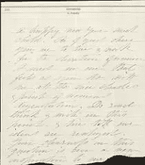
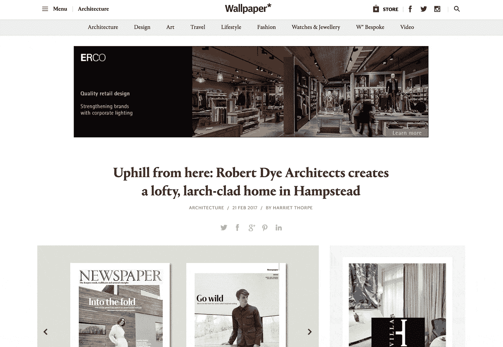
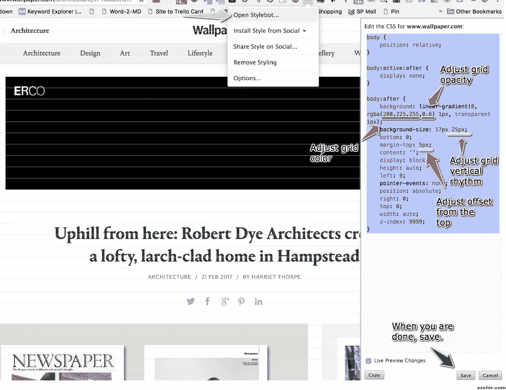
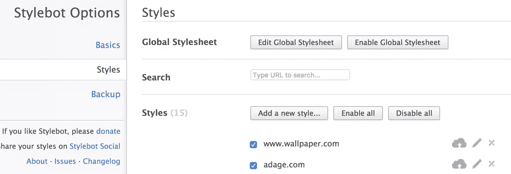
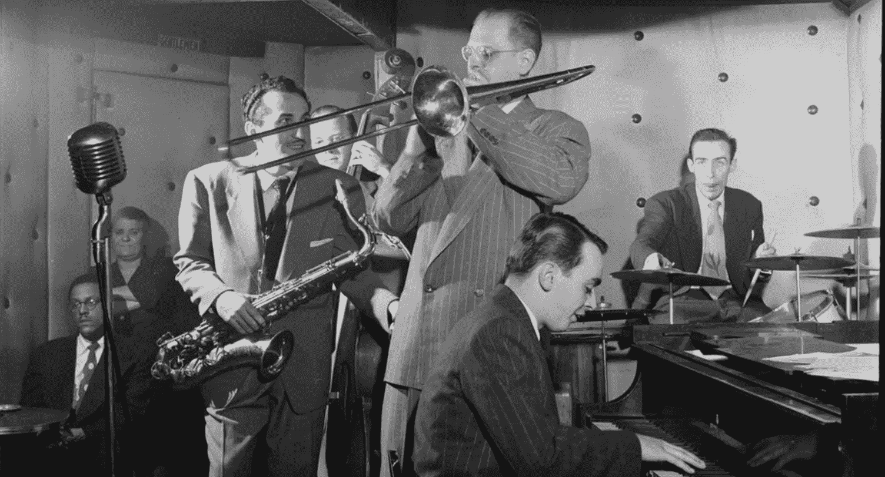

# 网页布局 101:垂直节奏是鼓手

> 原文：<https://www.sitepoint.com/web-layout-101-vertical-rhythm-is-a-drummer/>


一般来说，我认为大多数设计师和前端编码人员倾向于在他们的网页布局中花更多的时间考虑列而不是行。

这并不奇怪。由于大多数设备被设计成垂直滚动*，我们的页面**宽度**比我们的页面**高度**更加有限——所以划分水平空间似乎是一个非常自然的开始。*

*

有横线的纸使书写的文字有节奏

### 垂直基线节律

垂直基线节奏——有时被称为“垂直度量”——是一个水平线网格，你可以用它来悬挂你的排版。这和我们都学过的小学练习册上的浅蓝色线条没有什么不同。

理查德·鲁特这样描述它:

> 标题、副标题、大块引文、脚注、插图、题注和其他对文本的侵入，创造了切分和变化，违背了有规律的引导行的基本节奏。这些变化可以而且应该给页面增添活力，但是正文也应该在每个变化之后准确地按节拍和相位返回。
> [将排版风格的元素运用到网页上](http://webtypography.net/2.2.2)

通常，即使我们看不到实际的底层网格，我们也能通过布局中的平衡与和谐感觉到它。我们可能不知道为什么感觉“正确”，但我们知道它是正确的。

但这是否意味着每个页面元素都必须向万能的网格低头呢？

不，不一定。

## 壁纸 Mag…怎么卷？

[壁纸](http://www.wallpaper.com/)是一本在印刷中成长起来的杂志。他们的印刷布局总是整洁，通风和优雅，强调有吸引力的类型和低装饰。壁纸在网上的出现体现了这种方式。



乍一看，没有明显的网格——至少在我看来是这样。

但是把一个 25px 行高的网格卷过去，事情就变得更清楚了。元素并不总是紧紧锁定在每一行上——尽管有些是——但是许多元素在所提供的行内浮动。

## 将基线网格应用于任何页面

我经常发现能够将网格应用到动态网页是很有用的。它有助于开发的早期阶段，并给你与你的开发团队讨论一致的单元。这也是一个很好的方式来了解为什么你喜欢的网站的布局是有效的。

以下是我在 Chrome 上的操作方法，但它应该可以在大多数浏览器上运行。

1).安装 [Stylebot](https://chrome.google.com/webstore/detail/stylebot/oiaejidbmkiecgbjeifoejpgmdaleoha?hl=en) 。并转到要添加网格的页面。[时尚的](https://chrome.google.com/webstore/detail/stylish-custom-themes-for/fjnbnpbmkenffdnngjfgmeleoegfcffe?hl=en)也很好用。

2).点击时尚按钮，然后“打开时尚”。复制下面的 CSS 并粘贴到空的 Stylebot 面板中。

```
body {
    position: relative;
}
body:active:after {
    display: none;
}
body:after {
    background: linear-gradient(to bottom, rgba(200,225,255,0.6) 1px, transparent 1px);
    background-size: 17px 25px;
    bottom: 0;
    margin-top: 0px;
    content: '';
    display: block;
    height: auto;
    left: 0;
    pointer-events: none;
    position: absolute;
    right: 0;
    top: 0;
    width: auto;
    z-index: 9999;
}
```

您应该会立即看到覆盖在页面上的浅色水平线(见图片)。



3).你可能会想调整网格。改变`background-size`中的第二个数字来改变网格的行高。

```
...
background-size: 17px 25px;
...
```

通过编辑“背景”中的 RGBA 颜色来更改网格中的颜色和不透明度。

```
...
background: linear-gradient(to bottom, rgba(200,225,255,0.6) 1px, transparent 1px);
...
```

4).当你对它感到满意时，点击保存，你的网格将被应用到你在该域下访问的任何页面。单击“取消”，然后单击“X”关闭 StyleBot 编辑器。

5).你可以通过点击 StyleBot 按钮，选择“选项”,然后选择“样式”,来停用你的网格(或者你已经应用到页面的任何其他 CSS)。你可以随时打开或关闭你的网格。



这是展示它的快速屏幕截图。[https://share.viewedit.com/wrPnnTvyMguMuDKD4TnXCo](https://share.viewedit.com/wrPnnTvyMguMuDKD4TnXCo)

## 垂直基线节奏不是一种宗教

垂直基线是一个方便的工具，但它们不应该接管你的设计。有一段时间，我花了太多的精力试图弯曲每个页面元素，以遵守我强大的网格规则。我一直在和排版的百分比和页边空白较劲,“打格子”本身成了一个目标，而不仅仅是一个帮助我更好地设计的工具。那不好玩，也没什么用。

最好像乐队里的低音鼓一样看垂直基线。稳定的节拍有助于为乐队的其他成员留出演奏的空间。但是如果每个人都太合拍，你可能会有一个相当无聊的行进乐队(无意冒犯行进乐队)。



建立一个每个人都能感觉到的好节拍，但不要害怕可能会稍微偏离节拍的小花腔。他们可以给作品(和歌曲)增添活力和味道。

我个人喜欢建立一个强大的网格并使用它。如果标题和段落之间有空白，那也可以是 1、2 或 3 个完整的“垂直单位”——而不是 1.3 或 2.75 个单位。你的特征图像可能正好是 12 个单位的高度，而不是 12.3 个单位或 11.8 个单位，因为现在图像的底部边缘更有可能与它旁边的任何文本很好地对齐。

但是从另一方面来说，如果这些图片上的标题超过 25px 行高时看起来太空洞，那也没关系。只是让它看起来很好。

网格是您值得信赖的布局顾问，而不是您的主人。

## 分享这篇文章*