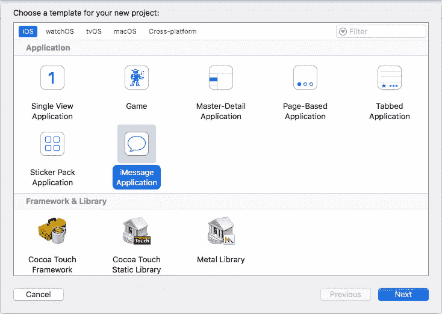

# iOS 上的“信息”扩展简介

> 原文：<https://www.sitepoint.com/an-overview-of-messages-extensions-on-ios/>

## 什么是扩展？

几年前的 2014 年，随着 iOS 8 的推出，苹果[推出了扩展框架](https://www.sitepoint.com/guide-extensions-ios-8-os-x-yosemite/)。然后，我推测该框架将在未来的 iOS 和 OS X 版本中发挥重要作用。事实证明，苹果在过去几年里一直在这么做。今年，他们增加了对构建 iMessage 扩展的支持。

苹果每次添加新的扩展点，都一直兼容后续版本。例如，很多人使用的 Today widget 扩展在 iOS 10 中有了新的外观，但开发者不必更新他们在以前的 iOS 版本中编写的 Today 扩展。尽管苹果从来没有提到这种情况会一直持续下去，但我认为在未来的 iOS 版本中，这种情况仍然会发生。因此，您今天编写的 iMessage 扩展可能会在未来的 iOS 版本中工作。

除了 iMessage 之外，还有其他消息应用也在市场上获得了关注。值得注意的是，微信和 LINE 在中国和日本都很受欢迎。一些具有基本的消息传递扩展支持，例如，支持通过微信购物。LINE 发布了许多 LINE 品牌的应用，这些应用在其消息应用的基础上提供了额外的功能。看起来 iMessage extension 正在遵循其他第三方消息应用程序开辟的道路，但当操作系统供应商自己提供该功能时，它将与系统紧密集成。

在 macOS 方面，iMessage 扩展中的许多功能似乎都不受支持。我们只能在 macOS 上查看贴纸。一些扩展只在一个平台上受支持而在另一个平台上不受支持的情况并不少见。在过去，自定义键盘扩展会出现这种情况。

## 构建 iMessage 应用程序

有两种主要的方法来构建你的 iMessage 应用程序:独立的或 iOS 应用程序的扩展。它们几乎是一样的东西，主要区别是:如果你构建了一个独立的应用程序，你的应用程序将只在 Messages 应用程序商店中列出，如果它是 iOS 应用程序的扩展，它将在 Messages 应用程序商店和主应用程序商店中列出。

在 Xcode 8 和更高版本中，您可以方便地创建新的 iMessage 应用程序或包含预填充模板的贴纸包。如果您正在构建一个扩展，您也可以通过*File->New->Target…*获得这些模板。苹果[发布了许多详尽的指南](https://developer.apple.com/imessage/)，详细介绍了你可以在 iMessage 应用上使用的每一个 API。如果你一直在编写 iOS 应用和扩展，这些是相当简单的。值得注意的要点是:
–iMessage 应用程序从`MSMessagesAppViewController`子类激活，该子类是`UIViewController`
的子类–期望`willBecomeActive(with conversation: MSConversation)`和`didResignActive(with conversation: MSConversation)`经常被调用，并在此保存/恢复您的数据。
–当用户扩展/最小化 iMessage 应用程序 UI 时，期待`willTransition(to presentationStyle: MSMessagesAppPresentationStyle)`被调用。

请记住，与任何其他 iOS 扩展一样，您只能重用为该扩展编译的类或包含在该扩展中的框架。不要期望能够重用你为你的 iOS 应用程序编写的所有东西。

## 构建贴纸包

苹果在 Messages 应用中增加了一个扩展点，即贴纸包扩展。这是 iMessage 应用程序的一个简单得多的版本，人们可以在没有一行代码的情况下打包他们的 iMessage 贴纸。是的，你没看错，没有一行代码。

发布 iMessage 贴纸应用的唯一要求是:
——图片必须是 PNG、a PNG、GIF 或 JPEG 文件。
–文件必须小于 500 KB。
–为获得最佳效果，图像不应小于 100 x 100 点或大于 206 x 206 点。

如果你只是想发布你的涂鸦，而且以前从未打开过 Xcode，那么按照这个步骤操作不会花你一个多小时。见鬼，应用程序签名和上传到 iTunes Connect 可能比应用程序本身花费的时间还长。

最后，如果你认为这只是主 iMessage 应用的一个方面，那么考虑一下这个:超级马里奥 Run，任天堂的第一个 iOS 应用发布了 iMessage 贴纸包来推广他们的 iOS 游戏。它已经在排行榜上占据了很长一段时间，并成功地让人们在游戏准备好之前就知道了他们游戏的发布。此外，LINE [仅在贴纸商店销售贴纸一项，去年就赚了 2.7 亿美元。](https://techcrunch.com/2016/06/13/chat-app-line-makes-over-270-million-a-year-from-selling-stickers/)

## iMessage 应用商店

iMessage App Store 只能从“信息”应用程序访问。有趣的是，你只能从对话视图进入 iMessage 应用商店。如果你从未给任何人发过信息，你就无法进入 iMessage 应用商店。该商店是一个独立于主应用商店的商店，但对贴纸的所有更新都要通过主应用商店应用程序。

当您将 iMessage 应用程序发送给没有安装该应用程序的人时，iMessage 应用程序商店中将会有一个指向该扩展的链接。我认为这将是人们发现新的 iMessage 应用程序和贴纸的主要方式。

## 有趣的 iMessage 应用程序

自从 iOS 10 推出以来，有几个有趣的 iMessage 应用程序，包括一些来自苹果的应用程序。例如，Apple Music 有一个 iMessage 扩展，允许我们分享我们正在听的内容，并让接收者听这首歌，即使他们不是 Apple Music 的订户。

iMessage 扩展的另一个有趣且出乎意料的流行类型是游戏，即双人回合制游戏。在 iOS 的早期，我们已经看到了相当多的这种游戏，但似乎 iMessage extension 将人们的游戏从他们的主屏幕带到了他们的消息应用程序，他们可能会比主屏幕的第二或第三页更频繁地看到这些游戏。《和朋友说话》是一款流行的 iOS 游戏，全世界有数百万人玩，其中包括美国前总统巴拉克·奥巴马。它在推出后的许多周内占据了 iMessage 应用商店的榜首。也有其他基于回合制的多人游戏在 iMessage 应用商店的排行榜上取得了成功。

最后，还有意想不到的聪明的消息应用程序，如 [Phoneys](http://www.macrumors.com/2016/09/30/phoneys-sticker-app-mimics-messages-chat-bubbles/) 和[文法势利](https://www.engadget.com/2016/09/16/grammar-snob-imessage-stickers/)。Phoneys 模仿 iMessage 的气泡，让它看起来像是你的朋友在给你发奉承的信息。语法势利眼聪明地有带语法改正的贴纸，你可以贴在语法错误的信息上。Phoneys 在推出后不久就因模仿苹果的消息气泡设计而被从 Messages 应用商店下架。

## 最后的话

自 iOS 8 引入以来，苹果公司似乎一直在广泛开发 iOS 扩展框架。我们在 iOS 10 中看到了一个不寻常的扩展框架，即 iMessage 扩展框架。iMessage 扩展可能是也可能不是你的应用业务的一个组成部分。但是随着我们看到新的 iOS 版本，看起来扩展框架本身将继续增长。

有关实现细节，我们建议您观看 WWDC 视频 [iMessage 应用和贴纸](https://developer.apple.com/videos/play/wwdc2016/204/)，第 1 和第 2 部分。

## 分享这篇文章