# 使用 CSS3 实现 60 FPS 的移动动画

> 原文：<https://www.sitepoint.com/achieve-60-fps-mobile-animations-with-css3/>

*本文最初发表在 [OutSystems](https://www.outsystems.com/?utm_source=sitepoint&utm_medium=top_of_article&utm_term=OutSystems&utm_content=Achieve%2060%20FPS%20Mobile%20Animations%20with%20CSS3&utm_campaign=sitepoint#) 上。感谢您对使 SitePoint 成为可能的合作伙伴的支持。*

在移动应用程序中制作动画元素很容易。在你的移动应用程序中制作动画元素**也很容易……如果你遵循我们这里的提示。**

虽然现在每个人都在手机上使用 CSS3 动画，但是很多人都没有正确使用。开发人员经常忽视最佳实践。发生这种情况是因为人们不理解这些做法存在的原因，也不理解为什么它们会得到如此大力的支持。

器件规格范围很广。因此，如果你不优化你的代码，你将交付一个低于平均水平的体验到最高的份额。

请记住:一些高端旗舰设备挑战极限，但世界上大多数人使用的设备类型，与那些规格怪物相比，看起来像一个带 LCD 屏幕的算盘。

我们想帮你正确地利用 CSS3 的力量。要做到这一点，我们需要先了解一些事情。
t

## 理解时间线

浏览器在渲染和摆弄元素的时候做什么？这条时间线被称为**关键渲染路径:**

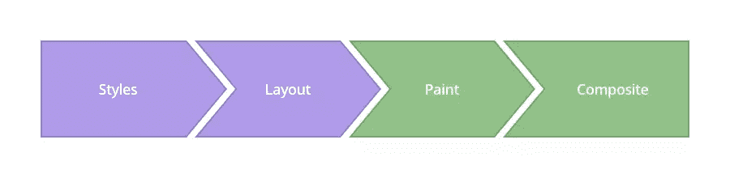

图片来源:[www.csstriggers.com](http://www.csstriggers.com/)

为了实现平滑的动画，我们需要专注于改变影响**合成**步骤的属性，而不是将这种压力添加到之前的层。

**1。样式**

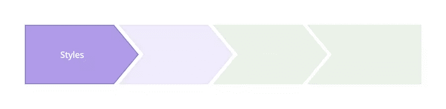

浏览器开始计算应用于元素的样式—重新计算**样式**。

**2。布局**


在接下来的层中，浏览器生成每个元素的形状和位置— **布局**。这是浏览器设置页面属性的地方，例如`width`和`height`，以及它的`margin`或`left/top/right/bottom`。

**3。油漆**

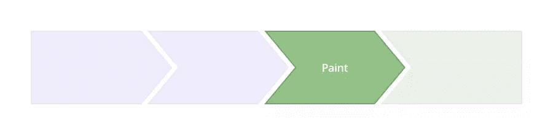

浏览器将每个元素的像素填充到层中。指的是这些属性:`box-shadow`、`border-radius`、`color`、`background-color`等。

**4。复合材料**

这是您想要执行动画的地方，因为这是浏览器将所有层绘制到屏幕上的时候。

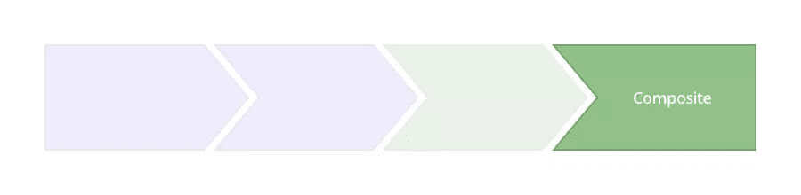

现代浏览器可以很好地动画化四种样式属性，利用`transform`和`opacity`属性。

*   **位置**—transform:translate x(n)translate y(n)translate z(n)；
*   **缩放** —变换:缩放(n)；
*   **旋转** —变换:旋转(ndeg)；
*   **不透明度** —不透明度:n；

## 如何实现每秒 60 帧

考虑到这一点，是时候卷起袖子开始工作了。

让我们从 HTML 开始。我们将创建一个非常简单的结构，并将我们的应用程序菜单放在一个布局类中。

```
 <div class="layout">
  <div class="app-menu"></div>
  <div class="header">
    <div class="menu-icon"></div>
  </div>
</div> 

```

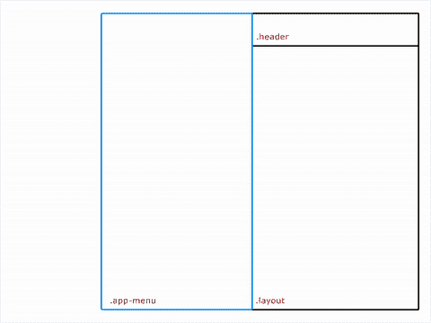

## 以错误的方式进行

```
 .app-menu {
  left: -300px;
  transition: left 300ms linear;
}

.app-menu-open .app-menu {
  left: 0px;
  transition: left 300ms linear;
} 

```

看到我们改变的属性了吗？您应该避免使用带有`left/top/right/bottom`属性的过渡。这些不会创建流畅的动画，因为它们会强制浏览器每次都执行一次布局，这会影响元素的所有子元素。

结果是这样的:

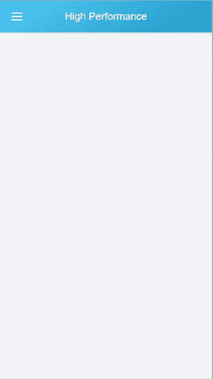

那个动画不太流畅。我们查看了 [DevTools 时间轴](https://developers.google.com/web/tools/chrome-devtools/profile/evaluate-performance/timeline-tool?hl=en)以了解幕后发生了什么，结果如下:

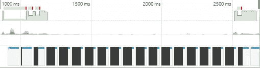

绿色区域表示渲染动画所花费的时间。

该数据呈现不规则的帧速率和缓慢的性能。

> “绿色条表示 FPS。高条形表示动画以 60 FPS 的速度渲染。低条表示低于 60 FPS。因此，理想情况下，您希望绿色条在时间线上始终保持高位。那些红条也表示 jank，所以，另一种衡量你进步的方法是去掉那些红条。
> 谢谢，[凯茜·巴斯克](https://medium.com/u/c8187519a8ef)！

## 使用转换

```
 .app-menu {
  -webkit-transform: translateX(-100%);
  transform: translateX(-100%);
  transition: transform 300ms linear;
}
.app-menu-open .app-menu {
  -webkit-transform: none;
  transform: none;
  transition: transform 300ms linear;
} 

```

`transform`属性影响**复合**步骤，而不是**布局**。在这里，我们通知浏览器，我们的层在动画开始之前是稳定的，所以我们在渲染动画时会经历较少的停顿。


这正是时间线所反映的:

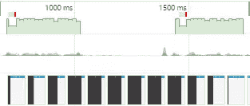

结果开始变得更好，帧速率似乎已经稳定，因此，动画运行更流畅。

## 在 GPU 中运行动画

那我们就更进一步吧。为了真正让它流畅运行，我们将使用 GPU 来渲染动画。

```
 .app-menu {
  -webkit-transform: translateX(-100%);
  transform: translateX(-100%);
  transition: transform 300ms linear;
  will-change: transform;
} 

```

尽管一些浏览器仍然需要`translateZ()`或`translate3d()`作为后备，但是`will-change`属性是未来的趋势。该属性将元素提升到另一层，因此浏览器不必考虑布局渲染或绘制。

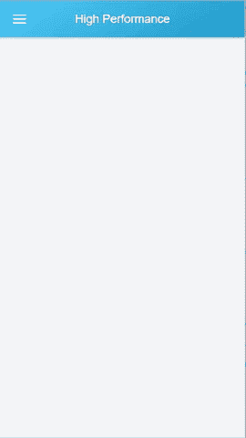

看到多光滑了吗？时间表证实:


动画的帧速率更加恒定，动画渲染速度更快。但开始时仍有一个长框架在那里运行:开始时有一点瓶颈。

还记得我们一开始创建的 HTML 结构吗？让我们看看如何在 JavaScript 中控制`app-menu` div:

```
 function toggleClassMenu() {
  var layout = document.querySelector(".layout");
  if(!layout.classList.contains("app-menu-open")) {
    layout.classList.add("app-menu-open");
  } else {
    layout.classList.remove("app-menu-open");
  }
}
var oppMenu = document.querySelector(".menu-icon");
oppMenu.addEventListener("click", toggleClassMenu, false); 

```

啊哈！我们在这里将类添加到`layout` div 中导致了一个问题。这迫使浏览器重新生成我们的样式树——这影响了渲染性能。

## 60 FPS 平滑如黄油的解决方案

如果我们在视窗区域之外创建菜单会怎么样？将菜单放在一个隔离的区域将确保我们只影响我们想要激活的元素。

因此，我们提出以下 HTML 结构:

```
 <div class="menu">
  <div class="app-menu"></div>
</div>
<div class="layout">
  <div class="header">
    <div class="menu-icon"></div>
  </div>
</div> 

```

现在我们必须以稍微不同的方式控制菜单的状态。我们将在一个类中操作动画，当动画结束时，我们通过使用 JavaScript 中的`transitionend`函数来移除它。

```
 function toggleClassMenu() {
  myMenu.classList.add("menu--animatable");        
  if(!myMenu.classList.contains("menu--visible")) {                
    myMenu.classList.add("menu--visible");
  } else {
    myMenu.classList.remove("menu--visible");                
  }        
}

function OnTransitionEnd() {
  myMenu.classList.remove("menu--animatable");
}

var myMenu = document.querySelector(".menu");
var oppMenu = document.querySelector(".menu-icon");
myMenu.addEventListener("transitionend", OnTransitionEnd, false);
oppMenu.addEventListener("click", toggleClassMenu, false);
myMenu.addEventListener("click", toggleClassMenu, false); 

```

让我们把它们放在一起，检查结果。这是一个完全启用的 CSS3 示例，一切都在正确的位置:

```
 .menu {
  position: fixed;
  left: 0;
  top: 0;
  width: 100%;
  height: 100%;
  overflow: hidden;
  pointer-events: none;
  z-index: 150;
}

.menu--visible {
  pointer-events: auto;
}

.app-menu {
  background-color: #fff;
  color: #fff;
  position: relative;
  max-width: 400px;
  width: 90%;
  height: 100%;
  box-shadow: 0 2px 6px rgba(0, 0, 0, 0.5);
  -webkit-transform: translateX(-103%);
  transform: translateX(-103%);
  display: flex;
  flex-direction: column;
  will-change: transform;
  z-index: 160;
  pointer-events: auto;            
}

.menu--visible .app-menu {
  -webkit-transform: none;
  transform: none;
}

.menu--animatable .app-menu {
  transition: all 130ms ease-in;
}

.menu--visible.menu--animatable  .app-menu {
  transition: all 330ms ease-out;
}

.menu:after {
  content: '';
  display: block;
  position: absolute;
  left: 0;
  top: 0;
  width: 100%;
  height: 100%;
  background: rgba(0,0,0,0.4);
  opacity: 0;
  will-change: opacity;
  pointer-events: none;
  transition: opacity 0.3s cubic-bezier(0,0,0.3,1);
}

.menu--visible.menu:after {
  opacity: 1;
  pointer-events: auto;
} 

```

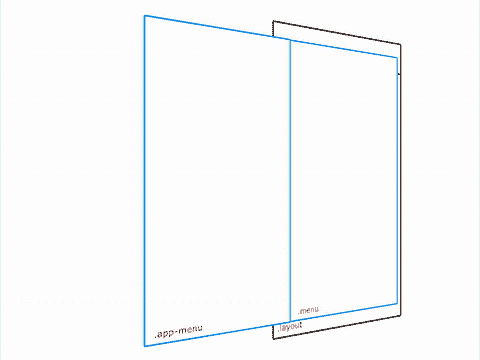

时间线向我们展示了什么？

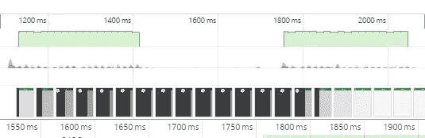

好几天了，宝贝。想看看活生生的例子吗？点击[这里](http://codepen.io/Onyros/pen/jAJxkW)。

## 分享这篇文章