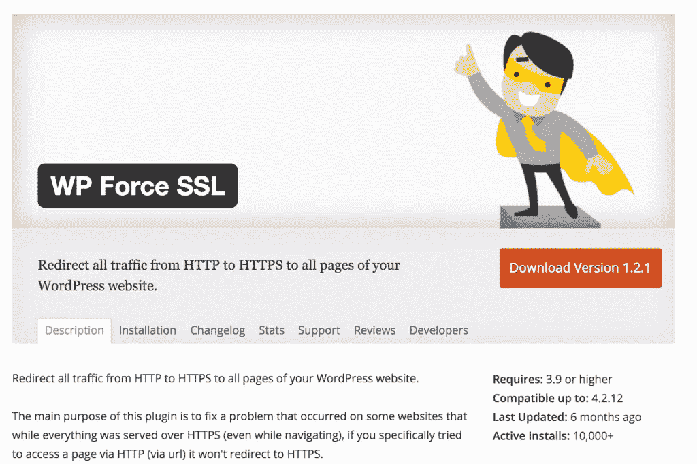
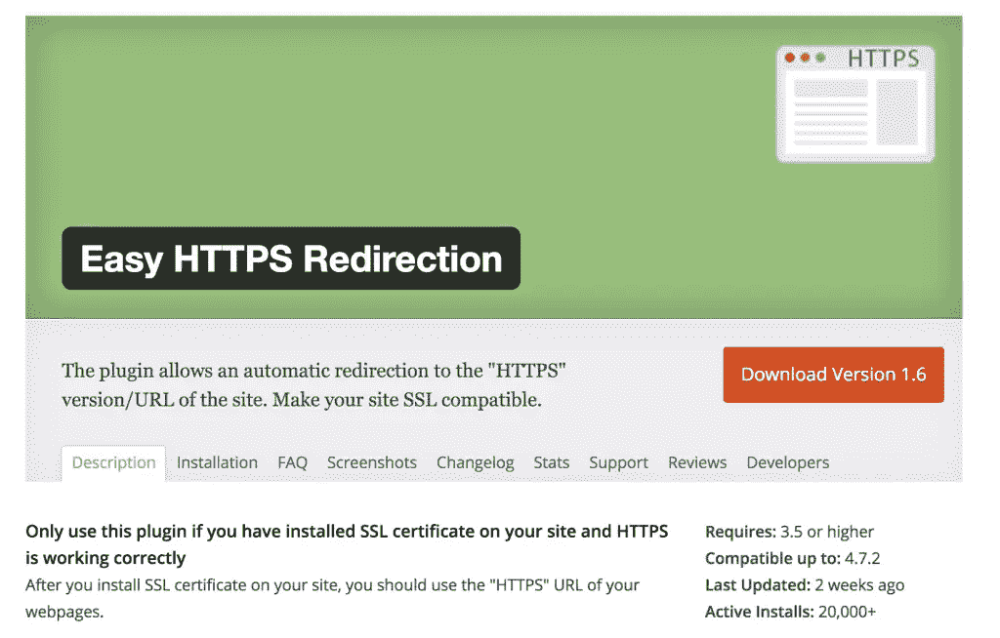
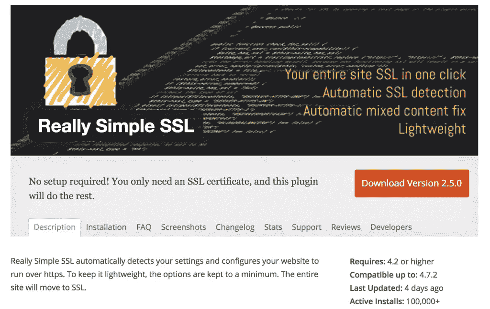
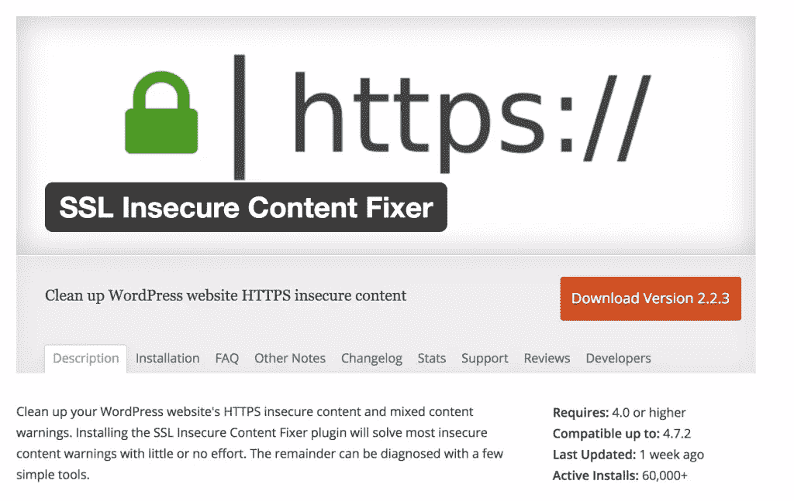
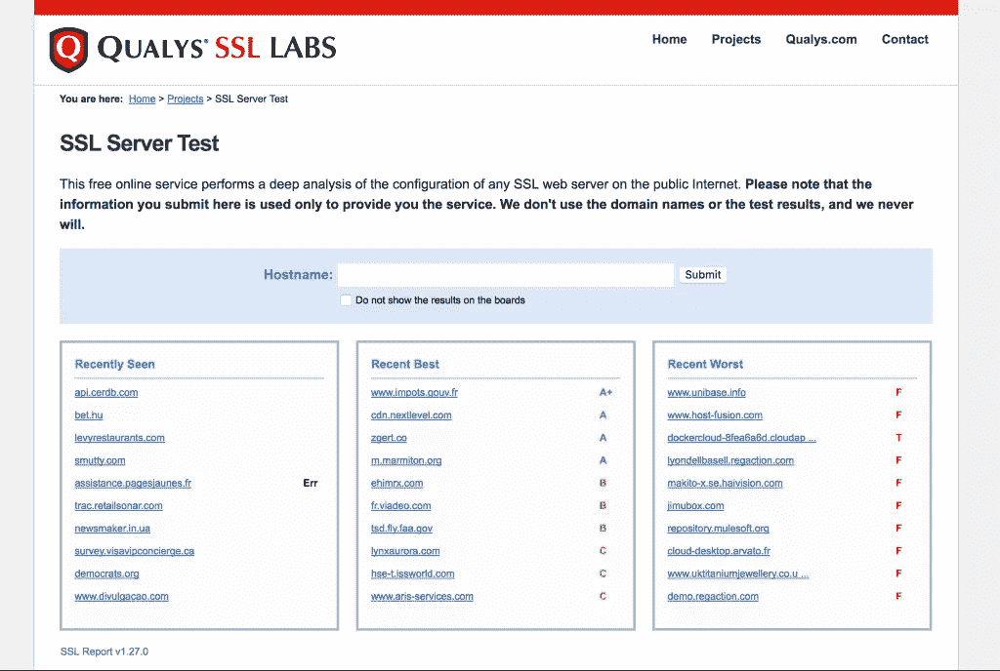
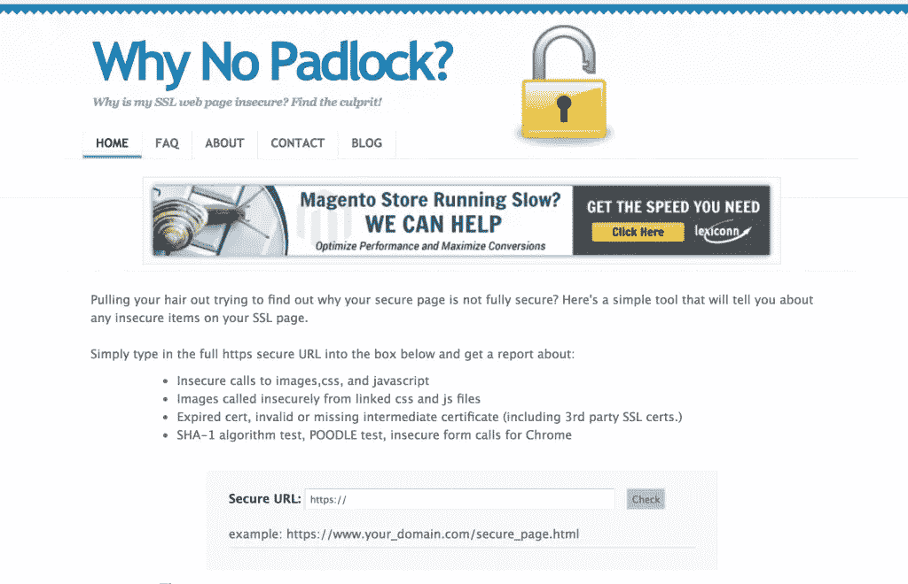
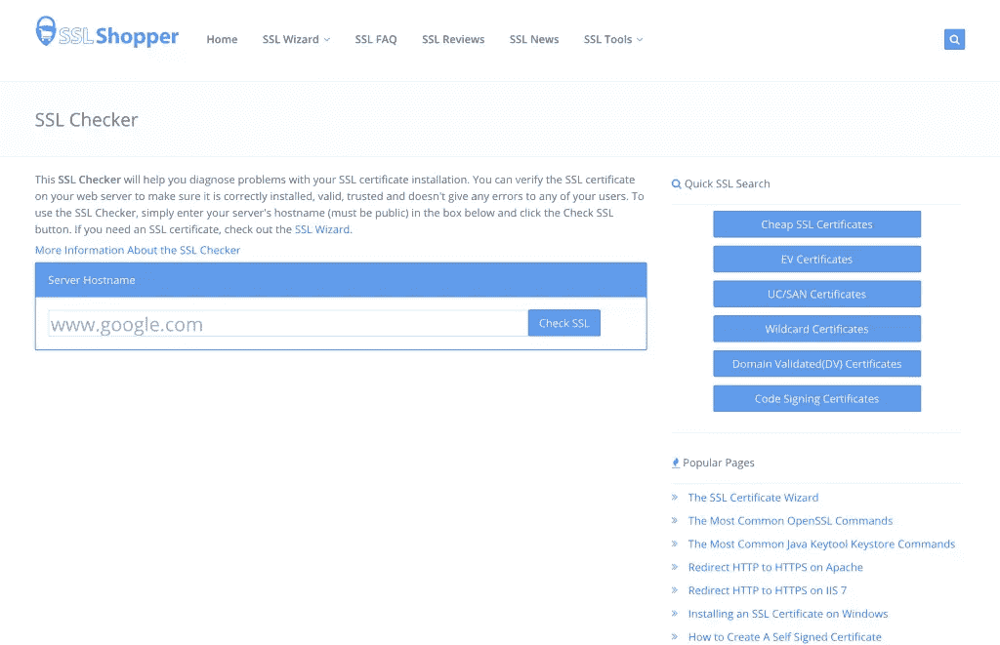

# WordPress SSL 插件使切换到 HTTPS 更容易

> 原文：<https://www.sitepoint.com/wordpress-ssl-plugins-to-make-switching-to-https-easier/>

在 WordPress 网站上启用 SSL (HTTPS)相对容易。一旦你在你的网络服务器上购买或启用了你的 SSL 证书，理论上你需要做的就是更新主页和网站的 URL(在仪表板>设置中，或使用`wp-config.php`)就大功告成了！然而，在实践中，根据您的站点是如何构建和配置的，可能会有一些绊脚石。

使用 SSL 通过加密保护您网站上的通信，使 web 浏览器和 web 服务器之间的通信保持私密。除了安全方面的好处，它也受到搜索引擎的大力鼓励。自 2014 年以来，SSL 甚至[已经成为一个排名因素。](http://searchengineland.com/google-starts-giving-ranking-boost-secure-httpsssl-sites-199446)

多年来，网络浏览器显示挂锁和各种图标来帮助用户识别安全网站，这些现在变得更加引人注目。SSL 是一个重要的信任因素，然而，如果你需要进一步说服自己为什么应该使用 HTTPS 而不是 HTTP，[看看 WP Tavern](https://wptavern.com/more-than-50-of-web-traffic-is-now-encrypted) 上最近的一篇文章，报道称现在超过 50%的网络流量被加密。他们还挖掘了一些当前的使用统计数据。

在这篇文章中，我将介绍一些我遇到的流行插件，以及 WordPress 社区中其他人推荐的插件。我还将列出一些有用的测试工具，它们在解决客户端和服务器 SSL 相关问题时帮助了我。

值得注意的是，所有现代网络浏览器都配备了“开发工具”，包括几个可以帮助解决 SSL 和证书问题的工具。

### WordPress 的 SSL 插件

所有这些插件都要求您在托管环境中成功安装 SSL 证书。它们可以帮助解决混合内容问题，但是我发现没有灵丹妙药，这就是为什么我列出了几个供您研究和测试。

#### WP 强制 SSL

活跃安装数:2 万+
评分:4.8 五星
最后更新时间:6 个月前
链接:[https://en-au.wordpress.org/plugins/wp-force-ssl/](https://en-au.wordpress.org/plugins/wp-force-ssl/)

#### 轻松 HTTPS 重定向

活跃安装数:2 万+
评分:5 星 3.8
最后更新:2 周前
链接:[https://en-au.wordpress.org/plugins/https-redirection/](https://en-au.wordpress.org/plugins/https-redirection/)

#### 非常简单的 SSL

活跃安装数:10 万+
评分:4.8 5 星
最后更新:6 天前
链接:[https://en-au.wordpress.org/plugins/really-simple-ssl/](https://en-au.wordpress.org/plugins/really-simple-ssl/)

#### SSL 不安全内容修复程序

活跃安装数:6 万+
评分:4.9 5 星
最后更新:1 周前
链接:[https://wordpress.org/plugins/ssl-insecure-content-fixer/](https://wordpress.org/plugins/ssl-insecure-content-fixer/)

### SSL 故障排除工具

SSL 问题可能源于您的网站本身，也可能源于 web 服务器。使用下面的工具应该有助于为您指出正确的方向，并为您提供更多关于接下来要看什么的信息。

#### 哪些 SSL 实验室

Qualys 有几个可用的 SSL 工具，他们的 SSL 服务器测试是最受欢迎的一个。该工具检查您的 web 服务器和 SSL 配置是否存在任何问题。它还根据您的 web 服务器和 SSL 实现的配置给出一个分数。

他们还提供了一个客户端测试工具([https://www.ssllabs.com/ssltest/viewMyClient.html](https://www.ssllabs.com/ssltest/viewMyClient.html))，可以报告你的网络浏览器的安全性能。这可能是有用的，尤其是如果您使用的是较旧的浏览器，这对于 SSL 来说可能是个问题。

链接:[https://www.ssllabs.com/ssltest/](https://www.ssllabs.com/ssltest/)

#### 为什么没有挂锁

为什么没有挂锁是一种快速简便的方法，可以检查使用 HTTP 引用的资产是否会导致混合内容问题。你的网络浏览器可以给你同样的信息，但这在与同事或客户一起工作时会很方便，因为它是远程托管的，并提供简单的报告。

混合内容问题是您将遇到的一些最常见的 SSL 问题。即使你做的一切都是正确的，使用一个开发很差的插件，或者嵌入来自第三方的代码，有时也会引入通过 HTTP 提供的硬编码资产的元素。

链接:[https://www.whynopadlock.com/](https://www.whynopadlock.com/)

#### SSL 购物者

这个工具对于报告 SSL 证书配置和安装问题非常有用。这是一个简单的检查，但通常正是您需要的信息来突出 SSL 相关问题的根本原因。

链接:[https://www.sslshopper.com/](https://www.sslshopper.com/)

### 结论

SSL/HTTPS 可能是一个复杂的话题，但幸运的是，您不需要弄脏自己的手就可以开始使用它。网上有丰富的插件、指南和故障排除工具来帮助您启动和运行。

如果你有任何其他有用的工具或插件推荐，请在下面的评论中告诉我们。

## 分享这篇文章