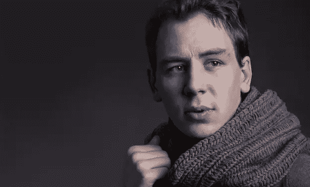
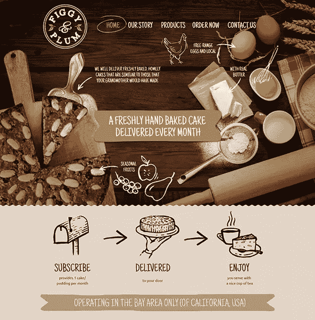
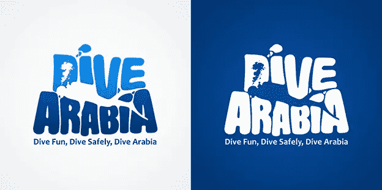
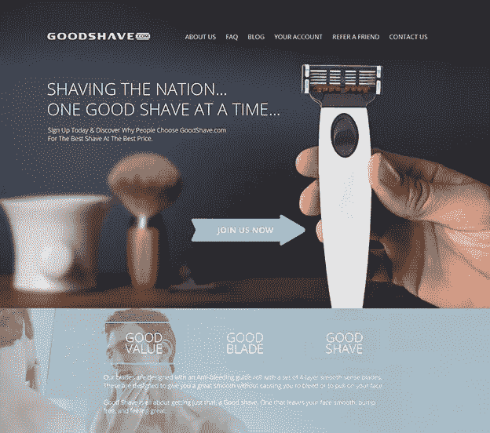

# 向长期社区领袖 DSKY 学习

> 原文：<https://www.sitepoint.com/dsky/>

这篇文章之前发表在 [99designs 博客](https://99designs.com/blog/portraits/learning-from-long-time-community-leader-dsky/?utm_source=partner&utm_medium=paid-referral&utm_campaign=sitepoint&utm_content=interview-post)上。想要最好的设计来改造你的企业吗？[考虑发起一场 99 设计的设计大赛！](https://99designs.com/launch/?utm_source=partner&utm_medium=paid-referral&utm_campaign=sitepoint&utm_content=interview-post)

设计师康斯坦丁·亚斯特雷波夫是我们白金社区的支柱，他在这里被称为 [DSKY](https://99designs.com/profiles/dsky/?utm_source=partner&utm_medium=paid-referral&utm_campaign=sitepoint&utm_content=interview-post) ，已经在近五年的比赛中占据主导地位。他是第一批被指定为白金唱片的人之一(早在我们想出它的时候！)并从那以后继续扩展他令人惊叹的设计组合。

他是 99 年的 [Top 9 的获胜者，也是一系列社区竞赛的获胜者或亚军(例如](https://99designs.com/blog/inside-99designs/top-9-at-99-results-december-2012/?utm_source=partner&utm_medium=paid-referral&utm_campaign=sitepoint&utm_content=interview-post)[鹈鹕的标志](https://99designs.com/blog/inside-99designs/pelicans-logo-contest-winner-and-top-designs/?utm_source=partner&utm_medium=paid-referral&utm_campaign=sitepoint&utm_content=interview-post)、 [99designs Habla Espanol](https://99designs.com/blog/inside-99designs/the-winners-of-99designs-habla-espanol-t-shirt-design-contest/?utm_source=partner&utm_medium=paid-referral&utm_campaign=sitepoint&utm_content=interview-post) 和[巴西世界杯](https://99designs.com/blog/inside-99designs/the-brazilian-word-cup-team-fan-contest-winne/?utm_source=partner&utm_medium=paid-referral&utm_campaign=sitepoint&utm_content=interview-post))，他也一直坚定地支持 99designs 的更大社区——比如有一次他在博客上告诉我们他的[获奖设计过程](https://99designs.com/blog/tips/winning-design-process-infographic/?utm_source=partner&utm_medium=paid-referral&utm_campaign=sitepoint&utm_content=interview-post)。

在我们的采访中，了解更多关于他的设计背景以及他是如何走到今天的。

### ****名称:**** 康斯坦丁·亚斯特列波夫 ****99 图案手柄:****[DSKY](https://99designs.com/profiles/dsky/?utm_source=partner&utm_medium=paid-referral&utm_campaign=sitepoint&utm_content=interview-post) ****地点:**** 乌克兰赫尔松市

**简单介绍一下你的背景吧！你是什么时候开始对平面设计感兴趣的，你的教育背景是什么？**

我叫康斯坦丁·亚斯特雷波夫。我今年 27 岁，住在乌克兰南部的小城市赫尔松。我做全职自由职业者已经两年了。

我有艺术家和设计师的大学学位。我一直对绘画、摄影、舞蹈、设计感兴趣，这些都做了很久。但我决定有必要只专注于一个，这样我就有更好的机会真正擅长它。

当然，我选择了设计。我们总是做出选择，有时他们是错误的，但总是给我们一个改进的机会。所以没必要害怕，行动就好。

你做了很多不同的设计——标识、身份和网页。你是如何做到如此多样化的？

当我开始做 99designs 的时候，我只是做标志设计。然后尝试了几个网页设计的比赛。当然，一开始也没什么结果。但这真的是一次很棒的经历，所以我继续从事网页设计竞赛。而且现在占了我大部分时间！所以我可以为顾客提供更广泛的服务。

你在设计中形成了一种非常一致的风格。是什么激发了你的审美？

当我开始做 99 设计的时候，我看到了很多原创和令人兴奋的设计。我很震惊，这些作品看起来真的很酷！我不认为几年后，我能做同样质量的工作。我寻找了其他设计师的最佳作品，并对其进行了分析。

设计师应该经常将自己的作品与其他人进行比较，因为这有助于提高设计技能。为了变得更好，我有很多东西要学，我还在继续比较和提高。

你如何选择你的客户和比赛？

我开发了一个选择竞赛的系统。首先，我关注所有让我感兴趣的比赛。我每天都检查新的。我从来不看一场比赛是否有保障。对我来说，反馈更重要。

如果过了一天，客户给出了相当高的反馈，我才开始工作。而且也有过我喜欢的比赛，但是因为反馈低而拒绝参加。我并不是说这个规则对每个人都适用，但对我来说，它非常适用。

在 99designs 博客上，你经常出现在社区竞赛和前 9 名中。他们或你的其他设计中，有你最喜欢的项目吗？

进入前 9 名是一次很棒的经历。我有非常强大的竞争对手，我没想到会赢。它帮助我达到了一个新的高度。这使我更加努力工作。这对 99designs 的每个参与者都是一个巨大的激励。

很难挑出一个特别的设计。可能是跳水阿拉伯(上图)，因为这对我来说是一场重要的胜利。这是我的第一次胜利！这成为我发展的强大动力。但我也知道我的设计并不完美。过了半年，我才对以前的工作不满意。这就是为什么我们必须继续发展。经常分析自己过去的项目，努力提高自己的设计水平。

这个社区的什么促使你继续参与？

一天，我的朋友向我展示了 99 个设计，这改变了我的生活。我遇到了很棒的人，我很荣幸成为这个社区的一员。我住在一个小镇，但现在我有机会与来自世界各地的人交流。真的是一件很神奇的事情。

从现在开始，你有什么计划？你有最终目标吗？

我知道我还有很多东西要学，我想提高。但是我相信我会在设计方面取得好成绩。我的目标是在这个世界上留下重要的印记。为其他人做些有用的事情。设计是一个很好的机会。

还有，我想和整个团队一起喝咖啡，吃披萨。告诉他们谢谢你。总有一天我会做到的！*(作者注——我们也是！)*

你对其他设计师有什么样的建议？

保持原创。寻找自己的风格，努力成为某个设计领域的专家，这样你会有很大的成就。但是不要忘记尝试新的东西。永远要为未来做好规划，明确自己的长期目标，还要规划好每个月的工作。

我理解许多人把竞赛视为彩票。但是你可以控制你在 99 设计上的收入。你只需要确定你想赚多少钱，做一点数学计算，以确保你能赚到。

与顾客沟通也很重要。你发送的每个设计版本，你都要解释。不要害怕问问题。假设这样的事情发生了，客户晚上 11 点给你发信息，你要睡觉了。你当然不能马上做出改变，你不是僵尸。但是最好的选择是回复客户，告诉他你可以在早上进行修改。正是这些小事为工作关系创造了良好的条件。

享受你的工作和生活。过好每一天，记住你的健康。今天是你一生中最美好的一天。活在当下，这样你就能改变他们的未来。

**看更多 DSKY 的作品[这里](https://99designs.com/profiles/dsky/?utm_source=partner&utm_medium=paid-referral&utm_campaign=sitepoint&utm_content=interview-post)。**

## 分享这篇文章