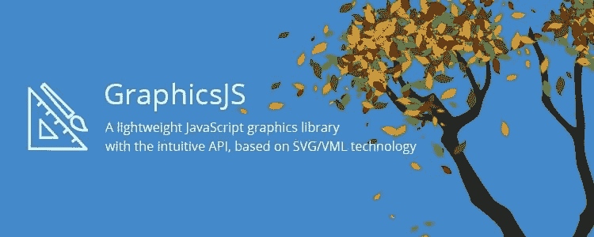

# GraphicsJS 简介，一个强大的轻量级图形库

> 原文：<https://www.sitepoint.com/introducing-graphicsjs-a-powerful-lightweight-graphics-library/>

HTML5 是现代网络的支柱。如今，当谈到创建交互式图像时，SVG 和 Canvas 通常是首选技术——Flash 已经被遗忘，Silverlight 是栖息在 Web 边缘的罕见独角兽，很少有人记得第三方插件。

每种技术的优缺点都有很好的证明，但是简单地说，SVG 更适合创建和处理交互元素。这是因为 SVG 是一种基于 XML 的矢量格式，当使用`<svg>`标签将图像加载到页面中时，图像中的每个元素都可以在 SVG DOM 中使用。

在本文中，我想向您介绍 [GraphicsJS](http://www.graphicsjs.org/) ，这是一个新的强大的开源 JavaScript 绘图库，它基于 SVG(带有用于旧 IE 版本的 [VML](https://en.wikipedia.org/wiki/Vector_Markup_Language) 后备)。我将从快速介绍其基础知识开始，然后借助两个简短但精彩的示例展示该库的功能:第一个示例是关于艺术的，而第二个示例演示了如何用不到 50 行代码编写一个简单的时间杀手艺术游戏。

## 为什么选择 GraphicsJS

有很多库可以帮助开发人员使用 SVG:[raphal](https://dmitrybaranovskiy.github.io/raphael/)、 [Snap.svg](https://snapsvg.io/) 和 [BonsaiJS](https://bonsaijs.org/) 等等。每一种都有自己的优点和缺点，但是对它们进行彻底的比较将是另一篇文章的主题。这篇文章是关于 GraphicsJS 的，所以让我来解释它的优点和特别之处。



首先，GraphicsJS 是轻量级的，拥有非常灵活的 JavaScript API。它实现了许多富文本特性，以及一个虚拟 DOM——与特定于浏览器的 HTML DOM 实现相分离。

其次，它是一个新的开源 JavaScript 库，由全球领先的交互式数据可视化软件开发商之一 [AnyChart](https://www.anychart.com) 于去年秋天发布。AnyChart 已经使用 GraphicsJS 在其专有产品中呈现图表至少三年了(自 AnyChart 7.0 发布以来)，因此 GraphicsJS 已经过全面的实战测试。(免责声明:我是 AnyChart 的研发负责人，也是 GraphicsJS 的首席开发人员)

第三，与 AnyChart 的 JavaScript 图表库不同，GraphicsJS 可以免费用于商业和非营利项目。在 Apache 许可下，它可以在 GitHub 上获得。

第四，GraphicsJS 跨浏览器兼容，支持 Internet Explorer 6.0+，Safari 3.0+，Firefox 3.0+，Opera 9.5+。它在旧版本的 IE 浏览器中以 VML 语言呈现，在所有其他浏览器中以 SVG 语言呈现。

最后，GraphicsJS 允许您将图形和动画结合在一起，以获得更好的效果。看看它的[主画廊](http://www.graphicsjs.org/)，里面有一个[动画篝火](https://playground.anychart.com/gallery/latest/Graphics/Bonfire-plain)、[旋转星系](https://playground.anychart.com/gallery/latest/Graphics/Galaxy-plain)、[落雨](https://playground.anychart.com/gallery/latest/Graphics/Rain-plain)、[程序生成树叶](https://playground.anychart.com/gallery/latest/Graphics/Tree-plain)、[可玩 15 个拼图](https://playground.anychart.com/gallery/7.12.0/Graphics/Puzzle_15-plain)等等。GraphicsJS 在其广泛的[文档](https://docs.anychart.com/latest/Graphics/Overview)和全面的 [API 参考](https://api.anychart.com/latest/anychart.graphics)中包含了更多的例子。

## 图形 JS 基础

从 GraphicsJS 开始，您需要引用该库并为您的绘图创建一个块级 HTML 元素:

```
<html lang="en">
  <head>
    <meta charset="utf-8" />
    <title>GraphicsJS Basic Example</title>    
  </head>
  <body>
    <div id="stage-container" style="width: 400px; height: 375px;"></div>

    <script src="https://cdn.anychart.com/js/latest/graphics.min.js"></script>
    <script> // GraphicsJS code here </script>
  </body>
</html> 
```

然后你应该创建一个舞台并在里面画一些东西，比如一个[矩形](https://api.anychart.com/latest/anychart.graphics#rect)、一个[圆形](https://api.anychart.com/latest/anychart.graphics#circle)或者其他[形状](https://docs.anychart.com/latest/Graphics/Shapes):

```
// create a stage
var stage = acgraph.create('stage-container');
// draw a rectangle
var stage.rect(25, 50, 350, 300); 
```

这里是 CodePen 上的例子，我们进一步绘制了[死亡圣器](https://harrypotter.wikia.com/wiki/Deathly_Hallows)符号。

## 我们的第一件杰作

### 填充、描边和图案填充

使用[填充设置](https://docs.anychart.com/latest/Graphics/Fill_Settings)和[描边设置](https://docs.anychart.com/latest/Graphics/Stroke_Settings)可以给任何形状或路径上色。所有东西都有一个描边(边框)，但只有形状和闭合路径有填充。填充和描边设置非常丰富，填充和描边都可以使用线性或圆形渐变。此外，线条可以是虚线，并且支持多种平铺模式的图像填充。但所有这些都是你几乎可以在任何图书馆找到的非常标准的东西。GraphicsJS 的特别之处在于它的[阴影和图案填充](https://docs.anychart.com/latest/Graphics/Hatch_Fill_Settings)特性，它不仅允许您使用 32 个(！)可用的 [hatch 填充图案](https://api.anychart.com/latest/anychart.graphics.vector.HatchFill.HatchFillType)开箱即用，而且还能轻松创建您自己的由形状或文本组成的图案。

现在，让我们看看到底什么是可能的！我将画一个站在房子附近的男人的小图，然后用不同的图案和颜色填充来增强它。为了简单起见，让我们把它做成一张[天真的艺术](https://en.wikipedia.org/wiki/Na%C3%AFve_art)图(尽量不要陷入[艺术的粗野](https://en.wikipedia.org/wiki/Outsider_art))。这是这样的:

```
// create a stage
var stage = acgraph.create('stage-container');

// draw the frame
var frame = stage.rect(25, 50, 350, 300);

// draw the house
var walls = stage.rect(50, 250, 200, 100);
var roof  = stage.path()
  .moveTo(50, 250)
  .lineTo(150, 180)
  .lineTo(250, 250)
  .close();

// draw a man
var head = stage.circle(330, 280, 10);
var neck = stage.path().moveTo(330, 290).lineTo(330, 300);
var kilt = stage.triangleUp(330, 320, 20);
var rightLeg = stage.path().moveTo(320, 330).lineTo(320, 340);
var leftLeg = stage.path().moveTo(340, 330).lineTo(340, 340); 
```

在密码笔上检查[的结果。](https://codepen.io/SitePoint/pen/VPGQKx)

如您所见，我们现在使用变量—所有在舞台上绘制东西的方法都返回一个对所创建对象的引用，该链接可用于更改或移除该对象。

还要注意在 GraphicsJS 中随处可见的链接是如何帮助缩短代码的。链接(例如`stage.path().moveTo(320, 330).lineTo(320, 340);`)应该小心使用，但是如果应用得当，它确实可以使代码紧凑并且更容易阅读。

现在，让我们把这张涂色纸给一个孩子，让他们涂色。因为即使一个孩子也能掌握以下技巧:

```
// color the picture
// fancy frame
frame.stroke(["red", "green", "blue"], 2, "2 2 2");
// brick walls
walls.fill(acgraph.hatchFill('horizontalbrick'));
// straw roof
roof.fill("#e4d96f");
// plaid kilt
kilt.fill(acgraph.hatchFill('plaid')); 
```

这是我们的例子现在的样子。

现在我们有一张苏格兰高地人的照片，他穿着苏格兰短裙，站在他有稻草屋顶的砖砌城堡附近。我们甚至可以大胆地说，这确实是一件我们想要版权的艺术品。让我们使用自定义的基于文本的图案填充来实现这一点:

```
// 169 is a char code of the copyright symbol
var  text = acgraph.text().text(String.fromCharCode(169)).opacity(0.2);
var  pattern_font = stage.pattern(text.getBounds());
pattern_font.addChild(text);
// fill the whole image with the pattern
frame.fill(pattern_font); 
```

如您所见，这非常容易做到:您创建一个[文本对象](https://api.anychart.com/latest/anychart.graphics.vector.Text)的实例，然后在一个阶段中形成一个[模式](https://api.anychart.com/latest/anychart.graphics.vector.Stage#pattern)，并将一个文本放入该模式中。

在 [CodePen](http://codepen.io) 上看到 SitePoint ( [@SitePoint](http://codepen.io/SitePoint) )的笔[彩色版权房屋/图形 js](https://codepen.io/SitePoint/pen/RKYyoV/) 。