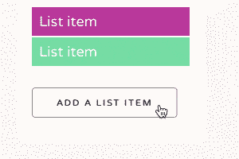
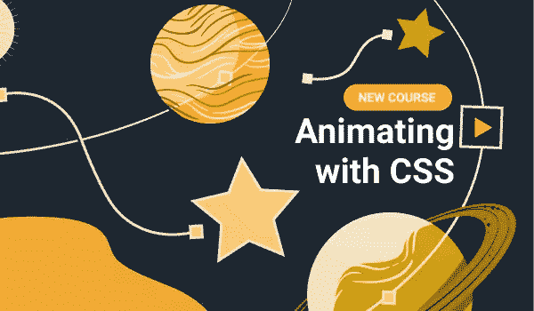

# 用 CSS 动画赋予网站生命

> 原文：<https://www.sitepoint.com/css-animations-bringing-websites-to-life/>

动画正迅速成为一种重要的设计工具，越来越多地被用来帮助我们的用户理解我们的作品并与之互动。

近年来，浏览器和移动设备对动画的支持有了很大的改进。事实上，所有现代桌面浏览器都内置了对 CSS 动画的支持。与 CSS 提供的其他优秀工具一起，现在是为我们的设计添加动感的最佳时机。但是为什么动画如此重要呢？今天你如何开始使用它？

## 为什么 CSS 动画在我们的设计中很重要？

运动是我们交流和理解周围世界的重要组成部分。这是我们与生俱来的本能。

我们已经进化到非常擅长注意运动。运动通过帮助我们注意到周围环境的变化来保护我们，它为我们所说的话增加了一层额外的交流。观察动作和视觉线索使我们能够以非语言的方式理解复杂的动作和想法。

网络上的动画可以达到同样的效果，并且可以为用户和用户界面之间的对话增加额外的深度和意义。

例如，我们可以在删除元素时将它们从屏幕上动画化，在添加新的元素时将它们动画化。这个简单的交易帮助我们了解他们去了哪里。它增加了我们正在处理的东西的心智模型，并使交互更丰富、更有意义。

我们可以使用动画来吸引用户对界面中某些元素的注意，或者讲述故事，带领用户踏上一步又一步的旅程。

在网站或应用程序的微交互中添加动画和过渡可以帮助吸引用户，给他们惊喜和愉悦。它们也是一种强大的方式，向用户提供他们正在采取的行动的反馈，例如悬停在点击上，点击按钮或填写表格。这些都增加了对话的内容，有助于增加界面的个性。

## JavaScript 呢？

CSS 不是给我们的设计带来动画的唯一方式，但它是最简单的入门方式。从 jQuery 早期开始，我们就有了用 JavaScript 制作和移动页面元素的方法。

最近，强大的软件包，如 GreenSock 的 GSAP，为浏览器带来了先进的动画——甚至对那些不支持 CSS 动画的浏览器也是如此。它们带来了对动画工作方式的精细控制，强大的向后兼容性和各种有用的功能。

但是这是有代价的。向我们的项目添加额外的 JavaScript 依赖项会使我们的项目变得更重，导致更长的下载时间和处理页面的时间。这对于高速宽带连接的台式机来说可能无关紧要，但是对于世界上依赖低速连接和移动设备的大部分地区来说，我们需要将性能放在心上。

引入 JavaScript 框架也增加了复杂性，因为它增加了更多的维护和可能的错误来源。

尽管如此，基于 JavaScript 的动画选项已经取得了很大进展，对于我们想要添加高级或复杂的动画时，它是一个强大而有用的选项。

不过，在我们接触插件之前，我们可以用 CSS 做很多事情:这是当今最快速、最简单的动画入门方式。

## 使用 CSS 制作动画

Web 浏览器支持现成的 CSS(程度不同)。

就像我们会在样式表中使用“字体大小”或“背景”属性来制作我们的视觉设计一样，我们也可以使用“过渡”、“动画”和“关键帧”来创建运动。

过渡可用于在悬停状态期间平滑变化的样式；关键帧动画可以设置为在多个状态之间循环，甚至可以组合在一起创建复杂的效果。我们可以使用内置的 CSS 属性来控制动画的时间、方向等等，在短暂的学习曲线之后，任何具有基本 CSS 技能的人都会非常熟悉这些属性。

当在使用“关键帧”或使用 JavaScript 之间做出选择时，了解 CSS 可以做什么是很有帮助的。

## 为什么不从今天开始呢？

CSS 动画的伟大之处在于没有什么可以阻止你立即开始。你所需要的只是一个网络浏览器和一个文本编辑器，或者你可以使用像 [CodePen](https://codepen.io) 这样的服务立即开始创作。

有很多理由让你对浏览器中的动画感到兴奋。有很多很好的例子说明动画不仅提升了网站的美感，还增加了互动性，减少了混乱。但是动画不仅仅是一个实用的工具，和他们一起工作是有趣和有创造性的；它给网络带来了生机。

我最近与 SitePoint 合作创建了一个新课程，用 CSS 制作动画。我对此感到兴奋，事实上，我认为教人们如何在网络上做新的事情并使它变得更好是至关重要的。这是我在 CSSAnimation.rocks 上的工作的延伸，这是另一个关于 CSS 动画的很好的学习资源。

让我们来看看您将在本课程中学到什么:

1.  **在浏览器中制作动画**
    为课程设置场景，看看动画的好处和原理。
2.  **过渡——从 A 到 B**
    学习添加两种状态间风格变化时的平滑过渡。
3.  **关键帧动画**
    学习如何使用`@keyframes '和` animation '属性制作更复杂的运动；首先是理论，然后是实例。
4.  **缓动和定时功能**
    探索如何使用缓动和三次贝塞尔函数添加角色和控制动画定时。
5.  **把所有这些放在一起**
    为了更进一步，我们将结合特效来创建多个过渡和多个动画。
6.  浏览器注意事项
    我们将讨论浏览器支持、厂商前缀和性能注意事项，以确保您的动画可以在尽可能多的设备上运行。
7.  **可访问性和动画**
    最后，我们将解决可访问性问题，并确保我们的动画不会因分散注意力或引起晕车而引起问题。

除了本课程所涵盖的理论和实际例子之外，还有许多地方可以寻找灵感。我喜欢在 [Dribbble](https://dribbble.com) 上查看动画概念。在[上有大量的 UI 灵感，使用你的界面](http://uyi.io)，还有[可以激活](http://capptivate.co)来获得 iOS 灵感，或者如果你正在寻找电影灵感，请确保将标题的[艺术加入书签。](http://www.artofthetitle.com)

动画可以给我们的设计带来很多东西。它可以帮助我们交流，它可以帮助我们讲故事，它可以是一个有趣的，创造性的出口。这很容易开始，但天空是我们所能创造的极限。所以，为什么不开始尝试一些新的东西，看看 motion 如何将你的设计变成现实！

## 分享这篇文章