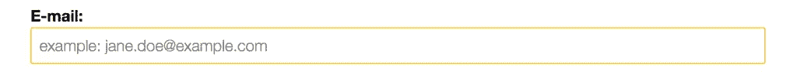
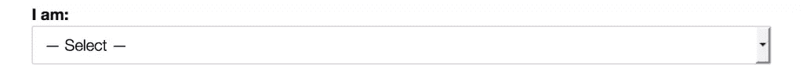
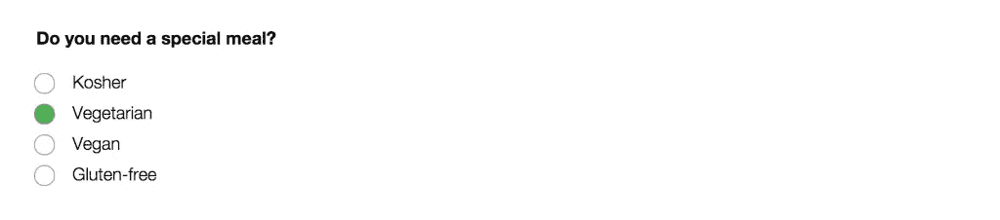
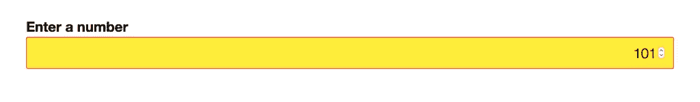
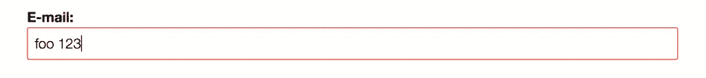

# CSS 伪类:根据表单字段的输入来设计它们的样式

> 原文：<https://www.sitepoint.com/css-pseudo-classes-styling-form-fields-based-on-their-input/>


下面是我们的书《CSS 大师》的摘录，作者是蒂芙尼·布朗。世界各地的商店都有出售，或者你可以在这里买到电子书。

让我们来看一些特定于表单域和表单域输入的伪类。无论字段是必需的还是当前启用的，这些伪类都可以用于根据用户输入的有效性来设计字段的样式。

后面的所有伪类都是特定于表单的。因此，不太需要用选择器来限制范围。使用`:enabled`不会给`span`元素带来副作用。但是，当您希望以不同的方式排列各种类型的表单控件时，限制范围是很有帮助的。

#### `:enabled`和`:disabled`

顾名思义，这些伪类匹配具有(或缺少)HTML5 属性的元素。这可以是一个输入控件，如`input`、`select`或`button`元素(很快就会看到)，也可以是一个`fieldset`元素:

```
<button type="submit" disabled>Save draft</button>
```

默认情况下，表单元素处于启用状态；也就是说，只有设置了`disabled`属性，它们才会被禁用。使用`input:enabled`将匹配每一个没有`disabled`属性集的`input`元素。相反，`button:disabled`将匹配所有具有`disabled`属性的按钮元素:

```
button:disabled {
    opacity: .5;
}
```

该图显示了我们的`button`元素的`:enabled`和`:disabled`状态。


#### `:required`和`:optional`

必填和可选状态由字段中是否存在`required`属性决定。[<sup class="footnote">【6】</sup>](#ftn.d5e1413)例如:

```
<p>
    <label for="email">E-mail:</label>
    <input type="email" id="email" name="email" placeholder="example: jane.doe@example.com" required>
</p>
```

大多数浏览器只在表单提交后才显示是否需要某个字段。使用`:required`伪类，我们可以在提交之前向用户指示该字段是必需的。例如，下面的 CSS 将从上面给我们的电子邮件字段添加一个黄色边框，如下图所示:

```
input:required {
    border: 1px solid #ffc107;
}
```



`:optional`类的工作方式类似，通过匹配 *没有* 属性的元素。例如，下面的 CSS 给出了如下所示的结果。

```
select:optional {
    border: 1px solid #ccc;   
}
```



#### `:checked`

与我们讨论过的其他伪类不同，`:checked`只适用于单选按钮和复选框表单控件。顾名思义，这个伪类允许我们为选择的输入定义单独的样式。

不幸的是，在大多数浏览器中设计单选按钮和复选框就像去看牙医一样令人愉快。CSS 基本用户界面模块级别 4 试图用外观属性来解决这个问题，但是这个属性还不被支持。然而，基于 WebKit/Blink 的浏览器和 Firefox 确实支持它的非标准、厂商前缀版本。

为了创建跨浏览器的自定义单选按钮和复选框输入，我们需要聪明地使用我们的选择器。我们将使用一个兄弟组合符、一个伪元素和`:checked`来创建定制的单选按钮和复选框控件。例如，要在标签的关联单选按钮被选中时更改标签的样式，我们可以使用以下 CSS:

```
[type=radio]:checked + label {
    font-weight: bold;
    font-size: 1.1rem;
}
```

这将使标签加粗，并在其关联控件被选中时增加其大小。不过，我们可以通过使用伪元素`::before`和元素`label`来注入一个定制控件来改进这一点:

```
[type=radio] { opacity: 0; }

[type=radio] + label::before {
    background: #fff;
    content: '';
    display: inline-block;
    border: 1px solid #444;
    height: 1.2rem;
    margin-right: 1em;
    vertical-align: middle;
    width: 1.2rem;
}

[type=radio]:checked + label::before {
    background: #4caf50;
}
```

这为我们提供了您在下面看到的自定义控件。



当然，为了让这种技术发挥作用，我们的 HTML 需要有适当的结构:

*   `label`元素必须紧邻其输入控件。

*   除了`name`属性之外，表单控件还必须有一个`id`属性(例如，`<input type="radio" id="chocolate" name="flavor">`)。

*   `label`必须有一个`for`属性，其值必须与表单控件的`id`匹配(例如`<label for="chocolate">Chocolate</label>`)。

使用`for`将标签与输入关联起来，可以确保当用户点击标签或其子伪元素(`::before`)时，表单输入将被选中。

#### `:in-range`和`:out-of-range`

`:in-range`和`:out-of-range`伪类可以与`range`、`number`和`date`输入控件一起使用。使用`:in-range`和`:out-of-range`需要设置控件的`min`和/或`max`属性值。这里有一个使用`number`输入类型的例子:

```
<p>
  <label for="picknum">Enter a number from 1-100</label>
  <input type="number" min="1" max="100" id="picknum" name="picknum" step="1">
</p>
```

如果值在 1 到 100 的范围之内或之外，让我们添加一点 CSS 来改变样式:

```
:out-of-range {
    background: #ffeb3b;
}

:in-range {
    background: #fff;
}
```

如果用户输入-3 或 101，`#picknum`的背景色将变成我们的`:out-of-range`规则集中定义的黄色(见下图)。否则，它将按照我们的`:in-range`规则集的定义保持白色。



#### `:valid`和`:invalid`

使用`:valid`和`:invalid`伪类，我们可以根据表单输入是否符合我们的要求来设置样式。这将取决于由`type`或`pattern`属性值强加的验证约束。例如，如果用户输入是“foo 123”，带有`type="email"`的输入将是无效的，如下图所示。



在下列情况下，表单控件将具有无效状态:

*   当必填字段为空字段时

*   当用户的输入与`type`或`pattern`约束不匹配时

*   当字段的输入超出其`min`和`max`属性值的范围时

默认情况下，值为空的可选字段有效。显然，如果用户输入满足字段的约束，它就以有效状态存在。

表单控件可以同时有多种状态。因此，您可能会发现自己在管理特殊性(将在下一节讨论)和级联冲突。减轻这种情况的一种方法是限制在项目中使用哪些伪类。例如，如果您还要定义一个`:valid`规则集，就不要费心定义一个`:optional`规则集。

不过，也有可能是 *链* 伪类。例如，我们可以混合使用`:focus`和`:invalid`伪类来设计一个元素的样式，只要它有焦点:`input:focus:invalid`。通过链接伪类，我们可以设计具有多个状态的元素。

* * *

[<sup class="para">【6】</sup>](#d5e1413)记住在 HTML5 中，属性的有无决定了它的值。换句话说，`required="false"`与`required="true"`、`required="required"`和`required`具有相同的效果。

## 分享这篇文章