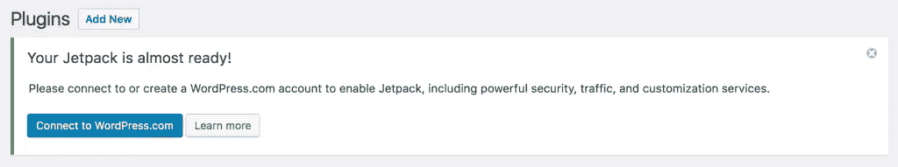
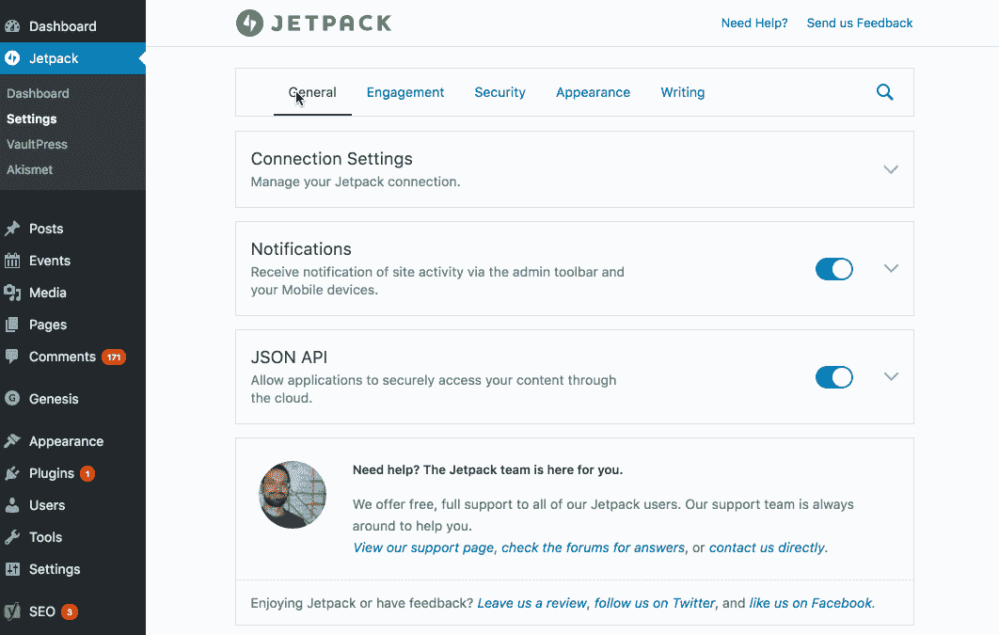
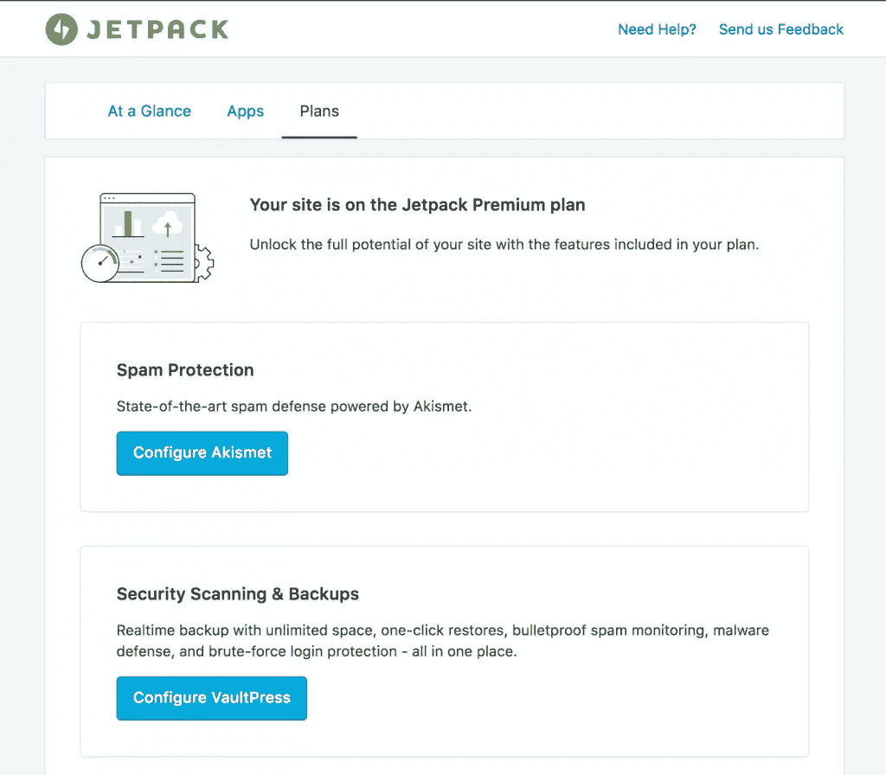
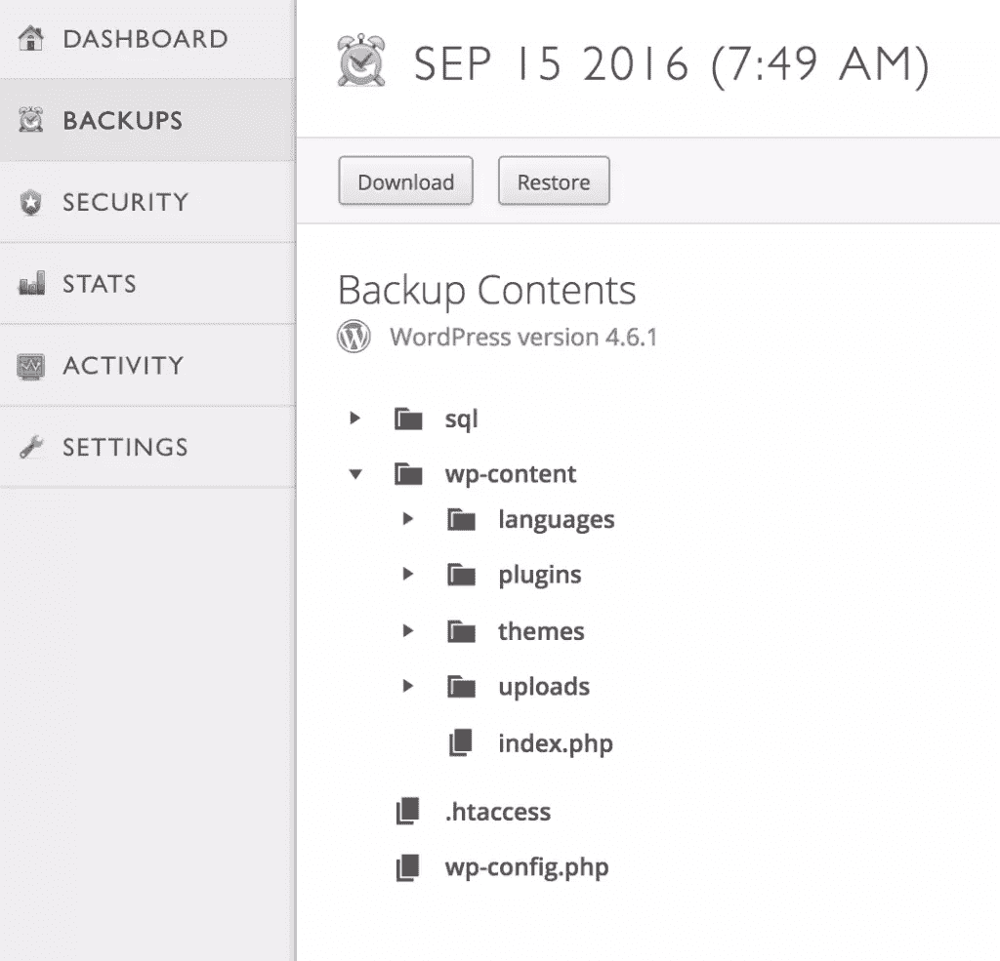
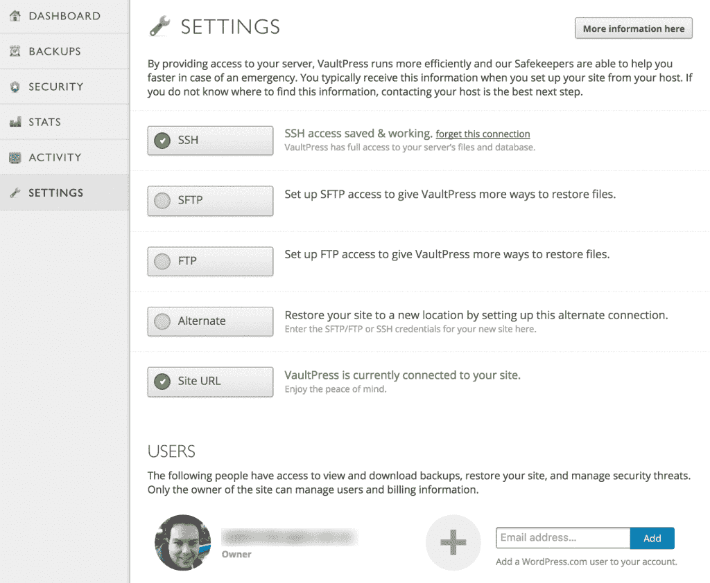
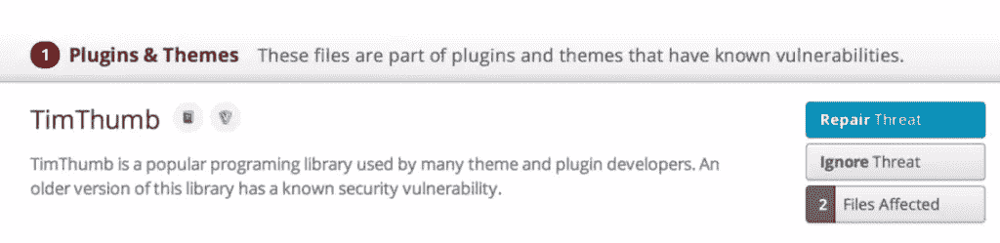

# 如何用 Jetpack 备份和保护 WordPress

> 原文：<https://www.sitepoint.com/how-to-backup-and-secure-wordpress-with-jetpack-2/>

*本文由 [Jetpack](https://jetpack.com/pricing/sitepoint/) 赞助。感谢您支持使 SitePoint 成为可能的公司。*

Jetpack 无疑是最受欢迎的 WordPress 插件之一，在撰写本文时已有数百万的安装量。

如果你一直在关注 WordPress 的新闻，你可能听说过 Jetpack 在过去的一年里经历了一些重大的重新开发，如果你有一段时间没有查看它的话——现在是再看一看的好时机。

由[automatic](https://automattic.com/)(WordPress.com 背后的人)开发的 Jetpack 不仅仅是另一个插件，它更像是一个类固醇插件。它给自托管的 WordPress 网站带来了许多与 WordPress 相同的功能，并增加了一些强大的功能。

我们已经在 SitePoint 详细介绍了 Jetpack，但是最新版本拥有完全重新设计的 UI，以及大量的新功能。在本文中，我们将介绍一些新的安全特性，包括集成的每日和实时备份。

## Jetpack 安装和功能概述

### 如何安装 Jetpack

在你开始之前，仔细检查你运行的是 WordPress 的最新版本，并且你的网站是可公开访问的(如果你使用本地安装，检查一下 [Jetpack 的开发者模式](https://jetpack.me/support/development-mode/))。您可能还想仔细检查您的 web 主机是否使用 PHP 5 或更高版本(如果不是，这可能是一个好主意！).

最简单的安装方法是通过[在线 Jetpack 安装程序](https://wordpress.com/jetpack/connect/install)。我将带您进行一个简短的演练:

*   首先[输入你的网站网址](https://wordpress.com/jetpack/connect/install)(例如:www.mywebsite.com)——Jetpack 会自动检查你的网站是否兼容——然后点击**开始安装**。
*   在下一页，点击“**安装 Jetpack** ”。这将把你带到你的 WordPress 仪表盘，你需要点击“**安装插件**”。
*   一旦插件安装完毕，点击**激活**。
*   然后，您将看到下面的提示，提示您将网站连接到 WordPress.com:

*   当你点击“连接到 WordPress.com”时，你将被重定向到 WordPress.com，要么创建一个帐户，要么使用现有帐户登录。
*   在你创建了一个帐户或者用你现有的帐户登录后，Jetpack 会确认你愿意将网站连接到这个用户，然后让你返回到你的 WordPress 网站。
*   现在你会发现你有一个新的“Jetpack”仪表板菜单项，使你能够控制你使用什么功能。

对于 WP-CLI 用户，您也可以使用以下命令启动并运行 Jetpack:`wp plugin install jetpack`。

有关[安装过程的更多信息，请查看 Jetpack.com](https://jetpack.com/support/installing-jetpack/)和方便的[快速入门指南](https://jetpack.com/support/quick-start-guide/)。

### Jetpack 的主要功能

使用流行的 JavaScript 库 React 重新编写了 Jetpack 接口。用户体验很流畅，模块选择和配置的导航感觉很快。

Jetpack 绝对是 WordPress 插件的瑞士军刀。它在一个插件中提供了 30 多种功能，以及全面的服务和优势。更好的是，你可以只激活你需要的，这使得这个插件对于任何 WordPress 站点都是高度可定制的。

Jetpack 插件的主要功能集中在 5 个关键领域:

1.  **备份和安全性**–强力保护和单点登录。Jetpack 的[高级](https://jetpack.com/install/premium/sitepoint/) [功能](https://jetpack.com/install/premium/sitepoint/)还允许垃圾邮件防护、带存档和存储的异地备份、自动恢复和恶意软件扫描。
2.  **性能**–高速 CDN 和正常运行时间监控。
3.  **流量和参与度**–网站统计、相关帖子、增强分发、共享工具和“专业”订阅级别也使您的网站能够进行投票、评级和调查。
4.  **站点管理**–插件管理、自动更新和跨平台工具。订阅选项还包括轻松的站点迁移(通过备份)。
5.  支持–免费插件为所有用户提供基本支持，但是 Jetpack 的高级选项提供额外的 WordPress 和安全支持。

我喜欢的一些鲜为人知的特性是自定义内容类型、Markdown 支持和自定义 CSS，但在本文中，我将更深入地探讨备份和安全性的第一点。

## 如何用 Jetpack 备份你的网站

Jetpack 提供了一些强大的站点管理和系统管理功能。所有站点所有者最容易忽视和低估的任务之一是备份。我们将看看 Jetpack 提供的高级备份选项，但首先我将深入了解备份为何如此重要。

### 并非所有备份都是平等的

仅仅因为您的主机包括“备份”，如果您仔细查看，就会发现这些备份通常不会保留很长时间，并且没有任何保证，有时甚至会在需要时向您收取恢复备份的费用。

出于许多原因，我总是建议我的客户永远不要依赖主机提供商备份。以下是一些例子:

*   备份通常与您的网站在同一个系统(或网络)上。如果托管服务失败，你的备份会随着你的网站一起关闭
*   您的备份没有保证
*   他们只是尽了最大努力，通常没有人会检查您的备份的完整性
*   如果您的备份丢失，您将无法合法恢复
*   您无法控制自己的备份，有时甚至无法下载自己的副本进行归档

不管你在做什么，失去你所有的辛苦工作可能是我们面临的最令人沮丧和最昂贵的事情之一。这太普通了，也太容易发生了。

尽管你尽了最大努力，失败还是会发生，所以要做好准备。一个好的备份策略包括自动存储(最好是异地)大量备份，以在出现问题时帮助保护您。某些类型的故障可能不会立即显现出来，这就是为什么建议您还保留旧备份的存档。

### Jetpack 的备份选项

对于认真对待网站运营的个人和企业，Jetpack 提供了两种订阅选项。这两个选项都有专业支持，这是许多使用 WordPress 的企业想要的。

如果您只需要每天备份您的站点，那么 [Jetpack 的‘Premium’](https://jetpack.com/install/premium/sitepoint/)订阅选项是一个很好的选择。它将提供你的 WordPress 主题，插件，上传和数据库的每日备份。如上所述，站点所有者不会立即意识到他们的站点有问题，因此访问这些每日备份的 30 天存档是一个很好的功能，因此您可以选择在这 30 天内恢复任何每日时间点。

每个站点每年 99 美元,“特优”选项为您提供:

*   通过简单的一键式恢复功能自动执行每日备份
*   通过 Akismet 插件过滤垃圾邮件
*   每天进行恶意软件扫描

如果你每天花大量的时间在你的网站上，那么实时备份是一个更好的选择。这些是 [Jetpack 的“专业”](https://jetpack.com/install/premium/sitepoint/)计划的一部分，该计划将在发生变化时备份每个帖子、评论、媒体文件、修订和仪表板设置。您还可以获得完整备份存档的好处，这样您就可以在订阅有效期内恢复任何备份。

每个站点每年 299 美元,“专业”选项提供了“高级”订阅的所有强大功能，还包括:

*   无限制的异地实时备份
*   一键安全威胁解决方案
*   高级 WordPress 和安全支持

对于许多网站来说，每日备份已经足够了，但是随着 WordPress 现在支持越来越多的电子商务、会员或社区网站，实时备份变得越来越重要。实时备份意味着每个更改都保存在异地位置，与您的托管环境分开。

### 备份和恢复过程的演练

Jetpack 中的备份在后台自动进行。如上所述，初始完整备份比后续备份花费的时间稍长。

选择订阅并付款后，Jetpack 将自动安装和配置 VaultPress(支持备份和安全扫描)和 Akismet(支持垃圾邮件过滤)。

如果您已经注册了高级订阅，备份将每天自动进行。如果你有专业订阅，它们会随着你的站点变化而实时发生。我们将通过一个使用高级订阅的示例，向您展示如何恢复备份。

#### 查找您的备份

你可以在 VaultPress 仪表板中找到你的备份，你可以访问[https://dashboard.vaultpress.com/](https://dashboard.vaultpress.com/)，关注你的 WordPress 账户中的链接，或者你自己的 WordPress 仪表板。然后，您可以导航到您要查找的日期，或者恢复完整的备份，或者浏览并下载或恢复单个文件。这是一个方便的功能，不是所有的备份插件或服务都提供。

#### 恢复备份

在“设置”页面中，您可以使用 SSH、SFTP 或 FTP 授予 VaultPress 对您的主机的访问权限，如果您想要将您的站点移动到新主机，还可以设置备用凭据。这些设置是在您注册托管帐户时提供的。如果您需要从备份中恢复，您需要确保您已经配置了服务器访问。

一旦您配置了服务器设置，恢复备份就很容易了。以下是步骤:

*   登录仪表板和“查看备份”部分
*   找到您要恢复的备份，然后单击“恢复”
*   然后，您可以选择任何或所有选项来恢复数据库，插件，主题和上传
*   然后会要求您确认恢复
*   就是这样！无需自己手动恢复数据库和文件，Jetpack 会处理所有繁重的工作。

在设置页面上，您还可以通过 WordPress.com 帐户添加其他用户并授予他们访问权限。

激活 VaultPress 后，将开始初始备份。初始备份可能需要一段时间，但是后续备份会快得多。

你也可以将备份恢复到一个新的主机提供商或一个新域，这里有更多关于如何做的信息。

## 如何使用 Jetpack 保护您的网站

网络安全是我特别热衷的一个话题，也是网站所有者永远不应该想当然的事情。

### 常见的安全威胁

在最近的一份报告(名为《2016 年 Q1 网站被黑趋势报告》)中，苏库里分析了超过 11，000 个受感染的网站。

在运行 WordPress 的网站中，超过 50%已经过时。

他们在结论中指出:

“如果说我们从这份报告中了解到一件事，那就是易受攻击的软件是一个大问题，会导致大量的危害。**保持当前和更新的一揽子指导被置若罔闻**。一些举措，如 WordPress 采取的措施——强调向后兼容和自动更新——对平台的核心产生了积极的影响，但我们知道，大多数妥协来自平台的可扩展组件，而不是其核心。”

*来源:[https://sucuri.net/website-security/website-hacked-report](https://sucuri.net/website-security/website-hacked-report)*

粗体字是我的，但我觉得这是值得强调的，因为我经常在这个领域看到这个问题——而且是从应该更了解这个问题的人那里看到的。我们所有人都应该认真对待安全和备份，并教育我们的同行和客户。定期更新和备份很容易实现，所以没有任何借口。

Jetpack 还提供了一个集中的管理界面，使得管理大量网站的工作变得更加容易。

### **Jetpack 中可用的安全选项**

安全是一个过程。这绝不应该是一种“一劳永逸”的方法。对于任何网站所有者来说，监控网站的安全威胁都是一个重要的考虑因素。

认识到网络安全的重要性，Jetpack 简化了对您网站的安全监控，在插件的“设置”部分下有一个名为“安全”的专用部分，它提供:

*   抵御暴力攻击(免费)
*   监控站点停机时间(免费)
*   安全认证的单点登录(免费)
*   安全扫描保护免受威胁和攻击(高级)
*   Akismet 垃圾邮件控制(免费和高级选项)
*   自动备份您的整个站点(高级)

### 缓和攻击的示例

Jetpack 将检查几个常见的威胁，包括改变的 WordPress 核心文件、web 外壳(让攻击者控制你的网站)以及检测具有已知安全漏洞的插件和主题。

下面是一个很常见的问题的例子，这个问题是由许多旧主题中使用的 TimThumb 脚本引起的。

## 结论

在本文中，我们介绍了 Jetpack 的核心特性，重点是安全性和备份。开始使用 Jetpack 作为网站安全和备份机制的一部分再简单不过了。

如果你想了解更多关于 Jetpack 的特性，SitePoint 已经在下面的文章中介绍了这个主题和 WordPress 维护:

*   将 WordPress.com 特色添加到您的网站:Jetpack 指南
*   WordPress 维护权威指南
*   [使用 Jetpack 的 Publicize 实现简单的 WordPress 社交分享](https://www.sitepoint.com/jetpack-publicize-social-sharing/)
*   关于 WordPress 的 Jetpack，你可能不知道的 5 件事

我还推荐官方文档作为参考和支持:

*   [Jetpack.com](https://jetpack.com/pricing/sitepoint/)
*   [喷气背包支持](https://jetpack.com/support/)

Automattic 为 SitePoint 阅读器提供 Jetpack 计划 10%的折扣——点击[此链接](https://jetpack.com/pricing/sitepoint/)获取代码。

## 分享这篇文章