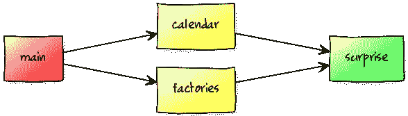
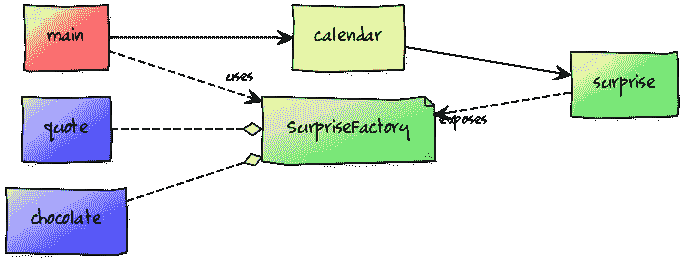

# Java 模块系统实践指南

> 原文：<https://www.sitepoint.com/java-module-system-hands-on-guide/>

### 目录 

*   [拼图前的应用](#the-application-before-jigsaw)
*   [进入拼图王国](#entering-jigsaw-land)
*   [模块](#modules)
*   [名称](#name)
*   [依赖关系](#dependencies)
*   [出口](#exports)
*   [实施](#implementations)
*   [分割成模块](#splitting-into-modules)
*   [编造的理由](#made-up-rationale)
*   [实施](#implementation)
*   [服务](#services)
*   [编造的理由](#made-up-rationale)
*   [实施](#implementation-2)
*   [总结](#summary)
*   [评论](#comments)

这篇文章最初发表在 CodeFX.org 上。因为 Java 9 离我们越来越近了，所以我们在这里联合了它，这样您就可以在 Java 平台模块系统(JPMS)上构建一个示例应用程序。文章最初写于 2015 年 12 月，更新至 2017 年 2 月的现状。

在本文中，我们将采用一个现有的演示应用程序，并用 Java 9 将其模块化。如果你想继续，去 GitHub 看看[，在那里可以找到所有的代码。](https://github.com/CodeFX-org/demo-jigsaw-advent-calendar "Jigsaw Advent Calendar")[设置指令](https://github.com/CodeFX-org/demo-jigsaw-advent-calendar/tree/master#setup "Jigsaw Advent Calendar - Setup")对于让脚本在 Java 9 上运行很重要。为了简洁起见，我在本文中去掉了所有包、模块和文件夹名称的前缀`org.codefx.demo`。

## 拼图之前的应用

尽管我尽最大努力忽略整个圣诞节的混乱，但让演示支持这个季节的精神似乎是明智的。所以它模拟了一个降临节日历:

*   有一个日历，有 24 个日历页。
*   每张纸都知道它在一个月中的哪一天，并包含一个惊喜。
*   向圣诞节的死亡进军象征着将床单(以及惊喜)打印到控制台上。

当然，首先需要创建日历。它可以自己做到这一点，但它需要一种方式来创造惊喜。为此，它得到了一份令人惊讶的工厂名单。这就是[`main`方法](https://github.com/CodeFX-org/demo-jigsaw-advent-calendar/blob/00-before-jigsaw/src/org.codefx.demo.advent/org/codefx/demo/advent/Main.java#L11-L18 "Jigsaw Advent Calendar - Before Jigsaw: Main::main")的样子:

```
public static void main(String[] args) {
	List<SurpriseFactory> surpriseFactories = Arrays.asList(
			new ChocolateFactory(),
			new QuoteFactory()
	);
	Calendar calendar =
		Calendar.createWithSurprises(surpriseFactories);
	System.out.println(calendar.asText());
} 
```

项目的初始状态绝不是 Jigsaw 出现之前的最佳状态。恰恰相反，这是一个简单化的出发点。它由一个单一的模块(从抽象的意义上来说，不是拼图式的解释)组成，包含了[所有需要的类型](https://github.com/CodeFX-org/demo-jigsaw-advent-calendar/tree/00-before-jigsaw/src/org.codefx.demo.advent/org/codefx/demo/advent "Jigsaw Advent Calendar - Before Jigsaw: Types"):

*   “惊喜 API”——惊喜和`SurpriseFactory`(都是接口)
*   “日历 API”–创建日历的`Calendar`和`CalendarSheet`
*   惊喜——几个`Surprise`和`SurpriseFactory`实现
*   main–连接并运行整个系统。

[编译和运行](https://github.com/CodeFX-org/demo-jigsaw-advent-calendar/blob/00-before-jigsaw/compileAndRun.sh "Jigsaw Advent Calendar - Before Jigsaw: Compile And Run")非常简单(Java 8 的命令):

```
# compile
javac -d classes/advent ${source files}
# package
jar -cfm jars/advent.jar ${manifest and compiled class files}
# run
java -jar jars/advent.jar 
```

## 进入拼图王国

下一步虽小但很重要。它对代码或其组织没有任何改变，只是将它移到了 Jigsaw 模块中。

### 模块

那么什么是模块呢？引用强烈推荐的模块系统的[状态:](http://openjdk.java.net/projects/jigsaw/spec/sotms/ "The State of the Module System")

> 一个*模块*是一个命名的、自描述的代码和数据的集合。它的代码被组织成一组包含类型的包，即 Java 类和接口；它的数据包括资源和其他种类的静态信息。
> 
> 为了控制它的代码如何引用其他模块中的类型，一个模块声明它*需要哪些其他模块*来编译和运行。为了控制其他模块中的代码如何引用其包中的类型，一个模块声明它*导出的包中的哪一个*。

(最后一段实际上来自该文档的旧版本，但我喜欢它总结依赖性和导出的方式。)

所以与 JAR 相比，一个模块有一个被 JVM 识别的名字，声明它所依赖的其他模块，并定义哪些包是它的公共 API 的一部分。

#### 名字

模块的名字可以是任意的。但是为了确保唯一性，建议坚持使用包的反向 URL 命名模式。因此，虽然这不是必需的，但这通常意味着模块名是它所包含的包的前缀。

#### 属国

模块列出了它编译和运行所依赖的其他模块。这对应用程序和库模块来说是正确的，但对 JDK 本身的模块来说也是正确的，它被分成大约 100 个模块(用`java --list-modules`看看它们)。

从设计概述来看:

> 当一个模块直接依赖于模块图中的另一个模块时，第一个模块中的代码将能够引用第二个模块中的类型。因此，我们说第一个模块*读取第二个模块*，或者等价地，第二个模块对于第一个模块是*可读的*。
> 
> […]
> 
> 模块系统确保每一个依赖关系都由恰好一个其他模块来满足，模块图是非循环的，每个模块最多读取一个定义给定包的模块，并且定义同名包的模块不会相互干扰。

当违反任何属性时，模块系统拒绝编译或启动代码。与脆弱的类路径相比，这是一个巨大的改进，在脆弱的类路径中，丢失的 jar 只能在运行时被发现，从而使应用程序崩溃。

同样值得指出的是，一个模块只有在直接依赖于另一个模块的情况下才能访问它的类型。所以如果 *A* 依赖于 *B* ，B 依赖于 *C* ，那么 *A* 无法访问 *C* ，除非它明确要求。

#### 电子竞技

模块列出了它导出的包。只有这些包中的公共类型可以从模块外部访问。

这意味着`public`不再是真正的公共。非导出包中的公共类型与导出包中的非公共类型一样不可被外界访问。这比 Java 9 之前的包私有类型更难访问，因为模块系统甚至不允许对它们进行反射访问。因为 Jigsaw 目前已经实现了[命令行标志](https://www.sitepoint.com/reflection-vs-encapsulation-in-the-java-module-system/#commandlineescapehatches)是解决这个问题的唯一方法。

### 履行

为了能够创建一个模块，项目需要在它的根目录下有一个`module-info.java`:

```
module advent {
    // no imports or exports
} 
```

等等，我不是说过我们也必须声明对 JDK 模块的依赖吗？那么为什么我们在这里什么都没提到呢？所有的 Java 代码都需要`Object`，这个类以及演示使用的其他一些类都是模块`java.base`的一部分。所以实际上*每个* Java 模块都依赖于`java.base`，这导致 Jigsaw 团队决定自动需要它。所以我们不必明确地提及它。

最大的变化是要编译和运行的脚本(Java 9 的命令):

```
# compile (include module-info.java)
javac -d classes/advent ${source files}
# package (add module-info.class and specify main class)
jar --create \
	--file=mods/advent.jar \
	--main-class=advent.Main \
	${compiled class files}
# run (specify a module path and simply name to module to run)
java --module-path mods --module advent 
```

我们可以看到编译几乎是一样的——我们只需要在类列表中包含新的`module-info.java`。

jar 命令将创建一个所谓的*模块化 JAR* ，即包含一个模块的 JAR。不像以前，我们不再需要清单，而是可以直接指定主类。注意 JAR 是如何在目录`mods`中创建的。

应用程序的启动方式完全不同。这个想法是告诉 Java 在哪里可以找到应用程序模块(用`--module-path mods`，这被称为*模块路径*，以及我们想要启动哪个模块(用`--module advent`)。


## 分割成模块

现在是时候真正了解 Jigsaw 了，并且[将那块巨石分割](https://github.com/CodeFX-org/demo-jigsaw-advent-calendar/tree/02-splitting-into-modules "Jigsaw Advent Calendar - Splitting Into Modules")成独立的模块。

### 虚构的理由

“惊喜 API”，即`Surprise`和`SurpriseFactory`，是一个巨大的成功，我们想把它从独石中分离出来。

制造惊喜的工厂变得非常有活力。这里做了大量的工作，它们经常改变，并且不同的版本使用不同的工厂。所以我们想隔离他们。

同时，我们计划创建一个大型的圣诞节应用程序，日历只是其中的一部分。因此，我们也希望有一个单独的模块。

我们最终得到了这些模块:

*   *惊喜*—`Surprise`和`SurpriseFactory`
*   *日历*–日历，使用惊喜 API
*   *工厂*—`SurpriseFactory`实施
*   *main*–原来的应用程序，现在被挖空到类`Main`

查看它们的依赖关系，我们发现 *surprise* 不依赖于其他模块。*日历*和*工厂*都使用它的类型，所以他们必须依赖它。最后， *main* 使用工厂创建日历，因此它依赖于这两个工厂。



### 履行

第一步是重新组织源代码。我们将坚持使用[官方快速入门指南](http://openjdk.java.net/projects/jigsaw/quick-start "Project Jigsaw: Module System Quick-Start Guide")提出的目录结构，并将所有模块放在各自的文件夹中`src`:

```
src
  - advent.calendar: the "calendar" module
      - org ...
      module-info.java
  - advent.factories: the "factories" module
      - org ...
      module-info.java
  - advent.surprise: the "surprise" module
      - org ...
      module-info.java
  - advent: the "main" module
      - org ...
      module-info.java
.gitignore
compileAndRun.sh
LICENSE
README 
```

为了保持可读性，我截断了下面的文件夹。缺少的是包以及每个模块的源文件。在 GitHub 上看到它的全盛时期。

现在让我们看看这些模块信息必须包含什么，以及我们如何编译和运行应用程序。

#### *惊喜*

没有必需的子句，因为*惊喜*没有依赖项。(除了`java.base`，它总是隐式要求的。)它导出包`advent.surprise`，因为其中包含两个类`Surprise`和`SurpriseFactory`。

所以`module-info.java`看起来如下:

```
module advent.surprise {
	// requires no other modules
	// publicly accessible packages
	exports advent.surprise;
} 
```

编译和打包与上一节非常相似。事实上这甚至更容易，因为 *surprise* 不包含主类:

```
# compile
javac -d classes/advent.surprise ${source files}
# package
jar --create --file=mods/advent.surprise.jar ${compiled class files} 
```

#### *日历*

日历使用来自惊喜 API 的类型，所以模块必须依赖于*惊喜*。将`requires advent.surprise`添加到模块中可以实现这一点。

模块的 API 由类`Calendar`组成。要公开访问它，必须导出包含包`advent.calendar`。请注意，同一个包的私有属性`CalendarSheet`，在模块外是不可见的。

但是还有一个额外的变化:我们刚刚公开了 [`Calendar.createWithSurprises(List<SurpriseFactory>)`](https://github.com/CodeFX-org/demo-jigsaw-advent-calendar/blob/02-splitting-into-modules/src/org.codefx.demo.advent.calendar/org/codefx/demo/advent/calendar/Calendar.java#L22) ，它公开了来自*惊喜*模块的类型。所以除非读取*日历*的模块也需要*惊喜*，否则 Jigsaw 会阻止它们访问这些类型，这会导致编译和运行时错误。

将 requires 子句标记为`transitive`可以解决这个问题。有了它，任何依赖于*日历*的模块也会读取*惊喜*。这叫做 [*隐含可读性*](http://blog.codefx.org/java/dev/implied-readability/) 。

最终的模块信息如下所示:

```
module advent.calendar {
	// required modules
	requires transitive advent.surprise;
	// publicly accessible packages
	exports advent.calendar;
} 
```

编译几乎和以前一样，但是对*惊喜*的依赖当然必须在这里反映出来。为此，将编译器指向目录`mods`就足够了，因为它包含所需的模块:

```
# compile (point to folder with required modules)
javac --module-path mods \
	-d classes/advent.calendar \
	${source files}
# package
jar --create \
	--file=mods/advent.calendar.jar \
	${compiled class files} 
```

#### *工厂*

工厂实现`SurpriseFactory`所以这个模块必须依靠*给*一个惊喜。由于它们从已发布的方法中返回了`Surprise`的实例，与上面相同的思路导致了一个`requires transitive`子句。

工厂可以在包`advent.factories`中找到，所以必须出口。请注意，在另一个包中的公共类`AbstractSurpriseFactory`在这个模块之外是不可访问的。

所以我们得到:

```
module advent.factories {
	// required modules
	requires public advent.surprise;
	// publicly accessible packages
	exports advent.factories;
} 
```

编译和打包类似于*日历*。

#### *主*

我们的应用程序需要编译和运行两个模块*日历*和*工厂*。它仍然没有可导出的 API。

```
module advent {
	// required modules
	requires advent.calendar;
	requires advent.factories;
	// no exports
} 
```

编译和打包类似于上一节的单个模块，只是编译器需要知道在哪里可以找到所需的模块:

```
#compile
javac --module-path mods \
	-d classes/advent \
	${source files}
# package
jar --create \
	--file=mods/advent.jar \
	--main-class=advent.Main \
	${compiled class files} 
```

使用 mods 中的所有模块，我们可以运行日历。

```
 # run
java --module-path mods --module advent 
```

## 服务

Jigsaw 通过实现[服务定位器模式](https://en.wikipedia.org/wiki/Service_locator_pattern "Service Locator Pattern")来实现松散耦合，其中模块系统本身充当定位器。让我们看看[会怎么样](https://github.com/CodeFX-org/demo-jigsaw-advent-calendar/tree/03-services "Jigsaw Advent Calendar - Services")。

### 虚构的理由

有人最近读了一篇关于松散耦合有多酷的博文。然后她从上面看着我们的代码，抱怨*主*和*工厂*之间的紧张关系。为什么*主*会知道*工厂*？

因为…

```
public static void main(String[] args) {
	List<SurpriseFactory> surpriseFactories = Arrays.asList(
			new ChocolateFactory(),
			new QuoteFactory()
	);
	Calendar calendar =
		Calendar.createWithSurprises(surpriseFactories);
	System.out.println(calendar.asText());
} 
```

真的吗？仅仅是为了实例化一个完美抽象的一些实现(`SurpriseFactory`)？

我们知道她是对的。让别人为我们提供实现将消除直接的依赖性。更好的是，如果所述中间人能够在模块路径上找到*所有的*实现，日历的惊喜可以通过在启动前添加或删除模块来轻松配置。

这正是服务存在的目的！我们可以让一个模块指定它提供一个接口的实现。另一个模块可以表示它使用了所述接口，并用`ServiceLocator`找到所有实现。

我们利用这个机会将*工厂*拆分成*巧克力*和*报价*，最终得到这些模块和依赖项:

*   *惊喜*—`Surprise`和`SurpriseFactory`
*   *日历*–日历，使用惊喜 API
*   *巧克力*—`ChocolateFactory`服务
*   *引用*—`QuoteFactory`即服务
*   *main*–应用程序；不再需要单独的工厂



### 履行

第一步是重新组织源代码。与之前唯一的变化是`src/advent.factories`被`src/advent.factory.chocolate`和`src/advent.factory.quote`取代。

让我们看看各个模块。

#### *惊喜*和*日历*

两者都没变。

#### *巧克力*和*报价*

除了一些名称之外，这两个模块完全相同。让我们看看巧克力，因为它更美味。

一如之前与*工厂*模块`requires transitive`合作的*惊喜*模块。

更有趣的是它的出口。它提供了`SurpriseFactory`的一个实现，即`ChocolateFactory`，具体如下:

```
provides advent.surprise.SurpriseFactory
	with advent.factory.chocolate.ChocolateFactory; 
```

因为这个类是其公共 API 的全部，所以它不需要导出任何其他东西。因此不需要其他出口条款。

我们最终会得到:

```
module advent.factory.chocolate {
	// list the required modules
	requires public advent.surprise;
	// specify which class provides which service
	provides advent.surprise.SurpriseFactory
		with advent.factory.chocolate.ChocolateFactory;
} 
```

编译和打包非常简单:

```
javac --module-path mods \
	-d classes/advent.factory.chocolate \
	${source files}
jar --create \
	--file mods/advent.factory.chocolate.jar \
	${compiled class files} 
```

#### *主*

关于 *main* 最有趣的部分是它如何使用 ServiceLocator 找到 SurpriseFactory 的实现。从[它的主要方法](https://github.com/CodeFX-org/demo-jigsaw-advent-calendar/blob/03-services/src/org.codefx.demo.advent/org/codefx/demo/advent/Main.java#L13-L14 "Jigsaw Advent Calendar - Services: Main::main"):

```
List surpriseFactories = new ArrayList<>();
ServiceLoader.load(SurpriseFactory.class)
	.forEach(surpriseFactories::add); 
```

我们的应用程序现在只需要*日历*，但是必须指定它使用`SurpriseFactory`。它没有要导出的 API。

```
module advent {
	// list the required modules
	requires advent.calendar;
	// list the used services
	uses advent.surprise.SurpriseFactory;
	// exports no functionality
} 
```

编译和执行和以前一样。

我们确实可以通过简单地从模块路径中删除一个工厂模块来改变日历最终包含的惊喜。整洁！

## 摘要

原来如此。我们已经看到了如何将一个单一的应用程序移动到一个模块中，以及如何将它分成几个模块。我们甚至使用服务定位器将我们的应用程序从服务的具体实现中分离出来。所有这些都在 GitHub 上[，所以请查看更多代码！](https://github.com/CodeFX-org/demo-jigsaw-advent-calendar "Jigsaw Advent Calendar on GitHub")

但是还有很多要谈的！Jigsaw 带来了一些不兼容性，但也提供了解决其中许多问题的方法。我们还没有谈到[反射如何与模块系统](https://www.sitepoint.com/reflection-vs-encapsulation-in-the-java-module-system/)交互以及如何迁移外部依赖。

如果你对这些话题感兴趣，请观看[这个标签](http://blog.codefx.org/tag/project-jigsaw/ "CodeFX - Project Jigsaw"),因为我肯定会在接下来的几个月里写下这些话题。

## 分享这篇文章