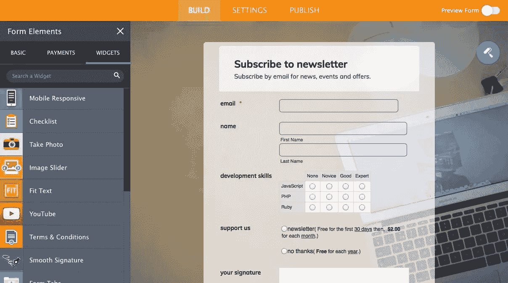
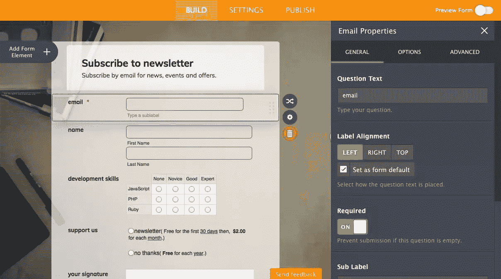
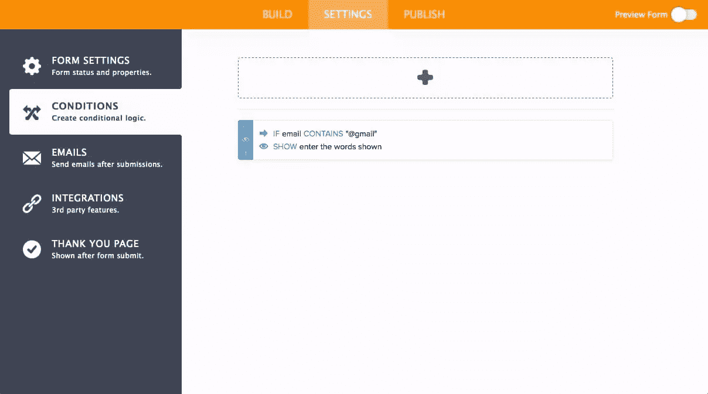
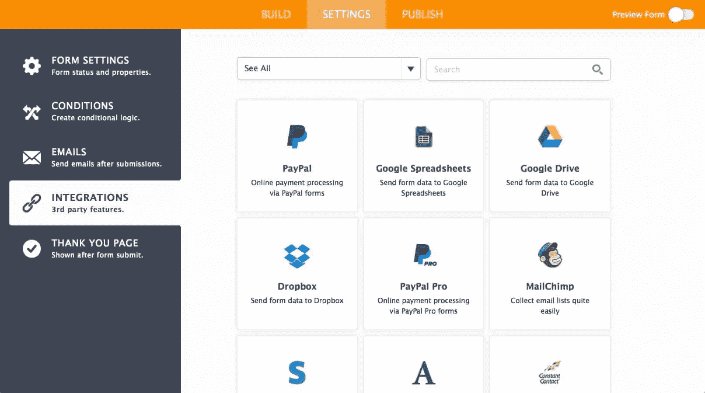
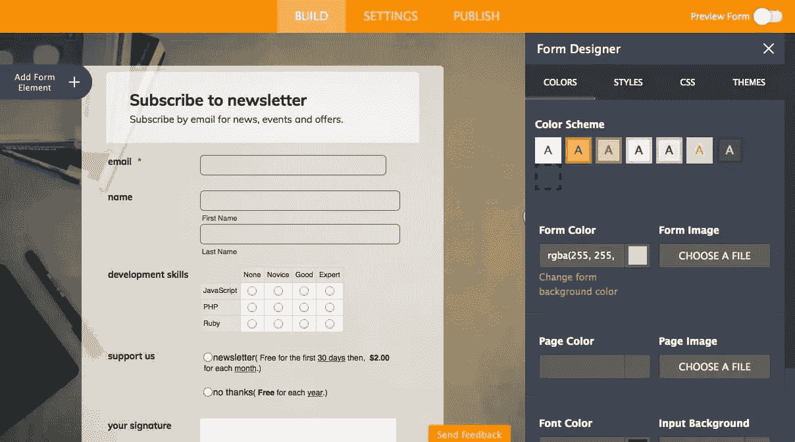
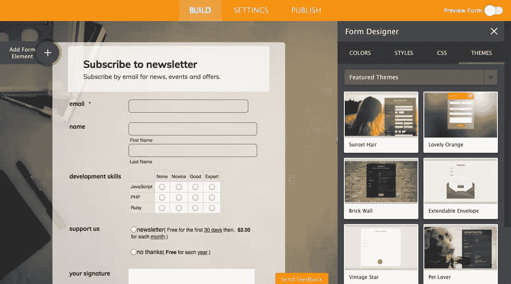
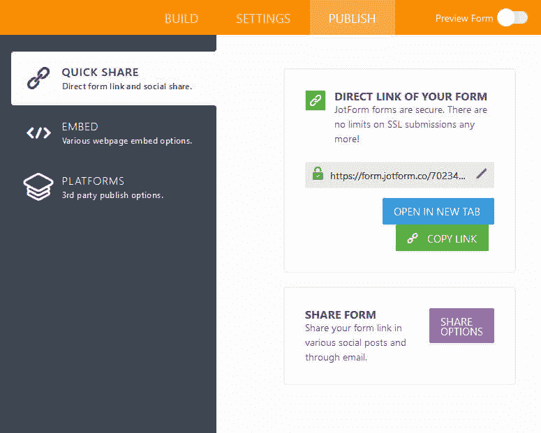

# 用 JotForm 4.0 减轻表单构建的痛苦

> 原文：<https://www.sitepoint.com/take-the-pain-out-of-form-building-with-jotform-4-0/>

*本文由 [JotForm](https://www.jotform.com/?utm_source=sitepoint&utm_campaign=launch-sitepoint&utm_medium=web) 赞助。感谢您对使 SitePoint 成为可能的合作伙伴的支持。*

HTML 表单是 web 开发人员生活中的祸根。它们很少令人兴奋，容易出错，而且会受到客户和老板的多次修改。你会考虑让他们直接编辑代码吗？即使最基本的表单也需要以下知识:

1.  HTML5 输入类型。
2.  浏览器支持和后备选项。
3.  客户端和服务器上的验证码。
4.  如有必要，自定义控件使用 HTML，CSS 和 JavaScript。
5.  垃圾邮件和欺诈检测技术。
6.  服务器端处理和数据存储。
7.  与电子邮件、分析、CRM、支付网关等第三方系统集成。
8.  自定义报告。
9.  在各种桌面和移动设备上进行测试。

表单很快成为任务关键型怪物，因为它们通常是客户接触的第一点。一个可靠的开发和测试计划是绝对必要的。

*或者是？*

## 新的改进的乔托形式

我在 2015 年 1 月复习了 [JotForm 3.0。该在线应用程序使非开发人员能够使用所见即所得界面构建和编辑复杂的数据捕获表单。您可以添加字段、选择主题、修改配色方案、定义集成选项、发布、等待响应和查看报告。](https://www.sitepoint.com/simplify-form-building-jotform/)

JotForm 3.0 是一个很好的解决方案，但是最新版本更进一步，为非技术用户提供了构建任何复杂表单的直观工具。

## JotForm 4.0

[JotForm 4.0 刚刚发布](https://www.jotform.com/?utm_source=sitepoint&utm_campaign=launch-sitepoint&utm_medium=web)，我很高兴地告诉大家，它解决了复杂性问题。界面已经过彻底检查，比以前更有吸引力和直观。选项很容易访问，但在您需要之前是隐藏的。

![JotForm 4.0 interface]](img/fb035692cbcc7634e4ded23a3ca0e5d5.png)

## 表单域和小部件

**添加表单元素**链接指向一个滑出式面板，该面板提供标题和基本表单字段，如电子邮件、姓名、电话、日期选择器、数字、下拉框、文件上传、按钮等等。

**支付**标签显示了十几家支付提供商，它们可以接受单次购买商品或持续订阅的在线交易。

**Widgets** 选项卡提供了一个看似无穷无尽(但可搜索)的自定义元素列表，如表单选项卡、滑块、YouTube 视频等。

将字段拖放到表单上。在那里，该项目旁边的属性 cog 图标打开另一个滑出面板，该面板用于设置选项，如标签对齐、字段是否为必填、占位符等。

## 表单设置

**设置**选项卡显示表单选项，如名称、警告信息甚至语言翻译。

一个**条件**面板允许您创建简单的条件逻辑，例如当输入特定值时显示另一个字段。条件还可以执行计算、启用或禁用必填字段、跳过或隐藏页面、更改“感谢”页面或修改电子邮件收件人。

**集成**面板提供了与几十个流行的在线提供商进行第三方集成的选项，包括 Google Docs、Dropbox、MailChimp、Campaign Monitor、Sales Force、Highrise 和 Braintree。该向导将逐步完成向服务进行身份验证的过程，并执行诸如将用户添加到邮件列表之类的操作:

## 表单主题和样式

点击 **BUILD** 选项卡上的滚轮图标，访问表单设计器。**颜色**选项卡允许您设置标准颜色和图像:

这由一个**样式**选项卡来补充，以控制表单宽度、对齐、字体和间距。 **CSS** 选项卡允许注入自定义代码。您还可以访问高级 CSS 编辑器，它会打开一个新的应用程序，使用控件或代码来编辑各个属性。

如果这听起来太费力，选择**主题**选项卡，选择一个预先设计的吸引人的主题:

## 表单预览

您的表单可以随时预览和使用。一个有用的**填充表单**按钮将向所有字段添加虚拟数据:

## 表单发布

一旦你的杰作完成，你可以链接到它的唯一网址:

还有一系列其他选项可供选择:

*   用一个 HTML `script`标签将表单嵌入到页面中
*   下载源代码并将其复制到您的页面中
*   将窗体放在 iframe 中
*   使用可定制的“反馈”按钮打开表单
*   使用按钮在灯箱中打开表单
*   在弹出窗口中打开您的表单
*   为 WordPress、Joomla、Drupal、脸书、Weebly、Shopify、PrestaShop、Magento 和 SharePoint 等流行的 CMS 和系统复制嵌入代码。

## 新功能

新的 JotForm 4.0 界面响应全面，可以在桌面、平板电脑或智能手机设备上使用。你所有的编辑都会立即保存，甚至在你的网络连接不稳定的情况下也能工作，因为应用程序是离线运行的。当您重新联机时，您的表单数据将会同步。

JotForm 还允许您访问修订列表，只需单击一下就可以恢复到以前的编辑状态。

最后，多个团队成员可以同时处理同一个表单。您的更改会自动应用到其他所有人的视图中。

## 摘要

JotForm 4.0 是对最初于 2006 年推出的表单设计系统的彻底改造。我是一个顽固的编码者，很少喜欢所见即所得编辑器，但是 JotForm 使用起来很愉快，并且节省了大量时间。当您在集成其他系统时不需要费力地阅读第三方 API 文档时，这种方式尤其快捷。

JotForm 4.0 的主要优点是:

*   一个更简单、更流畅、更容易的表单设计界面
*   完全可定制的设计
*   吸引人的预设主题
*   数百个标准和自定义字段
*   没有编程的条件逻辑
*   可以在桌面或移动设备上使用
*   离线处理和同步的即时保存
*   与同事实时协作
*   与数十家提供商的第三方集成
*   易于使用，嵌入网页或在线发布表单
*   [免费的入门计划](https://jotform.com/pricing/?utm_source=sitepoint&utm_campaign=launch-sitepoint&utm_medium=web)

JotForm 是任何需要注册、应用或支付系统的人的理想选择。新手用户可能在开始时仍然需要一点指导，但是新的用户界面没有以前那么令人生畏了。很容易创建一个吸引人的表单，即使是最不懂技术的客户或老板也可以编辑。

立即尝试 JotForm，随时随地创建表单。

## 分享这篇文章