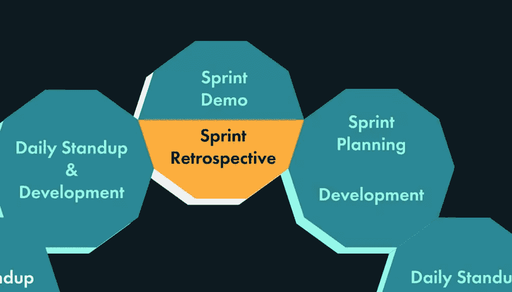

# Scrum 仪式:冲刺回顾

> 原文：<https://www.sitepoint.com/scrum-rituals-sprint-retrospective/>

以下是摘自我们的书《Scrum:新手到忍者，作者是 M. David Green。世界各地的商店都有出售，或者你可以在这里买到电子书。

如果每日站立是 scrum 最具标志性的仪式之一，那么 sprint 回顾可能是敏捷哲学的最典型代表。Sprint 回顾为团队提供了一个机会，让他们在每个 sprint 结束时反思他们一直在做什么，并找出他们想要如何修改他们的过程。

### 目标

sprint 回顾会将团队聚集在一起，考虑刚刚完成的 sprint 对每个人的影响。在这个过程中，房间里的每个人都会被问到哪些进展顺利，哪些进展不顺利，以及他们愿意作为一个团队在下一次冲刺中做出什么样的承诺。目标是对流程进行一系列修改，团队中的每个人都同意在即将到来的 sprint 中尝试。

开发团队的所有成员、scrum master 和产品负责人都应该参加 sprint 回顾会。仪式由 scrum master 领导。

### 注意:回顾展很少有客人

客人很少被邀请参加 sprint 回顾会。这是为了鼓励人们公开在冲刺阶段可能出了什么问题，并坦诚地说出他们的感受和他们遇到了什么问题。这种会议可能是情绪化的，私人团队环境的亲密关系提供了一个更具支持性的环境。

### 时间盒

团队可能会发现他们在回顾中花费的时间和他们在 sprint 演示中花费的时间是一样的。对于为期两周的冲刺，团队花半天时间进行回顾并不罕见。在安排回顾时，最好不要浪费时间，以避免切断团队成员获得有价值见解的途径。

团队花在 sprint 回顾上的时间反映了他们重视自己的过程，并在过程中不断改进的重要性。一些团队可能会尝试限制在回顾中花费的时间。这可能会以交流和改进为代价。scrum 最重要的一个方面是强调讨论是增强产品开发过程的一种手段。

### 准备

冲刺回顾可能会被高度充电。参与 scrum 的每个人都应该带着一些想法来参加这个仪式，这些想法是关于在 sprint 期间可能发生了什么，他们想要评论的。对一些人来说，这意味着要列出一长串要提出的问题。

scrum 大师应该带着一份议程来参加 sprint 回顾会，确保从所有参与者那里收集到积极和消极的反馈。scrum 大师的责任是确保每个人都有发言权，并为这个过程做出贡献。

### 警告:确保回顾会得到适当的关注

sprint 回顾是 scrum 团队最常缩短甚至放弃的一种仪式。这可能是这一过程陷入困境的迹象。没有对回顾给予足够的重视，团队就放弃了改进过程的机会。通常，建议减少对这种仪式的时间和关注的人，是那些以不断改进为代价，从现状中获益最多的人。确保这种仪式发生，并得到 scrum 团队中每个人的适当关注，是对团队中每个人表示关心和关注的一种方式。

### 什么进展顺利？

scrum master 应该问房间里的每个人，他们认为在过去的 sprint 中什么进展顺利。这通常是通过在房间里走来走去，让每个人报告一件或多件他们认为在之前的 sprint 中进行得特别好的事情。除非这次冲刺是一场彻底的灾难，否则大多数人应该能够想出一些他们认为很顺利的事情[【2】](#ftn.d5e920)。

让人们讨论进展顺利的部分价值在于将人们聚集在一起，让他们有机会认可和欣赏他们和他们的队友负责的出色工作。

### 警告:在每个人都提出自己的观点之前，暂停讨论

虽然在会议结束前应该鼓励每个人的参与，但在每个人都有机会分享他们的清单之前，让人们回应或讨论提出的问题并不是一个好主意。scrum master 应该为以后更开放的讨论提供机会，但最重要的是在更深入的讨论开始之前，给团队中的每个人一个发言的机会。

### 什么不顺利？

接下来，scrum master 应该在房间里走来走去，让人们报告他们认为在 sprint 期间不太顺利的事情。这是一个更微妙的话题，因为人们可能会提出不舒服或不愉快的问题。

和以前一样，应该要求每个人都参与。让人们对他们可能感到不舒服的话题做出诚实的回应是一个强大的 scrum 大师的技能的一部分。如果有人真的不想说话，或者有什么话不想在团队面前说，应该鼓励他们在这个仪式之外独立地与 scrum 主管谈论。

在队友面前说负面的话会觉得不舒服。scrum master 的部分工作是帮助指导人们从一个 sprint 到另一个 sprint，如何构建他们的问题，以便他们能够以富有成效的方式进行讨论。这个仪式不是关于人身攻击，而是关于寻找团队可以更好地合作的方法。

### 注意:订购此仪式

这个仪式的各个部分的顺序——处理什么进行得好，什么进行得不好——可能会根据团队的偏好而颠倒。Scrum masters 也可以选择遵循任何数量的实践来让团队更多地参与到这个过程中，包括游戏、笔记卡、预先提交等等。在计划这一仪式时有很大的创造性空间。

### 我们应该做些什么呢？

在每个人都有机会讨论他们认为在冲刺阶段哪些进展顺利，哪些进展不顺利之后，就应该开始讨论了。这是一个机会，让团队中的每个人都更多地谈论他们提出的问题，以及其他队友提出的问题，以及他们认为团队应该对他们做些什么。

对于进展顺利的事情，团队应该努力找到在未来的冲刺中复制成功的方法。他们可能在过去的 sprint 中尝试了一些新的东西，结果证明是成功的，并且可以整合到未来的流程中。

对于不太顺利的事情，团队有机会讨论哪里出了问题。有时问题在于没有遵循流程。其他时候，这个过程实际上是碍事的，需要调整。应该鼓励每个人对可能有益的变化发表意见。

最终，讨论将围绕团队希望关注的四五个关键问题展开。scrum 大师应该以这样一种方式引导讨论，即这些问题被表述为修订的实践——团队可以同意在即将到来的 sprint 中尝试。

### 注意:仅在冲刺之间进行可管理的改变

虽然可能会讨论很多问题，但是团队应该在一个 sprint 到下一个 sprint 之间达成一个小的、可管理的变更集。与用户体验测试一样，测试之间的变更越多，就越难找出哪些是有帮助的，哪些是导致问题的。

在这个仪式的最后，scrum master 应该向团队展示一个简短易懂的流程变更列表。最重要的是，scrum master 应该调查整个房间，确保每个人都同意这一系列的改变。然后 scrum master 应该记录团队对即将到来的 sprint 的修改的承诺。团队反思和改进的能力对其发展的重要性不亚于致力于 sprint backlog 对产品发展的重要性。

## 结论

在这一章中，我们已经讨论了 scrum 的四个关键仪式:冲刺计划、每日站立、冲刺演示和冲刺回顾。除了每天都要做的站立之外，这些仪式在每次冲刺中都要重复一次。

这些仪式将我们从功能故事——由产品负责人编写——带到团队评估、对 sprint backlog 的承诺、完成所有的故事、证明每个故事都已完成并满足其所有的验收标准，到最后反思在完成的 sprint 中什么可行，什么不可行，以便团队可以不断改进。

接下来，我们将看看 scrum 的一些工件。这些工具帮助 scrum 团队理解他们正在做什么，跟踪他们的进度，并且有效地一起工作。

* * *

这个仪式持续这么久的原因之一是因为每个人的参与是必不可少的。任何人都不应被排除在外。

## 分享这篇文章