# 用 Node 和 Heroku 构建脸书聊天机器人

> 原文：<https://www.sitepoint.com/building-facebook-chat-bot-node-heroku/>

用 Node 和 Heroku 构建一个脸书聊天机器人由 [Joan Yin](https://github.com/newjsn) 和 [Camilo Reyes](https://www.sitepoint.com/author/creyes/) 进行同行评审。感谢 SitePoint 的所有同行评审员使 SitePoint 的内容尽可能做到最好！


在去年的 f8 大会上，脸书发布了 [Messenger 平台](https://developers.facebook.com/docs/messenger-platform)，让开发者能够创建可以在 Messenger 上或从脸书页面与人对话的机器人。有了机器人，应用程序所有者可以通过提供个性化的交互式通信来更好地与他们的用户互动，这种通信可以针对大众进行扩展。自推出以来，企业和应用程序所有者对聊天机器人表现出了极大的兴趣。就在声明发布三个月后，据估计[有 11000 个机器人](http://www.forbes.com/sites/kathleenchaykowski/2016/07/01/more-than-11000-bots-are-now-on-facebook-messenger/#4de652526b82)建立在这个平台上。

企业和应用程序所有者并不是聊天机器人的唯一受益者。这些机器人的用户可以享受各种服务，例如:

*   获得即时客户支持
*   [预订航班](http://venturebeat.com/2016/06/23/hipmunk-embraces-bots-with-an-a-i-travel-assistant-for-facebook-messenger-and-slack/)
*   买电影票
*   [获得网飞电影推荐](http://www.andchill.io/)
*   [获取天气预报](https://poncho.is/)
*   [关注新闻](https://www.messenger.com/t/cnn/)
*   获得关于穿什么的建议
*   [根据手边的食材，想出晚餐吃什么](https://dinnerideas.io/)
*   [娱乐](https://www.facebook.com/storiesonsequel/)。

目前对聊天机器人的兴趣和吸引力是显而易见的，随着人工智能技术的进步，机器人将在与用户互动方面变得更好。

在本文中，我们将研究如何创建一个脸书聊天机器人，它可以代表一个脸书页面通过 Messenger 与用户交互。我们将构建一个机器人，为用户提供关于他们指定的电影的不同细节。

## 造机器人需要懂 AI 吗？

精通人工智能肯定会有所帮助，特别是在构建复杂的机器人方面，但这不是必需的。你当然可以在不了解机器学习的情况下构建一个机器人。

有两种类型的机器人你可以建立。一种是基于一套规则，另一种是使用机器学习。前者所能提供的交互是有限的。它只能响应特定的命令。这就是我们将要建造的机器人。

通过使用机器学习的机器人，你可以与用户更好地互动。用户可以以更自然的方式与机器人互动，就像他们在人与人的互动中一样，而不是仅仅使用命令。当它从与人的对话中学习时，它也会变得更聪明。我们将在以后的文章中构建这种类型的 bot。不过，机器学习知识不是必需的。幸运的是，有像 [wit.ai](https://wit.ai/) 和 [Api.ai](https://api.ai/) 这样的服务可以让开发者将机器学习(特别是自然语言处理——NLP)集成到他们的应用中。

## 入门指南

你可以在这里下载完整的演示应用[的代码。](https://github.com/sitepoint-editors/spbot)

为了让你的聊天机器人与脸书用户通信，我们需要设置一个服务器来接收、处理和发送回消息。服务器将为此利用脸书图形 API。Graph API 是将数据导入和导出脸书平台的主要方式。服务器必须有一个可以从脸书的服务器访问的端点 URL，因此在您的本地机器上部署 web 应用程序是行不通的，您必须将它联机。此外，从 Graph API 的 2.5 版本开始，服务的新订阅必须使用安全的 HTTPS 回调 URL。在本教程中，我们将把应用程序部署到 Heroku，因为所有默认的`appname.herokuapp.com`域都已经启用了 SSL。我们将使用 Node.js 来构建 web 应用程序。

要开始，首先确保在您的计算机上安装了[节点](https://nodejs.org/)。您可以通过在终端中键入`node -v`来检查这一点。如果安装了，它将输出版本号。然后[安装 Heroku 命令行界面](https://devcenter.heroku.com/articles/heroku-command-line) (CLI)。我们稍后将使用此功能将应用程序推送到 Heroku。使用`heroku --version`验证是否安装了 CLI。

使用以下命令创建项目目录并初始化一个`package.json`文件。

```
$ mkdir spbot
$ cd spbot
$ npm init 
```

按照提示为项目设置您的首选项。

在生成了`package.json`文件之后，打开它并给`scripts`对象添加一个`start`属性。这让 Heroku 知道执行什么命令来启动应用程序。在项目设置期间，我将`app.js`定义为应用程序的入口点，因此我使用`node app.js`作为`start`的值。根据项目的设置进行更改。

```
{
  "name": "spbot",
  "version": "1.0.0",
  "description": "SPBot Server",
  "main": "app.js",
  "scripts": {
    "test": "echo \"Error: no test specified\" &amp;&amp; exit 1",
    "start": "node app.js"
  },
  "author": "Joyce Echessa",
  "license": "ISC"
} 
```

安装以下节点包。

```
$ npm install express request body-parser mongoose --save 
```

在您的项目根目录中创建一个`.gitignore`文件，并包含`node_modules`文件夹，以防止它被提交。

```
node_modules 
```

在项目的根目录下，创建一个标记为`app.js`(或者`index.js`，如果您使用默认名称的话)的文件。如下所示修改它:

```
var express = require("express");
var request = require("request");
var bodyParser = require("body-parser");

var app = express();
app.use(bodyParser.urlencoded({extended: false}));
app.use(bodyParser.json());
app.listen((process.env.PORT || 5000));

// Server index page
app.get("/", function (req, res) {
  res.send("Deployed!");
});

// Facebook Webhook
// Used for verification
app.get("/webhook", function (req, res) {
  if (req.query["hub.verify_token"] === "this_is_my_token") {
    console.log("Verified webhook");
    res.status(200).send(req.query["hub.challenge"]);
  } else {
    console.error("Verification failed. The tokens do not match.");
    res.sendStatus(403);
  }
}); 
```

第一个 GET 处理程序将用于我们自己的测试——了解应用程序是否已经成功部署。第二个 GET 处理程序是脸书将用来验证应用程序的端点。代码应该寻找`verify_token`，并用验证请求中发送的`challenge`进行响应。

您可以将自己的令牌粘贴到代码中。这样的数据最好保存在一个[环境变量](https://devcenter.heroku.com/articles/getting-started-with-nodejs#define-config-vars)中，我们将在 Heroku 上创建一个项目后不久这样做。

### 部署到 Heroku

为了让脸书平台与我们的后端应用程序连接，我们首先需要让它上线。

创建一个 Git 存储库，并使用以下命令提交项目文件:

```
$ git init
$ git add .
$ git commit -m "Initial commit" 
```

如果你还没有一个免费的 Heroku 帐户，请注册一个。

从您的终端，登录 Heroku 并创建一个应用程序。

```
$ heroku login
$ heroku create
$ git push heroku master
$ heroku open 
```

运行`heroku open`命令时，将在您的默认浏览器中打开正在运行的应用程序的链接。如果一切顺利，您将获得一个带有文本 **Deployed 的页面！**在上面。

## 创建环境变量

在我们继续之前，让我们在 Heroku 上创建一个环境变量来保存应用程序的验证令牌。

打开你的 [Heroku 仪表盘](https://dashboard.heroku.com/apps)，选择你刚刚部署的应用。进入应用程序的*设置*，点击*显示配置变量*按钮。输入`VERIFICATION_TOKEN`作为*密钥*，输入您的令牌作为*值*，点击*添加*。

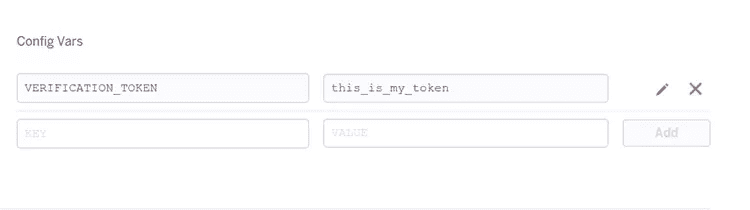

在您的代码中，将令牌字符串(`"this_is_my_token"`)修改为`process.env.VERIFICATION_TOKEN`。提交您的更改并将它们推送到 Heroku。

## 创建脸书页面和应用程序

服务器启动并运行后，我们现在将创建一个脸书应用程序及其关联的页面。您可以创建新页面或使用现有页面。

要创建脸书页面，请登录脸书，然后前往[创建页面](https://www.facebook.com/pages/create/)。从给定选项中选择页面类型。我选择了*娱乐*。

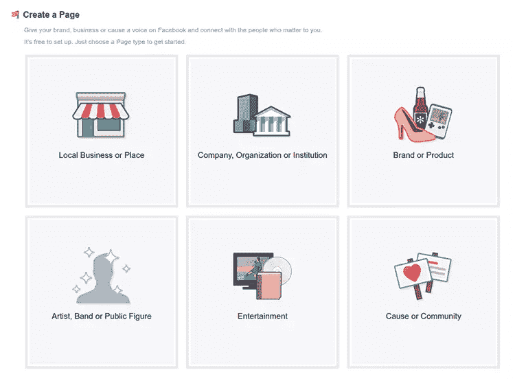

然后选择页面的类别和名称。

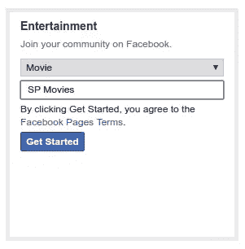

点击*开始*后，页面将被创建，您将被要求提供关于您的应用程序的更多详细信息(描述、网站、个人资料图片、目标受众等)。您现在可以跳过这些设置步骤。

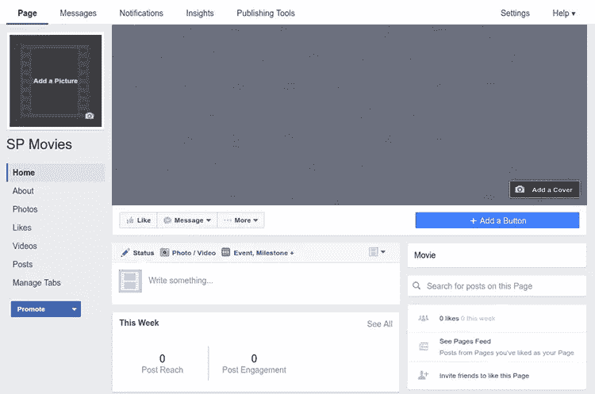

要创建脸书应用程序，请前往[添加新应用程序](https://developers.facebook.com/quickstarts/)页面，点击其他平台选项下方的*基本设置*链接。

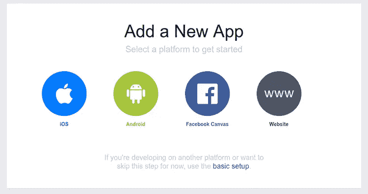

填写必要的详细信息。选择页面的*应用作为类别。*

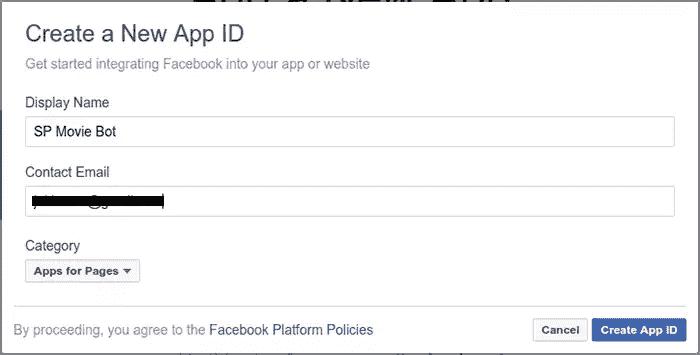

点击*创建应用 ID* ，将打开应用的仪表盘。

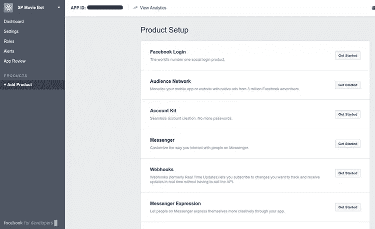

从右侧的*产品设置*中，点击*信使*部分的*开始*。然后您将被带到下面显示的 Messenger 设置页面。

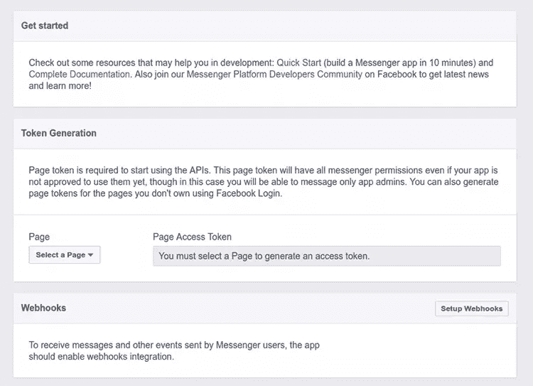

为了接收 Messenger 用户发送的消息和其他事件，应用程序应该启用 webhooks 集成。我们接下来会这样做。Webhooks(以前的*实时更新*)让你可以订阅你想要跟踪的变化并实时接收更新，而不必调用 API。

在 Webhooks 部分，点击*设置 Webhooks*

输入将发送更新的回调 URL(后端应用程序中定义的端点 URL，即`<your-app-url>/webhook`)，输入验证令牌(后端应用程序中使用的令牌，即`process.env.VERIFICATION_TOKEN`中存储的值)，并选中所有复选框。这些指定了应用程序将订阅的事件。稍后我们会看到它们会做什么。

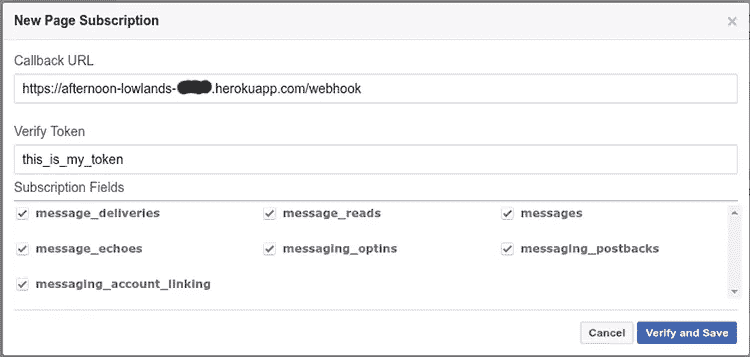

成功启用 webhooks 后，您应该会在 Webhooks 部分看到 *Complete* ，以及订阅的事件列表。如果出现错误，请确保您为 webhook 端点(以`/webhook`结尾)输入了正确的 URL，并确保这里使用的令牌与您在 Node 应用程序中使用的令牌相同。

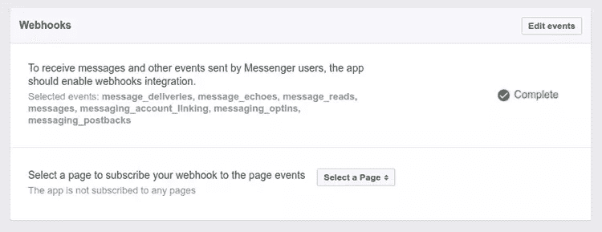

在*令牌生成*部分，从下拉菜单中选择您的页面。身份验证后，将为您生成一个页面访问令牌。

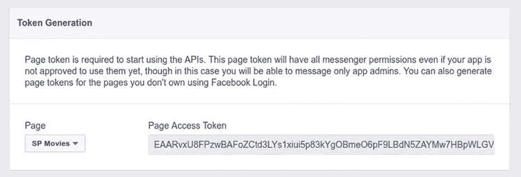

在 Heroku 上创建另一个环境变量，并将其*键*设置为`PAGE_ACCESS_TOKEN`，并将生成的令牌设置为*值*。请注意，生成的令牌不会保存在脸书上显示的当前页面中。每次您访问该网页时，页面访问令牌字段将为空，当您从页面下拉菜单中选择您的脸书页面时，将会生成一个新令牌。但是，之前创建的任何令牌都将继续发挥作用。因此，请确保在关闭网页之前复制令牌。

为了让您的 webhook 接收特定页面的事件，您必须将您的应用程序订阅到该页面。在 *Webhooks* 部分，选择要订阅的页面。

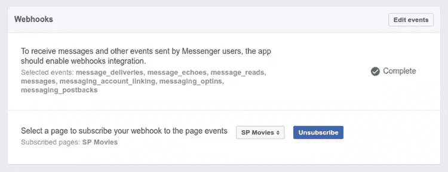

## 欢迎屏幕

当用户开始与你的机器人进行新的对话时，他们首先看到的是欢迎屏幕。该屏幕将显示您页面的名称、描述、个人资料图片和封面照片。您可以通过设置[问候文本](https://developers.facebook.com/docs/messenger-platform/thread-settings/greeting-text)来定制屏幕，该文本将用于替代页面描述。你可以用它来设置一个介绍性的信息，让用户知道你的机器人会给你带来什么。

默认情况下，开始对话是用户向您的机器人发送第一条消息。但是，您可以启用一个[启动按钮](https://developers.facebook.com/docs/messenger-platform/thread-settings/get-started-button)，这将使您的机器人能够发送初始消息。该按钮将向您的服务器发送一个事件，然后您可以对其做出响应。

要设置问候文本，请打开您的页面并进入其*设置*。

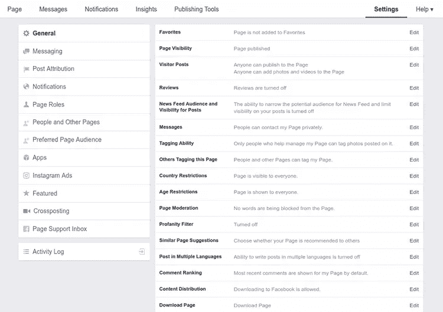

从左侧面板选择*消息*，然后打开*在右侧面板显示消息问候*。根据您的喜好设置消息。

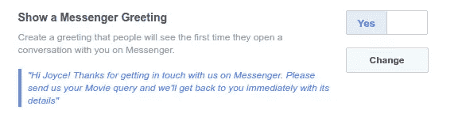

要启用 Get Started 按钮，请用您的令牌替换下面语句中的`PAGE_ACCESS_TOKEN`字符串，并将该命令粘贴到终端中。

```
curl -X POST -H "Content-Type: application/json" -d '{
  "setting_type":"call_to_actions",
  "thread_state":"new_thread",
  "call_to_actions":[
    {
      "payload":"Greeting"
    }
  ]
}' "https://graph.facebook.com/v2.6/me/thread_settings?access_token=PAGE_ACCESS_TOKEN" 
```

上面向脸书图形 API 提出了一个请求。如果请求成功，一个开始按钮将出现在新对话的欢迎屏幕上。用户点击按钮将触发回发接收到的回调。然后，您的 bot 可以响应此回发。

回发可以由不同类型的组件触发——回发按钮、开始按钮、持久菜单或结构化消息。您可以将任何字符串设置为`payload`。在后端，我们将使用这个字符串来标识点击 Get Started 按钮后发送的回发。若要接收回发消息，您的应用程序必须在您的 webhook 上订阅回发。我们之前在设置 webhook 时选中了`messaging_postbacks`复选框。

如果成功设置了“开始”按钮，您将得到以下响应。

```
{
  "result": "Successfully added new_thread's CTAs"
} 
```

记住*欢迎屏幕*和*开始*按钮只出现在新的对话中。当编码和测试你的机器人时，你可以通过删除当前的对话来开始一个新的对话。

要处理回发消息，请在节点应用程序中粘贴以下内容。

```
// All callbacks for Messenger will be POST-ed here
app.post("/webhook", function (req, res) {
  // Make sure this is a page subscription
  if (req.body.object == "page") {
    // Iterate over each entry
    // There may be multiple entries if batched
    req.body.entry.forEach(function(entry) {
      // Iterate over each messaging event
      entry.messaging.forEach(function(event) {
        if (event.postback) {
          processPostback(event);
        }
      });
    });

    res.sendStatus(200);
  }
});

function processPostback(event) {
  var senderId = event.sender.id;
  var payload = event.postback.payload;

  if (payload === "Greeting") {
    // Get user's first name from the User Profile API
    // and include it in the greeting
    request({
      url: "https://graph.facebook.com/v2.6/" + senderId,
      qs: {
        access_token: process.env.PAGE_ACCESS_TOKEN,
        fields: "first_name"
      },
      method: "GET"
    }, function(error, response, body) {
      var greeting = "";
      if (error) {
        console.log("Error getting user's name: " +  error);
      } else {
        var bodyObj = JSON.parse(body);
        name = bodyObj.first_name;
        greeting = "Hi " + name + ". ";
      }
      var message = greeting + "My name is SP Movie Bot. I can tell you various details regarding movies. What movie would you like to know about?";
      sendMessage(senderId, {text: message});
    });
  }
}

// sends message to user
function sendMessage(recipientId, message) {
  request({
    url: "https://graph.facebook.com/v2.6/me/messages",
    qs: {access_token: process.env.PAGE_ACCESS_TOKEN},
    method: "POST",
    json: {
      recipient: {id: recipientId},
      message: message,
    }
  }, function(error, response, body) {
    if (error) {
      console.log("Error sending message: " + response.error);
    }
  });
} 
```

每当有人与你的机器人交互或向你的页面发送消息时，就会通过你的 Webhook 集成发送一个更新。要获得消息，你必须在你的 webhook 上监听 POST 调用。所有回调都将针对这个 webhook。

在上面的 POST 处理程序中，我们迭代发送到应用程序的消息条目。有时消息被成批一起发送，因此一个条目可能包含多个对象。然后，我们遍历每个条目的消息事件，并检查其类型。下面显示了可以发送到应用程序的不同回调消息。

*   *消息接收回调*–当一个人向你的机器人发送消息时，消息接收回调被发送。在设置 webhook 时，您必须已经订阅了`messages`事件。
*   *回发收到的回调*–当一个人点击一个已配置为向您发送回发的按钮时，会发送回发收到的回调。为了从回发中获得回调，您必须在设置 webhook 时订阅了`messaging_postbacks`事件。
*   *消息传递回调*–当一个页面发送的消息已经被传递时，这个回调就会发生。在设置 webhook 时，您必须已经订阅了`message_deliveries`事件。
*   *身份验证回调*–当点击发送到信使插件时，会发生此回调。在设置 webhook 时，您必须已经订阅了`messaging_optins`事件。
*   *消息阅读回调*–当一个页面发送的消息被用户阅读时，这个回调就会发生。在设置 webhook 时，您必须已经订阅了`message_reads`事件。
*   *消息回显回调*–当您的页面发送了一条消息时，将发生此回调。您可能会收到文字信息或带有附件的信息(图像、视频、音频、模板或备用信息)。在设置 webhook 时，您必须已经订阅了`message_echoes`事件。
*   *结帐更新回调(BETA)*–当使用购买按钮进行灵活金额交易时，将发生此回调。这允许您根据某人的送货地址更新定价。在设置 webhook 时，您必须已经订阅了`messaging_checkout_updates`事件。**目前，这在美国以外的地区不可用。**
*   *支付回调(BETA)*–当一个人从由购买按钮呈现的结帐对话框中点击支付按钮时，将发生该回调。在设置 webhook 时，您必须已经订阅了`messaging_payments`事件。**目前，这在美国之外还不可用。**

如果事件是回发，我们调用`processPostback()`函数来检查`payload`值。记住，我们已经将`Greeting`设置为“开始”按钮的有效负载，所以这里我们首先检查消息事件是否是作为单击该按钮的结果发送的。如果是这样，我们使用用户配置文件 API 来获取用户的名字，并使用它来个性化将发送回给他们的消息。从 API 中，您可以获得他们的名字、姓氏、个人资料图片、地区、时区和性别。

然后，消息被发送到`sendMessage()`函数，该函数将消息发送到 Messenger 平台。回到 Webhook POST 处理程序，我们返回一个 200 OK HTTP 响应。

尽快回复 200 是很重要的。脸书会等 200 秒后再给你发下一条信息。在大容量的僵尸程序中，延迟返回 200 会导致脸书向你的 webhook 发送消息的延迟。

如果您的 webhook 返回一个错误(即不是 2XX 状态)或超时(即响应时间超过 20 秒)并持续超过 15 分钟，您将收到一个警告警报。

如果 webhook 持续失败 8 小时，那么脸书将向你发送一个警报，让你知道 webhook 被禁用，然后你的应用程序将被取消订阅。解决问题后，您必须重新添加 webhook，并重新订阅页面应用程序。

提交更改并将其推给 Heroku。

为了测试这个机器人，你可以从 facebook.com、facebook 移动应用程序或使用你的 Messenger 短 URL https://m.me/PAGE_USERNAME(我们将很快看到如何创建用户名)与你的页面开始对话。

在脸书和 messenger 上，您可以通过搜索页面名称来找到页面。

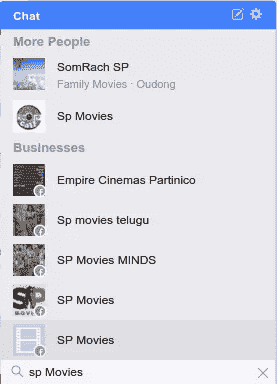

从上面可以看出，您不能总是保证页面的名称是唯一的。您的用户可能会选择错误的页面。为了防止这种情况，您可以为页面设置一个唯一的用户名。为此，进入你的页面主页，从*更多*下拉菜单中选择*编辑页面信息*。

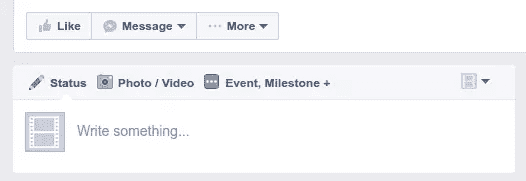

然后设置用户名。


现在如果你搜索`@page_username`，你会找到正确的页面。也可以去`https://m.me/PAGE_USERNAME`开始互动。

下面，您可以看到我们为欢迎屏幕设置的问候文本以及*开始*按钮。

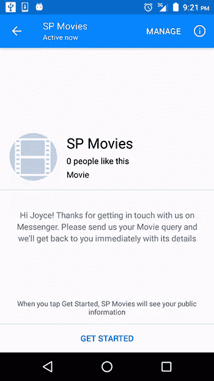

点击按钮，您应该会看到从服务器发送的消息。

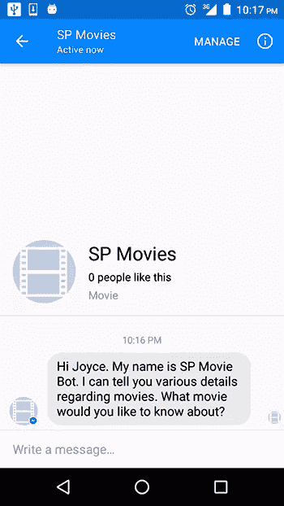

如果你输入任何文本，你不会得到任何回应。我们接下来会处理这个问题。

## 设置数据库

当用户输入电影名称时，机器人将使用[开放电影数据库 API](http://www.omdbapi.com/) 来获取电影的详细信息。我们将使用的 API 请求将只获取第一个匹配的结果，因此返回的电影可能不总是用户想要的。正因为如此，机器人将首先与用户确认，看看它是否得到了电影的权利，然后，用户可以获得电影的情节，演员阵容，IMDB 评级等细节。他们也可以输入另一部电影的名字并得到它的详细信息。

由于这种来回，机器人将需要记住用户当前的电影条目。脸书不会用你的 webhook 保持一个会话打开，所以你存储在 session 对象中的任何数据都会在下一次请求时丢失。我们将把这些数据保存在一个数据库中——具体来说是 MongoDB。我们将在 Heroku 上使用 mLab 的附加组件。

mLab 是 MongoDB 的数据库即服务。在 Heroku 上，虽然你可以使用免费的沙盒 mlab 计划，但你需要在 Heroku 上保存一张信用卡进行验证。如果您不想提供您的卡的详细信息，那么您可以在 mLab 网站上注册一个帐户，在那里创建一个自由层沙盒数据库，并从您的代码中链接到该数据库(稍后将详细介绍)。

要使用 Heroku 上的插件，进入应用程序的仪表板，选择*资源*标签。搜索`mlab`并选择结果。在弹出的对话框中，从下拉菜单中选择`Sandbox - Free`计划，点击*供应*。您应该会看到所选附加组件的确认信息。

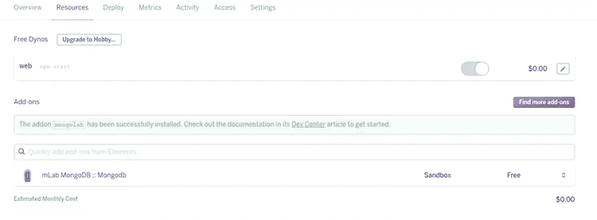

如果您在 Heroku 上检查您的环境变量，您将看到一个已经设置了 MongoDB 的 URI 的环境变量。

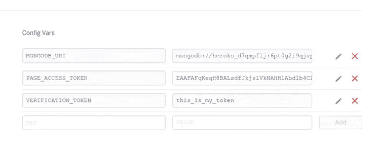

### 通过司法实验室网站建立数据库

如果您喜欢在 mLab 网站上设置 MongoDB 数据库，那么在那里注册一个帐户，然后前往[创建新部署](https://mlab.com/create)页面。将*计划*设置改为*单节点*，然后从*标准线*部分选择*沙箱*。

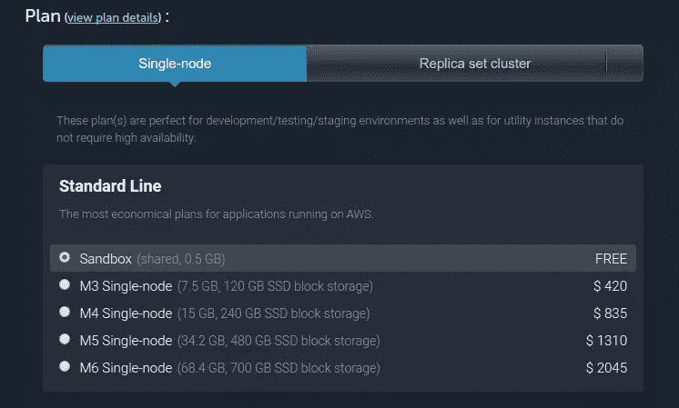

为您的数据库设置一个名称，并通过单击*Create new MongoDB deployment*按钮来完成这个过程。

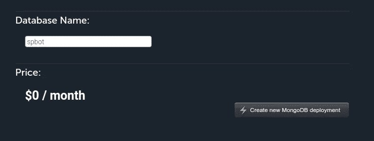

在接下来的页面上，从显示的表中选择刚刚创建的数据库。将打开一个页面，显示如何访问数据库的说明。

选择*用户*选项卡，点击*按钮添加数据库用户*。填写用户名和密码，点击*创建*。这将创建一组新的凭据，您可以使用这些凭据来允许您的应用程序访问数据库。

在页面的上半部分，找到并复制数据库 URI——看起来像`mongodb://<dbuser>:<dbpassword>@dsxxxxxx.mlab.com:55087/spbot`。插入您刚刚创建的`dbuser`名称和密码。在 Heroku 上，创建一个名为`MONGODB_URI`的环境变量，并粘贴数据库的 URI 作为它的值。

## 定义模型类

回到 Node 应用程序，创建一个标签为`movie.js`的文件，并将其保存在标签为`models`的文件夹中。将以下内容粘贴到文件中:

```
var mongoose = require("mongoose");
var Schema = mongoose.Schema;

var MovieSchema = new Schema({
  user_id: {type: String},
  title: {type: String},
  plot: {type: String},
  date: {type: String},
  runtime: {type: String},
  director: {type: String},
  cast: {type: String},
  rating: {type: String},
  poster_url: {type: String}
});

module.exports = mongoose.model("Movie", MovieSchema); 
```

上面创建了电影数据库模型。`user_id`将是从 Messenger 平台获得的用户 ID，而其他字段将从 movies API 获取。我们将只存储用户最后一次搜索的电影，所以数据库中每个用户只有一条记录。

我们可以省略`user_id`字段，只使用用户的 ID 作为创建的每条记录的`_id`。这应该是可行的，因为脸书页面的用户 id 是唯一的。如果您打算这样做，您应该知道用户 id 是页面范围的。这意味着对于给定的页面，用户的 id 是唯一的，但是对于不同的页面，用户可以有不同的 id。

如果你的机器人提供不同的页面，你只需要意识到这一点(是的，一个机器人可以[提供多个页面](http://stackoverflow.com/a/36665745/1380071))。因此，如果你的机器人服务于几个页面，只通过用户 ID 来识别用户可能是错误的，而且将用户 ID 用于记录的`_id`字段也是错误的，因为这必须是唯一的，你不能保证跨页面的唯一性。

## 把所有的放在一起

随着数据库和模型的建立，我们现在可以完成聊天机器人。代码将被分成几个部分，但是如果你想把整个代码粘贴到你的项目中，这里有到`app.js`文件的链接。

从设置数据库连接开始。Mongoose 应该已经安装了其他模块。

```
var mongoose = require("mongoose");

var db = mongoose.connect(process.env.MONGODB_URI);
var Movie = require("./models/movie"); 
```

修改 webhook 的 POST 处理程序，如下所示。

```
// All callbacks for Messenger will be POST-ed here
app.post("/webhook", function (req, res) {
  // Make sure this is a page subscription
  if (req.body.object == "page") {
    // Iterate over each entry
    // There may be multiple entries if batched
    req.body.entry.forEach(function(entry) {
      // Iterate over each messaging event
      entry.messaging.forEach(function(event) {
        if (event.postback) {
          processPostback(event);
        } else if (event.message) {
          processMessage(event);
        }
      });
    });

    res.sendStatus(200);
  }
}); 
```

我们添加了对类型为`message`的事件的检查，将它们传递给`processMessage()`函数。

```
function processMessage(event) {
  if (!event.message.is_echo) {
    var message = event.message;
    var senderId = event.sender.id;

    console.log("Received message from senderId: " + senderId);
    console.log("Message is: " + JSON.stringify(message));

    // You may get a text or attachment but not both
    if (message.text) {
      var formattedMsg = message.text.toLowerCase().trim();

      // If we receive a text message, check to see if it matches any special
      // keywords and send back the corresponding movie detail.
      // Otherwise, search for new movie.
      switch (formattedMsg) {
        case "plot":
        case "date":
        case "runtime":
        case "director":
        case "cast":
        case "rating":
          getMovieDetail(senderId, formattedMsg);
          break;

        default:
          findMovie(senderId, formattedMsg);
      }
    } else if (message.attachments) {
      sendMessage(senderId, {text: "Sorry, I don't understand your request."});
    }
  }
} 
```

这里，我们首先检查消息是否是通过消息回送回调发送的。当您的页面发送消息时，将发生此回调。例如，我们发送给用户的第一条消息(问候)将被发送回我们的 Webhook。我们不想处理任何我们自己的消息，所以我们勾选了此项。

然后，我们检查消息是文本还是附件(图像、视频、音频)。在后一种情况下，我们向用户发送一条错误消息。对于文本消息，我们检查输入是否与某些关键字匹配，这些关键字将指示用户想要电影的什么细节。此时，用户将已经查询了一部电影，并且该电影将被保存在数据库中。`getMovieDetail()`函数查询数据库并返回特定的记录。

```
function getMovieDetail(userId, field) {
  Movie.findOne({user_id: userId}, function(err, movie) {
    if(err) {
      sendMessage(userId, {text: "Something went wrong. Try again"});
    } else {
      sendMessage(userId, {text: movie[field]});
    }
  });
} 
```

如果用户的查询与任何一个设置的关键字都不匹配，机器人会认为输入是针对电影的查询，因此会将其传递给`findMovie()`函数，该函数使用输入调用打开的电影数据库 API。

```
function findMovie(userId, movieTitle) {
  request("http://www.omdbapi.com/?type=movie&amp;t=" + movieTitle, function (error, response, body) {
    if (!error &amp;&amp; response.statusCode === 200) {
      var movieObj = JSON.parse(body);
      if (movieObj.Response === "True") {
        var query = {user_id: userId};
        var update = {
          user_id: userId,
          title: movieObj.Title,
          plot: movieObj.Plot,
          date: movieObj.Released,
          runtime: movieObj.Runtime,
          director: movieObj.Director,
          cast: movieObj.Actors,
          rating: movieObj.imdbRating,
          poster_url:movieObj.Poster
        };
        var options = {upsert: true};
        Movie.findOneAndUpdate(query, update, options, function(err, mov) {
          if (err) {
            console.log("Database error: " + err);
          } else {
            message = {
              attachment: {
                type: "template",
                payload: {
                  template_type: "generic",
                  elements: [{
                    title: movieObj.Title,
                    subtitle: "Is this the movie you are looking for?",
                    image_url: movieObj.Poster === "N/A" ? "http://placehold.it/350x150" : movieObj.Poster,
                    buttons: [{
                      type: "postback",
                      title: "Yes",
                      payload: "Correct"
                    }, {
                      type: "postback",
                      title: "No",
                      payload: "Incorrect"
                    }]
                  }]
                }
              }
            };
            sendMessage(userId, message);
          }
        });
      } else {
          console.log(movieObj.Error);
          sendMessage(userId, {text: movieObj.Error});
      }
    } else {
      sendMessage(userId, {text: "Something went wrong. Try again."});
    }
  });
} 
```

如果找到一部电影，它的详细信息将与用户 ID 一起保存。如果先前已经创建了具有该用户 ID 的记录，那么它将被更新。然后，我们创建一个结构化的消息，并将其发送给用户。

除了文本，Messenger 平台还允许你发回图像、视频、音频、文件和结构化信息。结构化消息是支持不同类型用例的模板。[按钮模板](https://developers.facebook.com/docs/messenger-platform/send-api-reference/button-template)允许你发送文本和按钮。[通用模板](https://developers.facebook.com/docs/messenger-platform/send-api-reference/generic-template)允许你定义图像、标题、副标题和按钮。在我们的应用程序中，我们使用通用模板。

如图所示修改`processPostback()`功能。

```
function processPostback(event) {
  var senderId = event.sender.id;
  var payload = event.postback.payload;

  if (payload === "Greeting") {
    // Get user's first name from the User Profile API
    // and include it in the greeting
    request({
      url: "https://graph.facebook.com/v2.6/" + senderId,
      qs: {
        access_token: process.env.PAGE_ACCESS_TOKEN,
        fields: "first_name"
      },
      method: "GET"
    }, function(error, response, body) {
      var greeting = "";
      if (error) {
        console.log("Error getting user's name: " +  error);
      } else {
        var bodyObj = JSON.parse(body);
        name = bodyObj.first_name;
        greeting = "Hi " + name + ". ";
      }
      var message = greeting + "My name is SP Movie Bot. I can tell you various details regarding movies. What movie would you like to know about?";
      sendMessage(senderId, {text: message});
    });
  } else if (payload === "Correct") {
    sendMessage(senderId, {text: "Awesome! What would you like to find out? Enter 'plot', 'date', 'runtime', 'director', 'cast' or 'rating' for the various details."});
  } else if (payload === "Incorrect") {
    sendMessage(senderId, {text: "Oops! Sorry about that. Try using the exact title of the movie"});
  }
} 
```

这里我们为`Correct`和`Incorrect`有效载荷消息添加了两个检查。这些将被附加到按钮上，用户将使用这些按钮来让机器人知道它是否呈现了正确的电影。

提交您的代码并将其推送给 Heroku，然后尝试向机器人发送消息。

当您向 bot 发送查询时，如果它找到了电影，它会发回一条结构化消息，检查是否获取了正确的电影。

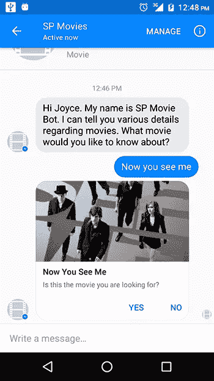

在 web(和 iOS)上，这看起来有点不同。

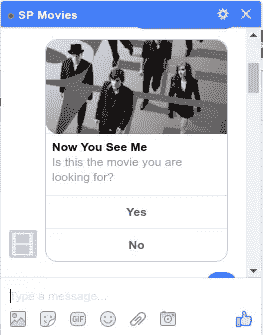

结构化消息可以有不同类型的按钮，如下所示:

*   *URL 按钮*:在应用内浏览器中打开一个 URL
*   *回发按钮*:当你想向你的机器人发送一个动作时，向你的 webhook 发送一个回发
*   *通话按钮*:拨打电话号码
*   *分享按钮*:打开分享对话框，与好友分享消息
*   *购买按钮*:打开购物结账对话框

在我们的示例中，我们使用两个回发按钮，并将它们的有效负载值设置为`Correct`和`Incorrect`。如果你看一下`processPostback()`函数，你会看到对这两个有效载荷的检查。如果点击 *No* 按钮，将返回以下信息:

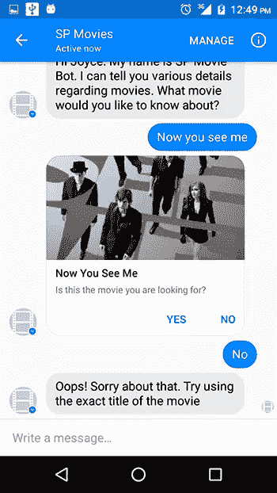

然后，用户可以进行另一个查询。

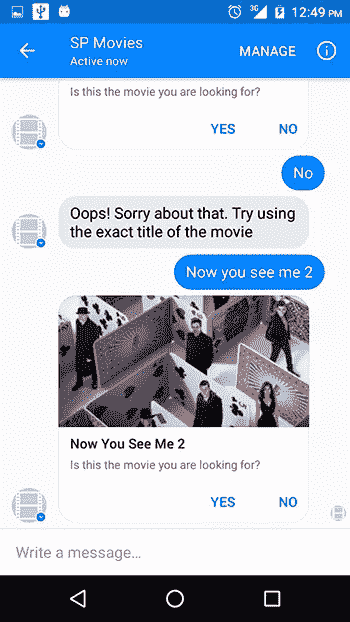

在确认这是正确的电影后，他们将从机器人那里获得如何进行的进一步指示。

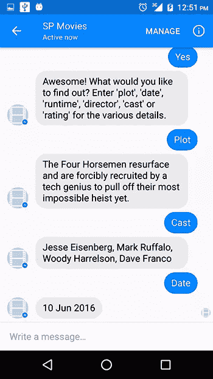

记住，我们在`processMessage()`中检查这些关键字。

你必须确保你发送的结构化消息是格式良好的，否则它不会显示给用户。在演示应用程序中，我注意到 movies API 返回的一些电影在它们的一些字段中缺少一些细节。在这种情况下，该字段的值为`N/A`。在我们的结构化消息中，我们使用了 API 返回的对象中的两个字段——标题和海报(电影海报的 URL)。如果找到一部电影，它总是有一个标题，所以不需要确认这一点，但如果这部电影没有海报，并且您没有为此提供备用 URL，则结构化消息将无法显示。所以要确保结构化消息中的属性总是有值的。

在我们的例子中，我们链接到一个占位符图像，以防没有返回。


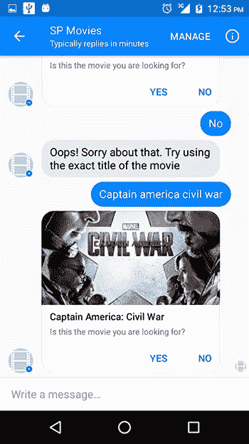

如果没有找到符合用户查询的电影，机器人会让他们知道这一点。

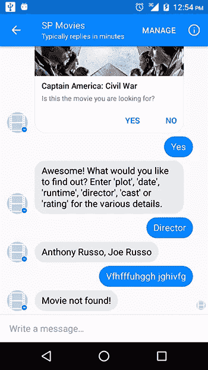

## 和你的脸书聊天机器人一起生活

当你准备好向公众发布你的应用程序时，它必须经过一个批准过程。在应用程序获得批准之前，只有您和您邀请的测试人员才能与其进行交互。向评审小组提交的过程超出了本教程的范围，但是本指南会告诉你需要做什么。

## 结论

在本教程中，我们已经构建了一个简单的脸书聊天机器人，它能够从 Messenger 上获取用户的请求并做出响应。然而，这个机器人远非完美。当用户与它交互时，他们只能使用一组严格的命令。这不是人们互相交谈的方式。机器人可以通过某种方式进行改进，使用户能够以更自然的方式与它互动，就像他们在人与人的互动中一样，而不仅仅是使用命令。这可以通过将自然语言处理集成到机器人中来实现。要做到这一点，你可以构建自己的 NLP 引擎，或者使用诸如 [wit.ai](https://wit.ai/) 之类的服务，使你能够将 NLP 添加到你的应用中。wit.ai 归脸书所有，可免费用于个人和商业项目。

如何看待聊天机器人及其越来越多的使用？如果你拥有一个脸书网页，你会考虑让一个机器人来处理与用户的互动吗？请在评论中告诉我你的想法。

> 想要了解更多关于机器人的信息吗？查看我们关于[用微软机器人框架创建 Skype 机器人的新高级课程](https://www.sitepoint.com/premium/courses/ms-bots-2939/)！

## 分享这篇文章