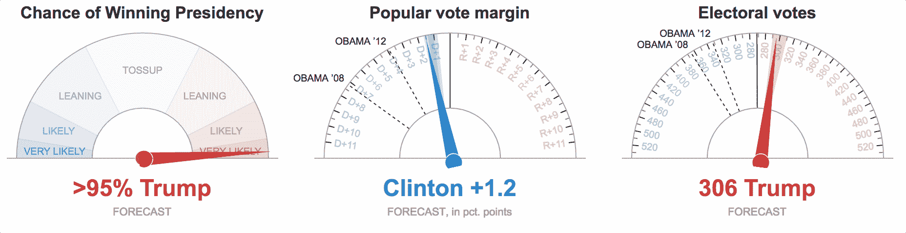
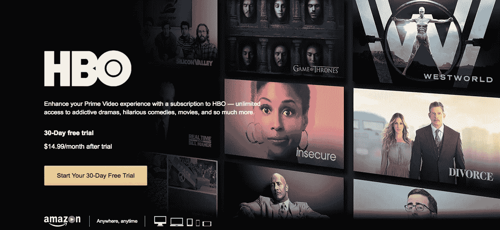
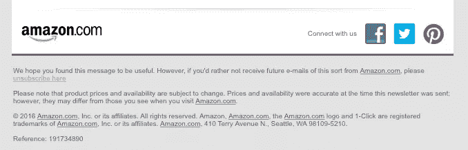
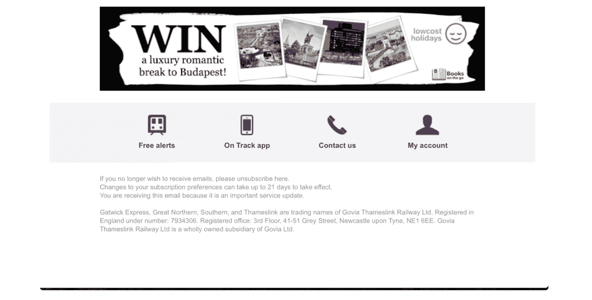
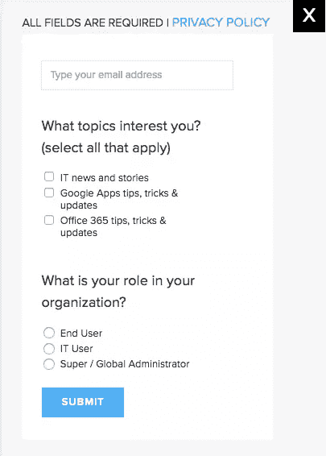

# 黑暗 UX:2017 年要避免的肮脏伎俩和策略

> 原文：<https://www.sitepoint.com/dark-ux-dirty-tricks-and-tactics-to-avoid-in-2017/>

像大多数人一样，2016 年 11 月 8 日晚上，我一直粘在屏幕前。《纽约时报》是我了解选举结果的主要媒体渠道；毕竟，比起其他任何来源，我更相信它的信息。

这份出版物在页面上方有一个“选举预测”的表盘。

最左边的刻度盘——“赢得总统职位的机会”——疯狂地抖动着。我的焦虑已经很高了，但这让我更加焦虑。

GIF: NYT 选举股票动画。

正如《纽约杂志》作家杰克·斯威林根所说的那样:

> “这对双方的支持者来说都是痛苦的，但也让你粘在表盘上——与电视网和有线新闻上古板的空谈者圆桌会议相比，这种直接的感觉既令人陶醉又令人焦虑……”

但事实证明，不断的来回摇摆并不是特朗普和克林顿机会的实时更新。《纽约时报》的设计者用 JavaScript 在表盘上编写了一个随机的“抖动功能”。想必，他们已经得出结论，即将公布的“真实”数据不够引人注目。

这是“黑暗 UX”的一个经典案例:精心制作的用来欺骗、误导或操纵用户的界面。让我们来看看四种黑暗模式，以及为什么避开每一种对你最有利。

## 1.强制连续性

强制连续性是最常见的黑暗模式之一。很有可能，你至少曾经是它的受害者。作为免费试用的回报，你向一个平台提供你的信用卡信息。

*快结束的时候我就取消试用，*你想。

问题？这些公司使退订变得尽可能困难。你没有得到任何提醒你的试用期即将到期，如果你设法记住，你经常被迫通过一个混乱，令人沮丧的取消过程。

我最近查看了我的银行对账单，发现过去六个月我一直在为 HBO Go 付费。

当然，HBO 得到了我半年的资金——但代价很高。我不再信任这家公司。

除了客户忠诚度，还有另一个避开这种模式的商业案例。要求信用卡注册参加试验增加了摩擦，所以你会看到更少的注册。

很多之前被封杀的用户(像我一样)会完全跳过试用。最终，如果你在试用结束后向人们询问支付细节，你的转换率通常会更高。

## 2.选择退出电子邮件

大多数电子商务网站要求你选择*退出*加入他们的时事通讯。如果你很匆忙，或者注意力不集中，你可能不会注意到标有“为我注册公告和促销活动”的方框

然而，从长远来看，这种策略会损害你与用户的关系。没有人喜欢收到他们不记得注册过的邮件。

当喜剧演员路易斯·C·K 创建他的网站时，他有目的地“根据他对互联网的厌恶来选择设计”

“当我的网站工作人员说，‘你想要预先选择邮件列表上的‘是’按钮，还是预先选择‘否’按钮？’他解释道:“我总是说‘是’，所以我就说‘不是’。

根据 C.K .的说法，只有最忠实的粉丝才会收到他的邮件。但是结果是惊人的:在一周内，他的网站创造了 100 万美元的销售额。

让你的客户或用户选择加入而不是退出可以带来巨大的收益。尽管你收集的电子邮件地址会更少，但你的参与度和点击率会更高——就像路易斯一样，你只会给你最大的“粉丝”发邮件

## 3.取消订阅链接

很难避免促销邮件，退订就更难了。计算机科学家 Lea Verou 创造了[Spot Unsubscribe](http://spottheunsubscribe.tumblr.com/)来记录隐藏在促销电子邮件底部的复杂或隐藏的选项。

例如，亚马逊变得有点狡猾，将他们的取消订阅链接的风格与所有其他链接的风格相比明显较低。如您所见，定位这个链接相当困难。

来源:spottheunsubscribe.tumblr.com

其他的则完全属于喜剧闹剧的范畴。在这个例子中，我们将让您从一家英国铁路公司找到 Waldo。

来源:spottheunsubscribe.tumblr.com

你可能很想隐藏你的退订链接，但请记住，未参与的订阅者通常是那些试图从你的电子邮件中退订的人——无论如何，他们的转化率不高。

如果你担心你的退订率太高，提供订阅优惠。能够定制电子邮件内容和频率的收件人通常会更加投入和满意。

SaaS 管理平台 BetterCloud 从用户注册的那一刻起就为他们提供了多种选择:

这个有两个问题的调查让普通用户更有可能从电子邮件中发现价值。

## 4.好友垃圾邮件

据 UX 顾问、 [Dark Patterns](http://darkpatterns.org) 创始人 Harry Brignull 称，“好友垃圾邮件”指的是一种技术，其中某个网站或游戏出于一个据称无害的原因要求你提供登录凭证，但在你不知情或未经你允许的情况下，继续从你的账户发帖。

你认为只有可疑的公司会发送好友垃圾邮件吗？再想想。2015 年 10 月，LinkedIn 因其“添加联系”功能遭到了 1300 万美元的诉讼，该功能收集用户的电子邮件地址，然后向他们的联系人反复发送信息，要求他们在平台上联系。

受害者表示，阻止 LinkedIn 发送这些消息几乎是不可能的。

尽管 LinkedIn 承诺对用户更加透明，但它并不是唯一一个使用好友垃圾邮件的流行社交网络平台。

脸书最近开始自动启动两个刚刚成为朋友的用户之间的新对话。给你一个想法，如果我接受 John Doe 的好友请求，我会收到一个通知，说我有来自 John Doe 的新消息——John Doe 会收到一个通知，说他有来自我的新消息。

虽然你可能会避免 LinkedIn 的命运，但好友垃圾邮件仍然会带来很高的成本。如果当你的用户发现了这个花招，他们会觉得被背叛了。我们的社会身份正迅速成为我们的身份，就这样。为了利益而盗用这些身份，你将失去所有的信誉。

黑暗的 UX 可能会在短期内提升你的底线。但是最终，这些模式对商业是有害的——所以不要利用它的阴暗面。

## 分享这篇文章