# CSS 选择器:伪元素

> 原文：<https://www.sitepoint.com/css-pseudo-elements/>


下面是我们的书《CSS 大师》的摘录，作者是蒂芙尼·布朗。世界各地的商店都有出售，或者你可以在这里买到电子书。

CSS 伪元素模块 4 级规范阐明了现有伪元素的行为，并定义了几个新的伪元素。然而，这些 [CSS 选择器](https://www.sitepoint.com/css-selectors/)中只有少数在当前的浏览器中有任何程度的支持。这些是我们在这里要重点关注的:

`::before`

在元素内容之前插入额外生成的内容

`::after`

在元素内容之后插入额外生成的内容

`::first–letter`

选择元素的第一个字母

`::first–line`

选择元素的第一行

`::selection`

设置光标所选文本的样式

其中，`::first–letter`、`::first–line`和`::selection`影响属于文档源的内容。另一方面，`::before`和`::after`伪元素将内容注入到文档中，而不存在于文档源中。让我们更仔细地看看这些伪元素。

### 注意:单冒号语法

您可能会在旧 CSS 中遇到单冒号版本的`::first–letter`、`::first–line`、`::before`和`::after`。这些伪元素在 CSS2 中用一个`:`定义。尽管 Internet Explorer 8 需要单冒号语法，但大多数其他浏览器都支持这两个版本。建议使用双冒号语法。

### `::before`和`::after`

大多数伪元素允许我们选择已经是文档源的一部分的内容，换句话说，就是您创作的 HTML，但不是由语言指定的。然而，有了`::before`和`::after`，事情就不一样了。这些伪元素将生成的内容添加到文档树中。这些内容在 HTML 源代码中并不存在，但在视觉上是可用的。

为什么要使用生成的内容？例如，您可能希望通过在标签后添加内容来指示哪些表单域是必需的:

```
/* Apply to the label element associated with a required field */
.required::after {
    content: ' (Required) ';
    color: #c00;
    font-size: .8em;
}
```

必需的表单域使用`required` HTML 属性。因为 DOM 已经可以获得这些信息，所以使用`::before`或`::after`来添加辅助文本是补充性的。它不是关键内容，所以它不是文档源的一部分也没关系。

### 注意:生成的内容和可访问性

一些屏幕阅读器和浏览器组合可以识别和阅读生成的内容，但大多数不能。避免依赖使用辅助技术用户可用的`::before`或`::after`生成的内容。关于这一点的更多信息可以在莉欧妮·沃森的文章[“CSS 生成内容的可访问性支持”中找到](http://tink.uk/accessibility-support-for-css-generated-content/)

`::before`或`::after`的另一个用例是给内容添加前缀或后缀。也许前面提到的表单包括帮助文本，如下所示:

```
<form method="post" action="/save">
<fieldset>
	<legend>Change Your Password</legend>
	<p>
		<label for="password">Enter a new password</label>
		<input type="password" id="password" name="password">
	</p>
	<p>
		<label for="password2">Retype your password</label>
		<input type="password" id="password2" name="password2">
	</p>
	<p class="helptext">Longer passwords are stronger.</p>
	<p><button type="submit">Save changes</button></p>
</fieldset>
</form>
```

让我们使用`::before`和`::after`将助手文本括在括号中:

```
.helptext::before {
    content: '( ';
}
.helptext::after {
    content: ')';
}
```

结果如下所示。

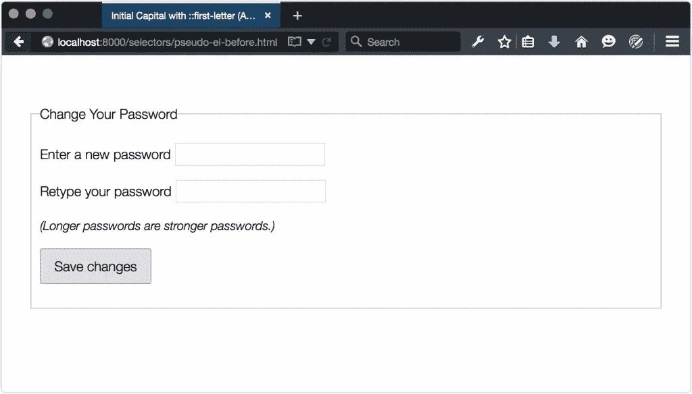

也许使用`::before`和`::after`最有用的方法是清除浮动元素。尼古拉斯·加拉格尔在他的文章[“一个新的 micro clearfix hack”:](http://nicolasgallagher.com/micro-clearfix-hack/)中介绍了这种技术(基于蒂埃里·科布伦茨的工作)

```
/* Use :before and :after if you need to support IE <= 8 */

.clearfix::before,
.clearfix::after {
    content: " "; /* Note the space between the quotes. */ 
    display: table;
}
.clearfix::after {
    clear: both;
}
```

将`clearfix`类添加到浮动元素后需要清除的任何元素中。

`::before`和`::after`的行为就像它们所附着的元素的常规后代一样。它们继承其父代的所有可继承属性，并位于由其父代创建的框内。但是它们也与其他元素盒进行交互，就好像它们是真正的元素一样。将`display: block`或`display: table`添加到`::before`或`::after`的方式与添加其他元素的方式相同。

### 警告:每个选择器一个伪元素

目前，每个选择器只允许一个伪元素。这意味着像`p::first-line::before`这样的选择器是无效的。

### 使用`::first-letter`创建印刷效果

当`::before`和`::after`伪元素注入内容时，`::first-letter`处理作为文档源的一部分存在的内容。有了它，我们可以创建首字母或首字母大写的效果，就像你在杂志或书籍版面中看到的那样。

### 注意:首字母大写和小写

一个 **首字母大写** 是一个大写字母，位于文本集的开头，字体比正文的其余部分要大。一个 **首字下沉** 类似于一个首字大写，但是被插入第一段至少两行。

这个 CSS 片段为我们文档中的每个`p`元素添加了一个首字母大写:

```
p::first-letter {
    font-family: serif;
    font-weight: bold;
    font-size: 3em;
    font-style: italic;
    color: #3f51b5;
}
```

结果可以在下面看到。

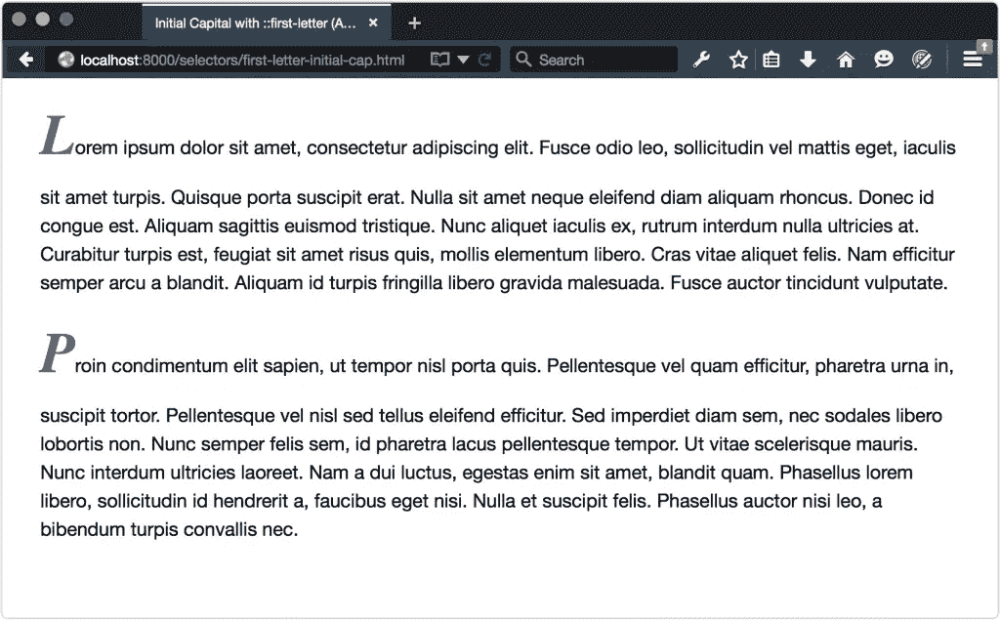

从这个截图中你可能已经注意到，如果你为元素设置了一个无单位的`line-height`，那么`::first–letter`将会影响第一行的`line-height`。在这种情况下，每个`p`元素从`body`元素继承一个`line-height`值 1.5。

有三种方法可以缓解这种情况:

1.  减少`::first–letter`伪元素的`line-height`值。一个`.5`值似乎在大多数时候都有效。

2.  在`::first–letter`伪元素上设置一个带有单位的`line-height`。

3.  在`body`或`::first–letter`父节点上设置一个带有单位的`line-height`。

第一个选项保留了使用无单位的`line-height`[<sup class="footnote">【1】</sup>](#ftn.d5e600)带来的垂直节奏，第二个选项将使用固定的`line-height`的副作用限制在那些伪元素上。选项三是这些选项中最糟糕的，因为很有可能会产生副作用，需要更多的 CSS 来覆盖它。

在这种情况下，让我们将`p::first-letter`的`line-height`值减少到`.5`(并重写我们的文件属性以使用`font`简写):

```
p::first-letter {
    font: bold italic 3em / .5 serif;
    color: #3f51b5;
}
```

这一更改产生了如下所示的结果。请注意，我们还必须调整每个`p`元素的底部边距，以补偿`p::first-letter`中减少的`line-height`。

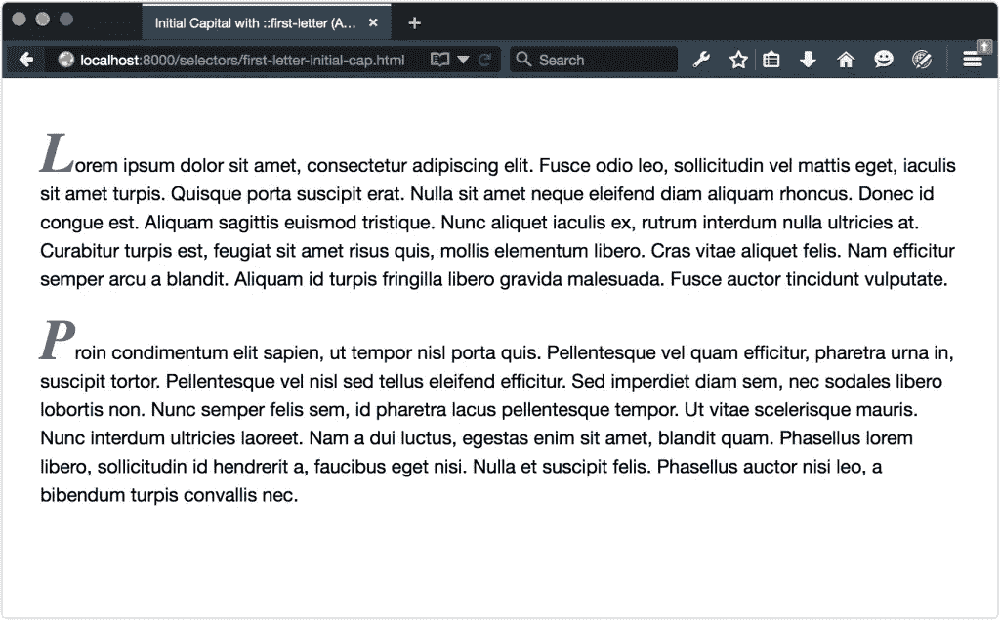

创建首字下沉需要多几行 CSS 代码。与首字母大写不同，首字下沉字母的相邻文本会将其换行。这意味着我们需要将`float: left;`添加到我们的规则集中。我们还将添加上边距、右边距和下边距:

```
p::first-letter {
    font: bold italic 3em / .5 serif;
    font-style: italic;
    color: #607d8b; 
    float: left;
    margin: 0.2em 0.25em .01em 0;
}
```

浮动一个元素，或者在这种情况下是一个伪元素，会使剩余的文本围绕它流动，如下所示。

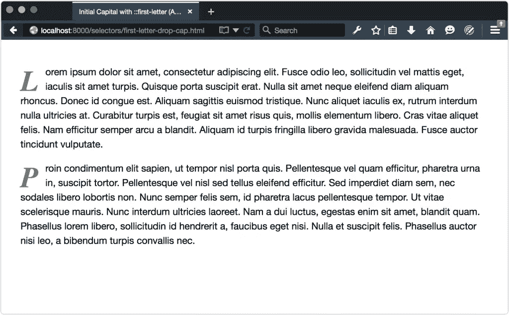

请注意，`::first-letter`很难在不同的浏览器上以像素级的精确度进行样式化，除非你使用`px`或`rem`作为尺寸、边距和行高的单位。

有时候一个文本元素的首字母其实就是标点符号；例如，一篇新闻报道以一句引言开头:

```
<p>&#8220;Lorem ipsum dolor sit amet, consectetur adipiscing elit.&#8221; Fusce odio leo, sollicitudin vel mattis eget, ...</p>
```

在这种情况下，为`::first-letter`定义的样式将影响开始的标点符号和第一个字母，如下所示。所有的浏览器都以同样的方式处理这个问题。


然而，当标点符号由一个元素生成时，这并不一定是正确的。考虑以下标记:

```
<p><q>Lorem ipsum dolor sit amet, consectetur adipiscing elit.</q> Fusce odio leo, sollicitudin vel mattis eget, iaculis sit ...</p>
```

当前的浏览器通常在包含的文本前后使用适合语言的引号来呈现`q`元素；然而，并不是所有的浏览器都以同样的方式对待这些引号。在 Firefox 42(如下图所示)、Safari 8 以及更早的版本中，`::first-letter`只影响开引号。

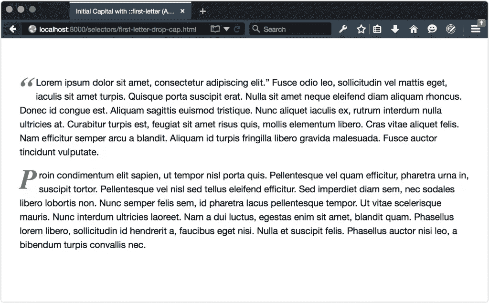

在 Chrome、Opera 和 Yandex 中，无论是`q`的开始引号还是段落的第一个字母都不会被重新设计。下图显示了这在 Chrome 中的样子。


然而，Internet Explorer 将首字母样式应用于开始引号 *和段落的首字母* ，如下所示。

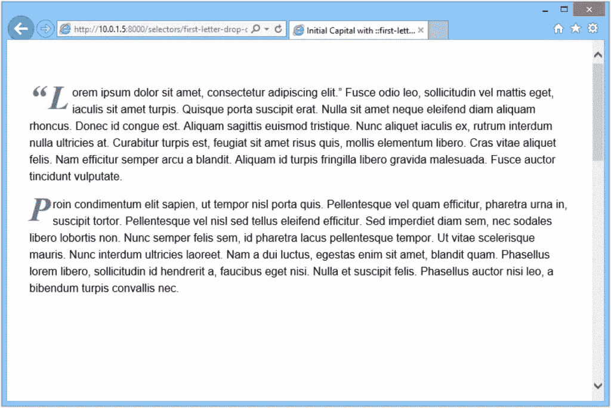

根据 [CSS 伪元素模块第 4 级规范，](http://dev.w3.org/csswg/css-pseudo-4/#first-letter-pseudo)应该包括紧接在第一个字母或字符之前或之后的标点符号；然而，规范不清楚这是否也适用于生成的标点符号。[](#ftn.d5e686)【2】

#### 使用`::first-letter`时的浏览器 bug

在很大程度上，`::first-letter`在不同的浏览器上都能正常工作。与任何 CSS 特性一样，有一些边缘情况和浏览器错误需要注意。

在 Firefox 39 和更早的版本中，一些标点符号会导致 Firefox 忽略一个`::first–letter`规则集 altogether:‑,$,^,_,+,`,~、>、<

无论第一个字符是使用`::before`和`content`属性设置的，还是包含在文档源中的，都是如此。这个问题没有解决办法。如果你也使用`::first-letter`，你需要避免使用这些字符作为第一个字符。

### 注意:基于 Blink 的浏览器中的错误

如果父元素的`display`值为`inline`或`table`，某些版本的基于 Blink 的浏览器将不会应用`::first–letter`规则。这个 bug 存在于 Chrome 42，Opera 29，Yandex 15 中。不过，它在 Chrome 44 中得到修复，应该会在这本书到达您手中时发布。如果您需要解决这个问题，最简单的方法是在父元素中添加`display: inline-block`、`display: block`或`display: table-cell`。

### 使用`::first-line`创建印刷效果

`::first-line`伪类的工作方式与`::first-letter`类似，但是影响元素的整个第一行。例如，我们可以使每个段落元素的第一行比每个段落的其余部分具有更大的文本大小和不同的颜色:

```
p::first-line {
    font: bold 1.5em serif;
    font-style: italic;
    color: #673ab7; 
}
```

你可以在下面看到结果。请注意，受影响的是每段的第一行，而不是第一句。第一行可以容纳多少字符由字体大小和元素宽度决定。


可以使用`br`或`hr`元素强制结束第一行，如下所示。不幸的是，这远非完美。如果你的元素宽度仅够容纳 72 个字符，在第 80 个字符后添加一个`<br>`标签不会影响`::first-line`伪元素。你将会得到一个奇怪的换行符。

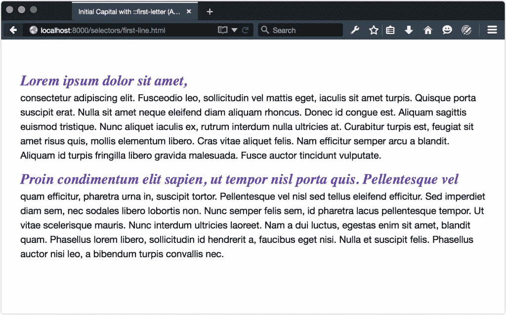

同样，使用不换行空格(`&nbsp;`)来防止单词间换行也不会影响`::first-line`。取而代之的是，位于`&nbsp;`之前的单词将被强制放在与它之后的文本相同的行上。

使用`::before`添加的生成内容将成为第一行的一部分，如下所示。

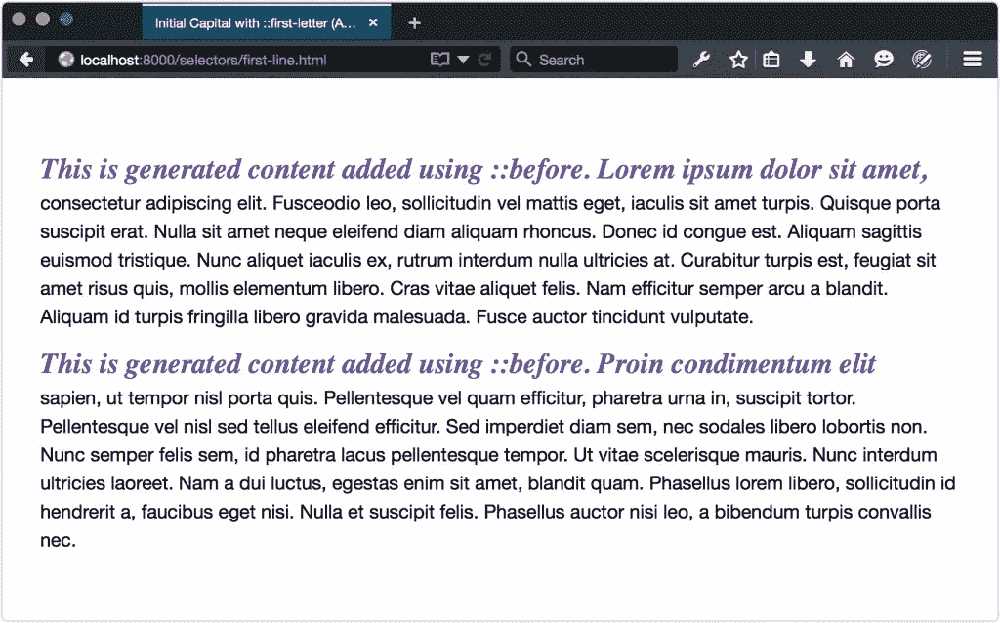

如果生成的文本足够长，它将填充整个第一行。但是，如果我们添加一个`display: block`声明，例如`p::before {content: '!!!'; display: block;}`，该内容将成为整个第一行:

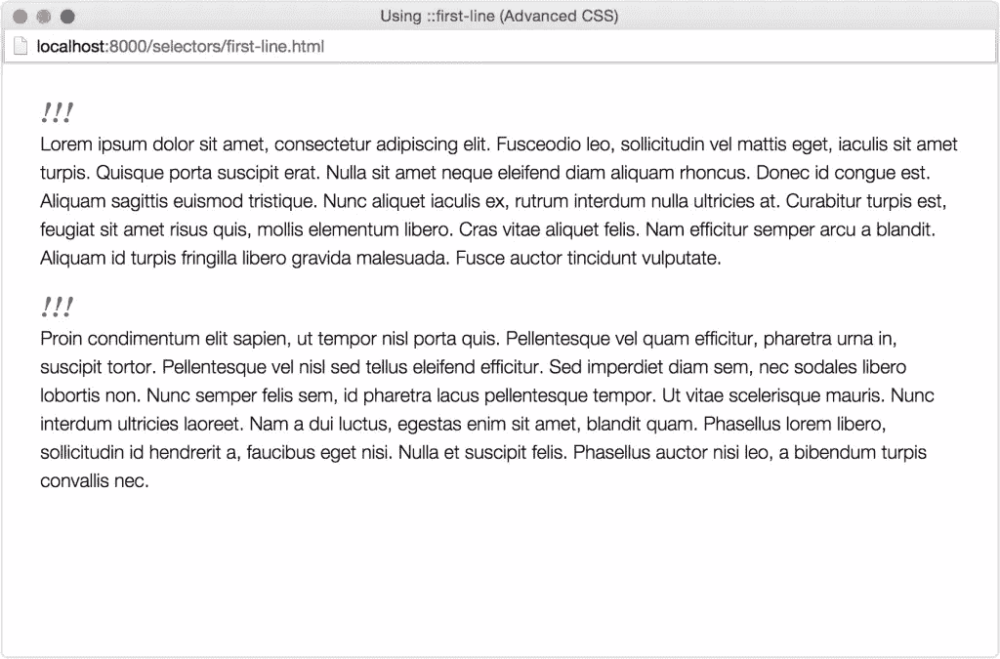

不幸的是，这在 Firefox 版本 40 或更早的版本中还不能工作。Firefox 完全忽略了规则集。

<h>用户界面趣味与`::selection`</h>

`::selection`伪元素是由 [CSS 伪元素模块级别 4 定义的所谓的“高亮伪元素”之一。](http://dev.w3.org/csswg/css-pseudo-4/)以前是选择器 3 级规范的一部分，它是浏览器实现的唯一高亮伪元素。[](#ftn.d5e807)

使用`::selection`，我们可以将 CSS 样式应用于用户用鼠标高亮显示的内容。默认情况下，高亮显示内容的背景和文本颜色由系统设置决定；然而，开发人员可以改变突出显示的外观，如下所示。

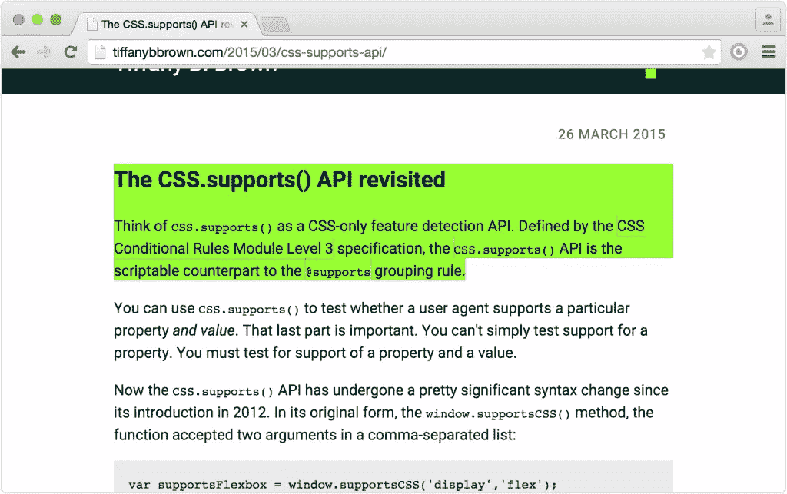

不是每个 CSS 属性都可以和`::selection`一起使用。如规范中所述，只有这些属性有效:

*   `color`

*   `background-color`

*   `cursor`

*   `outline`及其扩展属性

*   `text-decoration`及相关属性(如`text-decoration-style`

*   `text-emphasis-color`

*   `text-shadow`

实际上，在多个浏览器中只实现了`color`和`background-color`。让我们看一个例子:

```
::selection {
    background: #9f0; 
    color: #600;
}
```

这个 CSS 为用户突出显示的任何元素添加一个浅绿色背景，并将文本颜色改为深红色。该示例适用于所有支持`::selection`的浏览器，您可以在下面看到效果。

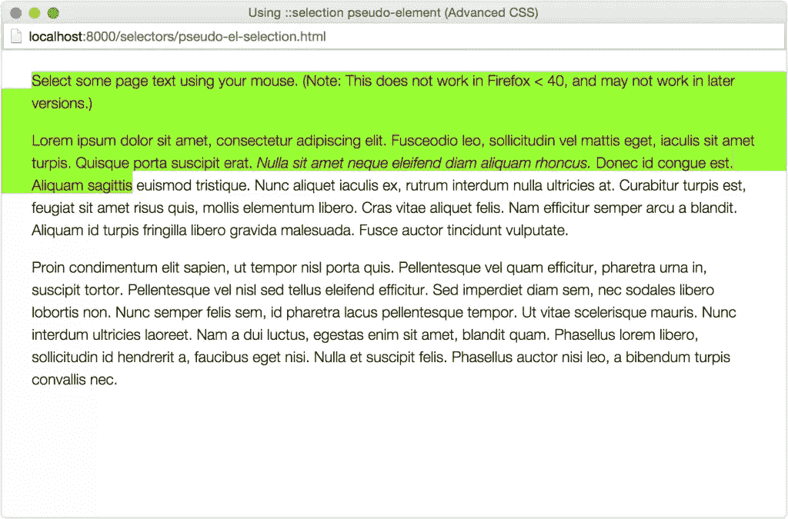

### 提示:颜色组合

选择使用`::selection`的前景色和背景色时，请牢记可访问性。一些颜色组合无法产生足够的对比度，以供弱视用户阅读。对于色盲用户来说，其他颜色组合可能难以辨认。在选择最终颜色之前，一定要使用对比度检查器和色盲模拟器。

`::spelling-error`和`::grammar-error`伪类也由伪元素模块定义。当实现时，这些伪类将让我们根据浏览器的字典对拼写错误或语法错误的文本进行样式化。

* * *

[<sup class="para">【1】</sup>](#d5e600)`line-height`的 Mozilla 开发者网络入口解释了为什么[无单位值](https://developer.mozilla.org/en-US/docs/Web/CSS/line-height)是正确的选择。

[<sup class="para">【2】</sup>](#d5e686)规范实际上使用了短语“排印字母单元”这包括 Unicode 字母和数字，也包括东亚和中东书写系统中使用的字符。

[<sup class="para">【3】</sup>](#d5e807)在 Firefox 中，这个伪元素需要一个–`moz-`前缀，像 so `::-moz-selection`。

## 分享这篇文章