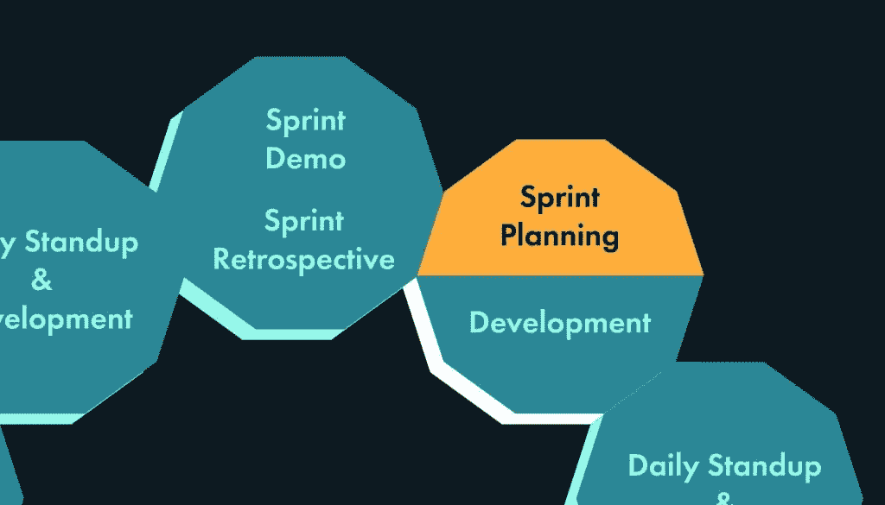

# Scrum 惯例:冲刺计划

> 原文：<https://www.sitepoint.com/scrum-rituals-sprint-planning/>

以下是摘自我们的书《Scrum:新手到忍者，作者是 M. David Green。世界各地的商店都有出售，或者你可以在这里买到电子书。

标志着每个冲刺开始的仪式被称为冲刺计划。Sprint 规划由 scrum master 主持，但是负责 sprint 规划大部分内容的人是产品负责人。

### 目标

冲刺计划的目的是为即将到来的冲刺制定议程。团队与产品负责人和 scrum master 聚在一起，介绍应该在下一个 sprint 中完成的故事。

产品负责人展示这些故事如何符合产品的愿景，团队评估产品负责人介绍的故事，并承诺根据他们的历史速度完成他们认为他们有能力完成的尽可能多的故事，历史速度由他们在平均冲刺中能够完成的点数决定。在 sprint 规划的最后，应该有一个对每个人都同意的特定故事集的承诺。这些故事应该都很清楚，它们所代表的工作量应该在团队的能力范围之内，以便在下一个 sprint 中完成。

### 时间盒

根据团队为每个 sprint 承诺的周数，sprint 计划可能需要几个小时，也可能需要一整天。对于一个两周的 sprint，一个团队可能会发现留出三四个小时是一个 sprint 规划的好投资。这可能看起来很长时间，但是正确的 sprint 计划非常详细和明确地说明了团队需要生产什么。scrum 的一个关键价值是它促进了沟通。冲刺规划就是一个例子。

大多数团队会发现，随着他们对过程越来越熟悉，他们能够更有效地完成这些仪式的目标。有一个强有力的 scrum 大师，围绕仪式的不同方面保持一个清晰的时间框，可以帮助过程尽可能顺利地进行。

但是在 sprint 规划期间有很多事情要做，这些仪式需要被给予足够的空间来容纳所有将浮出水面的问题。从明确的时间限制开始，让每个人都相信心中有目标和终点，也有助于保持人们的注意力。

#### 准备

在准备这个仪式的过程中，产品负责人将会和设计师、客户、各种团队成员以及 scrum master 一起工作，创建一个清晰而具体的故事，这些故事对产品来说具有最高的优先级。

产品负责人有责任确保每个故事都准备好了，并且以一种任何团队成员都可以阅读和理解每个故事的描述和接受标准的方式来表达。

### 引入新故事

Sprint planning 为 scrum 团队提供了一个机会，让他们了解产品所有者希望他们在产品的下一次迭代中处理的故事。在仪式的这一部分，产品负责人检查已经准备好的故事，将它们提交给团队进行评估。

团队的每个成员都必须积极参与演示，因为这是他们质疑和挑战每个故事的完整性和适当性的机会。一个好的产品负责人会在这个仪式之前与团队中的专家讨论这些故事，以确保可预见的异议得到解决。

Sprint 计划鼓励围绕每个故事进行积极的讨论。这个过程开启了一个对话，允许产品所有者和团队详细考虑每个故事的分支和可行性。尽管产品负责人被授权在 sprint backlog 上设置故事的优先级，但是团队有权在将故事添加到 sprint backlog 之前，拒绝它认为不可能的、定义不充分的或者技术上不合适的故事。

sprint 规划仪式的这一部分也是团队有责任展示与代码本身相关的故事的时候。如果产品所有者负责产品的远景，那么开发团队负责代码的质量和可维护性。scrum 以产品为导向的焦点并不是忽视技术债务的借口。

团队通常会围绕重构代码、更新代码以满足新标准或对基础设施进行重要升级来介绍故事。对团队来说，提出强有力的理由很重要，因为产品负责人拥有最终的权力。不同的团队以不同的方式解决这种权力平衡，这取决于每个团队如何最好地解决技术债务，同时仍然满足产品开发的期望。

### 故事估计

下一阶段的冲刺规划是 **剧情预估** 。在此过程中，团队将根据团队在过去类似故事中的经验以及他们同意的“完成”定义，估计完成每个故事所需的相对工作量。

团队评估故事的方式有很多。评估时要记住的重要事情是，分配给不同故事的值是任意的和相对的，与实际时间没有任何相似之处。评估练习的目的是提高团队审视新故事的能力，并计算出相对于他们已经完成的其他故事，需要付出多少努力。

大多数团队使用一个由 **点** 组成的系统来评估故事。一个较小的、简单的故事可能会得到 1 分，而一个较大或复杂的故事可能会得到 20 分。许多团队使用修正的斐波纳契标度，数字 0、1、2、3、5、8、13 和 20 代表努力程度的增加。随着时间的推移，团队的目标是了解他们在单次冲刺中可以完成多少分，这样他们就可以更有效地评估未来。

每个团队都有自己的想法，知道每一个分值对自己意味着什么。一个团队在冲刺阶段完成的分数和另一个团队在同一冲刺阶段完成的分数之间没有逻辑上的比较。分数的值是主观的，并且只与特定团队的参与者相关。

其他的报道尺码系统包括 t 恤尺码，比如小号、中号、大号、特大号。选择什么系统完全取决于团队。一旦团队选择了一个系统，他们应该试着坚持几次冲刺，这样随着时间的推移，他们就可以开始感觉到他们的速度在他们选择的度量中是多少。

### 注意:大家要认同

对团队中的每个人来说，同意一个故事的点估计是很重要的，不管团队中的每个成员是否都将致力于那个特定的故事。这是 scrum 透明性的一部分。团队中的每个人都应该能够很好地理解每个故事，以估计其相对的努力程度，当一个团队成员在处理一个故事时，每个人都应该至少对这个故事有一个概念。

#### 疯狂的

其他通常不赋分的故事都是 bug。一个 **bug** 在 scrum 中有一个特定的定义，它与现有产品中的意外或不想要的行为无关。scrum 中的 bug 是对仍在进行中的故事的遗漏需求，或者是在之前的 sprint 中已经被接受的需求。

如果团队已经完成了一个故事，并且被接受了，并且分数包含在 sprint 的总分中，但是后来发现这个故事没有正确完成，那么就不会分配分数来修复 bug 以使这个故事进入完成状态。

Bug 工作确实降低了团队的速度，因为它处理了不恰当地包含在速度计算中的点。不管错误是在同一个 sprint 中修复还是在随后的 sprint 中修复，都应该是这样。只要团队因为一个不符合接受标准的故事而得到分数，那么让它达到真正完成状态的工作就不应该计入任何 sprint 中的分数。

### 注意:你不需要为 bug 预留容量

没有必要留出一定比例的团队能力来处理 bug。在典型的 sprint 中，团队可以预测完成的工作量包括当故事被接受为完成，但实际上没有满足所有接受标准时，应用于修复 bug 的工作量。

#### 任务

有一个老笑话说，scrum 是一个提高团队交付技术债务能力的系统。当然，开发一个 web 或移动应用程序不仅仅是在一个不断增长、越来越复杂的代码基础上添加一些功能。最终，代码需要被重新分解，基础设施的改变将不得不进行，直到这些问题被解决，团队才能够在新的特性上进行有效的工作。这些必要的改进对客户来说可能没有特定的价值，但是它们对于防止代码变得陈旧或难以维护是必要的。

与代码维护相关的任务应该包含在团队完成的工作中，并在 sprint backlog 中进行优先排序，但不应该用点数来估计。scrum 中的点衡量团队向客户交付价值的能力，并且与特性开发相关。它们不是团队所做工作总量的度量。

任务通常不会交付任何有形的用户价值。但是任务是需要完成的，如果团队认识到保持系统可维护性和避免技术债务的必要工作因为新特性而被推迟，那么在 sprint 计划期间，团队和产品所有者之间需要进行协商。

#### 穗

大多数进入 sprint 计划的故事应该在团队的技术能力范围内，但是偶尔会有需要更深入研究的故事。这样的故事触发了被称为 **尖峰** 的新任务。扣球通常不计分。然而，一个合适的峰值是有接受标准的。任何峰值都应该有一个明确和一致的结果。

尖峰会占用团队的资源，而个人会去研究可能超出团队当前能力的技术解决方案。结果，完成产品所有者的目标所需的峰值越多，团队在一次冲刺中所能完成的分数就越低。

由于尖峰信号的未知性质，除非受到约束，否则它们会吃掉团队的大量资源。通常，当同意在 sprint 中包含一个尖峰时，团队将决定在必须结束或放弃尖峰之前可以投入的最大时间和精力。

### 致力于 Sprint 待办事项

一旦产品负责人提出的所有故事都已经被评估，仪式中的所有参与者一起工作，为即将到来的 sprint 提出一个有意义的 backlog。这个 backlog 将基于团队在过去能够完成的历史点数来确定大小，与新故事的点数估计相平衡。

虽然产品负责人对 sprint backlog 的内容以及 sprint backlog 的顺序有最终的决定权，但是在准备 backlog 时，团队有机会倡导某些变更。

例如，尽管每个故事都应该是独立的，但是对于团队来说，按照一定的顺序处理特定的故事可能是有意义的。团队可能还希望完成在之前的 sprint 中已经开始但没有完成的故事。完成正在进行的故事对开发团队很有用，因为这有助于他们保持连续性。虽然失去连续性是有代价的，但这种代价是产品所有者的责任，产品所有者有权为了产品做出这些决定。

一旦创建了最终的 sprint backlog，团队中的每个人都需要致力于这个 backlog。这是团队反对或提出他们认为可能会影响他们完成工作能力的问题的最后机会。如果仍然有分歧，scrum 主管需要介入并促进对话，以便达成一致。

sprint 规划的最终产品是团队中每个人都同意的 sprint backlog。scrum 主管应该在房间里投票，确保每个人都同意这个承诺是现实的，并且他们愿意在即将到来的 sprint 中承担这个任务。然后，新的故事应该按照优先级顺序输入到团队同意用于 sprint backlog 的跟踪工具中。

Sprint planning 提醒每个人他们在构建产品所有者的产品愿景的过程中所处的确切位置，以及即将到来的增量的目标是什么。在 sprint 规划的最后，团队中的每个人都应该对他们下一步需要做什么有一个很好的认识，并坚定地承诺在即将到来的 sprint 期间完成一组优先的故事。

## 分享这篇文章