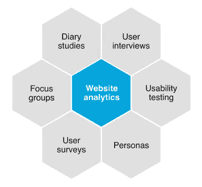
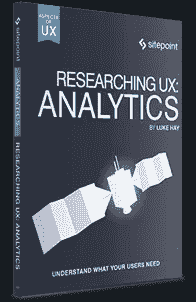

# 如何通过分析真正了解你的用户

> 原文：<https://www.sitepoint.com/how-to-really-get-to-know-your-users-with-analytics/>

不幸的是，网站和应用分析是 UX 经常被忽视的一个方面。当然，分析不能替代其他 UX 方法，但它可以补充这些方法，以确保涵盖定量和定性数据。UX 从业者可能会使用他们的网站分析数据来了解网站上发生了什么，但很少有人使用他们的分析数据作为用户研究的基础。本文将探讨分析如何帮助用户研究过程。

了解谁是你的用户对任何 UX 过程都是至关重要的。这就是为什么用户研究起着如此重要的作用。用户研究包括一系列不同的工具和技术，但支撑它们的是收集关于用户的有用数据。

研究不是问人们喜欢什么或讨厌什么，而是建立关于你的用户的事实。分析数据是客观的，提供事实而不是观点。这些数据不能替代深入的用户研究，但采取分析优先的方法有助于为您的研究提供坚实的基础。

## 分析在研究过程中的位置

用户研究过程没有固定的模式。不同的人会以不同的方式进行用户研究，这个过程可能会因项目而异。下图显示了一些不同形式的用户研究，您可以将它们作为流程的一部分。

您的分析数据可以在流程开始时使用，以大致了解访问您网站的用户类型。它还可以帮助你创建详细的人物角色，并分析不同用户类型的行为。使用你的分析数据来支持你的其他研究方法，以充分利用这一过程。

## 了解你的用户

为了理解为什么你的用户会有这样的行为，你首先需要了解他们。你可以假设这些用户是谁，但是你应该不断挑战这些假设，或者至少用事实来支持它们。你的分析包中有很多数据可以帮助你了解谁在访问你的网站。你越了解你的用户，你的设计决策就越明智。

这些数据可以为许多不同类型的研究提供有用的起点。这些数据特别有用的一个领域是为可用性测试招募人员。在可用性测试中，参与者与目标人物角色越匹配，测试就越好。

可用性测试应该显示“真实”用户如何与你的网站互动，以及他们可能在哪里遇到问题。知道谁是你的用户将会改善你的可用性测试的结果，并且给你一个更好的机会去发现你的真实用户所遇到的问题。

以下是您的网站分析数据可以帮助您回答的问题:

*   用户如何找到你的网站？
*   你的用户来自哪里？
*   他们说什么语言？
*   他们使用什么设备？
*   他们多大了，性别是什么？
*   他们多久访问一次你的网站？
*   他们对什么内容感兴趣？

正如你所看到的，那里有大量的信息可以为你的用户研究提供一个强有力的起点。

## 分析和人物角色

在 UX 过程中，人物角色被用来代表网站的实际用户。它们通常是为了帮助设计过程中的决策制定而创建的，并且可以是一个强大的工具，有助于始终关注用户。你的分析包中的大量数据可以作为创建新人物角色的起点，也可以用来分析这些人物角色是如何使用你的网站的。

人物角色不是真实的人，但是他们代表真实的人——可能使用你的网站的人的类型。最好的不仅仅是“编造的”，而是来自对网站用户及其可能行为的深入了解。

正如我们在本文前面所讨论的，您的分析数据为您提供了人口统计信息，这些数据对于基于真实用户的详细信息创建人物角色非常有用。

有几种方法可以获得为你的站点创建真实人物角色所需的信息。通过与对用户有第一手经验的利益相关者交谈，可以获得一些信息。然而，某种类型的用户研究也是至关重要的，可以包括调查和对真实用户的面对面采访。你的分析也应该在人物角色创建中发挥重要作用。

您的分析包中的几乎任何指标都可以用来帮助塑造人物角色。举例来说，网站上的时间可能表明你的用户是时间紧迫还是可能是悠闲的浏览者，而高跳出率可能表明不耐烦和/或效率。

创建真正准确和有用的人物角色的关键是从一系列来源中获取完整的图片。我并不建议你只使用分析数据，但它确实提供了许多无偏见的数据，这只会有助于这个过程。不要孤立地使用分析数据。将它与其他研究方法一起使用，而不是取代它们。

## 不要仅仅依赖分析数据

虽然分析数据对于人物角色的创建很有用，但是过于依赖这些数据可能会导致不准确的人物角色。例如，如果你为一个网站创建两个角色，而你的数据告诉你男女用户各占一半，那么拥有一个男性角色和一个女性角色是有意义的。但是，如果同一个网站有 50%的访问量来自英国，50%来自美国，这对你的人物角色意味着什么？你应该选择英国还是美国的男性角色？仅凭现有的数据是无法回答这个问题的。这进一步强调了做更多用户研究的必要性，以便更清楚地了解你的用户到底是谁。

一旦你很好地了解了谁是你的用户，你就可以创建细分市场来观察不同的用户群在你的网站上的行为。细分市场是您的分析数据的子集。例如，一个细分市场可能由来自特定国家或城市的用户组成。另一个细分市场可能是移动用户，或者是访问你的网站的特定部分的用户。细分可以由一个维度组成，也可以由多个维度组成，比如使用平板电脑的讲法语的女性。

一旦你有了你的细分，你就可以应用它们并查看你的导航报告，看看你的人物角色的代表是如何与你的站点交互的。

这整个过程也可能是循环的。您可以使用分析数据来通知您的角色，然后使用这些角色来进一步询问您的数据。希望这篇文章能让你相信，分析在用户研究过程中扮演着重要的角色。我不是建议你只使用分析进行研究，因为没有什么可以替代与真实用户的交流。但是你可以从你的分析包中获得很多真正有用的信息，这可以为你的用户研究过程打下坚实的基础。作为 UXers，我们知道了解我们的用户是创造良好体验的关键。分析你网站的分析数据是提高这种理解的一个很好的方法。

**AMA 事件！**希望你知道更多？或许你可以和卢克聊聊 UX，分析一下自己？或者您对收集有见地的分析有疑问，请加入我们的[谷歌用户见解分析 AMA](https://www.sitepoint.com/community/t/google-analytics-for-user-insight-ama-with-luke-hay-on-thursday-26th-12pm-pst/250565) 与卢克·海于**1 月 26 日星期四中午 12 点(太平洋标准时间)**的活动。

*如果您想了解更多关于在 UX 流程中使用分析数据的信息，请查阅卢克的新书《研究 UX:分析》，该书更详细地介绍了在 UX 使用分析优先的方法。先睹为快，看看书中的[样章](https://uploads.sitepoint.com/wp-content/uploads/2017/01/1484093524uxanalytics1sample.pdf)。*

## 分享这篇文章