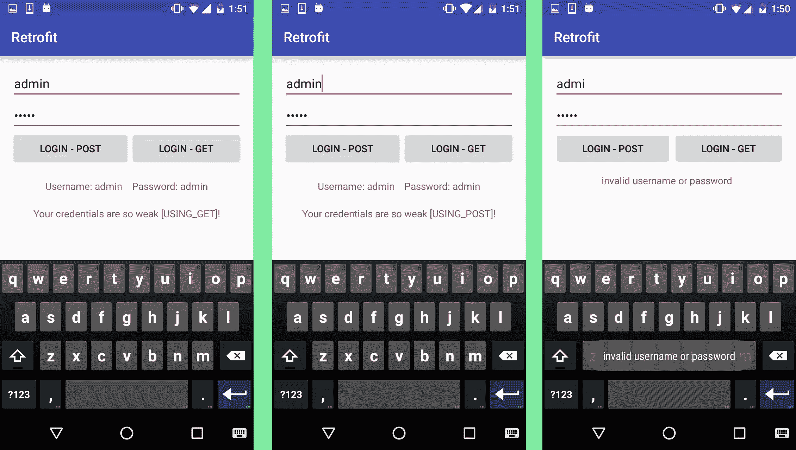

# 翻新，一个简单的 Android 和 Java 的 HTTP 客户端

> 原文：<https://www.sitepoint.com/retrofit-a-simple-http-client-for-android-and-java/>

*本文更新于 2017 年 1 月 11 日。具体来说:更新改装版本 2.1*

在移动应用程序和后端服务器之间交换数据是许多开发项目的基本需求。虽然谷歌的[凌空](http://developer.android.com/training/volley/index.html)库使这项任务变得更简单，但它有一个陡峭的学习曲线，而[的改造](http://square.github.io/retrofit/)旨在使这项任务更加简单。

在本教程中，我将向您展示如何使用翻新库在 Android 应用程序和后端 PHP 应用程序之间交换数据。这个示例应用程序将通过向服务器发送两个字符串(用户名和密码)来模拟登录过程，等待响应，然后向用户显示。

你可以在 [GitHub](https://github.com/sitepoint-editors/Retrofit) 上找到这个应用的最终代码。

## 构建 Android 应用程序

在 Android Studio 中创建新项目，选择 *18* 的*最低 API 级别*，并添加一个*空活动*。

将访问互联网的权限添加到 *AndroidManifest.xml* 的`application`标签中:

```
<uses-permission android:name="android.permission.INTERNET"/>
```

将库依赖项添加到 *build.gradle (Module: app)* 文件的*依赖项*部分:

```
 compile 'com.squareup.okhttp3:logging-interceptor:3.4.0'
    compile 'com.squareup.retrofit2:retrofit:2.1.0'
    compile 'com.squareup.retrofit2:converter-gson:2.1.0'
    compile 'com.squareup:otto:1.3.8'
    compile 'com.google.code.gson:gson:2.6.2'
```

### 创建登录布局

该应用程序唯一需要的布局是 *activity_main.xml* ，将其更改为以下内容:

```
<?xml version="1.0" encoding="utf-8"?>
<RelativeLayout xmlns:android="http://schemas.android.com/apk/res/android"
    xmlns:tools="http://schemas.android.com/tools"
    android:layout_width="match_parent"
    android:layout_height="match_parent"
    android:paddingBottom="@dimen/activity_vertical_margin"
    android:paddingLeft="@dimen/activity_horizontal_margin"
    android:paddingRight="@dimen/activity_horizontal_margin"
    android:paddingTop="@dimen/activity_vertical_margin"
    tools:context="com.example.theodhorpandeli.retrofit.MainActivity">

    <LinearLayout
        android:layout_width="match_parent"
        android:layout_height="wrap_content"
        android:orientation="vertical"
        android:id="@+id/loginLayout">    

            <EditText
                android:layout_width="match_parent"
                android:layout_height="wrap_content"
                android:id="@+id/usernameInput"
                android:hint="Username:"/>          

            <EditText
                android:layout_width="match_parent"
                android:layout_height="wrap_content"
                android:id="@+id/passwordInput"
                android:hint="Password:"/>

        <LinearLayout
            android:layout_width="match_parent"
            android:layout_height="wrap_content"
            android:orientation="horizontal">

            <Button
                android:layout_width="wrap_content"
                android:layout_height="wrap_content"
                android:id="@+id/loginButtonPost"
                android:text="Login - Post"
                android:layout_gravity="right"
                android:layout_weight="1" />

            <Button
                android:layout_width="wrap_content"
                android:layout_height="wrap_content"
                android:id="@+id/loginButtonGet"
                android:text="Login - Get"
                android:layout_weight="1" />

        </LinearLayout>

    </LinearLayout>

    <LinearLayout
        android:orientation="vertical"
        android:layout_width="match_parent"
        android:layout_height="fill_parent"
        android:layout_below="@id/loginLayout">

        <TextView
            android:layout_width="wrap_content"
            android:layout_height="wrap_content"
            android:id="@+id/information"
            android:layout_gravity="center_horizontal"
            android:layout_marginTop="20dp" />

        <TextView
            android:layout_width="wrap_content"
            android:layout_height="wrap_content"
            android:id="@+id/extraInformation"
            android:layout_gravity="center_horizontal"
            android:layout_marginTop="20dp" />
    </LinearLayout>

</RelativeLayout>
```

布局包括两个`EditText`元素(用户名和密码)，两个`Buttons`和两个`TextView`来显示服务器响应。

### 创建类

为了向服务器发送数据，Retrofit 使用了一个`Communicator`和一个`Interface`类。`Communicator`方法创建使用`Interfaces`来执行服务器请求的`RestAdapters`。

要创建接口类，*右键单击主包上的*并选择 *New - > Java Class* 。调用这个类*接口*，选择*种类- >接口*。

这个类包含了与 API 通信的方法。首先添加用于发送请求的*方法。*

```
public interface Interface {

    //This method is used for "POST"
    @FormUrlEncoded
    @POST("/api.php")
    Call<ServerResponse> post(
            @Field("method") String method,
            @Field("username") String username,
            @Field("password") String password
    );

  //This method is used for "GET"
    @GET("/api.php")
    Call<ServerResponse> get(
            @Query("method") String method,
            @Query("username") String username,
            @Query("password") String password
    );

}
```

三个变量以表单数据的形式发送给 API。稍后您将构建`ServerResponse`类，所以不要担心您可能看到的任何错误。

`Communicator`类执行调用并包含创建 Rest 适配器的方法。

创建一个名为`Communicator`的新类，并添加以下代码:

```
public class Communicator {
    private static  final String TAG = "Communicator";
    private static final String SERVER_URL = "http://127.0.0.1/retrofit";

     public void loginPost(String username, String password){

        //Here a logging interceptor is created
        HttpLoggingInterceptor logging = new HttpLoggingInterceptor();
        logging.setLevel(HttpLoggingInterceptor.Level.BODY);

        //The logging interceptor will be added to the http client
        OkHttpClient.Builder httpClient = new OkHttpClient.Builder();
        httpClient.addInterceptor(logging);

        //The Retrofit builder will have the client attached, in order to get connection logs
        Retrofit retrofit = new Retrofit.Builder()
                .client(httpClient.build())
                .addConverterFactory(GsonConverterFactory.create())
                .baseUrl(SERVER_URL)
                .build(); Interface service = retrofit.create(Interface.class);

        Call<ServerResponse> call = service.post("login",username,password);

        call.enqueue(new Callback<ServerResponse>() {
            @Override
            public void onResponse(Call<ServerResponse> call, Response<ServerResponse> response) {
                BusProvider.getInstance().post(new ServerEvent(response.body()));
                Log.e(TAG,"Success");
            }

            @Override
            public void onFailure(Call<ServerResponse> call, Throwable t) {
                // handle execution failures like no internet connectivity
                BusProvider.getInstance().post(new ErrorEvent(-2,t.getMessage()));
            }
        });
    }

    public void loginGet(String username, String password){
        //Here a logging interceptor is created
        HttpLoggingInterceptor logging = new HttpLoggingInterceptor();
        logging.setLevel(HttpLoggingInterceptor.Level.BODY);

        //The logging interceptor will be added to the http client
        OkHttpClient.Builder httpClient = new OkHttpClient.Builder();
        httpClient.addInterceptor(logging);

        //The Retrofit builder will have the client attached, in order to get connection logs
        Retrofit retrofit = new Retrofit.Builder()
                .client(httpClient.build())
                .addConverterFactory(GsonConverterFactory.create())
                .baseUrl(SERVER_URL)
                .build();

        Interface service = retrofit.create(Interface.class);

        Call<ServerResponse> call = service.get("login",username,password);

        call.enqueue(new Callback<ServerResponse>() {
            @Override
            public void onResponse(Call<ServerResponse> call, Response<ServerResponse> response) {
                BusProvider.getInstance().post(new ServerEvent(response.body()));
                Log.e(TAG,"Success");
            }

            @Override
            public void onFailure(Call<ServerResponse> call, Throwable t) {
                // handle execution failures like no internet connectivity
                BusProvider.getInstance().post(new ErrorEvent(-2,t.getMessage()));
            }
        });
    }
```

将`SERVER_URL`改为你的 PHP 服务器的 URL，我不会在本教程中涉及设置 PHP，但是你可以在这里找到[全面的说明。](http://php.net/manual/en/install.php)

创建一个名为`BusProvider`的新类，并添加以下代码:

```
public class BusProvider {

    private static final Bus BUS = new Bus();

    public static Bus getInstance(){
        return BUS;
    }

    public BusProvider(){}
}
```

在`MainActivity`类中，从`EditText`元素中获取值，并将它们用作服务器调用的参数。将`MainActivity`类改为:

```
public class MainActivity extends AppCompatActivity {

    private Communicator communicator;
    private String username, password;
    private EditText usernameET, passwordET;
    private Button loginButtonPost, loginButtonGet;
    private TextView information, extraInformation;
    private final static String TAG = "MainActivity";
    public static Bus bus;

    @Override
    protected void onCreate(Bundle savedInstanceState) {
        super.onCreate(savedInstanceState);
        setContentView(R.layout.activity_main);

        communicator = new Communicator();

        usernameET = (EditText)findViewById(R.id.usernameInput);
        passwordET = (EditText)findViewById(R.id.passwordInput);
        //This is used to hide the password's EditText characters. So we can avoid the different hint font.
      passwordET.setTransformationMethod(new PasswordTransformationMethod());

        loginButtonPost = (Button)findViewById(R.id.loginButtonPost);
        loginButtonPost.setOnClickListener(new View.OnClickListener() {
            @Override
            public void onClick(View v) {
                username = usernameET.getText().toString();
                password = passwordET.getText().toString();
                usePost(username, password);
            }
        });

        loginButtonGet = (Button)findViewById(R.id.loginButtonGet);
        loginButtonGet.setOnClickListener(new View.OnClickListener() {
            @Override
            public void onClick(View v) {
                username = usernameET.getText().toString();
                password = passwordET.getText().toString();
                useGet(username, password);
            }
        });

        information = (TextView)findViewById(R.id.information);
        extraInformation = (TextView)findViewById(R.id.extraInformation);
    }

    private void usePost(String username, String password){
        communicator.loginPost(username, password);
        }

  private void useGet(String username, String password){
        communicator.loginGet(username, password);
      }
      }
```

概括一下你到目前为止所做的事情。`EditText`元素的值被传递给`usePost()`方法。然后调用`communicator`方法，并使用这些值来创建它的 Rest 适配器并执行调用。

既然 post 方法已经基本完成，应用程序应该处理来自服务器的响应了。为此，翻新使用名为`Model`的类。对于这个应用程序来说，`Model`的名字是`ServerResponse`，在`Interface`的方法中作为回调被调用，当`RestAdapter`被创建时。在这两种情况下，它都指定了服务器预期的响应类型。

创建一个名为`ServerResponse`的新类，并添加以下代码:

```
public class ServerResponse {
    public class ServerResponse implements Serializable {
        @SerializedName("returned_username")
        private String username;
        @SerializedName("returned_password")
        private String password;
        @SerializedName("message")
        private String message;
        @SerializedName("response_code")
        private int responseCode;

        public ServerResponse(String username, String password, String message, int responseCode){
            this.username = username;
            this.password = password;
            this.message = message;
            this.responseCode = responseCode;
        }

        public String getUsername() {
            return username;
        }

        public void setUsername(String username) {
            this.username = username;
        }

        public String getPassword() {
            return password;
        }

        public void setPassword(String password) {
            this.password = password;
        }

        public String getMessage() {
            return message;
        }

        public void setMessage(String message) {
            this.message = message;
        }

        public int getResponseCode() {
            return responseCode;
        }

        public void setResponseCode(int responseCode) {
            this.responseCode = responseCode;
        }
    }
}
```

Retrofit 的模型通常实现`Serializable`,因为它们需要解析来自对象的数据，在本例中，来自 JSONObject。这个类声明变量，以及 JSON 键的名称，它们处理这些变量的数据。

为了显示服务器响应，改型使用“事件”。要获得服务器响应，您需要创建事件类。创建一个名为`ServerEvent`的新类。

```
public class ServerEvent {
  private ServerResponse serverResponse;

  public ServerEvent(ServerResponse serverResponse) {
      this.serverResponse = serverResponse;
  }

  public ServerResponse getServerResponse() {
      return serverResponse;
  }

  public void setServerResponse(ServerResponse serverResponse) {
      this.serverResponse = serverResponse;
  }
}
```

当被调用时，这个类构造一个`ServerResponse`。

创建另一个名为`ErrorEvent`的类，并添加以下代码:

```
public class ErrorEvent {
  private int errorCode;
  private String errorMsg;

  public ErrorEvent(int errorCode, String errorMsg) {
      this.errorCode = errorCode;
      this.errorMsg = errorMsg;
  }

  public int getErrorCode() {
      return errorCode;
  }

  public void setErrorCode(int errorCode) {
      this.errorCode = errorCode;
  }

  public String getErrorMsg() {
      return errorMsg;
  }

  public void setErrorMsg(String errorMsg) {
      this.errorMsg = errorMsg;
  }
}
```

这些方法获取更多关于服务器响应或任何错误的信息。对于这个示例应用程序，创建了`Event`类，但没有使用。将这些方法添加到`Communicator`类中，在右括号之前:

```
...
@Produce
  public ServerEvent produceServerEvent(ServerResponse serverResponse) {
      return new ServerEvent(serverResponse);
  }

  @Produce
  public ErrorEvent produceErrorEvent(int errorCode, String errorMsg) {
      return new ErrorEvent(errorCode, errorMsg);
  }
  ...
```

`RestAdapter`现在已经完成，代码中最重要的部分是:

```
...
Call<ServerResponse> call = service.post("login",username,password);

        call.enqueue(new Callback<ServerResponse>() {
            @Override
            public void onResponse(Call<ServerResponse> call, Response<ServerResponse> response) {
                // response.isSuccessful() is true if the response code is 2xx
                BusProvider.getInstance().post(new ServerEvent(response.body()));
                Log.e(TAG,"Success");
            }

            @Override
            public void onFailure(Call<ServerResponse> call, Throwable t) {
                // handle execution failures like no internet connectivity
                BusProvider.getInstance().post(new ErrorEvent(-2,t.getMessage()));
            }
        });
...
```

这指定回调将有一个`ServerResponse`结构，并实现两个被覆盖的方法，`success`和`failure`。当客户端从服务器获得响应时调用第一个方法，当找不到服务器或出现连接错误时调用第二个方法。

每当调用`success`或`failure`方法时，改型使用`BusProvider`从服务器获取数据。一个`BusProvider`就像一个通道，每个响应都在这里传递。根据具体情况，`BusProvider`会发布一个`ServerEvent`，从中您可以获得所需的数据，或者发布一个包含错误信息的`ErrorEvent`。

在通道的一端是推送响应数据的`Retrofit Builder`，在另一端是等待数据的任何活动。

要让`MainActivity`类等待一个事件，首先，需要实现两个方法。将以下内容添加到类中:

```
@Override
  public void onResume(){
      super.onResume();
      BusProvider.getInstance().register(this);
  }

  @Override
  public void onPause(){
      super.onPause();
      BusProvider.getInstance().unregister(this);
  }
```

这导致活动通过向事件总线注册来等待事件，现在需要捕获事件。因为您构建了两种类型的事件，`ServerEvent`和`ErrorEvent`，它们都需要通过实现两个`Subscribed`方法来捕获。将以下方法添加到`MainActivity`:

```
@Subscribe
  public void onServerEvent(ServerEvent serverEvent){
      Toast.makeText(this, ""+serverEvent.getServerResponse().getMessage(), Toast.LENGTH_SHORT).show();
      if(serverEvent.getServerResponse().getUsername() != null){
          information.setText("Username: "+serverEvent.getServerResponse().getUsername() + " || Password: "+serverEvent.getServerResponse().getPassword());
      }
      extraInformation.setText("" + serverEvent.getServerResponse().getMessage());
  }

  @Subscribe
  public void onErrorEvent(ErrorEvent errorEvent){
      Toast.makeText(this,""+errorEvent.getErrorMsg(),Toast.LENGTH_SHORT).show();
  }
```

现在，该类订阅了总线提供的事件，根据事件的类型，用户接收信息。

## 服务器端

### PHP 脚本

对于这个示例应用程序，服务器由一个简单的 PHP 脚本组成。为了简单起见，这个脚本没有连接到数据库。创建*api.php*并添加以下内容:

```
<?php

    //Post Method here
    if(isset($_POST['method']) == 'login'){
        $username = $_POST['username'];
        $password = $_POST['password'];

        if($username == "admin" && $password == "admin"){
            $response = array('returned_username' => "-admin-",
                              'returned_password' => "-admin-",
                              'message' => "Your credentials are so weak [USING_POST]!",
                              'response_code' => "1");
               echo json_encode($response);

        }else{
            $response = array('response_code' => "-1",
                              'message' => "invalid username or password");                    
               echo json_encode($response);
        }
    }
```

第一部分从`POST`方法中获取参数，如果它们是预期的，则语句是`true`, JSON 响应被发送回客户端。如果语句不正确，JSON 错误消息响应将被发送回客户机。

第二部分与第一部分几乎相同，但是参数是使用`GET`方法发送的。响应选项是相同的。如果这些方法都没有使用，就会生成一个带有错误代码的普通响应，作为一个 JSON 对象。

将以下内容添加到您的 PHP 文件中:

```
//Get Method here
else if(isset($_GET['method']) == 'login'){
    $username = $_GET['username'];
    $password = $_GET['password'];

    if($username == "admin" && $password == "admin"){
        $response = array('returned_username' => "=admin=",
                          'returned_password' => "=admin=",
                          'message' => "Your credentials are so weak [USING_GET]!",
                          'response_code' => "1");
             echo json_encode($response);
    }else{
        $response = array('response_code' => "-1",
                          'message' => "invalid username or password");                    
           echo json_encode($response);
    }
}

//If no method
else{
        $response = array('response_code' => "-2",
        'message' => "invalid method");                    
             echo json_encode($response);
}
?>
```

启动你的 PHP 服务器和 Android 应用程序。根据您在文本字段中键入的内容以及您点击的按钮，您应该会得到以下结果。



## 结论

经过一些初始设置后，改造库允许您向 Android 应用程序添加网络调用，我已经在我开发的大多数应用程序中使用过。我希望你和我一样喜欢使用这个图书馆，我期待着你的评论和问题。

## 分享这篇文章