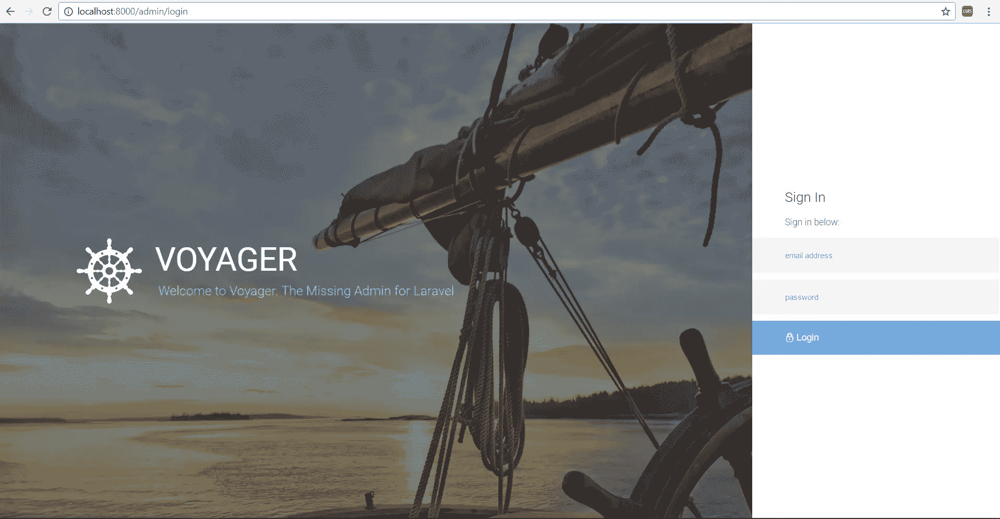
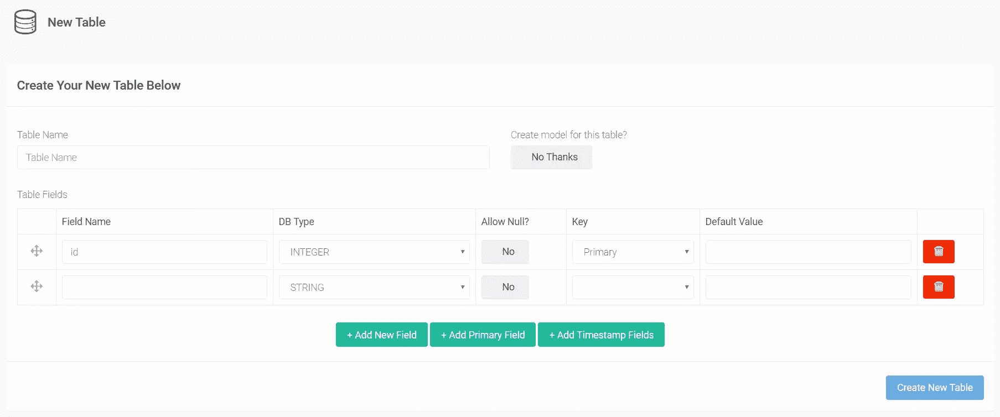
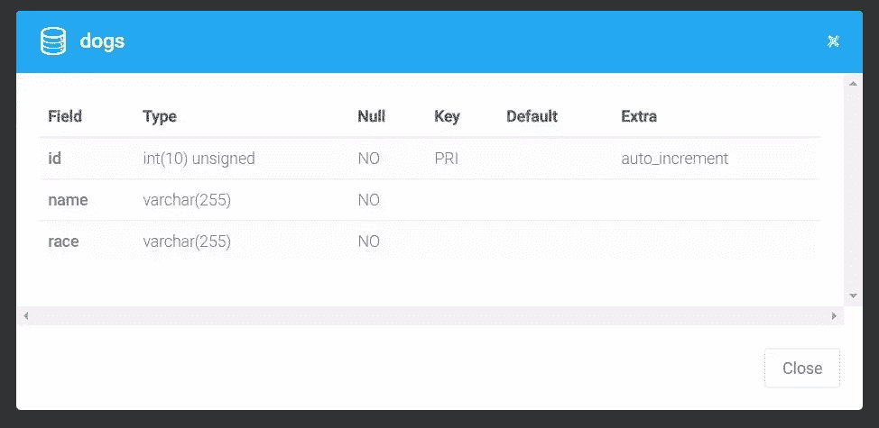
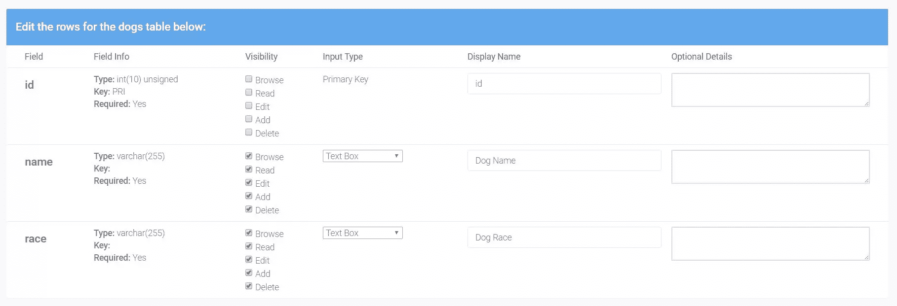
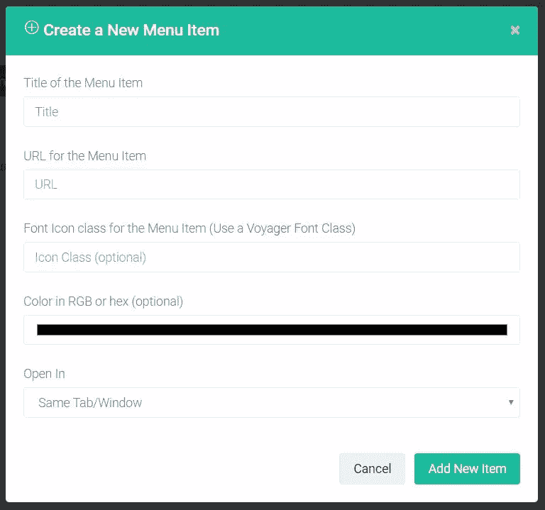
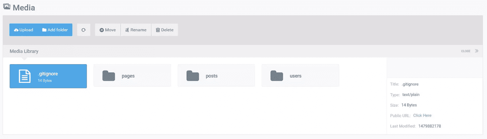

# 航海家——一个管理用户界面能让 Laravel 更加平易近人吗？

> 原文：<https://www.sitepoint.com/voyager-can-an-admin-interface-make-laravel-even-more-approachable/>

*这篇文章由[沃恩·安切塔](https://www.sitepoint.com/author/wancheta)进行了同行评审。感谢 SitePoint 的所有同行评审员使 SitePoint 的内容尽可能做到最好！*

* * *

今天，我们要谈论的是[航海家号](https://the-control-group.github.io/voyager/)！


Voyager 是一个 Laravel 包，它以“框架应用程序”的形式为框架提供了一个完整的管理系统。旅行者号有 4 个主要特点:

*   **媒体管理器**–构建在[干预图像](https://github.com/Intervention/image)之上，它提供了一个全功能的媒体管理器，允许我们查看、编辑和删除存储的图像。通过这种方式，我们可以将所有媒体放在一个地方，使其易于访问和操作。

*   **菜单生成器**–菜单生成器允许我们添加、编辑和删除菜单项。它还让我们能够创建新菜单并管理它们。

*   **数据库管理器**–允许我们直接从管理面板访问和操作我们的数据库。Voyager 为我们提供了一种在数据库中添加、删除和编辑条目的机制，而不是必须使用 Laravel 的`Schema`。它还将(根据规范)在向数据库添加表时创建我们的模型。

*   **Bread/CRUD builder**–Bread 就是数据库的 CRUD。Voyager 提供了一种浏览、读取、编辑、添加和删除数据库中任何表的条目和视图的机制。

让我们仔细看看。

## 安装 Voyager

首先，让我们从一个新的 Laravel 装置开始。当然，我们可以从一个现有的项目开始，但是为了本文的目的，我们将从一个新的项目开始。

虽然这超出了本文的范围，但是开始一个新的 Laravel 项目的推荐方法是使用 [Composer](https://www.sitepoint.com/php-dependency-management-with-composer/) :

```
composer create-project laravel/laravel voyager 
```

这将在`/voyager`文件夹中创建一个名为`voyager`的新 Laravel 项目。为了服务这个新的 Laravel 项目，使用 PHP 的内置服务器:

```
php artisan serve 
```

在[家园改善](https://www.sitepoint.com/quick-tip-get-homestead-vagrant-vm-running/)上，Nginx 为您服务。

随着一个全新的 Laravel 安装的启动和运行，我们现在可以专注于安装 Voyager 管理包。

```
composer require tcg/voyager 
```

正如我们在安装过程中看到的，Voyager 从一些非常著名的 PHP 包中提取组件，如用于数据库管理器的 Doctrine ORM，或用于 PHP 图像处理和操作的 [Guzzle](https://www.sitepoint.com/guzzle-php-http-client/) 和 Intervention Image。这向我们表明，航海家号是建立在可靠和成熟的组件之上的。

接下来，让我们启动我们最喜欢的代码编辑器。我们需要编辑一些文件来让航海家号运行起来。

首先，我们打开`.env`文件并添加我们的数据库凭证，以便 Voyager 可以连接到它。

```
DB_HOST=localhost
DB_DATABASE=database
DB_USERNAME=username
DB_PASSWORD=password 
```

之后，让我们将 Voyager 和图像干预服务提供商添加到我们的提供商阵列中。这个数组可以在`config/app.php`文件中找到，我们需要做的就是向它添加以下元素:

```
TCG\Voyager\VoyagerServiceProvider::class,
Intervention\Image\ImageServiceProvider::class, 
```

要完成安装:

```
php artisan voyager:install 
```

我们现在应该会看到`"Successfully installed Voyager! Enjoy :)"`消息。

只剩下一件事要做:播种数据库。

```
php artisan db:seed 
```

这将使用种子类为我们的数据库植入测试数据。如果我们再次为我们的 Laravel 安装服务，我们现在应该在右上角看到`login`和`register`选项。

在`/admin`中新创建的管理区域应该如下所示:



相当华丽！TCG 团队付出了相当大的努力。要登录并浏览，让我们使用以下凭据:

```
email: admin@admin.com
password: password 
```

从这个管理面板，我们可以访问我们所有的主要功能。媒体管理器，菜单生成器，数据库管理器和 CRUD/BREAD 生成器，都可以从管理面板的主菜单中访问。

我们还可以访问一个仪表板，通过它我们可以添加 Google Analytics，方法是转到`Settings`，并将我们的`Google Analytics Client ID`添加到指定的字段中。

如果我们检查`Tools -> Database`,我们可以看到菜单项是激活了`BREAD`选项的菜单项(并且创建了一个适当的菜单，但是我们将在后面讨论)。我们正在看我们的三个主要特性:数据库管理器、面包生成器和菜单生成器。让我们看看他们的行动。

## 数据库管理器

为了在 Laravel 中创建新的数据库列，我们通常需要使用`migrations`和 Laravel `schema` facade。虽然这两种方法使用起来都相对简单，但如果我们将它们与使用 Voyager 进行比较，我们可以很容易地看出哪种方法更快。

假设我们想要创建一个新表，并以 Laravel 方式添加一些列(使用迁移作为我们的数据库“版本控制”，然后使用 Schema 来构建我们的数据库模式)。

让我们专注于创建一个带有一些列的`Dogs`表来标识我们心爱的宠物。首先，我们从桌子开始。首先，我们的表将包含一个名为`id`的自动递增字段。

```
Schema::create('dogs', function (Blueprint $table) {
    $table->increments('id');
}); 
```

然后，让我们向表中添加`name`和`breed`列。

```
Schema::table('dogs', function ($table) {
    $table->string('name');
    $table->string('breed');
}); 
```

我们的完整迁移文件将如下所示:

```
<?php

use Illuminate\Support\Facades\Schema;
use Illuminate\Database\Schema\Blueprint;
use Illuminate\Database\Migrations\Migration;

class CreateDogsTable extends Migration
{
    /**
     * Run the migrations.
     *
     * @return void
     */
    public function up()
    {
        Schema::create('dogs', function (Blueprint $table) {
            $table->increments('id');
        });

        Schema::table('dogs', function ($table) {
            $table->string('name');
            $table->string('breed');
        });
    }

    /**
     * Reverse the migrations.
     *
     * @return void
     */
    public function down()
    {
        Schema::drop('dogs');
    }
} 
```

虽然迁移很有用，但使用 Voyager 使事情变得更简单、更直观，甚至非程序员也能轻松完成。

让我们看看使用 Voyager 的数据库管理器的同一个例子。

在我们的航海家管理区，让我们点击`Tools -> Database -> Create New Table`按钮



它非常简单明了，如果您曾经使用过 PhpMyAdmin 这样的工具，应该会很熟悉。让我们填写相应的字段，然后单击`Create New Table`按钮。确保通过选择`Add Timestamp Fields`选项来添加时间戳字段，因为这在将来会很重要。之后，让我们检查列表。我们可以看到我们的`dogs`表，有`View`、`Edit`、`Delete`和`Add BREAD to this table`选项。如果我们单击`View`，我们可以看到我们刚刚创建了与上面相同的表，没有使用任何代码，速度提高了一倍。



## 面包制造商

前面我们谈到了面包的特性。BREAD 只不过是浏览、阅读、编辑、添加和删除数据库中任何表的视图和功能。添加这个功能就像在我们的表格列表中的任何表格上点击`Add BREAD to this table`一样简单。让我们对我们的`Dogs`桌做吧。

正如我们通过单击按钮所看到的，我们现在有了这个大的表单生成器。在这里，我们可以找到面包的所有选项，从显示名称到可见性。我们还可以看到，Voyager 允许我们不仅将输入类型设置为文本字段和不同的框类型，还可以设置为图像和文件。这样，我们可以很容易地将图像和文件字段添加到数据库中。



还有一些信息字段，如 Slug、图标(它可以选择使用 Voyager 的图标字体类)、显示名称和型号名称。

填写完表格并制作好面包后，如果我们查看菜单，我们会发现还没有`Dogs`选项。这就是菜单生成器的用武之地。

## 菜单生成器

在`Tools -> Menu Builder`中，我们可以选择创建新菜单、编辑`admin`菜单或`main`菜单。现在，我们想在管理面板中创建一个新的菜单项，这样我们就可以使用为`Dogs`表创建的面包选项。在管理员旁边，让我们点击`Builder`选项。

拖放菜单让我们现在组织我们的管理面板菜单。在页面的顶部，有一个`New menu item`选项。



填写这张表格时要小心。URL 应该遵循以下结构:`/admin/slug`，其中 slug 应该是为表创建 BREAD 时使用的 URL slug。如果它们不相同，我们最终会遇到很难调试的路由问题。选择菜单图标后，我们就可以开始了！我们的`Dogs`菜单创建完毕！

我们现在可以导航到`Dogs`菜单来查看、添加、编辑或删除条目。我们目前还没有，所以创建一些吧。

*注意:我在玩 Voyager 时发现的一件事是，当试图向一个新创建的数据库表插入值时，它会试图插入一个`created_at`和`updated_at`值。即使这些字段不是在数据库中创建的，也会发生这种情况。我不得不返回并将这些字段手动添加到数据库表中。这就是我们必须提前添加这些字段的原因。*

## 媒体经理

如果我们检查菜单，我们可以看到我们有一个`Media`选项。



媒体经理直截了当。它为我们提供了一个集中的位置来访问应用程序中的所有静态文件，可以选择上传文件、创建文件夹来进一步组织我们的媒体、移动文件、重命名和删除它们。正如我们在下面的截图中看到的，我们还获得了一些关于上传文件的信息，包括一个缩略图和一个便于访问的公共 url。

一切都将方便地存储在`storage/app/public`文件夹中。


## 结论

Voyager 是 Laravel 的一个很棒的管理包。它非常容易使用，非常实用。Voyager 也是开源的，每天都在改进。为什么不看看它的回购协议，并帮助编写更好的文档或修复一些错误呢？这个非常实用的 Laravel 包肯定会让许多 Laravel 用户受益，值得我们给予它所有的帮助。

你试过了吗？你有什么抱怨？你有哪些赞？请在评论中告诉我们。

## 分享这篇文章