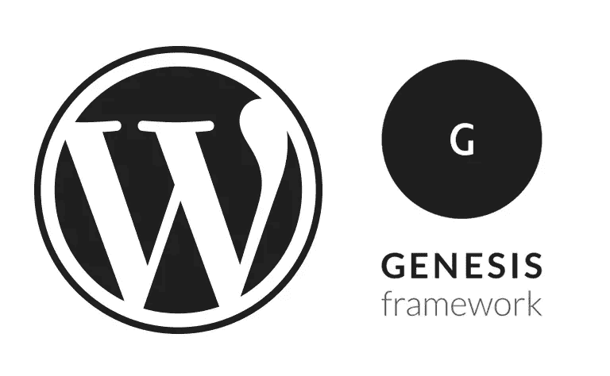
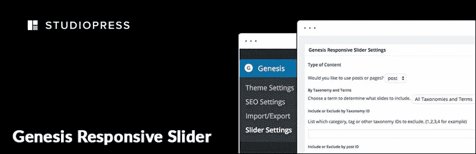
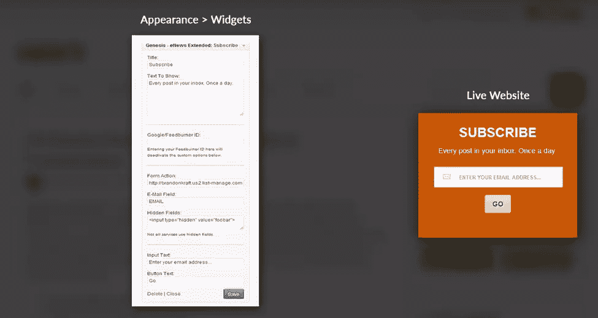
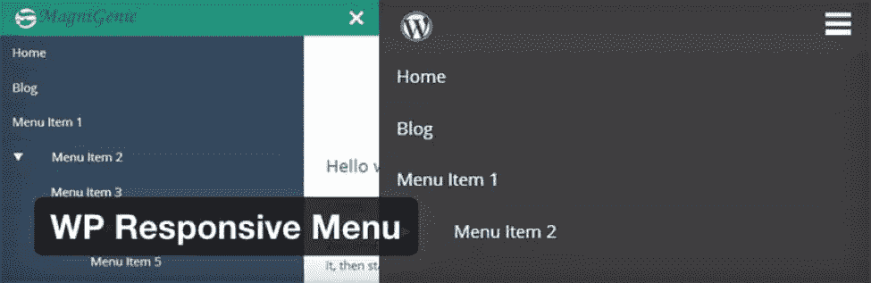
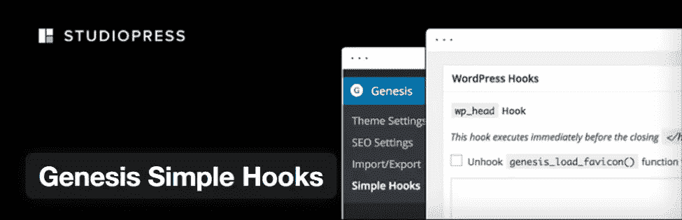
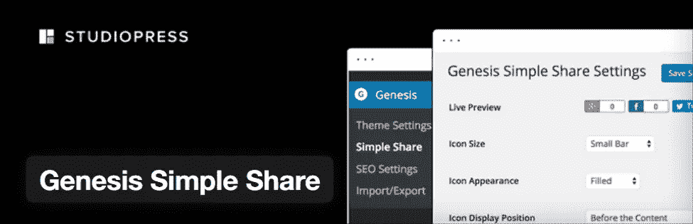
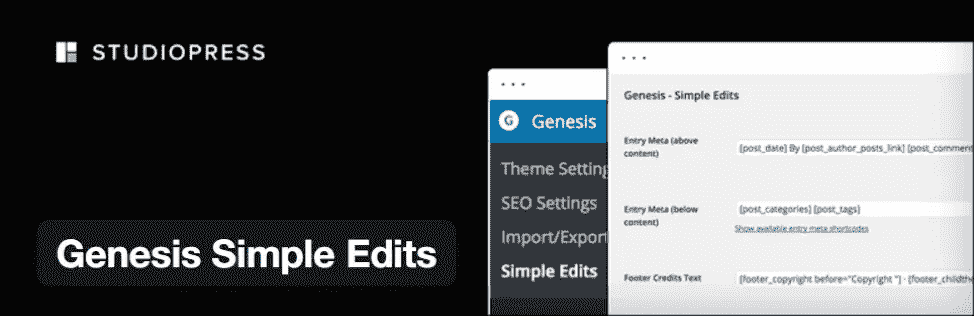
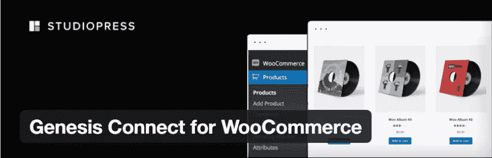
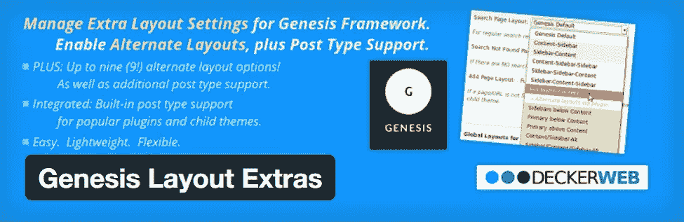
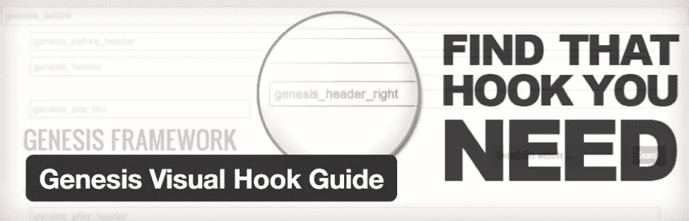

# 增强你的 WordPress 网站的创世纪框架插件

> 原文：<https://www.sitepoint.com/genesis-framework-plugins-to-enhance-your-wordpress-website/>

无论你是初学者还是专家，你都很可能遇到过 StudioPress 的杰作《创世纪框架》。众所周知，这个流行的 WordPress 框架为高质量的 WordPress 网站提供了一个安全的基础，易于设置(和维护)，并且对 SEO 友好。

鉴于它是一个如此受欢迎的框架，有各种各样的插件被构建来扩展 Genesis。在这篇文章中，我将分享一些最流行的 Genesis 插件。

像往常一样，尽量选择你安装的插件来保持你的网站精简，只关注你真正需要的功能。

## 创世纪响应滑块

Genesis 响应式滑块是一款优秀的滑块，解决了没有默认专用滑块的问题。该插件允许你显示特色文章的幻灯片。幻灯片包括帖子的标题、摘录和特色图片。滑块会自动响应并调整到目标屏幕尺寸。

**WordPress 所需版本:** 3.2 或更高版本
**兼容最高版本:** 4.3.6
**主动安装:** 80，000+

### 主要特点:

*   响应滑块和根据屏幕大小自动调整。
*   拖放选项将幻灯片放在小部件区域。
*   为帖子的幻灯片选择所需的尺寸。
*   设定幻灯片显示的外观和功能。
*   使用帖子 id，您可以在滑块上显示自定义帖子。

### 快速教程和安装指南:

#### 手动程序:

1.  打开/wp-content/plugins/目录，上传文件夹 genesis-responsive-slider 到那里。
2.  请确保不要更改文件夹的名称。
3.  进入 WordPress 管理面板的插件菜单，激活插件。

#### 通过 WordPress 安装:

1.  仪表板>插件>添加新项。
2.  搜索创世纪响应滑块插件。
3.  安装并激活它。
4.  从创世纪>滑块设置转到滑块设置。
5.  配置响应滑块并调整其设置。
6.  要添加滑块，请转到小部件区域，从左侧小部件屏幕中找到相应的滑块。找到后，将 Genesis 响应滑块拖放到所需位置。

**更多详情及下载:**(【https://wordpress.org/plugins/genesis-responsive-slider/】T2)

## 创世纪电子报扩展

Genesis eNews Extended 是一个简单的第三方插件，它极大地扩展了 Genesis 框架的功能。虽然它在 2.0 版本中被删除，但它仍然与所有后续版本兼容。该插件创建了一个小部件，它集成了邮件列表服务提供商，如 FeedBlitz、FeedBurner、Aweber、MailChimp 和其他几个服务提供商。挺好用的。您所要做的就是选择服务提供商，输入用户凭证，然后一切就绪。

**WordPress 所需版本:** 3.0 或更高版本
**兼容最高版本:** 4.7
**主动安装:** 90，000+

### 主要特点:

*   易于与流行的邮件列表提供商集成。
*   通过附加配置选项定制订阅框。
*   与以前的“Genesis 电子新闻”版本相比，改进了特性和功能。

### 快速教程和安装指南:

#### 手动程序:

1.  打开/wp-content/plugins/目录，上传那里扩展的文件夹 Genesis eNews。
2.  请确保不要更改文件夹的名称。
3.  进入 WordPress 的插件菜单并激活插件。

#### 通过 WordPress 安装:

1.  仪表板>插件>添加新项。
2.  搜索 Genesis 电子新闻扩展插件。
3.  安装并激活它。
4.  要添加订阅表单，请转到小部件区域，在左侧小部件屏幕中找到 Genesis eNews Extended。找到后，将其拖放到所需位置。

使用 Genesis eNews 扩展插件有点棘手。将表单与邮件列表提供商连接时，您需要使用服务提供商提供的表单代码来添加表单字段 ID、表单操作 URL 等。你可以在这里观看我使用 MailChimp 的视频示例。

一旦你设置好了，我强烈建议你做一个测试来验证它是否正常工作。

**更多详情及下载:**(【https://wordpress.org/plugins/genesis-enews-extended/】T2)

## WordPress 响应菜单

在 Genesis 支持的网站中集成交互式和高度响应的移动设备导航菜单最好通过 WP 响应式菜单来完成。该插件基于 Sidr jQuery 菜单插件，包含许多功能，包括定制菜单颜色和动画，向菜单添加徽标，缩放，滑动手势，隐藏特定菜单项。该插件还有一个专业版，提供了几个附加功能。

**WordPress 所需版本:** 3.5.0 或更高版本
**兼容最高版本:** 4.5.4
**主动安装:** 60，000+

### 主要特点:

*   启用/禁用收缩缩放功能的选项。
*   管理界面非常用户友好，定制菜单轻而易举。
*   在菜单中添加徽标、颜色、动画和其他吸引人的功能，以匹配网站的主题。
*   以你喜欢的方式打开菜单，即从右、左、上。
*   容易与 WordPress 菜单系统集成。
*   丢弃/隐藏手持设备上不需要的功能或元素。
*   添加一个自定义搜索栏，并改变其文本以匹配整个菜单的字体和配色方案。

### 快速教程和安装指南:

#### 手动程序:

1.  打开/wp-content/plugins/目录并上传文件夹。
2.  请确保不要更改文件夹的名称。
3.  进入 WordPress 的插件菜单并激活插件。

#### 通过 WordPress 安装:

1.  仪表板>插件>添加新项。
2.  在搜索栏中搜索 WordPress 响应式菜单。
3.  安装并激活它。
4.  一旦安装完成，你会在 WordPress 仪表盘的左侧导航栏中看到这个插件。

**更多详情及下载:**(【https://wordpress.org/plugins/wp-responsive-menu/】T2)

## 创世纪简单挂钩

Genesis Simple Hooks 是一个尖端的插件，允许开发者访问 WordPress 和 Genesis hooks。当你安装插件时，一个新的设置页面会在网站的仪表盘中创建，就在框架菜单的正下方。您可以通过访问此页面来确定内容和适当的挂钩。您可以在钩子中插入内容，而不必创建任何自定义函数。

**WordPress 所需版本:** 3.9.2 或更高版本
**兼容最高版本:** 4.3.6
**主动安装:** 90，000+

### 主要特点:

*   50+创世纪动作钩。
*   容易和简单的界面，通过改变钩子系统来修改你当前的创世纪主题。
*   获取 WordPress 内置和 Genesis 主题挂钩。

### 快速教程和安装指南:

#### 手动程序

1.  打开/wp-content/plugins/目录，上传 Genesis-simple-hooks 文件夹的内容。
2.  请确保不要更改文件夹的名称。
3.  进入 WordPress 的插件菜单来激活插件。
4.  找到并选择要使用的挂钩。
5.  现在输入该钩子需要执行的代码。
6.  选择 PHP 和 Shortcodes 是否需要在那个钩子上执行。
7.  保存更改并检查更改是否应用于创世纪主题。

#### 通过 WordPress 安装:

1.  仪表板>插件>添加新项。
2.  在搜索栏中搜索创世纪简单挂钩。
3.  安装并激活它。
4.  一旦安装完成，你会在 WordPress 仪表盘的左侧导航栏中看到插件，然后按照上面的步骤 4 继续操作。

**更多详情及下载:**(【https://wordpress.org/plugins/genesis-simple-hooks/】T2)

## 创世纪简单分享

社交分享图标是许多网站的常见功能。如果你有一个 Genesis 驱动的网站，你可以通过安装这个插件很容易地包含社交分享按钮。Genesis Simple Share 是 StudioPress 的一个官方版本，提供了几个配置选项，使您能够定制单个帖子的社交共享图标的外观。

**WordPress 所需版本:** 3.7 或更高版本
**兼容最高版本:** 4.6.1
**主动安装:** 20，000+

### 主要特点:

*   通过简单的拖放操作改变社交分享图标的顺序。
*   性能轻巧快速。
*   选择此插件将被激活的帖子类型。
*   Twitter 的特殊设置，允许用户将其用户名放在 Twitter 图标上。

### 快速教程和安装指南:

#### 手动程序

1.  下载创世纪简单分享插件。
2.  转到你的 WordPress 仪表盘，把它作为一个新插件上传。你也可以通过 FTP 把这个插件上传到 wp-content/plugins 文件夹。
3.  激活插件。

#### 通过 WordPress 安装:

1.  仪表板>插件>添加新项。
2.  在搜索栏搜索创世纪简单分享。
3.  安装并激活它。
4.  一旦安装完成，你会在 WordPress 仪表盘的左侧导航栏中看到这个插件。

**更多详情及下载:**(【https://wordpress.org/plugins/genesis-simple-share/】T2)

## 创世纪简单编辑

每当你在父安装上设置一个子主题时，你会注意到关于文章信息、页脚区域和文章元素的配置都是预先设置好的。问题是，Genesis 没有提供一种方法来根据单个帖子的要求修改这三个区域。

这就是 Genesis Simple Edits 派上用场的地方，因为它允许您非常容易地编辑和修改这些区域。您可以编辑这三个字段，方法是转到管理屏幕，对 HTML、短代码和文本框中的文本进行更改。

**WordPress 所需版本:** 3.2 或更高版本
**兼容最高版本:** 4.3.6
**主动安装:** 20 万+

### 主要特点:

*   免费，重量轻，非常简单易用。
*   使用户能够快速修改页脚、署名和带有自定义细节的帖子元信息。
*   省去编写 PHP 函数、调整挂钩或使用过滤器的麻烦。

### 快速教程和安装指南:

#### 手动程序

1.  打开/wp-content/plugins/目录，上传 Genesis-simple-edits 文件夹的内容。
2.  请确保不要更改文件夹的名称。
3.  进入 WordPress 的插件菜单来激活插件。
4.  去创世纪->简单编辑。
5.  用自定义信息编辑这三个字段。
6.  保存更改。

#### 通过 WordPress 安装:

1.  仪表板>插件>添加新项。
2.  在搜索栏中搜索 Genesis 简单编辑。
3.  安装并激活它。
4.  一旦安装完成，你会在 WordPress 仪表盘的左侧导航栏中看到插件，然后按照上面的步骤 4 继续操作。

**更多详情及下载:**(【https://wordpress.org/plugins/genesis-simple-edits/】T2)

## WooCommerce 的起源连接

你是否正在寻找一个同时使用 WooCommerce 和 Genesis 来创建在线商店的解决方案？你的搜索以这个插件结束。通过 Genesis Connect for WooCommerce，您可以将 WooCommerce 的功能和特性整合到 Genesis 子主题和框架中。您可以轻松地为标签档案、产品及其类别以及主商店页面使用定制设计。

**WordPress 所需版本:** 3.3 或更高版本
**兼容最高版本:** 4.6.1
**主动安装:** 20，000+

### 主要特点:

*   使 Genesis 简单菜单和 Genesis 简单侧边栏与 WooCommerce 兼容。
*   支持用户可以在模板级别进行的定制，确保将来不会丢失任何更改。
*   兼容 Genesis、WordPress、WooCommerce 2.1+版本。
*   该插件免费提供，由 StudioPress 开发者创建。
*   允许您显示产品列表，并与电子商务平台完美配合。

### 快速教程和安装指南:

#### 手动程序

注意，在你安装这个插件之前，必须在框架上激活一个 Genesis 子主题，并且必须在你的系统上安装 WooCommerce。

1.  打开/wp-content/plugins/目录，上传 Genesis-connect-WooCommerce 文件夹的内容。
2.  2.请确保不要更改文件夹的名称。
3.  3.进入 WordPress 的插件菜单来激活插件。
4.  4.添加代码 add _ theme _ support(' genesis-connect-woo commerce ')；创世纪儿童主题的 functions.php 文件。
5.  5.检查新模板在您的商店页面上是否正常工作。

#### 通过 WordPress 安装:

1.  仪表板>插件>添加新项。
2.  在搜索栏中搜索 WooCommerce 的 Genesis Connect。
3.  安装并激活它。
4.  一旦安装完成，你会在 WordPress 仪表盘的左侧导航栏中看到这个插件。

更多详情及下载:([https://wordpress.org/plugins/genesis-connect-woocommerce/](https://wordpress.org/plugins/genesis-connect-woocommerce/))

## 创世纪版面附加

Genesis Framework 在页面布局的多样性方面有些欠缺，这就是为什么安装 Genesis Layout Extra 插件是添加额外布局的最佳选择。这是一个非常轻量级的插件，使您能够轻松地改变和修改默认布局的档案部分，单页，搜索结果页，主页，附件页，作者页，和 404 页。你可以给网站一个全新的外观，从上述页面的广泛选项中选择有创意的布局。

**WordPress 所需版本:** 3.4 plus Genesis 1.8+或更高版本
**兼容最高版本:** 4.6.1
**主动安装:**10000+

### 主要特点:

*   多达 9 种新布局。
*   修改主页、搜索、附件、各种存档和 404 页面的默认布局。
*   由框架中的其他插件或其他第三方作者创建的帖子可用的布局。
*   作为附加功能的 Genesis 兼容 bbPress 2.x 论坛插件的布局设置。

### 快速教程和安装指南:

#### 手动程序

请注意，Genesis 布局额外插件只与 Genesis 框架的父主题(GPL-2.0+)兼容

1.  打开/wp-content/plugins/目录，上传 Genesis-featured-page-extras 文件夹的内容。
2.  请确保不要更改文件夹的名称。
3.  进入 WordPress 的插件菜单来激活插件。
4.  进入左边的创世纪主题设置菜单，选择附加布局，修改默认布局。

#### 通过 WordPress 安装:

1.  仪表板>插件>添加新项。
2.  在搜索栏中搜索创世纪布局附加。
3.  安装并激活它。
4.  进入左边的创世纪主题设置菜单，选择附加布局，修改默认布局。

**更多详情及下载:**(【https://wordpress.org/plugins/genesis-layout-extras/】T2)

## 创世纪视觉挂钩指南

你想要完全按照你想要的方式定制创世纪儿童主题吗？

创世纪视觉挂钩指南允许您在当前子主题中轻松快速地定位创世纪过滤器、标记和动作挂钩。

**WordPress 所需版本:** 3.4 或更高版本
**兼容最高版本:** 4.1.13
**主动安装:**10000+

### 主要特点:

*   适用于创世纪简单挂钩。
*   插件安装后，管理栏中会添加一个下拉菜单，允许用户从三个挂钩选项中进行选择，并找到它们的位置。

### 快速教程和安装指南:

#### 手动程序

1.  打开`/wp-content/plugins/`目录，上传 Genesis-visual-hook-guide 文件夹的内容。
2.  请确保不要更改文件夹的名称。
3.  进入 WordPress 的插件菜单来激活插件。

#### 通过 WordPress 安装:

1.  仪表板>插件>添加新项。
2.  在搜索栏中搜索创世纪简单挂钩。
3.  安装并激活它。
4.  一旦安装完成，你会在创世纪下的 WordPress 仪表盘的左侧导航栏中看到这个插件。

**更多详情及下载:**(【https://wordpress.org/plugins/genesis-visual-hook-guide/】T2)

## 包扎

现在你知道了，这些是 Genesis 网站最好的插件。您可以轻松地使用一个组合(或全部)来定制基于 Genesis 的项目，并极大地增强用户体验。

如果你在你的版本中使用了任何其他的 Genesis 插件，请在下面的评论中与我们分享。

## 分享这篇文章