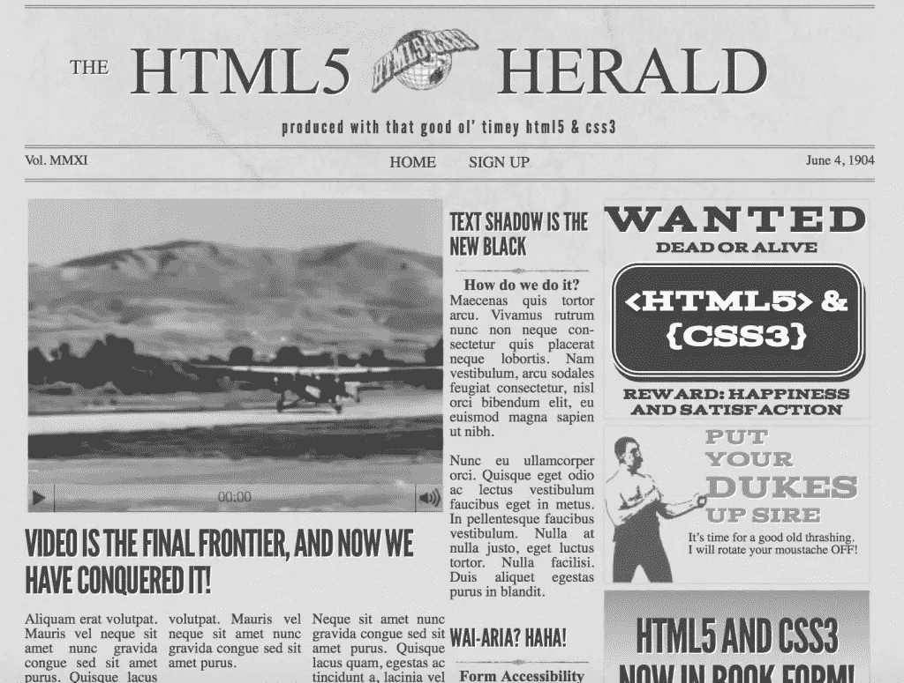

# 介绍 HTML5 Herald 示例站点

> 原文：<https://www.sitepoint.com/145702-2/>


以下是我们的书的摘录，由 Alexis Goldstein、Louis Lazaris 和 Estelle Weyl 撰写的《真实世界的 CSS3，第二版。世界各地的商店都有出售，或者你可以在这里买到电子书。

既然我们已经给了您一些历史入门知识，以及一些令人信服的学习 HTML5 并开始在您的项目中使用它的理由，现在是时候向您介绍我们将在本书中逐步构建的示例站点了。

在我们简要介绍了我们将要构建的内容之后，我们将讨论一些 HTML5 语法基础，以及一些关于最佳实践编码的建议。接下来我们将介绍一些关于跨浏览器兼容性的重要信息，以及 HTML5 中页面结构的基础知识。最后，我们将介绍一些特定的 HTML5 元素，看看它们如何适合我们的布局。

所以让我们开始吧！

## HTML5 先驱报简介

出于本书的目的，我们已经整理了一个示例网站项目，我们将从头开始构建。网站已经建好了——你现在可以在[thehtml5herald.com 查看。](http://thehtml5herald.com/)这是一个叫做 *的老式报纸式网站，HTML5 先驱报* 。该网站的主页包含一些视频、图像、文章和广告形式的媒体。还有另一页是注册表格。

继续查看源代码，如果您喜欢，可以尝试一些功能。当我们继续阅读这本书时，我们将学习制作网站的代码。我们将避免讨论所涉及的 CSS 的每一个细节，因为大部分内容您应该已经很熟悉了——浮动布局、绝对和相对定位、基本字体样式等等。我们将主要关注新的 HTML5 元素、API，以及用于为各种元素添加样式和交互性的所有 CSS3 技术。

下图显示了一点成品的样子。



当我们建立网站时，我们将尽力解释 HTML5 元素、API 和 CSS3 特性，并推荐一些最佳实践。当然，其中一些技术仍然是新的，还在发展中，所以我们将尽量不要过于教条地认为你能做什么，不能做什么。

## 基本 HTML5 模板

随着您学习 HTML5 并将新技术添加到您的工具箱中，您可能想要为自己构建一个样板文件，您可以从该文件开始所有基于 HTML5 的项目。我们鼓励这样做，您也可以考虑使用众多在线资源中的一个，这些资源为您提供了一个基本的 HTML5 起点。[<sup class="footnote">【4】</sup>](#ftn.d5e339)

然而，在这个项目中，我们希望从头开始构建我们的代码，并在进行过程中解释每一部分。当然，即使是我们能想到的最不可思议、最笨拙的样本站点，也不可能包含每一个*新元素或技术，所以我们也将解释许多不适合这个项目的新特性。这样，当你决定如何构建你的 HTML5 和 CSS3 网站和应用程序时，你将熟悉大量的选项，使你能够使用这本书作为一些功能和技术的快速参考。*

 *让我们从简单的 HTML5 页面开始:

```
<!DOCTYPE html>
<html lang="en">
  <head>
    <meta charset="utf-8">

    <title>The HTML5 Herald</title>
    <meta name="description" content="The HTML5 Herald">
    <meta name="author" content="SitePoint">

    <link rel="stylesheet" href="css/styles.css">

    <!--[if lt IE 9]>
      <script src="js/html5shim.js"></script>
    <![endif]-->

  </head>
  <body>

    <script src="js/scripts.js"></script>

  </body>
</html>
```

有了这个基本模板，现在让我们检查标记的一些重要部分，以及它们与 HTML5 之前的 HTML 编写方式有何不同。

## 文档类型

首先，我们有文档类型声明，或 **doctype** 。这只是告诉浏览器或任何其他解析器它正在查看什么类型的文档的一种方式。在 HTML 文件的情况下，它意味着 HTML 的特定版本和风格。doctype 应该总是任何 HTML 文件顶部的第一项。许多年前，doctype 声明是一堆难看的、难以记忆的东西。对于 XHTML 1.0 严格版:

```
<!DOCTYPE html PUBLIC "-//W3C//DTD XHTML 1.0 Strict//EN" "https://www.w3.org/TR/xhtml1/DTD/xhtml1-strict.dtd">
```

对于 HTML4 过渡版:

```
<!DOCTYPE HTML PUBLIC "-//W3C//DTD HTML 4.01 Transitional//EN" "https://www.w3.org/TR/html4/loose.dtd">
```

虽然我们文档顶部的那一长串文本并没有真正伤害我们(除了强迫我们网站的浏览者下载一些额外的字节)，HTML5 已经去掉了那个难以辨认的眼中钉。现在你只需要这个:

```
<!DOCTYPE html>
```

简单明了。doctype 可以大写、小写或大小写混合书写。你会注意到声明中明显缺少了“5”。虽然当前的 web 标记迭代被称为“HTML5”，但它实际上只是以前 HTML 标准的一个演变——未来的规范将只是我们今天的发展。

因为浏览器通常需要支持 Web 上的所有现有内容，所以不需要依赖 doctype 来告诉它们在给定的文档中应该支持哪些特性。换句话说，光靠 doctype 是无法让您的页面符合 HTML5 的。这真的要靠浏览器来做。事实上，您可以在页面上使用这两种旧文档类型中的一种，并在页面上添加新的 HTML5 元素，页面将呈现与使用新文档类型时相同的效果。

## `html`元素

任何 HTML 文档中的下一个元素是`html`元素，它在 HTML5 中没有显著变化。在我们的例子中，我们包含了值为`en`的`lang`属性，它指定文档是英文的。在基于 XHTML 的标记中，需要包含一个`xmlns`属性。在 HTML5 中，这已经不再需要了，甚至对于文档来说,`lang`属性也不需要验证或正确运行。

这是我们目前所知道的，包括结尾的`html`标签:

```
<!DOCTYPE html>
<html lang="en">

</html>
```

## `head`元素

我们页面的下一部分是`head`部分。`head`中的第一行定义了文档的字符编码。这是自 XHTML 和 HTML4 以来简化的另一个元素，是一个可选特性，但是推荐使用。在过去，你可能会这样写:

```
<meta http-equiv="Content-Type" content="text/html; charset=utf-8">
```

HTML5 对此进行了改进，将字符编码标签`meta`减少到最少:

```
<meta charset="utf-8">
```

几乎在所有情况下，`utf-8`都是您将在文档中使用的值。对字符编码的完整解释超出了本书的范围，你可能也不会对此感兴趣。尽管如此，如果你想更深入一点，你可以[在 W3C](https://www.w3.org/html/wg/drafts/html/master/infrastructure.html#encoding-terminology) 或 [WHATWG 上阅读这个主题。](https://html.spec.whatwg.org/multipage/infrastructure.html#encoding-terminology)

### 重要:编码声明

为了确保所有浏览器都能正确读取字符编码，整个字符编码声明必须包含在文档的前 512 个字符中。它还应该出现在任何基于内容的元素之前(比如在我们的示例站点中，它后面的`title`元素)。

关于这个主题，我们可以写得更多，但是我们想让你保持清醒——所以我们就不告诉你那些细节了！现在，我们满足于接受这个简化的声明，并继续我们文档的下一部分:

```
<title>The HTML5 Herald</title>
<meta name="description" content="The HTML5 Herald">
<meta name="author" content="SitePoint">

<link rel="stylesheet" href="css/styles.css">
```

在这些行中，HTML5 与以前的语法几乎没有什么不同。页面标题(`head`中唯一的强制元素)被声明为和以前一样，我们包含的 meta 标签仅仅是可选的例子，用来指示它们应该放在哪里；您可以在这里放置任意多的[有效`meta`元素](https://html.spec.whatwg.org/multipage/semantics.html#the-meta-element)。

这部分标记的关键部分是样式表，它是使用惯用的`link`元素包含的。除了`href`和`rel`之外，`link`没有必需的属性。`type`属性(在旧版本的 HTML 中很常见)不是必需的，也不需要用来指示样式表的内容类型。

## 公平竞争

标记中的下一个元素需要一些背景信息才能引入。HTML5 包含了许多新元素，比如`article`和`section`，我们将在后面介绍。您可能认为这是旧浏览器支持未识别元素的一个主要问题，但您错了。这是因为大多数浏览器实际上并不关心你使用什么标签。如果你有一个带有`recipe`标签(或者甚至是`ziggy`标签)的 HTML 文档，并且你的 CSS 将一些样式附加到该元素上，几乎每个浏览器都会像这完全正常一样运行，毫无怨言地应用你的样式。

当然，这种假设的文档可能无法验证，并且可能存在可访问性问题，但它*几乎可以在*所有浏览器中正确呈现——旧版本的 Internet Explorer (IE)除外。在版本 9 之前，IE 阻止未识别的元素接受样式。这些神秘元素被渲染引擎视为“未知元素”，因此您无法改变它们的外观或行为。这不仅包括我们想象的元素，还包括在开发这些浏览器版本时尚未定义的任何元素。这意味着(你猜对了)新的 HTML5 元素。**

 **好消息是，在撰写本文时，大多数仍在使用 IE 版本的人都在使用 9 版或更高版本，只有极少数人在使用 9 版，所以这对大多数开发者来说不再是大问题；然而，如果你的大部分观众仍然在使用 IE8 或更早的版本，你必须采取行动确保你的设计不会崩溃。

幸运的是，有一个解决方案:一段非常简单的 JavaScript [最初由 John Resig 开发。受 Sjoerd Visscher 的一个想法的启发，它可以使新的 HTML5 元素在旧版本的 IE 中具有样式。](http://ejohn.org/blog/html5-shiv/)

我们将这个所谓的“html 5 shiv”[<sup class="footnote">【5】</sup>](#ftn.d5e416)包含在我们的标记中，作为被条件注释包围的脚本标签。条件注释是在版本 9 和更早版本的 Internet Explorer 中实现的专有功能。它们使您能够使用脚本或样式来定位特定版本的浏览器。[<sup class="footnote">【6】</sup>](#ftn.d5e418)下面的条件注释告诉浏览器，包含的标记应该只对使用版本 9 之前的 Internet Explorer 查看页面的用户显示:

```
<!--[if lt IE 9]> <script src="js/html5shim.js"></script>
<![endif]-->
```

应该注意的是，如果您使用的是处理 HTML5 特性或新 API 的 JavaScript 库，它可能已经有了支持 HTML5 的脚本；在这种情况下，您可以删除对脚本的引用。这方面的一个例子是 [Modernizr，](http://www.modernizr.com/)一个检测现代 HTML 和 CSS 特性的 JavaScript 库。Modernizr 为您提供了在旧版本 IE 中包含支持 HTML5 元素的代码的选项，因此 shiv 是多余的。我们在附录 a 中仔细看看 Modernizr。

### 注意:不是每个人都能从 HTML5 Shiv 中受益

当然，仍然有一群用户无法从 HTML5 shiv 中受益:那些因为这样或那样的原因禁用 JavaScript 并使用 IE8 或更低版本的用户。作为网页设计师，我们经常被告知，我们网站的内容应该对所有用户完全开放，即使是那些没有 JavaScript 的用户。但并没有看起来那么糟糕。许多研究表明，禁用 JavaScript 的用户数量很少，几乎不用担心，尤其是当你考虑到这些用户中很少有人会使用 IE8 或更低版本时。

在 2013 年 10 月发表的一项研究中，英国政府数字服务确定，在英国浏览政府网络服务且禁用或不可用 [JavaScript 的用户占 1.1%。](https://gds.blog.gov.uk/2013/10/21/how-many-people-are-missing-out-on-javascript-enhancement/)在雅虎开发者网络进行的另一项研究中(发表于 2010 年 10 月)，禁用 JavaScript 的用户占全球总流量的 1%左右。

## 结局是尽人皆知的

看看我们开始模板的其余部分，我们有通常的`body`元素以及它的结束标记和结束的`html`标记。我们还在`script`元素中引用了一个 JavaScript 文件。

与前面讨论的`link`标签非常相似，`script`标签不要求您声明一个`type`属性。如果你曾经编写过 XHTML，你可能记得你的`script`标签是这样的:

```
<script src="js/scripts.js" type="text/javascript"></script>
```

由于 JavaScript 实际上是 Web 上使用的唯一真正的脚本语言，并且即使您没有明确声明这个事实，所有浏览器也会假定您正在使用 JavaScript，因此在 HTML5 文档中没有必要使用`type`属性:

```
<script src="js/scripts.js"></script>
```

我们将`script`元素放在页面底部，以符合嵌入 JavaScript 的最佳实践。这与页面加载速度有关；当浏览器遇到脚本时，它会暂停下载并呈现页面的其余部分，同时解析脚本。当大型脚本出现在页面顶部任何内容之前时，这会导致页面加载速度变慢。这就是为什么大多数脚本应该放在页面的最底部，这样只有在页面的其余部分加载后才能解析它们。

然而，在某些情况下，(比如使用 HTML5 shiv)脚本可能需要将*放在文档的头部，因为您希望它在浏览器开始呈现页面之前生效。*

 ** * *

[<sup class="para">【4】</sup>](#d5e339)你可能想了解的几个地方可以在 html5boilerplate.com 的[和 https://github.com/murtaugh/HTML5-Reset](https://html5boilerplate.com/)的[找到。](https://github.com/murtaugh/HTML5-Reset)

[<sup class="para">【5】</sup>](#d5e416)你可能更熟悉它的别称:HTML5 shim。虽然这两个名字有相同的代码片段，但我们将所有实例都称为 HTML5 shiv，它的原始名称。

[<sup class="para">【6】</sup>](#d5e418)更多信息参见[站点参考](https://www.sitepoint.com/web-foundations/internet-explorer-conditional-comments/)。*** 

## ***分享这篇文章****