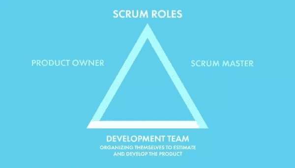

# Scrum 角色:产品所有者和团队成员

> 原文：<https://www.sitepoint.com/scrum-roles-product-owner/>

以下是摘自我们的书《Scrum:新手到忍者，作者是 M. David Green。世界各地的商店都有出售，或者你可以在这里买到电子书。

不像 scrum master，他的责任集中在开发团队，一个 **产品负责人** 对团队和客户有共同的责任。产品负责人是客户的代言人，代表着客户的需求、愿望和期望。

产品负责人通常属于一个部门，比如产品或客户支持部门，花时间与客户直接合作，了解他们的需求，并使用我们在 scrum 术语中称为故事的一致格式，将这些需求转化为团队可以估计和处理的清晰描述。

产品负责人从客户的角度关注全局，关注产品的整体状态和发布周期的时间表，以及不断变化的技术前景，同时决定团队在下一个 sprint 中最优先考虑的功能。

产品负责人直接与设计师合作，以确保已经考虑了用户体验流程，并且团队已经准备好了设计资产。他们还与 QA 工程师一起工作，来验证在一个故事的测试套件中考虑了必要的验收标准。产品负责人还与 scrum master 合作，帮助清除团队之外可能阻碍进展的障碍。

与此同时，产品负责人与团队密切合作，根据团队和技术的实际限制，决定所需的功能在技术上是否可以实现，并根据他们的历史开发速度和他们对产品的反馈来计划故事的顺序。接近团队是至关重要的，因为产品负责人需要有空，这样开发人员可以询问故事的细节，并确认他们的工作进度。产品负责人通常也会参加所有的 scrum 仪式。

### 警告:一个人不应该既是 Scrum 大师又是产品所有者

一个人不应该试图同时扮演 scrum 大师和产品负责人的角色。产品负责人首先对客户或顾客负有责任，通常不属于工程部门。scrum master 的目标以可持续的生产力为中心，这些目标可能与部门外任何人的组织目标不一致。

### 责任

产品负责人最重要的职责之一是阐明客户的需求，开发积压的产品功能，编写清晰的故事，传达对产品的全部期望，同时满足团队的标准。一个写得好的故事需要概括一个独特功能的全部意图，包括任何验收标准，以及客户需要这个特殊功能的理由。通常产品负责人和 scrum master 会合作确保每个故事都为团队准备好了。

一旦足够多的故事被写出来，让团队为即将到来的 sprint 而忙碌起来，产品负责人就会跟踪并组织它们，以确保产品的开发顺序被有效地规划出来，并符合客户的期望。与此同时，产品负责人正在努力工作，如果团队在当前的 sprint 中耗尽了工作，可能需要这些故事，同时概述和起草反映客户在不久的将来对 sprint 的预期需求的项目。

产品负责人不需要比团队正在做的事情提前一两步做详细的计划。事实上，在 sprint 之前写的故事可能会被频繁地丢弃或重写，以至于详细地拼写它们通常是浪费时间。但是一个好的产品负责人会对产品如何随着单个功能的增加而发展保持远见，记住在当前冲刺阶段为将来可能需要的功能做好准备的重要性。

产品负责人需要定期与客户沟通，以确保他们正在编写的故事和他们正在整理的待办事项符合当前的期望。虽然 scrum 鼓励透明，但并不是所有的团队都邀请客户直接参与仪式和工件。产品负责人向客户解释产品的状态——演示并获得每个交付功能的批准——并收集客户的反馈，让团队知道他们是否在正确的道路上。

此外，产品负责人需要能够帮助团队解决任何冲突，或者澄清团队正在处理的故事的任何细节。作为客户的内部声音，产品负责人需要体现对产品的期望，并能够快速做出决策，以便团队能够继续工作。

### 生活中的一天

产品负责人将他们的时间分配给几个责任和成员:

*   定期与客户会面，分享有关团队进展的信息，并收集有关客户下一步需求的反馈

*   直接与设计师合作，为团队规划和准备资产

*   为开发中的故事获得团队的技术批准

*   验证 QA 测试套件的完整性和相关性

*   与 scrum master 协调，确保每个人都有完成工作所需的信息

*   当被要求澄清问题并做出决策时，与团队成员会面

*   撰写故事并整理产品待办事项，使其反映产品的当前愿景。

大多数产品负责人喜欢参加团队的每日起立仪式。作为客人，产品负责人通常不允许提问或给出反馈，直到团队的每个成员都做了介绍，除非被直接问到。在会议结束后，产品负责人通常会与团队内部或外部的相关方一起跟进会议期间提出的问题。

当团队在处理当前 sprint 的故事时，产品负责人一直在关注他们的进展。如果一个关键的功能看起来有不能很快完成的危险，在当前的 sprint 中调整故事的顺序是产品负责人的特权。如果团队在当前的 sprint 中用完了所有的故事，产品负责人也可以优先处理那些已经准备好的故事。

产品负责人需要花时间准备回答关于 sprint 期间正在进行的故事的问题。当无法联系到产品负责人寻求快速回答时，开发人员可能会被永久屏蔽。出于这个原因，许多产品负责人更喜欢和团队一起工作，这样他们可以随时待命。

客户喜欢与敏捷开发团队一起工作的原因之一是频繁和准确的产品状态信息。产品负责人经常与客户进行日常沟通，报告进展情况，并深入了解客户心中的任何问题。

当他们不协助团队或客户时，产品负责人正在为下一个 sprint 编写和提炼故事，整理积压的故事以满足客户对产品的愿景，并与设计师合作以确保团队需要为这些故事工作的一切都为他们准备好了。

## 团队成员

大多数 scrum 团队由四至八名工程师组成。他们的专业化应该被计划来支持团队将要负责的工作类型，这样他们就可以很好地估计它，并产生符合团队对完成的定义的结果。

一个团队成员应该积极参与所有的 scrum 仪式，并以透明的方式运作，让每个人至少能从外围知道他们的队友在做什么。

### 交叉训练

专业化对工程师的职业发展很重要，但是在 scrum 团队中，并不认为任何一个工程师会对所有故事的任何特定方面都有专属的责任。scrum 的部分力量是它提供的透明性，允许来自所有背景的工程师了解在开发团队已经接受的工作的任何方面所涉及的内容。

Scrum 鼓励工程师一起工作。一种叫做 **结对编程** 的实践，改编自被称为极限编程的敏捷技术，通常适用于在 web 和移动项目中完成的工作类型。结对编程提倡让具有不同经验水平的人合作编写相同的代码，这样每个人都可以从对方的角度受益。

这种方法的优点是，关于产品正在做什么，以及如何开发它的每一部分的知识，在整个团队中是共享的。不鼓励只存在于单个工程师头脑中的信息孤岛，这有利于与其他人的交流。不是每个人都被期望成为产品所有领域的专家，但是每个人都应该准备好在他们通常舒适区之外的领域与专家一起工作。

结果是，随着人们跟上速度，工作开始时可能会显得慢一些。但是很快一个更深层次的共享环境将会发展起来，这将会加速评估和开发。如果有人中了彩票并决定退休，团队也会变得更有弹性。不会留下一个知识的大洞。可能会有很多人需要填补，但至少会有人对所涉及的内容有所了解。

### 注:结对编程

结对编程要求很高。一些期望是两个人共享一个监视器，并交换输入代码(驾驶)和跟踪下一步需要发生的事情(导航)的责任。两个人在工作时应该不断地互相交谈，任何一个人都不应该让电子邮件之类的干扰干扰这个过程。大多数人发现他们在这种模式下每天工作不超过 6 个小时，但是生产率的提高和对团队稳定性的好处是值得权衡的。

### 责任

就 scrum 过程而言，一个团队成员对正在开发的产品的质量负责，并对整个团队的 scrum 过程的保存负责。这是每个团队成员都有权通过他们履行职责的方式来影响的两个方面。

产品的质量由团队接受或拒绝故事的能力来支持。如果出现的故事不完全清楚，或者从项目的历史来看是不可能或不切实际的，团队应该把他们工作的质量放在第一位，并坚持让产品负责人重写或收回这些故事。

估计完成一个故事所需的工作量也是团队职责的一部分。当一个团队一起工作并从不同的故事中获得经验时，他们应该开始在相似性质的故事中开发一个共享的和主观的相对努力的尺度。工作通常以任意点来衡量，由团队分配，以帮助确定他们在一个时间框架内可以做多少工作。这有助于产品所有者计划新功能的完成速度。

考虑到项目的实际限制，预计该团队将抵制任何为了速度而牺牲质量的企图。此外，团队应该跟踪代码库的整体质量，并提出重构现有代码以增强可维护性或支持新兴技术标准的故事。保持代码的整洁、自文档化和内部一致性有助于团队中的每个人更有效地合作。

团队的每个成员也有责任为其他成员维护 scrum 过程。如果有人打断了站立，或者试图在冲刺阶段对故事进行修改，每个团队成员都应该觉得有权打断这种行为。团队中的任何人都应该有权指出 scrum 何时被忽略。

对于团队成员来说，认真对待对其他团队成员的责任是至关重要的。scrum 的力量在于它在一群人之间创造的动力。未能捍卫 scrum 过程就是让其他团队成员失望。

### 注意:所有团队成员都是平等的

尽管团队成员可能向 scrum 环境内外的一个或多个经理报告，但在 scrum 团队中，所有团队成员都是平等的。团队成员不应该向产品负责人或 scrum master 报告，因为这会在敏捷角色和每个员工在组织层级中的独立位置之间产生矛盾。如果 scrum 团队中的员工之间存在资历或报告关系，那么在遵循 scrum 流程时，应该忽略它们。任何注意到组织等级被用来影响 scrum 过程的人都应该将此事告知 scrum 主管，无论是在当时、在回顾中，还是秘密地。

### 生命中的一天

大多数时候，一个团队成员会在一天中的大部分时间里，在尽可能长且稳定的时间段内从事代码工作。团队成员的核心日常职责相当简单:

*   开发、检查、测试和记录代码

*   从产品负责人那里获得澄清、故事细节和反馈

*   参与 scrum 的仪式

*   与 scrum master 一起为团队成员清除障碍。

当描绘一个 scrum 团队时，最普遍的印象可能是这个团队参加一个日常的站立仪式，我们将在 scrum 仪式一章中详细讨论。每个团队成员都应该准备好迎接这短暂的 15 分钟。一个团队通常会尝试安排这样的工作，这样就不会干扰团队的工作流程。

### 注意:什么时候做单口相声

对于一些团队来说，安排在午饭前或午饭后，或者一天工作的开始，是最有意义的。不在同一地点的团队可能需要选择一个对跨多个时区的人都适用的时间。团队总是可以根据在 sprint 回顾中收集的反馈来调整时间。

在安排其他 scrum 仪式的日子里，所有团队成员都应该出席并积极参与。scrum 的惯例是为了有效利用有限的时间，同时产生可预测的有价值的结果。一个好的 scrum 大师会为每个仪式安排一个时间盒，这样时间承诺和最终结果是可以预测的。

除了参与 scrum 的仪式之外，所有团队成员都应该把时间花在从准备好到完成的故事上。如果组织通过创建过多的会议来干扰这项工作，团队应该将这个问题提交给 scrum 主管，以便解决。保持开发人员专注于编码所需的不间断时间是 scrum 的首要任务之一。

## 分享这篇文章