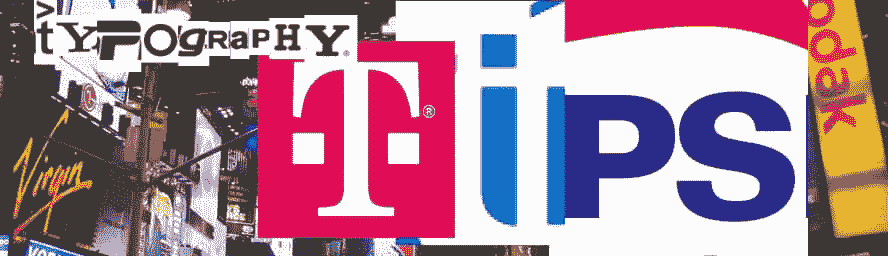
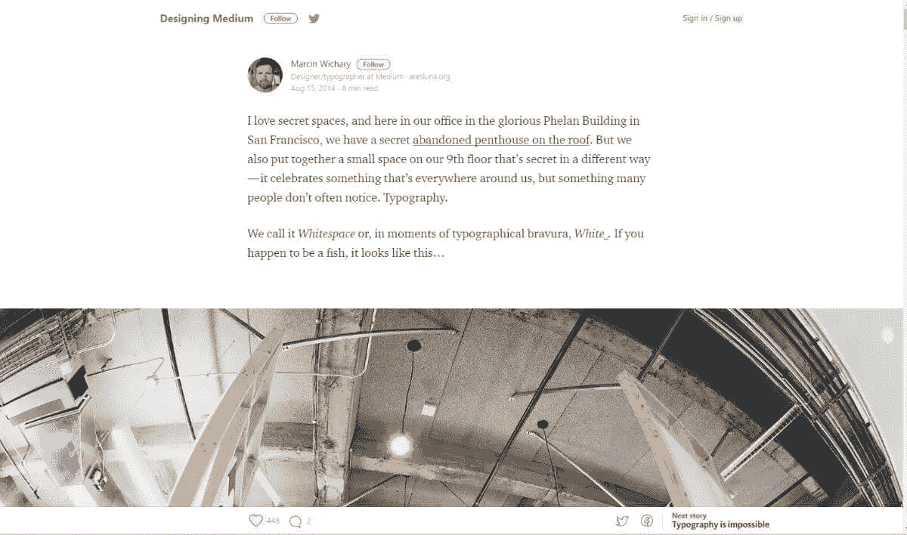
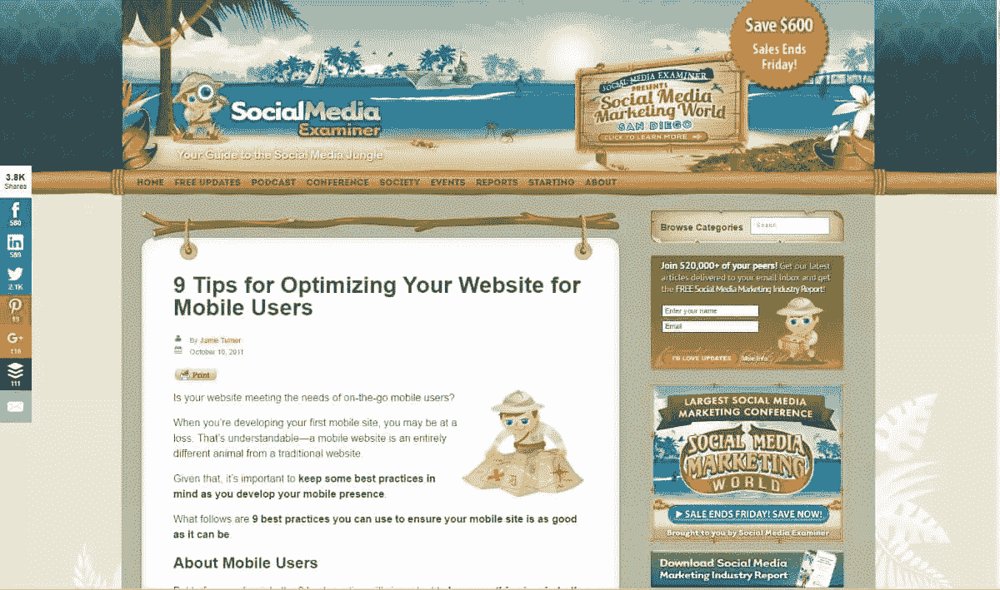
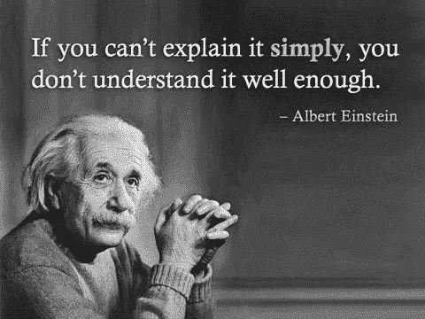
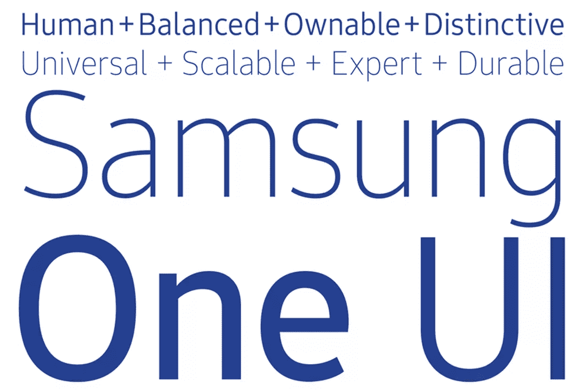
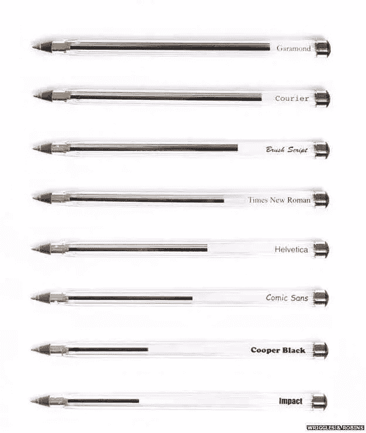
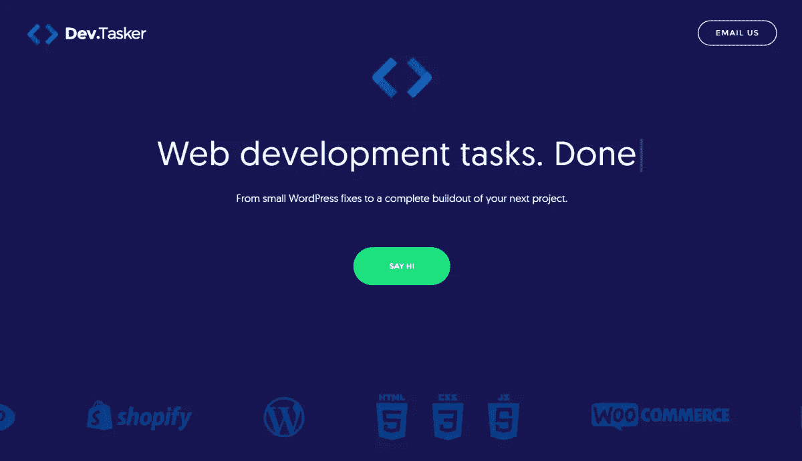
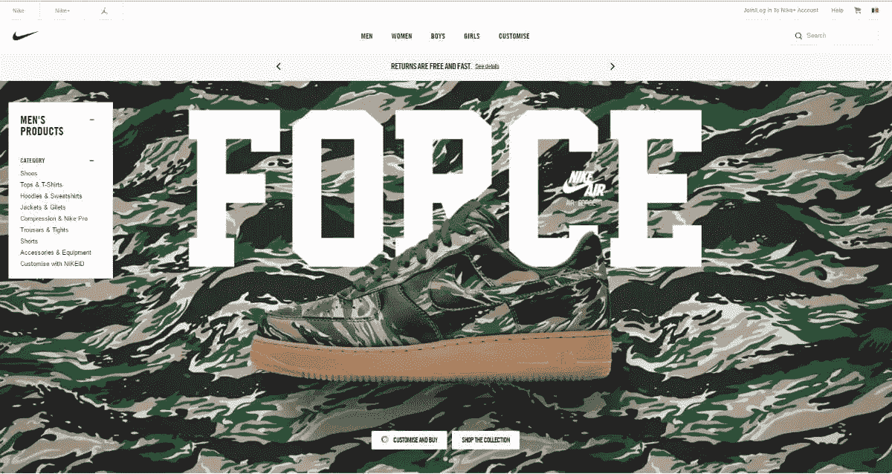

# 来自世界最大品牌的 4 个黑仔排版技巧

> 原文：<https://www.sitepoint.com/4-killer-typography-tips-from-the-worlds-biggest-brands/>

当文字和字母被印刷时，它们必须穿上字体的衣服。就像我们的时尚产业一样，字体设计有它自己的趋势，有著名的设计师，也有时尚失礼的地方。。

就像穿鳄鱼和莱卡去参加商务会议可能是个坏主意一样，用校服或漫画字体写简历也不太可能给人留下你想要的印象。

虽然我们可能没有意识到，但我们阅读的一切都是通过别人的视觉风格决定过滤的。更重要的是，这总是会影响我们理解信息的方式。有无数的研究分析了字体的力量。从人们浏览文件的方式到某些字体的力量，再到 T2 操纵我们思考的方式，结果表明了字体选择对认知的影响。

作为一名营销人员和排版爱好者，我一直对字体和我们决策过程之间的复杂联系很感兴趣。

现在，我知道我不是唯一一个谈论排版和品牌的人，但我认为有四个有趣的提示你可能不知道。

## 1.更少意味着更多

像 [Medium](https://medium.com/) 、 [Teamweek/a >和](http://www.teamweek.com) [DevTasker](http://www.devtasker.com) (我工作过的一个网站)这样的网站从排版的角度来看就像瑜伽馆。

这些信息盲目地遵循了 KISS 的设计原则(保持简单愚蠢),这使得用户很容易理解发生了什么。

然而，避免以枯燥和重复的方式简单。随着扁平化设计、极简主义和 Helvetica 的兴起，设计师倾向于将他们的能力限制在安全的设计技术上，这通常会导致停滞不前。

就像印更多的钱不是解决贫困的办法一样，在我们的情况下，增加更多的信息或文字也不是解决信息不清晰的办法。如今，一个品牌能为任何人提供的最有价值的资产是清晰和简单。

你看，尽管你不断追求创造一流的内容，如果你的内容不美观，抓住用户的注意力是一件麻烦的事。 [SocialMediaExaminer](http://www.socialmediaexaminer.com/) 是我最喜欢的内容蚕食的例子之一。他们有数百万人阅读他们的创新文章，他们的内容质量非常好。但是，信息有点杂乱。

用不同字体写的内容从任何地方冒出来都会导致“内容膨胀”。

这里可行的建议是:尽量用更少的内容说更多的话，如果你发现这很难做到或不可能，那么…

## 2.创造独特的品牌体验

字体设计在品牌塑造中很重要，因为它传达了品牌的信息。很多时候，你甚至可以在阅读文字之前，通过看字体就能理解一个品牌的身份。

大品牌正在寻找一种可以全球阅读、随处表达的字体。一个品牌字体要有个性。八岁的孩子应该和六十岁的老人一样清楚。无论大小和格式如何，它都必须用于印刷和数字。

创造一种创新的字体，开发一种独特的品牌体验，真的很难做到。不仅仅是 26 个字母和英文字母表，而是要将其扩展成多种系统和语言。

老实说，如果你是一家初创公司或本土品牌，创造自己的字体不是你应该追求的东西。创造一种字体的逻辑简直是可怕的，三星可以[联系](https://www.youtube.com/watch?v=3XlB-n2qLzk)。

当他们设计 Samsung One 字体时，他们希望跨多个平台和格式统一视觉品牌。这种字体的目的是让消费者记住三星的视觉个性。

三星并不是唯一一家自己设计字体的公司。谷歌因其著名的 Roboto 而闻名，苹果公司也使用了他们自己改编的 ITC Garamond 和苹果 Garamond，这两种字体已被用作他们的公司字体超过 18 年。

即使是唐纳德·特朗普也有自己的字体，它被称为“[小手](https://www.buzzfeed.com/benking/tiny-hand-will-be-your-new-comic-sans)”。这种字体是 BuzzFeed 的人创作的讽刺作品，它模仿了唐纳德的笔迹。

此外，如果你想了解更多关于品牌和排版的知识，我建议跟随 [Designhill](http://www.designhill.com) 。他们提供了如何创造一个令人惊叹的品牌体验的惊人技巧，如果你正在寻找一个好的平面设计市场，他们是你的得力助手。

## 3.实用清晰

信不信由你，选择一种墨水友好的字体，比如 Garamond，而不是 Helvetica 或 Times New Roman，实际上可以帮你节省很多钱。如果你在某种机构工作，或者你每天都要打印大量的文件，你应该考虑墨水比香水更贵的事实。

虽然你可能会认为数字文档时代已经使打印不再是一个问题，但最近美国环保署的一项调查确定美国工人平均每年仍然打印 10，000 页。

可悲的是，考虑到一升打印机墨水大约 5000 美元的事实，购买一台新打印机往往比重新填充墨盒更便宜——这比等量的香奈儿 5 号香水还要贵。

字体的选择是要花钱的。

但是易读不仅仅是让字体变大或者字母间距——尽管这可能会起到一定的作用。

清晰易读(我在这里引用杰里米·劳埃德的话)意味着:

> 以一种能让读者的眼睛容易地接触到内容的方式，并以一种有意义的方式来安排单词和词组。这真的是一种艺术形式，随着时间的推移，成功的组合
> 被发现。

例如，一些实用的建议是保持字体为 10 磅或更大，以获得最佳的阅读速度。就阅读速度而言，Arial、Verdana、Georgia 和 Times New Roman 都做得一样好。

从市场营销的角度来看，选择一种阅读速度更快、易读而不浮夸的字体应该对你最有利。pogo 粘连效应和高跳出率是营销人员的真正烦恼。在你的潜在客户看到你的登陆页面、广告或视频的最初几秒钟内抓住他们的注意力是至关重要的。

如果这个例子还不够简单，耐克应该会给你很大的启发。他们是字体和信息配对的真正鉴赏家，他们利用像 Futura(这也是他们的标志，或至少是它的一种变体)这样的重字体来确保他们的信息和观众之间不会出现可读性差或注意力持续时间短的情况。

## 结论

找到正确的字体并不是一门困难的科学。没有神奇的配方，也没有秘方。相反，它是关于寻找和测试什么最适合你，关于寻找与你的品牌、文案和信息精确相似的字体。

## 分享这篇文章