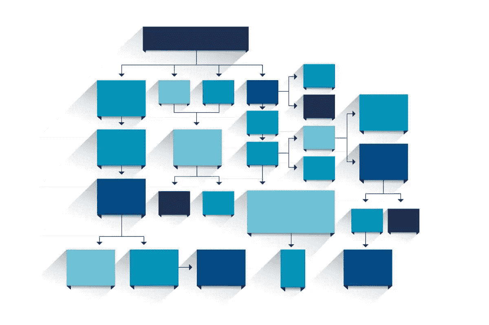

# PHP 如何执行——从源代码到渲染

> 原文：<https://www.sitepoint.com/how-php-executes-from-source-code-to-render/>

*这篇文章由[尤尼斯·拉菲](https://www.sitepoint.com/author/yrafie)同行评审。感谢 SitePoint 的所有同行评审员使 SitePoint 的内容尽可能做到最好！*

* * *

受最近一篇关于【Ruby 代码如何执行的文章的启发，这篇文章涵盖了 PHP 代码的执行过程。



## 介绍

当我们执行一段 PHP 代码时，会有很多事情发生。一般来说，PHP 解释器在执行代码时会经历四个阶段:

1.  乐星
2.  从语法上分析
3.  汇编
4.  解释

本文将浏览这些阶段，并展示我们如何查看每个阶段的输出，以真正了解发生了什么。注意，虽然使用的一些扩展应该已经是 PHP 安装的一部分了(比如 tokenizer 和 OPcache)，但其他的还需要手动安装和启用(比如 php-ast 和 VLD)。

## 第一阶段–乐行

词法分析(或标记化)是将字符串(这里是 PHP 源代码)转换成一系列标记的过程。令牌只是它匹配的值的命名标识符。PHP 使用 [re2c](http://re2c.org) 从 [zend_language_scanner.l](https://github.com/php/php-src/blob/master/Zend/zend_language_scanner.l) 定义文件中生成它的词法分析器。

我们可以通过[标记器](http://php.net/manual/en/book.tokenizer.php)扩展看到词法分析阶段的输出:

```
$code = <<<'code'
<?php
$a = 1;
code;

$tokens = token_get_all($code);

foreach ($tokens as $token) {
    if (is_array($token)) {
        echo "Line {$token[2]}: ", token_name($token[0]), " ('{$token[1]}')", PHP_EOL;
    } else {
        var_dump($token);
    }
} 
```

产出:

```
Line 1: T_OPEN_TAG ('<?php
')
Line 2: T_VARIABLE ('$a')
Line 2: T_WHITESPACE (' ')
string(1) "="
Line 2: T_WHITESPACE (' ')
Line 2: T_LNUMBER ('1')
string(1) ";" 
```

上面的输出有几个值得注意的地方。第一点是，并不是所有的源代码都被命名为令牌。相反，[一些符号本身被认为是记号](https://github.com/php/php-src/blob/master/Zend/zend_language_scanner.l#L1118)(如`=`、`;`、`:`、`?`等)。第二点是 lexer 实际上不仅仅是简单地输出一个令牌流。在大多数情况下，它还存储词位(与标记匹配的值)和匹配标记的行号(用于堆栈跟踪等)。

## 第 2 阶段–解析

解析器也生成了，这次是用 [Bison](https://www.gnu.org/software/bison/) 通过 [BNF 语法文件](https://github.com/php/php-src/blob/master/Zend/zend_language_parser.y)生成的。PHP 使用 LALR(1)(向前看，从左到右)上下文无关的语法。前瞻部分仅仅意味着解析器能够前瞻`n`标记(本例中为 1)来解决解析时可能遇到的歧义。从左到右部分意味着它从左到右解析令牌流。

生成的解析器阶段将来自词法分析器的令牌流作为输入，有两个任务。它首先通过尝试将它们与它的 BNF 语法文件中定义的任何一个语法规则进行匹配来验证令牌顺序的有效性。这确保了有效的语言构造由令牌流中的令牌形成。解析器的第二项工作是生成*抽象语法树*(AST)——一个将在下一阶段(编译)使用的源代码的树形视图。

我们可以查看由解析器使用 [php-ast](https://github.com/nikic/php-ast) 扩展生成的*形式的*AST。内部 AST 没有直接公开，因为它不是特别“干净”(就一致性和一般可用性而言),所以 php-ast 扩展对它进行了一些转换，使它更好使用。

让我们看看 AST 中的一段基本代码:

```
$code = <<<'code'
<?php
$a = 1;
code;

print_r(ast\parse_code($code, 30)); 
```

输出:

```
ast\Node Object (
    [kind] => 132
    [flags] => 0
    [lineno] => 1
    [children] => Array (
        [0] => ast\Node Object (
            [kind] => 517
            [flags] => 0
            [lineno] => 2
            [children] => Array (
                [var] => ast\Node Object (
                    [kind] => 256
                    [flags] => 0
                    [lineno] => 2
                    [children] => Array (
                        [name] => a
                    )
                )
                [expr] => 1
            )
        )
    )
) 
```

树节点(通常是类型`ast\Node`)有几个属性:

*   `kind`–描述节点类型的整数值；每个都有相应的常数(例如，`AST_STMT_LIST` = > 132，`AST_ASSIGN` = > 517，`AST_VAR` = > 256)
*   `flags`–指定过载行为的整数(例如，`ast\AST_BINARY_OP`节点将有标志来区分正在发生的二元运算)
*   `lineno`–从之前的令牌信息中看到的行号
*   `children`–子节点，通常是进一步分解的节点部分(例如，功能节点将有子节点:参数、返回类型、主体等)

对于静态代码分析器(例如 [Phan](https://github.com/etsy/phan) )这样的工具来说，这个阶段的 AST 输出很容易处理。

## 第 3 阶段–编译

编译阶段使用 AST，通过递归遍历树来发出操作码。这个阶段还执行一些优化。其中包括[解析一些带文字参数的函数调用](https://github.com/php/php-src/blob/ce0669c892b5007f5f0e62f0457e779874f29861/Zend/zend_compile.c#L3644)(比如`strlen("abc")`到`int(3)`)和折叠常数数学表达式(比如`60 * 60 * 24`到`int(86400)`)。

我们可以用多种方式在这个阶段检查操作码输出，包括用 [OPcache](http://php.net/manual/en/book.opcache.php) 、 [VLD](https://derickrethans.nl/projects.html#vld) 和 [PHPDBG](http://phpdbg.com) 。为此，我将使用 VLD，因为我觉得输出看起来更友好。

让我们看看下面的**file.php**脚本的输出是什么:

```
if (PHP_VERSION === '7.1.0-dev') {
    echo 'Yay', PHP_EOL;
} 
```

执行以下命令:

```
php -dopcache.enable_cli=1 -dopcache.optimization_level=0 -dvld.active=1 -dvld.execute=0 file.php 
```

我们的输出是:

```
line     #* E I O op                           fetch          ext  return  operands
-------------------------------------------------------------------------------------
   3     0  E > > JMPZ                                                     <true>, ->3
   4     1    >   ECHO                                                     'Yay'
         2        ECHO                                                     '%0A'
   7     3    > > RETURN                                                   1 
```

操作码有点类似于原始源代码，足以遵循基本操作。(我不打算在本文中深入研究操作码的细节，因为这本身就需要几篇完整的文章。)在上面的脚本中，没有在操作码级别进行优化——但是正如我们所看到的，编译阶段通过将常量条件(`PHP_VERSION === '7.1.0-dev'`)解析为`true`进行了一些优化。

OPcache 不仅仅是缓存操作码(从而绕过词法分析、解析和编译阶段)。它还包含许多不同级别的优化。让我们将优化级别提高到四个阶段，看看会有什么结果:

命令:

```
php -dopcache.enable_cli=1 -dopcache.optimization_level=1111 -dvld.active=-1 -dvld.execute=0 file.php 
```

输出:

```
line     #* E I O op                           fetch          ext  return  operands
-------------------------------------------------------------------------------------
   4     0  E >   ECHO                                                     'Yay%0A'
   7     1      > RETURN                                                   1 
```

我们可以看到常量条件已经被移除，两个`ECHO`指令被压缩成一个指令。这些只是 OPcache 在执行脚本操作码传递时应用的众多优化中的一部分。不过，我不会在本文中讨论各种优化级别，因为这本身也是一篇文章。

## 第 4 阶段–解释

最后一个阶段是解释操作码。这是 Zend Engine (ZE)虚拟机上运行操作码的地方。这个阶段实际上没什么可说的(至少从高层次的角度来看)。输出几乎是您的 PHP 脚本通过诸如`echo`、`print`、`var_dump`等命令输出的任何内容。

因此，在这个阶段不要深究任何复杂的东西，这里有一个有趣的事实:PHP 在生成自己的 VM 时需要自己作为一个依赖项。这是因为 VM 是由 PHP 脚本生成的，因为它更容易编写和维护。

## 结论

我们简要地看了一下 PHP 解释器在运行 PHP 代码时所经历的四个阶段。这涉及到使用各种扩展(包括 tokenizer、php-ast、OPcache 和 VLD)来操作和查看每个阶段的输出。

我希望这篇文章有助于您对 PHP 解释器有一个更全面的了解，并展示了 OPcache 扩展的重要性(对于它的缓存和优化能力)。

## 分享这篇文章