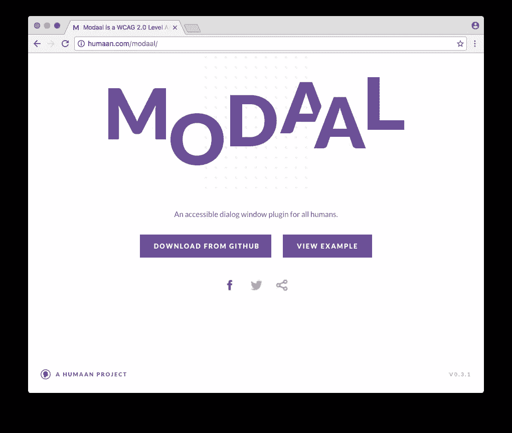

# 前端工具:2016 年我最喜欢的发现

> 原文：<https://www.sitepoint.com/front-end-tools-my-favorite-finds-of-2016/>

又一年过去了，正如我们所预料的那样，网络平台继续爆发出创新、[恼怒、](https://hackernoon.com/how-it-feels-to-learn-javascript-in-2016-d3a717dd577f#.jvd5wo241)[疲劳、](https://www.smashingmagazine.com/2016/11/not-an-imposter-fighting-front-end-fatigue/)以及[大量涌入的新工具和技术，这些工具和技术有望使我们作为开发人员的生活更加轻松。](https://www.sitepoint.com/drowning-in-tools-web-development-industry/)

像往常一样，我们看到了像 React 和 Angular 这样的流行工具的更新，而像 Vue.js 这样的新工具已经出现并迅速引起了人们的兴趣。

正如你们许多人所知，因为我策划了一份关注工具的每周时事通讯，我在研究中遇到了大量荒谬的事情。自然，我会关注一些流行的东西。但我也欣赏一些不太为人注意的东西，它们既有趣又实用。因此，[就像我去年做的一样](https://www.sitepoint.com/front-end-tools-favorite-finds-2015/)，在这篇文章中，我将描述我今年在前端开发人员工具领域的一些最喜欢的发现。

## [模块](http://humaan.com/modaal/)

总感觉具有可访问性的工具在我们的行业中不受重视，所以我在这里包括的第一个是这个灵活易用的模态窗口插件。

找到一个模态窗口插件并不难，但是很少能找到一个在功能和特性方面检查几乎所有框的插件。这种模式窗口的行为完全符合它的预期——它响应迅速，它根据用户交互正确地运行(例如，当你按下 ESC 时它关闭，等等),它是 WCAG 2.0 AA 级可访问的，几乎接受所有类型的内容，具有全屏支持，为打开和关闭之前/之后提供回调事件，等等。

下面是我做的一个 CodePen 演示，演示如何使用它。

参见 [CodePen](https://codepen.io) 上 SitePoint ( [@SitePoint](https://codepen.io/SitePoint) )使用模态的笔[模态窗口示例。](https://codepen.io/SitePoint/pen/ObEVVo/)