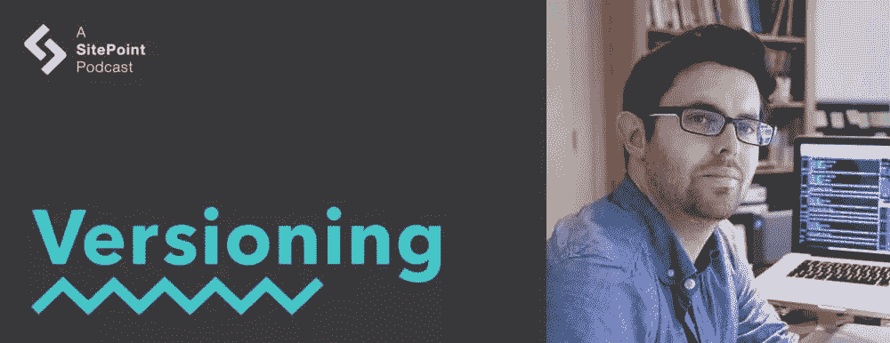

# CSS 预处理和前端开发，Guy Routledge

> 原文：<https://www.sitepoint.com/versioning-show-episode-20-with-guy-routledge/>

在这一集的版本控制节目中，David 和 Tim 加入了 Guy Routledge，他是 SitePoint 的 AtoZ CSS 视频系列的前端开发人员、教师和演示者。他们讨论了从 Sass 到 PostCSS 的转换，前端开发的复杂性，跳入框架还是学习基础知识，用乐高建造泰姬陵，以及#HolidayCode 的乐趣。

[https://w.soundcloud.com/player/?url=https%3A//api.soundcloud.com/tracks/298796035&color=ff5500&auto_play=false&hide_related=false&show_comments=true&show_user=true&show_reposts=false](https://w.soundcloud.com/player/?url=https%3A//api.soundcloud.com/tracks/298796035&color=ff5500&auto_play=false&hide_related=false&show_comments=true&show_user=true&show_reposts=false)

[访问版本控制展示主页](https://www.sitepoint.com/versioning-show/)

**[在 iTunes 上订阅](https://itunes.apple.com/us/podcast/the-versioning-show/id1135300597) | [在 Stitcher 上订阅](http://www.stitcher.com/podcast/sitepoint/the-versioning-show) | [查看所有剧集](https://www.sitepoint.com/blog/)**

## 显示注释

*   推特上的#HolidayCode 标签。
*   推特上的家伙: [@guyroutledge](https://twitter.com/guyroutledge)
*   guy ' s〔t0〕IMDB 页〔t1〕
*   [阿塔兹 CSS](https://www.sitepoint.com/blog/)
*   SitePoint Premium [HTML 和 CSS 频道](https://www.sitepoint.com/premium/topics/all?q=&limit=24&offset=0&page=1&content_types%5B%5D=All&slugs%5B%5D=htmlcss&states%5B%5D=available&order=)
*   [大会](https://generalassemb.ly/)
*   [Sass](http://sass-lang.com/)
*   [PostCSS](http://postcss.org/)
*   [在 SitePoint Premium 上发布 CSS 视频](https://www.sitepoint.com/premium/screencasts/getting-started-with-postcss)
*   [site point Premium 的家伙](https://www.sitepoint.com/premium/users/guy_routledge)
*   在推特上打招呼:[@ mdavid green](https://twitter.com/mdavidgreen)|[@ tevko](https://twitter.com/tevko)|[@ versioningshow](https://twitter.com/versioningshow)|[@ sitepointdotcom](https://twitter.com/sitepointdotcom)

## 谈话要点

> 我一直是一个视觉型的人。我家里的人都很有想象力。他们上过艺术学校或诸如此类的学校。我总是对这种东西产生共鸣，但我总是感到沮丧，因为我不能让一些东西看起来像我希望的那样。

* * *

> 一旦你下定决心，就无法挽回。但是当你进入数字时代，如果你把虚拟画笔放在虚拟画布上，如果它开始看起来像废物，那么你可以撤销多次，让它回到你需要重新开始的地方。我认为那对我来说更有趣。

* * *

> 我认为，当任何人在做他们真正喜欢的事情时，并且某种程度上满足了他们，勾选了所有的存在框——你知道，你得到了那种内在的平衡，然后你就尽你最大的努力——因为你正在朝着你真的真的喜欢的事情努力。

* * *

> 我更喜欢做新的项目，开始新的事情，并在过程中学习新的东西。当我离开那里去承包时，那实际上是相当令人满意的，因为我从零开始工作在许多新的事物上。我能够将这种体验融入到构建考虑到可维护性和性能的东西中。

* * *

> 这是一个持续的旅程，渴望找到一个好的、可靠的系统。有趣的是，这有点不太可能实现，因为即使你得到了你认为好的、有效的、可靠的东西，你也会意识到，哦，我可以在这里改进它。或者，<q>我不再需要那个东西了，因为我真的不用它了。</q>你不断在这种进化中进步。

* * *

> 当我第一次开始时，都是在 HTML 中点击。然后每个人都像，<q>不，这太可怕了。这不是关注点的分离。</q>废话，废话，废话。现在我们回到角度和反应。你知道，现代 JavaScript 框架，它们都是关于把 JavaScript 放到 HTML 中，或者甚至把 HTML 放到 JavaScript 中。事情的发展很有趣。

* * *

> 我认为网络变化如此之快，我想我采取的立场是，不要学习最新的框架并直接进入其中，并能够通过试错和解决它来做出一些东西，然后最好从基础开始，从良好的基础开始。尽管我喜欢 Sass，而且我几乎每天都用它来写我的 CSS，但我提倡从 CSS 开始，理解 inline 和 block 的基本概念，以及如何设计字体，使其可读和可访问。

* * *

> 自从我找到了自己在科技领域的最佳状态，我已经能够完全扭转这种局面，收入是以前的 10 倍。如果我能帮助其他人找到他们的激情，找到可以为他们打开许多大门的东西——如果我能为一个人做到这一点，那么能参与其中就太棒了。

* * *

> 幸运的是，开发者社区——也是设计社区——是如此开放和友好，每个人都分享一切。真是难以置信。这就像你和开发人员去参加一个会议，他们都说，这是秘密。所有的秘密！拥有它们。去创造神奇的东西吧。

## 副本

Tim:

嘿，大家好吗？这是蒂姆·埃夫科…

David:

…这位是大卫·格林先生…

Tim:

…您正在收听的是版本控制播客的第 20 集。

David:

这是一个我们聚在一起讨论 web 行业的地方，从开发到设计，一些人今天正在实现它，并计划它在下一个版本中的发展方向。

Tim:

今天我们和 Guy Routledge 一起谈论 CSS 专业知识和教育。非常令人兴奋的东西。让我们开始这个版本吧。

* * *

David:

伙计，我真的很高兴见到你。谢谢你今天加入我们。

Guy:

谢谢你们邀请我，伙计们。真的很感激。谢谢你为我不幸的时区调整你的时间表。

David:

没关系。蒂姆在纽约，我在旧金山，我们的客人来自世界各地，所以我们习惯于稍微灵活一点。

Guy:

是啊，有道理。

Tim:

跨国公司。

Guy:

嗯，我今天从伦敦加入你们。外面又黑又冷，但是我的办公室很温暖，很高兴来到这里。

David:

太棒了。这是版本控制展示，也是我们喜欢在这里做的事情之一——它是关于网络开发和设计的哲学。所以我们喜欢从问我们的客人一个哲学问题开始。你今天的哲学问题是，<q>在你目前的职业生涯中，你是什么版本，为什么？</q>

Guy:

这是个很难回答的问题，你知道吗？我可能在第 5 或第 6 版。如果我们用创业和失败，或者创业和失败来计算的话…嗯，失败可能不是一个合适的词…是的，也许是 5 或 6 个。差不多吧。我做过一些事情，但现在非常喜欢科技方面的东西。我觉得我找到了自己的最佳状态。

David:

听起来你不像是从科技行业起家的。

Guy:

我没有。实际上，有趣的是，我问了，因为人们总是问我这个烦人的问题。这就像，哦，那么，你知道，你是做什么的，你是怎么开始的？这就像是最糟糕的事情，因为没有人对这个问题有一个简单的答案。有趣的是，现在我主要从事网络开发。实际上，我在 11 岁或 12 岁左右的时候用 QBasic 写了第一行代码。然后我在 1997 年写了我的第一个 HTML 页面，我想可能是在 CSS 被发明之前，或者可能是在我知道它被发明之前。

然后我离开了，在这期间做了各种各样的事情。然后，大约在 2000 年前后，大约在 2010/11 年，又回到了科技领域。我最终工作了…嗯，在这期间我做了一大堆疯狂的事情，但是后来我专业地从事网页设计和开发，从那以后就没有再回头。

Tim:

这真是太好了，因为我认为我们在这个节目中谈论 QBasic 还不够。我本打算早点告诉大卫的。

Guy:

太棒了，耶。我们做这种——我想这有点像命令行游戏，很久以前的事了。比如用代码画形状什么的，还有这些决策树游戏什么的。如果现在有人给我看，我可能不知道发生了什么，但如果有必要，我可能会捡起来。

David:

听起来科技是一场早恋，然后又把你拉了回来。

Guy:

是的，我想是的。我想也许哲学上的答案是，对我来说一直很好的东西是创造力和科学的结合，几乎是同等程度的结合。技术层面的东西，然后是真正有创意的东西。中学和大学毕业后，我做的第一件事就是成为一名摄影师。我在电影业工作了大概五年。我甚至有一个 IMDB 页面，我想这也算是一种名声吧。我在英国拍过各种非常有趣的，有时有些不靠谱的独立电影。

这是一个非常有趣的平衡，平衡了讲故事的创造力，灯光和框架，构图。诸如此类的东西。然后，技术方面的东西，你知道，你有一个带所有这些按钮的相机，或者你必须解决像光圈和焦距这样的事情，以及你正在使用的镜头的所有东西。太棒了。我真的很喜欢它，因为它有，它真的很满意这两方面的结合。它的问题是报酬不高。这成了一个有点棘手的问题，我最终离开去寻找下一个东西。

David [4:04]:

听起来你从一开始就在做视觉方面的工作。

Guy:

是的，我想是的。我一直是一个视觉型的人。我家里的人都很有想象力。他们上过艺术学校或诸如此类的学校。我总是对这种东西产生共鸣，但我总是感到沮丧，因为我不能让一些东西看起来像我希望的那样。在过去，这就像在画布上画画，或者用笔和纸，或者铅笔之类的东西。我会做艺术类的东西。

但问题是，一旦你像笔一样写下了承诺，你就无法撤销。但是当你进入数字时代，如果你把虚拟画笔放在虚拟画布上，如果它开始看起来像废物，那么你可以撤销多次，让它回到你需要重新开始的地方。我认为那对我来说更有趣。再说一次，设计和开发的视觉方面是我做的一点点，但我认为我更擅长代码。

Tim:

你如何看待你过去在视觉艺术领域的工作与你今天正在做的事情之间的关系？

Guy:

好问题。我认为这只是给了我一个非常好的基线，让我把事情做到非常细致。我经常从雇主那里，尤其是从设计师那里听到的是，人们似乎不明白这一点。他们不知道细节。他们看不到细微差别。他们有时看不到系统中的模式。显然，不是每个人都这样，但这是我经常听到的。能够用那种创造性的眼光去接近一些东西，并对平衡和构图之类的东西有更多的理解，这真的很有用。

是啊，不管是什么原因，一切都很顺利。我认为，当任何人在做他们真正喜欢的事情时，并且某种程度上满足了他们，勾选了所有的存在框——你知道，你得到了那种内在的平衡，然后你就尽你最大的努力——因为你正在朝着你真的真的喜欢的事情努力。

David:

绝对的。在我听来，你也把你的设计哲学带进了你正在做的事情中。

Guy:

很有可能。一切都很复杂。没有一个人或没有一个主题领域或什么的，这是纯粹的黑与白。所有的事情都有许多不同的灰色阴影和复杂性阴影。如果你足够幸运能够做到，那么你就能找到组合和调色板，如果我们要继续某种哲学艺术讨论，那就最好了。

Tim:

对于我们不熟悉的听众，你现在在做什么样的事情？

Guy:

我会努力把重点放在技术方面，因为我实际上也做一些其他的事情。如果你感兴趣的话，我们可以晚点再谈。

David:

绝对的。实际上，这项技术如何融入你正在做的工作的其他部分是很有趣的。

Guy:

好的，当然。我将从技术方面开始，然后可能也谈谈其他一些零碎的东西。目前，我是一名合同前端开发人员，已经做了三四年了。在那种工作中，我与伦敦的许多机构合作，从事咨询类的工作，但也为他们提供项目。

有时人们直接来找我，我会帮助他们任何他们需要帮助的事情——无论是只是建议他们如何开始他们的业务，或者他们如何从 A 点到 B 点，或者从 B 点到 c 点。主要是与品牌和建立互动网站合作。我偶尔也会做一些应用程序级别的事情。目前在做一个 Angular 的 app。是的，不管需要什么，我们都要投入进去。

另外，几年前我在做一个兼职项目，这是一个名为 [AtoZ CSS](https://www.sitepoint.com/blog/) 的在线教学平台。有一天下午，我突然有了这个想法，然后说，<q>嗯，CSS 有点有趣，而且种类繁多，规范也相当广泛。有各种各样的属性，值等等。我想知道字母表中的每个字母是否都有一个。</q>

一天下午，我坐下来，列出了 A，B，C，D，一直到 Z，并开始尝试找出哪些属性或价值或概念可能与其中的每一个相匹配。然后我把它变成了一个截屏系列。它被捡起来了。它在周围被看到了。人们似乎很喜欢它，这实际上导致我加入 SitePoint 成为一名频道编辑。我现在和 SitePoint 团队一起工作，帮助其他人为那边的 [HTML 和 CSS 频道](https://www.sitepoint.com/premium/topics/all?q=&limit=24&offset=0&page=1&content_types%5B%5D=All&slugs%5B%5D=htmlcss&states%5B%5D=available&order=)贡献视频。

是的，有很多零碎的东西。晚上和周末，我也会亲自授课。在过去三年左右的时间里，我一直在[大会](https://generalassemb.ly/)教书。几乎完全是前端开发。我们确实喜欢 10 周的业余课程。我们兼职学习 JavaScript。然后，我们在 JavaScript、一点点 Ruby 和各种好东西的整个堆栈中进行沉浸式课程。

Tim [8:42]:

我想马上谈谈你在教育方面的努力，但在此之前，我总是发现代理工作对我来说有点挑战性，因为我喜欢投资于我发布的项目的长期护理。你有没有发现这个问题，或者你有没有克服它？你真的如何看待你为机构工作的项目的长期关怀和绩效，以及可维护性？

Guy:

这是一个有趣的问题，因为我开始做的很多事情——我在一家机构做全职工作——他们都有固定客户。他们会带人来。有时，他们会选择现有的网站，只是调整和维护它。有时他们会从头开始。它们是正在进行的项目。例如，其中一个大品牌是我们在英国的一个大麦片品牌，叫做多塞特麦片。他们在 2000 年代中期左右为他们制作了一个网站。(直到最近才彻底重建。)

大约 10 年来，这是一个正在进行的项目，有东西被添加，有东西被删除，有东西被清理。东西被调整和监控，诸如此类的东西。尽管它是一个机构，但人们关注项目的长期可持续性。这是一个非常有趣的角度。

另一方面，我真的不觉得那种维护工作很有趣。我更喜欢做新的项目，开始新的事情，并在过程中学习新的东西。当我离开那里去承包时，那实际上是相当令人满意的，因为我从零开始工作在许多新的事物上。我能够将这种体验融入到构建考虑到可维护性和性能的东西中。

David:

能够一直开始新项目的好处之一是，你可以不断地接触到最新的技术。我很好奇，现在你是如何构建一个项目的？

Guy:

结构和站点架构是我发现非常吸引人的事情之一。我想这是一种进入规划和组织和逻辑之类的书呆子端。我基本上只做前端的工作，但是我花了很多时间做的一件事就是找出启动项目的最佳方式。如何最好地构建 Sass。如何最好地构建 JavaScript 模块。如何最好地运行所有的任务之类的东西。

这是几年来发生的事情，因为当我第一次开始时，我对这些事情一无所知。这是一个持续的旅程，渴望找到一个好的、可靠的系统。有趣的是，这有点不太可能实现，因为即使你得到了你认为好的、有效的、可靠的东西，你也会意识到，哦，我可以在这里改进它。或者，<q>我不再需要那个东西了，因为我真的不用它了。</q>你不断在这种进化中进步。我认为这也很重要，否则你最终会陷入旧的方式，永远不会进步。

Tim:

你对目前的筹码有什么看法？

Guy:

我现在用的，还是喜欢 [Sass](http://sass-lang.com/) 。虽然，我们最近委托制作了一个关于 [PostCSS](http://postcss.org/) 的系列，看起来真的很有趣。这是其中的一种情况，如果你觉得某件事对你很有效，你不需要去寻找解决方法。我之所以想到这个，是因为我们委托[在 SitePoint](https://www.sitepoint.com/premium/screencasts/getting-started-with-postcss) 上制作了一系列短片。真的很有趣。我在想我想进入这个领域。它看起来更加灵活，可以做一些额外的事情，这很酷。

David [12:18]:

你能简单解释一下 PostCSS 对我们的听众意味着什么吗？

Guy:

是啊，当然。对不起，我应该那样做的。PostCSS 就像一个 JavaScript 插件。这是一个命令行工具，允许你使用 JavaScript 转换你的风格。有点像 Sass 的工作方式，它通过一个编译器。PostCSS 将会获取你的标准 CSS 代码。不是萨斯，不是 SCSS，不是更少。标准 CSS 文件名。它会捡起来的。它会把它传递到一个节点树中，这个节点树包含了所有不同的选择器，属性，值等等。然后它会对他们做些事情。它可以以某种方式操纵它们，然后再次吐出常规 CSS。这有点像双向转换。

是的，看起来很有趣。目前让我有些矛盾的是，我正在看着它，我现在有几个项目正在进行中，我有几个系统已经准备好了，比如样板代码，我一直在重复使用。我不知道我是否有精力回去把它们都换成只是为了试验。我可能会尝试做的是找到一个独立的项目，我可以去尝试一下，看看它进展如何，看看它是否是我想过渡到的东西。

David:

如今，前端代码变得越来越复杂。我记得以前你只需要写一行 JavaScript，插入就可以了。

Guy:

是啊，虽然事情总是在转圈。当我第一次开始时，都是在 HTML 中点击。然后每个人都像，<q>不，这太可怕了。这不是关注点的分离。</q>废话，废话，废话。现在我们回到角度和反应。你知道，现代 JavaScript 框架，它们都是关于把 JavaScript 放到 HTML 中，或者甚至把 HTML 放到 JavaScript 中。事情的发展很有趣。

Tim:

谈到你所接受的一些教育。我做过一段时间大会 JavaScript 课程的内容或课程顾问，我发现在这个行业有卖的东西，其中你可以让很多人注册一门课程，如果你答应教他们最新的框架。我认为这对那些真正想尽可能多地学习 web 开发的人来说并没有什么帮助。你有没有发现，在教育领域，带来最多学生的东西和你认为学生真正应该学的东西之间存在差距？

Guy:

我认为，在人们认为他们应该知道或想知道的事情和他们需要知道的事情之间，肯定存在着不平衡。你完全正确。有很多关于任何框架的新热点的讨论，无论是 JavaScript 应用框架，还是前端框架——如 Bootstrap 或 Foundation 等。更常见的情况是，人们认为他们听说过某件事，然后有人说，<q>哦，这件事真的很酷。</q>可能还没有做大量的研究，他们就走了，<q>哦，这个我认识、信任、喜欢、理解、相信的人说一些很酷的事情，所以一定很酷。</q>如果我有机会去问这样的问题，<q>哦，我们在学这个吗？</q>或<q>我们学到了吗？</q>然后可能就是想多了就出来了。

我真的不能代表大会上管理课程和其他东西的人说话。我认为网络变化如此之快，我想我采取的立场是，不要学习最新的框架并直接进入其中，并能够通过试错和解决它来做出一些东西，然后最好从基础开始，从良好的基础开始。尽管我喜欢 Sass，而且我几乎每天都用它来写我的 CSS，但我提倡从 CSS 开始，理解 inline 和 block 的基本概念，以及如何设计字体，使其可读和可访问。如何构建你的布局，从小的东西开始，到像浮动、内嵌块这样的东西。然后移动到定位。然后所有这些其他的事情。只是一点一点地叠加。

David [16:17]:

绝对的。如果你不理解这些东西，就不可能真正利用 Sass 或其他框架。如果你不了解 Ruby，你就不能真正利用 Rails。如果你不懂 JavaScript，你就不能真正利用 Angular。

Guy:

是啊，绝对的。我曾经把自己置于一个创业的境地。对于我们的团队来说，这可能不是最好的决定，但我很喜欢学习 Rails，所以我们将在 Rails 中做 MVP。我对 Ruby 了解不多，但我能在一周、两周、一个月内拼凑出一些东西——不管是什么。通过这样做，我能够理解 Rails。这不是我真正理解的事情。这是一个有趣的练习，但是方法不对。

Tim:

在我的职业生涯中，对我帮助最大的事情之一是从学习更多的 JavaScript 语法和语言如何工作，到学习软件中的设计模式。我认为这很有帮助。使用最新的框架真的很容易，而且你可能在这方面做了很多工作。仅仅学习软件的设计模式以及基本原理、语法、基础知识之类的东西，真的可以帮助你更好地理解你正在做的是什么，常见的陷阱，以及将来哪里可能出错。

Guy:

是啊。我在课堂上经常举的一个例子是，如果我去商店买了一套乐高玩具。也就是如何用乐高建造死星。你有所有的零件，你有说明书。你也许可以通过一点一滴的学习来构建它。跟着所有的照片什么的。太酷了。你做了一个东西，它起作用了，也许看起来不错。也许你会向你的朋友炫耀。随便啦。如果你现在说，去掉所有的指令。这是另一组砖块。不同的颜色，不同的形状，不同的尺寸，但是没有说明。用乐高制作泰姬陵。你会说，<q>我甚至不知道如何开始。</q>

了解工具是什么，了解构件是什么，让你能够通过自己的创造力制造你需要的任何东西，而不是盲目地跟随和走，哦，第一步:把这个放在这里。第二步:把这个放在那里。

David:

绝对的。我想我以前开过这个玩笑，如果你想建立 Basecamp，从 Rails 开始。知道一个框架有什么用处，意味着你要用它来创造什么。

Guy:

是的，很有可能。

David:

你的职业生涯中让我感兴趣的一件事是，许多人进入了技术领域，他们喜欢开发这些东西，但你实际上已经决定去那里教书，教育，接触社区，分享你的知识。我很好奇你是怎么开始的。

Guy:

这是个很好的问题。我不认为这是我有意找出来的。我当时在一家机构工作，是他们的首席前端开发人员。我们有一个实习生来了一小段时间。几周左右。她被分配给我，作为一个可以在我们正在做的项目上教她一两件事的人。我让她帮忙做一些低级的事情。算是看了。这就像我们一起宠物编程。

她真的很棒，我有点惊讶，因为有人告诉我，哦，是的，我们有个实习生要来。她对代码感兴趣，并想了解一下在代理公司工作的感觉。她真的很棒。我和她聊天，我说，<q>你在哪里学的这些东西，因为看起来你好像知道你在做什么，你可能会在这里工作得到报酬，而不是免费实习。</q>她说，<q>哦，我去了纽约的大会。是的，我想她实际上是去了纽约。我说，<q>哦，大会是什么？她说，哦，好吧，这是你学习这些东西的地方。这就像训练营的风格，他们带你去三个月，每天都很紧张，一周五六天。现在我已经回到伦敦，实际上我正在协助他们在这里开办的一门课程。</q></q>

我说，哦，听起来很酷。你觉得他们还需要其他前端教官吗？她说，<q>好的，我来问这个问题。为什么不呢？大约一周后，我与所有课程的制作人共进午餐。接下来的一周，我想我在教我的第一课。这只是其中的一件事。你看到一个机会，你问正确的问题。是啊，就像他们说的，剩下的就是历史了。</q>

David [20:35]:

你在为大会教学。你写了你自己发布的课程，现在是 SitePoint 的一部分。你在经营 SitePoint 的频道。回馈社会的感觉真好。我想也是在回归过程中。

Guy:

绝对的。能够帮助别人是一件真正令人满足的事情。我想这就是它的来源。只是对一个话题有真正的兴趣。当我看到我的学生身上也有类似的火花时，我为他们感到无比自豪。他们进来后说，哦，我做作业一直工作到凌晨 3 点。这真的很难，但后来我做到了，这太棒了。听到有人对这种事情感到兴奋，真是令人欣慰。

我想真正让我把它带回家的原因是，当我离开大学做我的第一件事时，我试图追求制作电影的热情，成为这种有相机和其他东西的创造性技术人员。坦白地说，我没有赚到钱。这就像，可能有一周的工作，然后一个月的休息。然后工作几天，然后休息一个月。

自从我找到了自己在科技领域的最佳状态，我已经能够完全扭转这种局面，收入是以前的 10 倍。如果我能帮助其他人找到他们的激情，找到可以为他们打开许多大门的东西——如果我能为一个人做到这一点，那么能参与其中就太棒了。我甚至不需要知道我是否扮演了那个角色。只是如果其他人也能从中获益，那就太棒了。

David:

如果人们想从事你所从事的工作，你认为他们应该从哪里开始？在发布信息和与人分享方面？

Guy:

我认为准入门槛相当低。你可以用文本编辑器来编辑。如果你已经在写代码，那么你已经知道其中一个是什么了。你可以打开一个新标签，开始写下你感兴趣的话题。然后从那里，拿一个开始写博客。然后在你意识到之前，你已经得到了一些独特的、有趣的、有价值的东西。你可以在网上任何地方发布，或者加入一个论坛。得到一个中等账户。把它分解成 140 个字符，作为推特意识流发布到推特上。

如今，真正把东西放在那里的门槛真的很低。问题是，它真的很难被注意到，所以如果你把东西放在那里，没有人看到它，这可能会有点令人沮丧。但这取决于你做这件事的目的。你是为了自己吗？你这样做是为了帮助别人吗？每个人对他们为什么做某事会有不同的立场。

幸运的是，开发者社区——也是设计社区——是如此开放和友好，每个人都分享一切。真是难以置信。这就像你和开发人员去参加一个会议，他们都说，这是秘密。所有的秘密！拥有它们。去创造神奇的东西吧。你去参加一个标准的汽车销售员会议。我不知道他们有没有，但也许有。他们说，<q>我们做了一件了不起的事情。我们赚了这么多钱，我不会告诉你任何秘密。你自己去解决吧。</q>我在猜测，但我认为它可能不像我们这个行业那样友好和开放。所以是的，拥抱它。接受人们喜欢学习和分享的事实。开始吧。

Tim:

这当然是一个很好的建议，如果你是我们的听众之一，刚刚开始学习这个，并希望了解更多，就照盖伊说的去做。对此我没有什么要补充的。伙计们，非常感谢你们今天的参与。人们如何与你联系，了解你的工作，学习和参加你的课程？

Guy [24:10]:

我现在有点不在线。大约从去年五月开始，我甚至没有打开过我的推特。通常我会说这是找到我最简单的方法。是的，你可以发微博给我。你可以在[网站](https://www.sitepoint.com/premium)上查看我们的资料，我想如果你想的话，有办法让[在那里和我联系——如果你](https://www.sitepoint.com/premium/users/guy_routledge)[给我们发邮件](mailto:feedback@sitepoint.com)的话。给我们留言，我们会找到的，这样我们就可以开始对话了。

David:

太棒了。我希望很多这样的对话会因此而开始。非常感谢你今天参加我们的版本控制节目。

* * *

你把他的名字念对了。我对此印象深刻。

Tim:

我做到了。我很紧张，即使他告诉我怎么读，我还是会读错。

David:

我肯定他一直都有这种感觉。他在外面发表的东西太令人惊讶了。你见过他的 AtoZ CSS 的东西吗？

Tim:

是的，我也学到了一些东西。CSS 就是那些东西中的一种——我不知道我是否应该把 CSS 称为一种语言，但无论如何我都要这么做。CSS 是这样一种语言，不管你知道多少，总有那么多不同的东西你可以继续学习。我觉得有趣的一件事是某些属性有多个值，比如 border。很多人都喜欢`border: 1px red solid;`，但我最近才知道，你可以只写`border: solid red 1px;`，它只知道把所有这些值放在正确的位置。

我认为他的系列肯定揭示了一些关于 CSS 的鲜为人知的事情。当你得到这样的东西时总是很有趣——它只是帮助你在一天结束时写出更好的代码。

David:

这有点像你在图书馆浏览书库时得到的乐趣。或者查字典。寻找你可能不认识的随机单词。它呈现信息的方式与你想象的不同。你会接触到所有这些你在 CSS 中从未想过的晦涩的小属性和东西。一旦你知道机会就在那里，你就会了解它们，然后你会找到一种方法来应用它们，因为，当然，一旦你了解了某件事，你就会立刻意识到，哦，我应该利用它！

Tim:

是啊，这又让我想起了另一点。这是我提到的东西。在我们这个行业，所有的秘密都是公开的。我记得第一次意识到。我心想，为什么？为什么每个人都放弃他们知道的一切？对于其他存在商业秘密的行业来说，这是字面上的意思。大卫，为什么你认为这是我们行业的事情，而不是其他行业的事情？

David:

嗯，首先，在这个行业很难隐藏任何东西，因为所有的东西都在网上。已经出版了。你可以下载某人的代码。好吧，至少前端是这样。你可以下载某人的代码并查看，但实际上就后端而言，我认为人们对共享也同样开放。这不能仅仅是技术鼓励了这种环境。我想知道这是否与事情发展的速度有关，因为你可能有一个商业秘密，但这个商业秘密只会持续你很短的一段时间。鉴于你所在的行业发展如此之快，你现在就可以分享你所知道的一切，六个月后，你所分享的一切可能相关，也可能不相关。你分享它的事实会一直存在。这本身就有价值。

Tim:

我也有自己的一套理论。这可能很愚蠢，但我会尝试，只是广播它。我认为是因为我们所做的事情的分布。例如，我在纽约的电脑上写代码。你在…旧金山做着同样的事情。

David:

旧金山。

Tim [27:48]:

旧金山。是的，我记得一些事情。*【笑声】*然后全世界都有人这么做。只是有太多的工作要做。这不像我可以发展我的网站建设帝国，并处理东海岸的所有网站。那是不可能的。例如，如果我是一名汽车销售员，那就更有可能了。我认为，如果你能开创自己的汽车生意，除了一台电脑或一些人人或几乎人人都可以使用的小工具，我认为分享秘密的意愿会开放得多。因为，让我们面对现实吧，这份工作对你来说是可行的。每个人都有空间，但你不可能在东海岸卖掉所有的车。这有一点点意义吗？

David:

我想是的。事实上，这让我想起了其他行业，那里的信息共享与我在科技领域看到的类似。例如，在教育领域，我被训练去教授英语作为第二语言。当我开始参与这个社区时，给我留下深刻印象的一件事是人们如何自由地分享课程计划、想法和书籍。人们总是在那里分享，这对我的学生很有用。如果你在给说土耳其语的人教英语，那么这就是这种语言和那种语言的不同之处，也是你需要注意的地方。这些是阿拉伯语的发音问题。

正如你所说，这个领域有无限的学生。一个老师不可能垄断整个行业，所以分享信息不仅可以传播知识，还可以建立分享者的声誉。我认为这是关键点。

Tim:

是啊。它只是帮助你在一天结束时更好地完成工作。另一件我很喜欢那个家伙的作品，是他用乐高搭建泰姬陵的插图，没有任何步骤。每天我都更加相信这个想法——以下步骤在某些领域可能是有帮助的，但是如果你真的想更好地为 web 构建东西，了解基本原理、构建模块、模式和语法，会比复制和粘贴代码以及只是走过场或按步骤走得更远。

David:

那东西并不性感，但是很重要。如果你不知道，你会在某个时候发现自己迷失了。你将知道如何用乐高积木建造尽可能多的死星，只要乐高积木看起来像死星碎片。当你看到泰姬陵时，你不知道该去哪里。

Tim:

有时这是我自己陷入的一个陷阱。例如，你知道，我存储了许多样板代码。每隔一段时间，我就会建造一些东西。我会把这个复制粘贴到第一步，然后停下来，我会说，<q>等一下。为什么会这样？为什么这东西现在在做我想让它做的事？为什么代码都井井有条了？</q>知道步骤，不知道背景。幕后发生的事情让这个东西做我想让它做的事情。

这很有帮助，因为当我学会了这些，我就可以拓展业务了。我可以调整事情。我可以通过改变这个函数的运行方式来获得更多的结果，并根据我正在构建的应用程序的具体类型来定制它。对于每个项目来说，定制变得更加容易和更好。而不仅仅是遵循一个样板。

David:

这就是我现在开始任何项目时感到害怕的地方，因为你已经有一大堆了。你有这个单调的项目，你有 npm 安装所有这些不同的部分，他们都一起工作。就好像你创造了这个复杂的塔，它是基于这些你根本不知道的基本构件。你可以进去学习这些东西的 API，但是你并不真正理解他们是如何做他们正在做的事情的。你并不能真正控制你自己的项目。然而，如果你不这样做，你必须从头开始构建这么多的部分，以至于你永远不会开始任何事情。

Tim [31:53]:

这就是为什么我认为盖伊又提到了这一点。他触及了很多东西。他是一个非常聪明的人。我认为 2017 年将会是简化的一年。这是工具更少的一年，也许要做更多的工作，但代价是不必管理另一个依赖项。在我的工作中，我总是喜欢尽可能少的依赖，尽可能少的单点故障。总有另一种工具可以使用。我对大多数事情都用吞咽。我对大多数事情都用 Sass。我对大多数事情都使用 npm。我试着让这些东西做尽可能少的工作。我努力确保如果我不得不删除其中一个工具，我仍然可以使用我的项目。

如果我正在开发一个 Express 应用程序，这并不总是可能的。我需要 npm。这必须奏效。但如果我是，就像我现在做的，我基本上只是为我哥哥工作的一家公司建立一个宣传册网站。我启动 Gulp 只是为了斗嘴，然后我意识到我不需要这个网站的任何 JavaScript，除了这个画布外的菜单。我基本上只是内联了三行 JavaScript 来实现画布外的导航转换。

我对自己说，我可以很容易地为此过度使用工具，但是保持事情简单，压力就会小得多。我要担心的事情少了很多。它不是最漂亮和最优雅的东西，但它完成了工作，有人可以去维护它，它会很好。

David:

你用了<q>过度加工</q>这个词。我认为这个词人们用得还不够多。如果我们在 2017 年推动这个项目，人们将会开始使用这个词。当人们开始意识到过度工具化是我们建造这些东西的一种非常危险的方式，我们正在创造这些将来很难进入和维护的怪物。

Tim:

我觉得应该推这个概念。我认为开发人员的便利不应该妨碍构建可维护的——我不会说是持久的——而是需要持续多久就持续多久的软件，并且首先让用户受益。我认为工具可能会妨碍这一点，我认为也许我们还没有看到它发生，但我认为我们正在达到这一点。那只是一个理论。如果你不同意，如果你热爱工具，请告诉我们，因为我们想听到更多的观点。我们当然不想生活在回音室里。

David:

是的，如果你正在开发每个人都应该使用的下一个工具，你可能对此有自己的看法。因此，请发微博到 [@VersioningShow](https://twitter.com/versioningshow) 告诉我们。

Tim:

是的，肯定的。因为工具很有趣。工具确实让事情变得有趣，但是，是的，再一次，我总是喜欢在我这边多做一点点工作，这样事情对其他人更好。就是这样。

David:

好吧，酷。我很高兴你特别提到了代码可维护性和代理工作的问题，因为我认为这与我们在这里讨论的内容有关。这是关于代码需要持续多长时间，并把用户放在第一位。在代理工作中，我认为你有机会接触到可能不需要持续很长时间的工作，但需要解决特定用户群的特定需求。

Tim:

非常正确，在这种情况下，你确实有更多的空间去尝试，就像盖伊提到的那样。他真的很喜欢尝试新事物和新方法。你知道，如果你为一个机构工作，该机构说，嘿，我们需要一个销售我们产品的感恩节网站。该死，去找乐子吧，因为尝试使用下一个模块捆绑器什么的总是一件很有趣的事情。

David:

我喜欢这样。这就像节日代码。这是开发商的节日，因为他们可以玩了。对于用户来说，这是一个节日，因为它只与这个节日相关，这是一个试验所有这些深层堆栈和奇怪工具的机会。

Tim:

这是真的，节日代码。例如，特别是如果你从事电子商务的话。其中你必须建立一个登陆页面来销售六种只在假期打折的产品。你猜怎么着听众们，除了工具之外，告诉我们你对假日代码最好的体验——或者最差的体验，因为这两者都存在。

David:

哈希标签#HolidayCode。

Tim:

好吧。现在它将会出现在剧集的笔记中，我可以保证当这一集发布的时候它会成为一个东西。

David:

非常感谢大家的聆听。我们一直很高兴能与大家谈论技术。

Tim:

我们还要感谢 SitePoint.com 和我们的制片人 Adam Roberts 和奥菲利·勒沙特，他们在制作上得到了拉尔夫·梅森的帮助。请随时在 Twitter 上给我们发送您的评论—[@ versioningshow](https://twitter.com/versioningshow)——[在 iTunes 上给我们评分](https://itunes.apple.com/us/podcast/the-versioning-show/id1135300597)，让我们知道我们做得如何。

David:

我们下次再见，希望你喜欢这个版本。

## 分享这篇文章