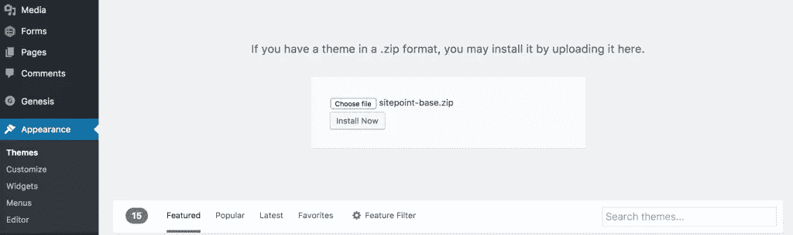
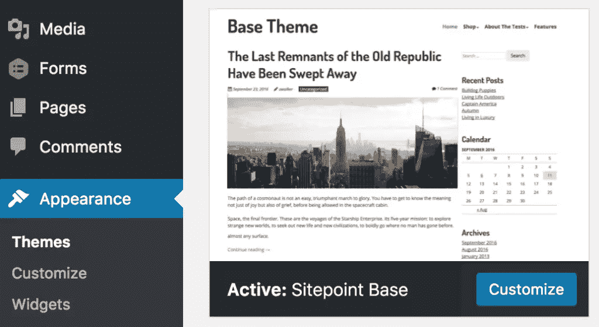
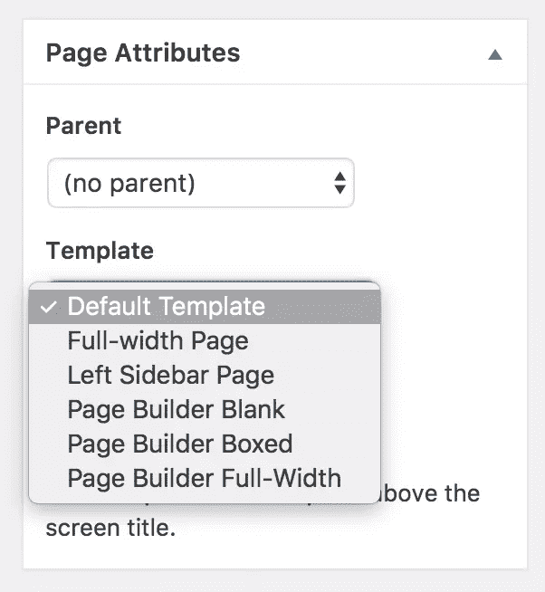
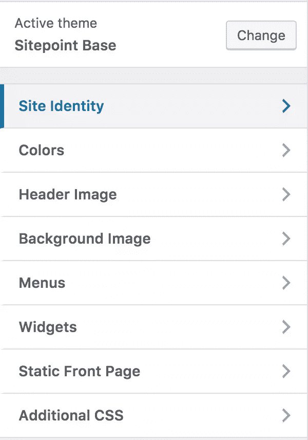
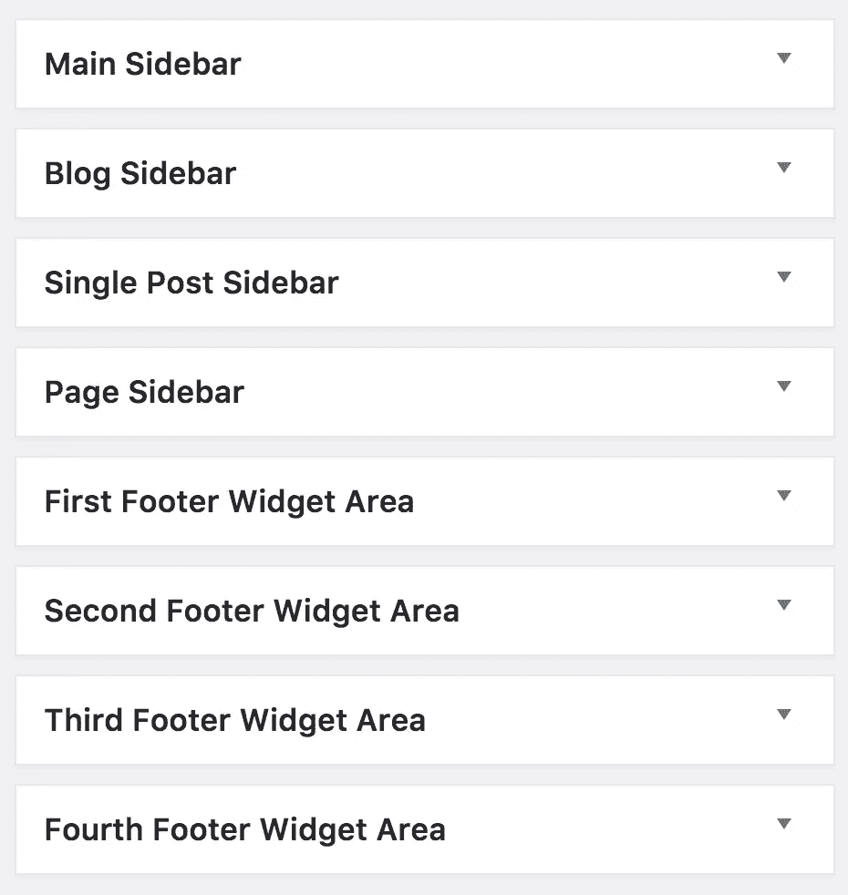

# WordPress 的 SitePoint 基本主题初学者指南

> 原文：<https://www.sitepoint.com/beginners-guide-to-sitepoint-base-theme-for-wordpress/>

如果你想了解更多关于自定义主题开发的知识，请查看 SitePoint 高级课程 [WordPress 主题开发](https://www.sitepoint.com/premium/courses/wordpress-theme-development-2931)！

本周早些时候，我向你介绍了 WordPress 的 [SitePoint 基本主题。](https://www.sitepoint.com/introducing-sitepoint-base-theme-for-wordpress/)

有时候，WordPress 的主题在前端可以吸引你的眼球，而在幕后，它们显得臃肿而缺乏质量。SitePoint 希望解决这个问题，并专注于开发一个新的基本主题，它可以自信地为用户提供一个入门主题，他们可以在任何 WordPress 项目中使用，这个主题是最小的、干净的、简单的、轻量级的和响应性的。

SitePoint 基本主题的设计重点是以下关键功能:

*   100%免费:开源 GPL 2.0
*   高性能
*   代码质量
*   移动优化
*   搜索引擎友好
*   woo 商务兼容性
*   页面生成器兼容性

今天，我们将仔细看看如何在你的下一个项目中开始使用 SitePoint Base 主题，带你了解这个入门主题提供的开箱即用的关键特性和好处。

## 步骤 1:下载并安装 SitePoint 基本主题

第一步是下载 SitePoint 基本主题的副本。

然后，在你的 WordPress 仪表盘中，进入**外观**和**主题**，然后将主题上传到你的 WordPress 网站。我还建议手头准备一份[文档](https://s3.amazonaws.com/learnable-components/SitePoint+Base+Theme+Documentation+v1.pdf)。

## 第二步:创建你自己的主题

SitePoint 基本主题是作为一个入门主题设计的，所以你可以用你自己的创作来扩展它。我们可以直接编辑主题，但是最佳实践是创建一个副本作为我们自己的 ***子主题*** 。

在这样做之前，您需要复制 SitePoint 基本主题文件夹，并将名称更改为其他名称。然后，您需要对所有模板中的名称进行三步查找和替换。

然后您需要做的就是更新`style.css`中的样式表头。

## 步骤 3:使用模板

SitePoint 包括了全幅、侧边栏、标签、类别、作者、搜索、文章存档和 404 等流行的模板。

它们还包括页面生成器空白、盒装和全角模板，如果您选择使用 Visual Composer 或 Divi Builder 之类的页面生成器，这是非常理想的。

## 步骤 4:使用主题定制器

开箱即可轻松添加:

*   自定义徽标
*   自定义标题
*   自定义背景

## 步骤 5:配置小部件

选择您希望如何利用基本主题中的主要小部件区域。有一个主侧边栏，博客侧边栏，单篇文章侧边栏和页面侧边栏。

SitePoint 还提供了多达四个页脚小部件，这些部件可以根据包含的数量在页面上均匀分布。

## 如果你想要更多呢？

如果你想进一步定制你的网站，你有几个选择:

### 1.编辑 CSS

使用 CSS 你可以改变你的主题的整体外观，但是你需要知道一些基本的 CSS 和 HTML。如果你是初学者，[这里有一个很好的起点](https://www.sitepoint.com/html-css-beginners-guide/)。对于更多的主题定制，添加一些基本的 CSS 将足以满足更多的需求。你也可以编辑你的页面模板，它们大多是简单的 HTML。

对于自定义**功能** *，你正在进入插件领域(也就是说，SitePoint Base Theme 支持许多流行的插件，如支持强大电子商务功能的 WooCommerce)。*

### 2.使用页面生成器

SitePoint Base Theme 支持所有主要的页面生成器，包括 Visual Composer、Beaver Builder、Divi Builder 和 SiteOrigin。

我们有一篇很棒的文章，解释了 WordPress 页面构建器的力量，这也包含了一些优点和缺点。

## 获得帮助

如果您有机会回顾或构建 SitePoint 基础主题，请在下面与我们分享您的想法和经验。否则，您可以在社区论坛上发布与支持相关的查询和反馈。

## 分享这篇文章