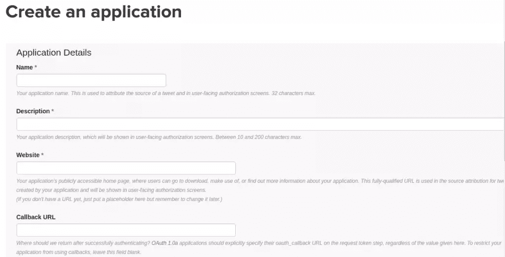
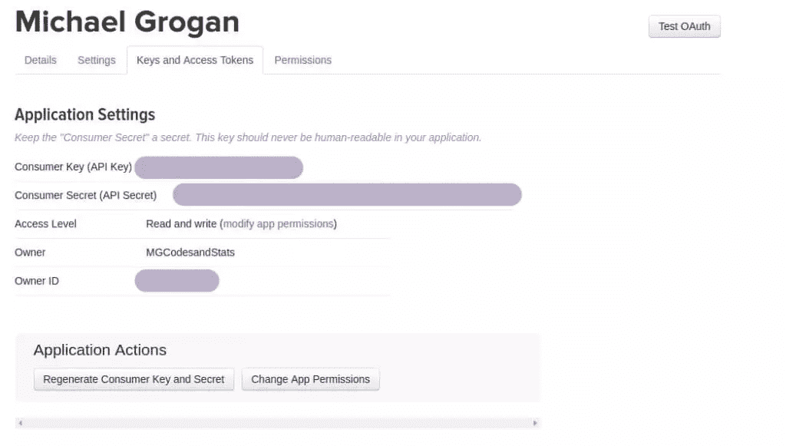
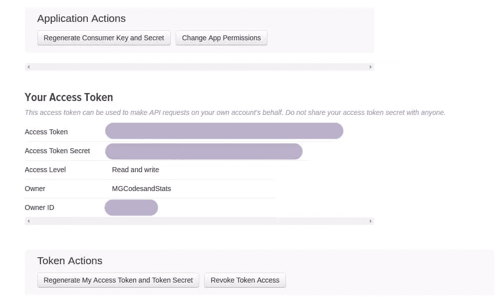
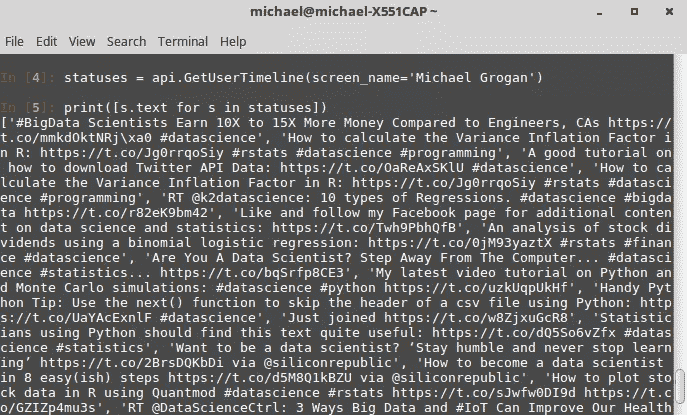
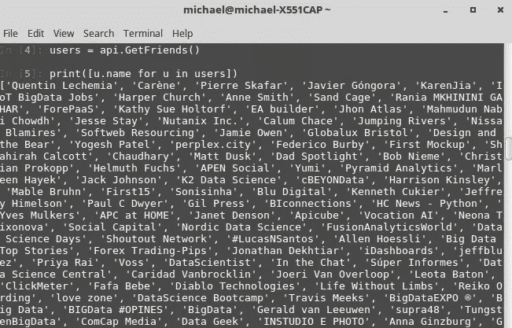
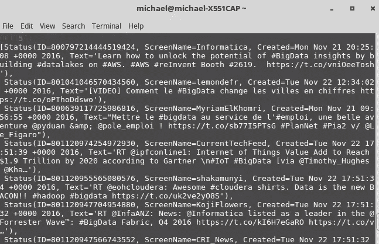
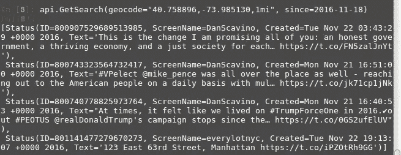

# 如何通过 Python 创建 Twitter 应用程序和 API 接口

> 原文：<https://www.sitepoint.com/how-to-create-a-twitter-app-and-api-interface-via-python/>

本教程演示了如何使用 Python API 通过 Twitter 库连接到 Twitter 帐户。具体来说，该 API 允许用户提取与特定 Twitter 帐户相关的大量数据，并从 Python 平台直接控制 Twitter 帖子(例如一次发布多条推文)。


即使你不是 Python 的普通用户，使用 Python 的一个 Twitter 库对于分析也是非常有用的。例如，虽然 web 开发人员可能更倾向于使用 PHP 之类的语言来连接 API，但是 Python 在分析趋势和数据统计方面提供了更大的灵活性。因此，数据科学家和其他分析师会发现 Python 更适合这个目的。

在本教程中，我们将从将 Python 连接到 Twitter API 的一些基本步骤开始，然后看看如何传输所需的数据。请注意，虽然 Twitter 库(以及其他 Python 库，如 [Tweepy](http://www.tweepy.org/) 和 [Twython](https://twython.readthedocs.io/en/latest/) )可以使用数据执行大量不同的[任务](http://python-%20twitter.readthedocs.io/en/latest/twitter.html)，但在本文中，我将重点讨论一些更基本(也更有用)的查询。具体来说，我将介绍如何:

1.  使用适当的凭证将 Python 连接到 Twitter API
2.  下载与特定账户相关的推文
3.  为一个帐户下载所有关注和被关注用户的列表
4.  一次发布多条推文
5.  自定义在 Twitter 上搜索特定术语的实例。

## 1.将 Python 连接到 Twitter API

本教程使用 [iPython](https://ipython.org/install.html) 作为 Python 接口来连接 Twitter。为了连接到 API，我们需要获得**消费者密钥**、**消费者秘密**和**访问令牌秘密**。

要获得这些，您需要在[apps.twitter.com](https://apps.twitter.com/)登录您的帐户。在那里，系统会提示您创建一个应用程序:



一旦创建了应用程序，您将在**密钥和访问令牌**部分找到相关的密钥和令牌。





首先，我们在终端中安装 python-twitter 库，如下所示:

```
 pip install python twitter 
```

完成后，我们导入 Twitter 库并输入如下凭证:

```
 import twitter
api = twitter.Api(consumer_key='your_consumer_key',
  consumer_secret='your_consumer_secret',
    access_token_key='your_access_token_key',
    access_token_secret='your_access_token_secret') 
```

```
 print(api.VerifyCredentials()) 
```

一旦输入了正确的凭证，到 API 的连接就完成了，现在我们能够通过 Python 平台控制我们的 Twitter 帐户了！

## 2.下载用户时间表

既然我们已经将 Python 与 Twitter API 连接起来，我们就可以开始远程利用不同的 Twitter 功能了。例如，如果我们希望下载用户的 tweets 时间表，我们使用下面的`api.GetUserTimeline`来完成(并为适当的帐户指定屏幕名称)，然后使用`print()`函数来显示结果:

```
 statuses = api.GetUserTimeline(screen_name='Michael Grogan')
print([s.text for s in statuses]) 
```

输入上述内容后，我们会看到 Python 界面中显示的相应时间轴:



## 3.下载关注和被关注的联系人

Twitter 库还使我们能够下载特定用户关注的帐户列表，以及该特定用户的关注者的帐户。为此，我们用`api.GetFriends()`表示前者，用`api.GetFollowers()`表示后者:

```
 users = api.GetFriends()
print([u.name for u in users]) 
```



```
 followers = api.GetFollowers()
print([f.name for f in followers]) 
```


请注意，我们还可以设置希望获取的用户数量的上限。例如，如果我们希望为任何特定帐户获取 100 个追随者，我们可以通过向函数添加一个`total_count`变量来实现，如下所示:

```
 followers = api.GetFollowers(total_count=100)
print([f.name for f in followers]) 
```

## 4.发布多条推文

使用 Twitter API 的一个好处是能够一次发布多条推文。例如，我们可以使用`api.PostUpdate`命令同时发布下面两条推文(再次使用`print()`函数进行确认)。一旦我们转到有问题的 Twitter 账户，我们会看到两条推文都已发布:

```
 status = api.PostUpdate('How to calculate the Variance Inflation Factor in R: http://www.michaeljgrogan.com/ordinary-least-squares-an-analysis-of-stock-returns/ #rstats #datascience #programming')
print(status.text) 
```


```
 status = api.PostUpdate('#BigData Scientists Earn 10X to 15X More Money Compared to Engineers, CAs http://bit.ly/1NoAgto  #datascience')
print(status.text) 
```


## 5.搜索推文

twitter 库中包含的`GetSearch()`函数是一个特别强大的工具。这个功能允许我们在 Twitter 上搜索特定的术语。请注意，这适用于所有输入了特定术语的用户——不仅仅是我们在 Python 中提供了凭证的帐户。

例如，让我们在 Python 中搜索术语“bigdata”。我们设置的参数是自 2016 年 11 月 21 日以来包含该术语的推文，我们选择将推文数量限制在 10:

```
api.GetSearch(term='bigdata', since=2016-11-21, count=10) 
```



注意，我们可以用多种方式定制`GetSearch()`函数，这取决于我们希望如何提取数据。例如，虽然如果没有指定日期，这将需要更长的时间来传输，但我们也可以选择在 2016 年 11 月 21 日之前收集包含术语“大数据”的推文，如下所示:

```
api.GetSearch(term='bigdata', until=2016-11-21, count=10) 
```

值得记住的是，这个函数下载了我们在`until`变量下指定的日期之前 7 天的数据。

此外，我们不仅限于使用`GetSearch`进行搜索。例如，假设我们希望通过地理位置搜索推文，特别是自 11 月 18 日以来在纽约时代广场 1 英里半径范围内发送的推文(注意，距离可以分别使用英里或公里进行格式化):

```
api.GetSearch(geocode="40.758896,-73.985130,1mi", since=2016-11-18) 
```

在运行`GetSearch()`函数时，我们看到 Python 返回了以下 tweets(当然，还有什么更好的地方可以找到 Donald Trump！):



## 如何使用这些数据？

Python 对于流式社交网络数据极具吸引力的一个特殊原因是——如前所述——对我们收集的信息进行深入数据分析的能力。

例如，我们已经看到了如何使用`GetSearch`按位置搜索推文。随着机器学习在参与分析社交媒体趋势的数据科学家中风靡一时，一种在该领域变得非常流行的特殊技术是网络分析。这是一种技术，其中分散的数据(或节点)实际上可以被显示为形成紧密的网络——通常某些节点被证明是焦点。举个例子，假设我们要分析世界上十个不同地方的 1000 条最受欢迎的推文。

在随机的一天，我们可能会发现伦敦推特上的标签与纽约推特上的标签有很大不同，尽管我们可能仍然会看到网络中不同推特之间的一些一致性。然而，在重大的世界事件期间，如美国大选之夜或英国退出欧盟，当推特关注特定话题时，人们发现网络往往更加紧密，因此，在这种情况下有更多的机会进行情绪分析——例如，谁将赢得总统大选，或者英国投票脱离欧盟变得很明显。人们通常会看到网络以不同的方式聚集，这取决于趋势推文，因为进一步的实时信息变得可用。

这只是 Python 的优势之一。虽然使用 API 连接 Twitter 是一回事(这可以在许多编程语言中完成)，但能够使用分析以有意义的方式对数据进行排序则是另一回事。可以通过 Python 使用机器学习技术来分析来自社交网络的流数据，并根据这些数据做出有意义的预测。

## 结论

模块文档非常详细地描述了 Python 中可用于下载、过滤和操作数据的不同函数。最后，虽然我们也研究了使用 API 直接发布到 Twitter 的方法，但是上述技术在分析趋势时特别有用——例如标签流行度、按位置排列的搜索词频率等等。在这方面，通过 Python 与 Twitter 交互对于那些希望对收集的信息实施数据分析技术的人来说特别有用。

当然，API 与 Twitter 的交互可以用多种语言完成，这取决于您的最终目标。如果目标是 web 开发或设计，那么 PHP 或 Ruby 可能是你最好的选择。然而，如果你的目标是使用从 Twitter 获得的数据进行有意义的分析，那么 Python 是独一无二的。在这种情况下，当使用 Twitter 进行一些严肃的数字处理时，我强烈推荐 Python。

## 分享这篇文章