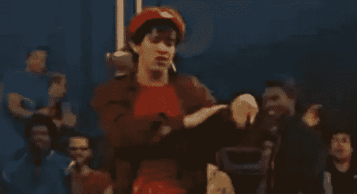
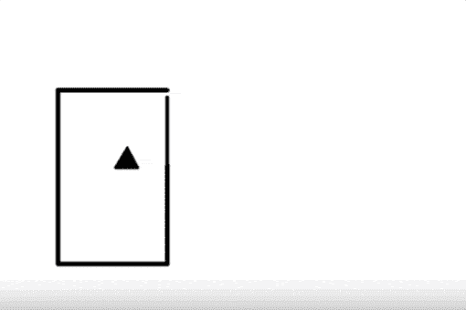
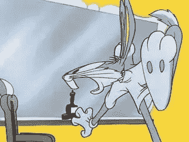

# UI 动作:可以用动作讲故事吗？

> 原文：<https://www.sitepoint.com/ui-motion-can-tell-story-movement/>

这周我一直在为一个日历功能设计微交互。虽然“视觉设计”的部分很久以前就已经完成了，但是这个动作很难在代码中正确表达。

“好像是..第一部分停留了一会儿，然后折叠起来..”

我发现自己用开发人员 Stu 在空中“摇摆身体”的手势来描述我希望两个 UI 组件如何移动。

它也成功了！但这确实让我想知道，如果我们不在同一个房间里，我们会怎么样。很难在空闲时间或电子邮件中进行“身体摇摆”。

许多应用程序迎合简单的屏幕过渡、淡入淡出和按钮状态(Invision、漫威、Adobe XD)，但完整的“UI 动作创作工具”较少。Atomic.io 看起来是我们的下一站。

### 你的 UI 如何移动真的很重要吗？

或者，简单的“放松”不行吗？

有时会，但通常不会。我们知道，当我们选择颜色时，它会对内容产生影响。运动有意义。

下面是一个 1944 年的动画短片。它是由实验心理学家弗里茨·海德和 T2 发明的。他们让 34 名本科生观看，然后描述他们所看到的。

很好玩。你自己看吧，告诉我你看到了什么。

海德尔&齐美尔的动画(1944)

你对这部动画有什么看法？

*   你看到角色了吗？
*   有故事吗？
*   你看到形状之间的关系了吗？

如果你*没有*看到以上任何一条，那你就不寻常了。我们大多数人都会情不自禁地看到下面这样的东西:

> 大三角是权威人物——可能是年长的男性。
> 这两个较小的形状通常被视为年轻夫妇。我们看着大三角责备他们，并试图恐吓小三角远离小圆。然而，不屈服，较小的三角形返回与圆团聚，最终他们一起逃跑。大三角以毁灭之怒回应*。*

被要求描述动画中发生的事情的大学生:

*   32 人把几何图形称为人
*   1 把几何图形称为鸟
*   1 将几何图形称为…嗯，图形。

大多数人能够在形状上暗示微妙和复杂的人类特征，如嫉妒、仇恨、勇气和爱。

当然，尽管事实上这些“角色”几乎没有我们所期望的故事角色的正常特征。他们没有脸、眼睛、嘴或四肢。他们不能说话或发声，也没有字幕来填补认知空白。

动画师使用“挤压和拉伸”

这些形状甚至不会拉伸、压缩或扭曲——这是动画师们传统且深受喜爱的讲故事工具。从纯技术角度来说，它让《南方公园》看起来像 3d 动作捕捉。

然而，不知何故，我们能够让一个微小的*罗密欧与朱丽叶*在简单的黑色形状的运动中上演。简而言之，我们把一个 ***lot*** 的意思解读成某物如何运动。

### 所以，现在每个滑动菜单都变成了凯文·史派西？

当然不是。

但是如果 UI 元素必须移动——收缩、扩展、滑动、弹跳、旋转和摇摆——有时它移动的方式和它到达 UX 时发生的事情一样重要。

## 分享这篇文章