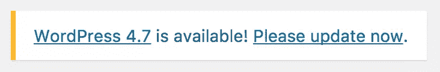
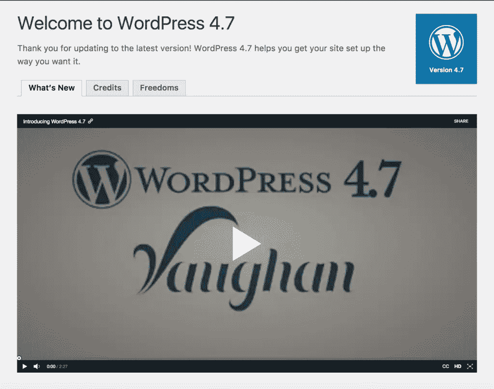
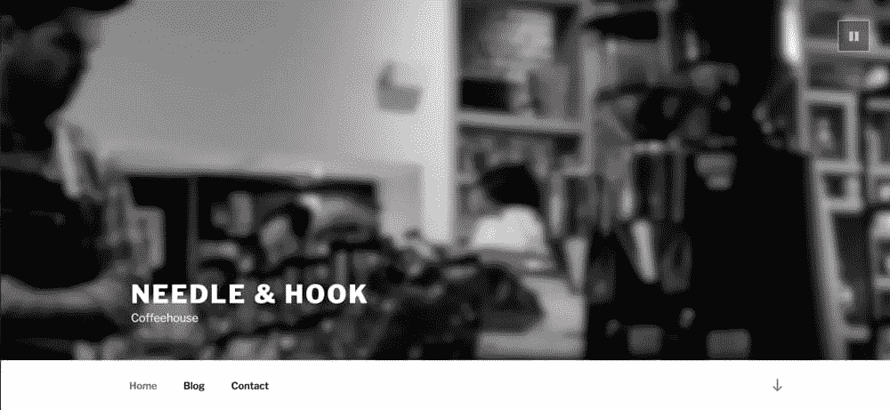
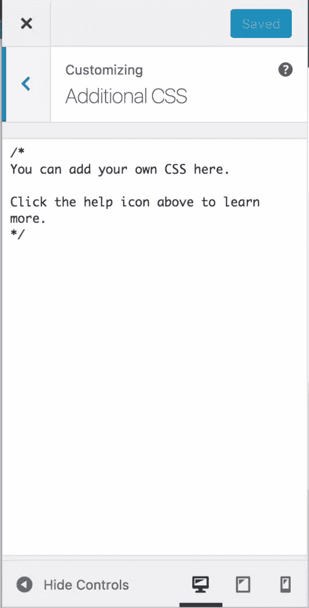

# WordPress 4.7 的新功能

> 原文：<https://www.sitepoint.com/whats-new-in-wordpress-4-7/>

“沃恩”刚刚登陆，向爵士歌手萨拉·沃恩致敬。

距离上一次发布 [WordPress 4.6](https://www.sitepoint.com/whats-new-in-wordpress-4-6/) 还不到四个月。在这个最新的版本中有很多很棒的特性，可以帮助你的 WordPress 网站变得更好。作为 WordPress 的重度用户，我总是很兴奋地看到新的改进，但 4.7 绝对是更值得兴奋的版本之一。

在这篇文章中，我将概述 WordPress 4.7 中的新特性，以及当你更新你的站点时你会看到什么。然而，在我们开始之前，让我们不要忘记承认和感谢为我们带来 WordPress 4.7 的团队的努力。感谢海伦·侯-桑迪，她与杰夫·保罗和亚伦·乔宾一起领导了这次最新的发行。随后，他们得到了创纪录的 482 名贡献者的进一步支持。

## 更新前-备份你的网站

在升级 WordPress 4.7 之前，不要忘记做一个完整的网站备份(数据库和文件)。如果你的主题或插件提供者发布了任何关于 WordPress 4.7 支持的东西，这也是值得回顾的。

如果可能的话，强烈建议将更新应用到测试或试运行环境中，以便您可以在将它们应用到实际站点之前测试这些更改。

如果您遇到问题，请尝试一些基本的故障诊断步骤。查尔斯·科斯塔分享了一些解决 WordPress 常见问题的技巧。别忘了你也可以访问官方的 [WordPress 支持论坛](https://wordpress.org/support/)，只要确保你读了欢迎帖。

鉴于 WordPress 4.7 是一个主要版本，你需要在准备好的时候手动运行这个更新。

## 介绍新的 2017 主题

WordPress 每年都会发布一个新的默认主题，今年也不例外。217 是一个全新的商业网站的理想主题，它有一个大的标题区域，你可以在那里显示全屏图像或视频背景。主页上还有多个部分，您可以根据自己的需要定制内容和图片。

你可以在 http://2017.wordpress.net/亲自预览 2017 年的新主题。

## 视频标题

WordPress 4.7 现在为开发者提供了在主题中包含视频标题的机会。然后，用户可以通过定制器轻松地更新它。

## 在一个流程中设置您的站点

定制器现在将通过一个变化的实时预览来帮助你设置一个主题。

## 改进的菜单构建

有了 WordPress 4.7，你现在可以直接在菜单编辑器中添加页面，这使得构建你的网站结构变得更加容易。当你完成后，你可以简单地跳转到页面添加你的内容。

## 自定义 CSS 和实时预览

WordPress 4.7 的一个伟大的新特性是现在能够通过定制器直接添加一些定制的 CSS，这样你就可以在发布之前预览修改。

## 用户管理语言

如果有多个人用不同的本地语言管理站点，这个特性是非常理想的。如果你想用不同于网站默认设置的语言来查看 WordPress 仪表盘，你现在可以通过用户配置文件来控制。

## PDF 缩略图预览

现在，您将能够在媒体库中查看 PDF 第一页的缩略图，而不是以前的默认文件图标。

## 面向开发人员的功能

### REST API 内容端点

现在，您可以找到帖子、评论、术语、用户、元数据和设置的 REST API 端点。这个新特性为 WordPress 的外部交互提供了一种全新的方式。你可以在这里找到更多关于 WordPress REST API 的信息。

### WP_Hook

WordPress 中构成动作和过滤器的代码有了很大的改进。你还会看到一些 bug 也被修复了。

### 自定义批量操作

现在，除了批量编辑和删除之外，您还可以列出表格。

### 主题 API 更新

对于主题开发者，看看 WordPress 4.7 中的[新功能、钩子和行为。](https://make.wordpress.org/core/2016/09/09/new-functions-hooks-and-behaviour-for-theme-developers-in-wordpress-4-7/)

### 扩展设置注册 API

`register_setting()`已经改进到现在也有类型、描述和 REST API 可见性。

### 帖子类型模板

主题开发者现在有了更多的灵活性，因为所有文章类型的页面模板功能已经开放。

## 包扎

要了解更多关于 WordPress 4.7 的信息，请查看 WordPress Codex 发布说明。

最近在费城举行的 WordPress 美国会议上，马特·莫楞威格提到(在他传统的关于 Word 的[状态演讲中)2017 年 WordPress 的未来发布将会有所不同，没有设定主要发布日期。](http://wordpress.tv/2016/12/07/matt-mullenweg-state-of-the-word-2016/)

我很想在下面的评论中听到你对这个最新版本的反馈。

*这篇文章的部分内容最初发表在 [SitePoint WordPress 时事通讯上，如果你感兴趣，你可以在这里](https://www.sitepoint.com/newsletter/)订阅。*

## 分享这篇文章