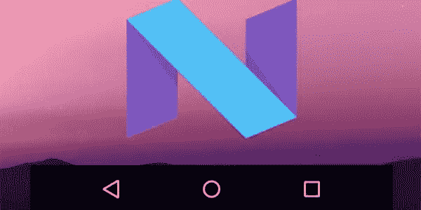
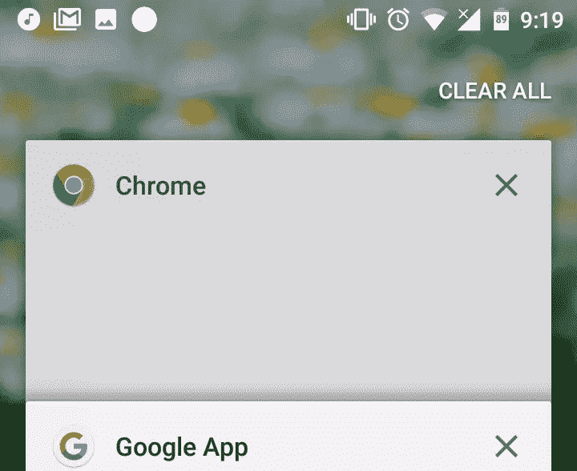
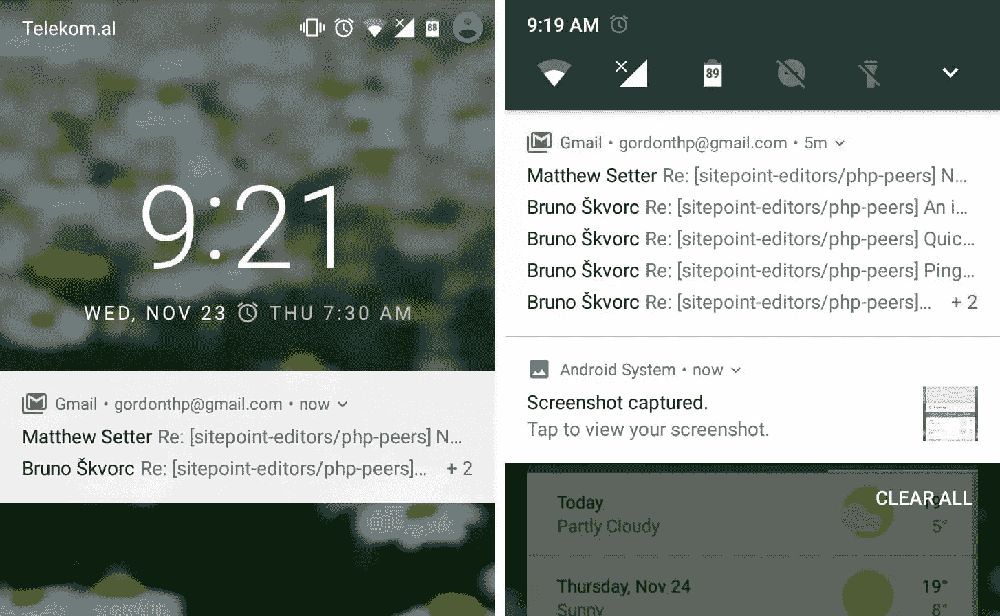
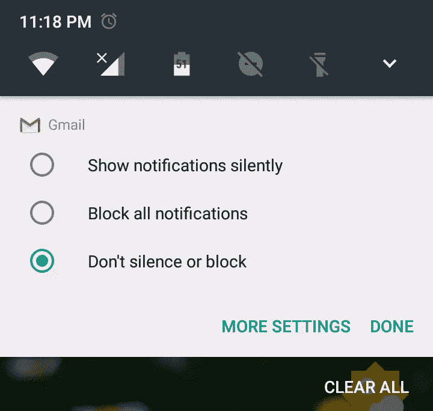
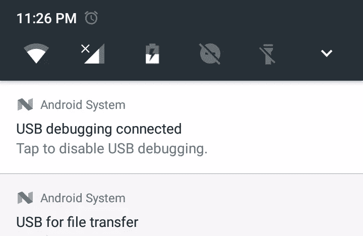
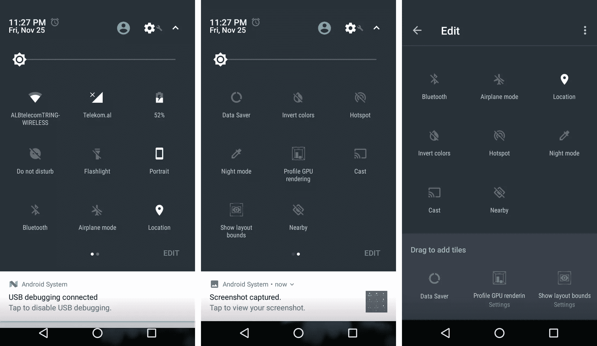
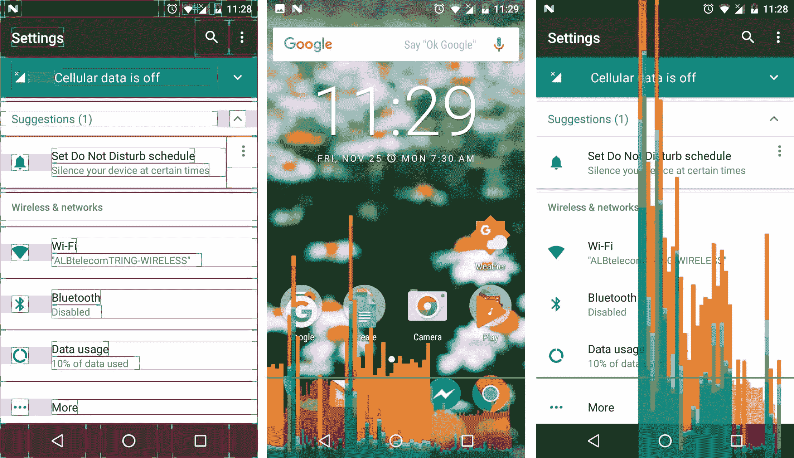
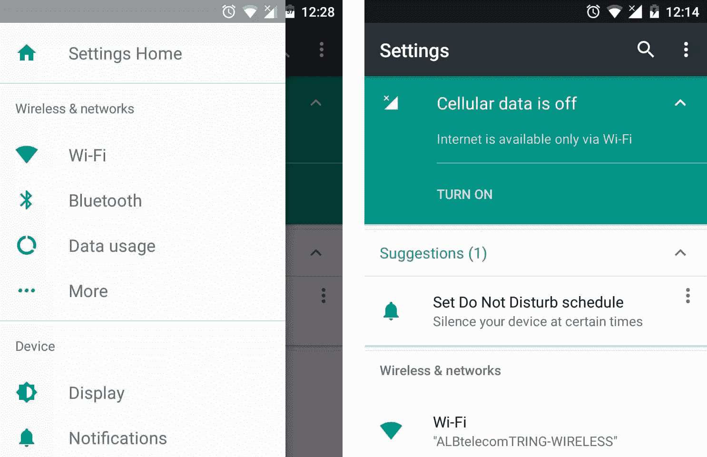

# 安卓牛轧糖有什么新功能

> 原文：<https://www.sitepoint.com/whats-new-in-android-nougat/>

Android Nougat 7.0 是最新的官方 Android 操作系统更新，目前仅在 0.3%的 Android 设备上可用，包括 Nexus 5X 和 6P，以及通用移动 4G 等 Android One 设备。随着每次更新，牛轧糖带来了许多新功能，使用户的体验更好，更容易和更可定制。

先说 Android N 的新特性:

## 上次应用召回

您在导航按钮中看到的方块现在有了新用途。如果你*双击*，你将在两个最常用的应用之间切换。它是点击一次，然后选择第二个应用程序窗口的简短形式。如果你正在使用谷歌文档，但你需要在 Chrome 上查看一些东西，只需打开 Chrome，找到这些信息，然后*双击最近应用按钮上的*，就会自动带你进入谷歌文档。

## 双窗口

这是“最近使用的应用程序”按钮的另一种用法。如果你需要同时使用两个应用程序，现在只需长按“最近使用的应用程序”按钮，就可以让它们共享屏幕。您需要至少有一个最近使用的应用程序才能使用它。您还可以移动应用程序之间的分割线，以便更好地管理空间。此模式可以通过再次长按或清除所有最近的应用程序来禁用。

## 清除所有最近的应用

最后，只需轻轻一点，你就可以跳过所有最近的应用程序！Android 在最近使用的应用程序上添加了一个*清除所有*按钮。它最初是隐藏的，要使它可见，你需要通过向下滑动来导航到最近的应用程序。这是一个防止意外清除所有最近的应用程序的好办法。

## 捆绑通知

来自同一个应用程序的通知现在被分组，你可以滚动浏览它们，查看每个特定的通知，甚至可以回复电子邮件或信息，而无需解锁屏幕。

## 通知重要性设置

我们收到了几乎所有安装在智能手机上的应用程序的通知。但并不是所有的都是重要的，其中一些真的会给我们带来垃圾邮件。现在问题解决了。如果你长按一个通知，你会看到一个关于它的重要性的菜单。要再次启用它，只需进入*设置*->-*通知*。

## 扫描和搜索

想象一下，你在刷你喜欢的应用程序时看到了一个很酷的国家，但你想要更多关于它的信息，除了名称和一些照片。这很容易。长按 home 键，牛轧糖会扫描你的屏幕。一旦找到名字，它会搜索你，并在同一个屏幕上显示结果。你可以对你需要搜索的任何东西都这样做。

## 即时回复

这项新功能提供了与通知交互的能力。您可以从 Messenger、Hangouts 等应用程序以及通知中的其他消息应用程序回复对话。这意味着您在回复邮件的同时会忽略通知。

## 快速快速设置

如果你向下滑动状态栏，你会发现那里有一些快速设置的磁贴。最近，这些瓷砖的数量发生了变化。他们有很多。有时候太多了很难找到合适的。新的解决方案是迷你快速设置栏，其中显示了最常用的磁贴。如果你想看到所有的瓷砖，然后再向下滑动。您也可以使用两个手指向下滑动来打开完整的快速设置栏。

## 自定义快速设置图块

不同的设备有不同数量的快速设置图块，具体取决于硬件。牛轧糖可以让你改变瓷砖的顺序，隐藏那些你不用的。只需点击*编辑*，然后你就可以拖放瓷砖。

## 显示布局界限和 GPU 渲染图

也为开发者增加了一些新的工具。该系统可以分析每个应用程序的布局，并使用矩形显示每个小部件的边界。它还显示了关于 GPU 使用情况的信息图。要使用这两个功能，只需在*快速设置*部分拖动它们的磁贴，然后点击它们。

## 搜索设置并接受建议

*设置*类别是子类别中最受欢迎的类别之一，很多小工具很难找到。但是 Android 试图保持简单，在工具栏中增加了*搜索*选项。您也可以使用左侧的导航抽屉菜单在类别之间切换。为了获得最佳性能，系统也会给出建议。

## 结论

相比之前的版本，Android N 带来了许多新功能和改进。看起来他们中的一些人真的很有用，是 UX 的好想法。

如果您有任何意见或问题，请在下面告诉我。

## 分享这篇文章