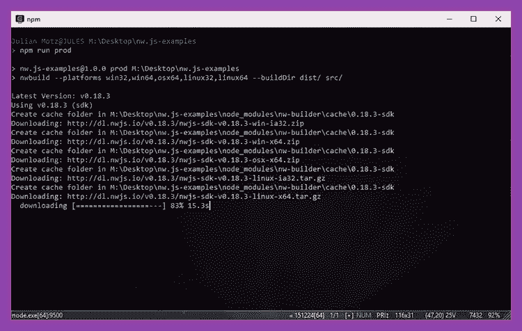
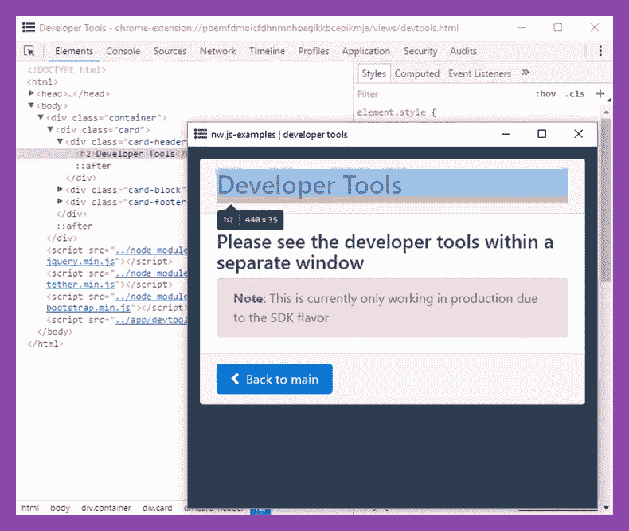
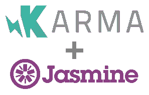

# 用 NW.js 构建跨平台桌面应用

> 原文：<https://www.sitepoint.com/cross-platform-desktop-app-nw-js/>

这篇文章由[蒂姆·塞弗里恩](https://www.sitepoint.com/author/tseverien/)和[琼·尹](https://github.com/newjs)进行了同行评议。感谢 SitePoint 的所有同行评审员使 SitePoint 的内容尽可能做到最好！


NW.js 是一个使用 HTML、JavaScript 和 CSS 等 web 技术创建本地应用程序的框架。在最简单的情况下，您正在使用正常的工作流开发 web 应用程序。在这个过程的最后，您运行一个生成器，将所有内容编译到一个本地应用程序中，然后像浏览器一样显示您的 web 应用程序。这些应用程序被称为“混合应用程序”。

混合应用之所以伟大，不仅仅是因为它们是用你已经熟悉的语言(HTML、JavaScript 和 CSS)编写的，还因为它们提供了超越普通 web 应用的重要优势:

*   控制浏览器和浏览器版本(您知道您的应用程序是由哪个浏览器调用的)。NW.js 混合应用程序使用 [Chromium](https://www.chromium.org/) 显示，Chromium 是一种运行在谷歌 Chrome 背后的开源浏览器。因此，在 Chrome 上运行的应用程序也应该可以使用 NW.js。
*   对视口的控制。例如，您可以定义固定或最小/最大视口。
*   由于本地文件，没有[同源策略](https://en.wikipedia.org/wiki/Same-origin_policy)限制。如果从文件系统中打开一个本地文件，浏览器会阻止不在同一目录中的文件的 [XMLHttpRequest](https://developer.mozilla.org/en/docs/Web/API/XMLHttpRequest) 请求。可以在 NW.js 应用程序中禁用此行为。

它们还提供自定义 API，带来以下优势:

*   Node.js 集成
*   剪贴板访问
*   对文件系统的访问
*   硬件访问(例如，获取打印机列表)
*   托盘图标
*   自定义文件选择器对话框
*   外壳集成(在默认文件资源管理器或浏览器中打开文件或 URL)
*   自定义整个窗口(关闭按钮、菜单栏)和上下文菜单的选项
*   设置和获取缩放级别的能力。

听起来很棒？那我们开始吧。在本文中，我们将在实践中熟悉 NW.js，并学习如何创建混合应用程序。可以在 GitHub 上的[中找到使用本文中的说明构建的示例应用程序。](https://github.com/sitepoint-editors/nw.js-examples)

## NW.js 相对于电子的优势

首先，有一点要提一下:NW.js 不是混合应用的唯一框架。还有一个竞争对手叫做[电子](http://electron.atom.io/)。它始于 2013 年，比 NW.js 晚两年，但因为它来自 GitHub，所以很快就广为人知。现在你可能会对它们之间的区别感兴趣。以下是 NW.js 相对于 Electron 的优势:

*   支持`chrome.*`API。这些 API 可用于与浏览器交互。(你可以在 [NW.js 文档](http://docs.nwjs.io/en/latest/References/Chrome%20Extension%20APIs/)中找到更多相关信息。)
*   有 [Chrome 应用支持](http://nwjs.io/blog/whats-new-in-0.13/#chrome-packaged-app-support)。Chrome 应用是用 web 语言编写的打包应用。(更多信息见 [Chrome 开发者文档](https://developer.chrome.com/apps/about_apps)。)这些应用不同于 NW.js，因为它们没有 Node.js 集成，并且使用 Chrome Web Store 发布。(Chromium 将在 2018 年 8 月前取消支持(见他们的[博文](https://blog.chromium.org/2016/08/from-chrome-apps-to-web.html))。但是根据[这篇文章](https://groups.google.com/d/msg/nwjs-general/UYqoXHFMMag/-UPXaFMABAAJ) NW.js 仍然会支持 Chrome 应用。)
*   支持 NaCl (Native Client)和 PNaCl (Portable Native Client)应用。它们关注性能，因此主要用 C 和 C++编写。(关于如何在 NW.js 中使用它们，请参见本教程
*   具有 V8 快照源代码保护，用于保护您的应用程序的源代码。使用`nwjc`工具，您的代码将被编译成本机代码。(更多信息见[本文](http://docs.nwjs.io/en/latest/For%20Users/Advanced/Protect%20JavaScript%20Source%20Code/)。)
*   具有内置的 PDF 查看器。
*   允许打印预览。
*   在 Web Workers 中支持 [Node.js 集成。它们用于编写多线程应用程序。](http://nwjs.io/blog/v0.18.4/)

然而，电子也有一些值得一提的优点:

*   内置自动更新器(可以关注[本期](https://github.com/nwjs/NW.js/issues/233)关于 NW.js 的一个自动更新器)。
*   向远程服务器自动报告崩溃。NW.js 只写一个本地文件，然后可以手动提交。

还有一个根本的区别。NW.js 应用程序以 HTML 文件的形式指定它们的入口点。这个 HTML 文件将直接在 GUI 中打开。

另一方面，电子应用程序指定一个 JavaScript 文件作为它们的入口点。这个 JavaScript 文件在单独的主进程中打开，然后可以在 GUI 中打开一个 HTML 文件。这意味着理论上你可以在没有 GUI 的情况下运行电子应用。同样，关闭 GUI 不会关闭主进程；您需要通过调用 API 方法来手动终止它。

虽然 Electron 为用 JavaScript 编写的没有 GUI 的桌面应用程序打开了大门，但是如果您只想显示一个基于 HTML 的应用程序，NW.js 应用程序可能更容易设置。

*注:如果你真的喜欢电子的优势，看看 SitePoint 最近的一篇关于[用电子](https://www.sitepoint.com/desktop-node-apps-with-electron/)创建桌面应用的文章。*

## 创建演示应用程序

让我们开始创建我们的应用程序，稍后我们将把它编译成本机应用程序。因为有很多方法可以建立一个 web 应用程序——使用各种 JS 语言(TypeScript、CoffeeScript 等)。)、模块加载器(RequireJS、webpack、SystemJS 等。)、框架(AngularJS、React、Vue.js 等。)和预处理器(SCSS、LESS、Haml 等。)—而且每个人都有自己的喜好，我们只是用了基本的技术 HTML，CSS 和 JS (ES6 标准)。

NW.js 没有为任何设置打开的样板文件(起始项目)。它们都是为特定的框架、模块加载器或预处理器而构建的。因此，我们自己从头开始实现了一个简单的 NW.js 应用程序。这很容易理解，以后您可以根据自己的需要轻松地定制它，或者切换到样板文件。

### 项目结构

首先，我们需要创建我们的项目结构和文件:

```
nw.js-example/
├── src/
│   ├── app/
│   │  └── main.js
│   ├── assets/
│   │  └── icon.png
│   ├── styles/
│   │  └── common.css
│   ├── views/
│   │  └── main.html
│   └── package.json
└── package.json 
```

解释:

*   包含我们应用程序的源文件。
*   `src/app/`包含我们的 JavaScript 文件。
*   `src/assets/`包含图片。在我们的示例中，只有文件`icon.png`——它将在窗口中显示为窗口图标——应该是方形的。
*   通常包含 SCSS 或更少的文件——在我们的例子中，只是一个简单的 CSS 文件。
*   `src/views/`包含 HTML 视图文件。
*   `src/package.json`是 NW.js 应用程序的清单文件(见[清单格式](http://docs.nwjs.io/en/latest/References/Manifest%20Format/))。我们还在这里指定了应用程序的依赖关系。
*   `package.json`是一个 npm [包文件](https://docs.npmjs.com/files/package.json)，我们需要它来构建工作流，并指定在实际的 NW.js 应用程序中不必要的依赖关系(例如构建依赖关系)。

### 创建清单

现在我们已经创建了项目结构和文件，我们可以从 NW.js 清单文件`src/package.json`开始。根据文档中的[，这个文件基本上只需要两个属性，`name`，应用程序名，和`main`，一个 HTML 文件的路径，用作入口点。但是我们添加了更多的信息，如窗口图标的路径，以及最小宽度和高度，以确保用户不会看到任何意外的事情:](http://docs.nwjs.io/en/latest/References/Manifest%20Format/)

```
{
  "name":"nw.js-example",
  "main":"views/main.html",
  "window":{
    "min_width":400,
    "min_height":400,
    "icon":"assets/icon.png"
  }
} 
```

就是这样！应用程序稍后将在开始时打开`src/views/main.html`，因为`main`路径是相对于清单文件的。

### 创建主视图

在这一点上，我们可以编写一个待办事项应用程序。但是我们想重点介绍一下 NW.js 及其特性。出于这个原因，我更愿意让*你*来决定我们应用的功能。我在 GitHub 上创建了一个示例项目 [NW.js-examples](https://github.com/sitepoint-editors/nw.js-examples) 来演示几个 NW.js 特性，比如 Node.js 集成和剪贴板访问。请在您的应用程序中随意使用它。但是也可以用别的。

无论您做出什么决定，您至少必须创建`src/views/main.html`文件，因为它是我们的应用程序入口点。它可能看起来像这样:

```
<!doctype html>
<html>
<head>
    <meta charset="utf-8">
    <title>NW.js-example | main</title>
    <link rel="stylesheet" href="../styles/common.css">
</head>
<body>
    <h1>Hello World :-)</h1>
    <script src="../app/main.js"></script>
</body>
</html> 
```

在实际的应用程序中，您可能有几个其他的视图文件，并用 Ajax 加载它们。为了简单起见，您也可以创建本地超链接并引用其他 HTML 文件。例如:

```
<a href="something.html">Something</a> 
```

然后，在`src/views/`中创建`something.html`文件。[在我的示例项目中，我是这样做的](https://github.com/sitepoint-editors/nw.js-examples/blob/master/src/views/main.html)。

## 安装 NW.js

我们现在已经创建了 NW.js 项目，包括清单和一个主视图。我们最终需要一种方法来直接在我们的开发机器上运行 NW.js in development，并实现一个构建过程，为几个操作系统生成本机应用程序。

为此，我们需要以下两个包:

*   [西北](https://www.npmjs.com/package/nw)(开发)
*   [nw-builder](https://www.npmjs.com/package/nw-builder) (生产)

由于它们与我们实际的应用程序无关(它们只是用于开发和生产构建)，我们在根文件夹中的第二个`package.json`中将它们创建为`devDependencies`，旁边是`name`和`version`字段:

```
{
  "name":"nw.js-example",
  "version":"1.0.0",
  "devDependencies":{
    "nw":"^0.18.2",
    "nw-builder":"^3.1.2"
  }
} 
```

现在我们只需要在项目的根文件夹中运行以下命令来安装`devDependencies`:

```
$ npm install 
```

搞定了。让我们建造。

## 包装和分销

为了简化打包，我们将 npm 脚本添加到我们的`package.json`文件中。它们允许我们运行 CLI 命令，定义在右边用快捷键在左边用 [`npm run`](https://docs.npmjs.com/cli/run-script) 。我们增加两个`scripts`，一个用于开发和生产:

```
{
  "name":"nw.js-example",
  "version":"1.0.0",
  "devDependencies":{
    "nw":"^0.18.2",
    "nw-builder":"^3.1.2"
  },
  "scripts":{
    "dev":"nw src/",
    "prod":"nwbuild --platforms win32,win64,osx64,linux32,linux64 --buildDir dist/ src/"
  }
} 
```

### 直接运行 NW.js

要直接启动 NW.js 应用程序，只需运行:

```
$ npm run dev 
```

这个快捷方式将调用我们在`dev`下的`scripts`中定义的命令，使用 [nw 包](https://www.npmjs.com/package/nw)。在你的开发机器上应该会直接打开一个显示`src/views/main.html`的新窗口。

### 生产构建

生产构建将使用 [nw-builder](https://github.com/nwjs/nw-builder) ，它支持 Windows、Linux 和 macOS 的输出。在我们的例子中，我们为所有这些平台构建了一个 32 位和 64 位版本的包。对于 macOS，目前只能在传统模式下构建 32 位。(参见 GitHub 上的[本期](https://github.com/nwjs/nw-builder/issues/363)。)因此，只构建 64 位。

要运行我们的生产版本，只需运行:

```
$ npm run prod 
```

像直接运行 NW.js 一样，这将使用我们在`scripts`中定义的 CLI 命令。

这需要一段时间…



一旦完成，看看你的`dist/`文件夹。它应该看起来像:

```
dist/
└── nw.js-example/
    ├── linux32/
    ├── linux64/
    ├── osx64/
    ├── win32/
    └── win64/ 
```

太棒了，我们快完成了！

## 测试和调试

### 指南

由于 NW.js 基于 Chrome，手动测试就像在 Chrome 中一样简单。当您遇到一个 bug——视觉上的或功能上的——您可以使用键盘快捷键 F12 打开开发人员工具[,或者以编程方式使用:](http://docs.nwjs.io/en/latest/For%20Users/Debugging%20with%20DevTools/#open-developer-tools)

```
nw.Window.get().showDevTools(); 
```



注意，这需要 [SDK 构建风格](https://github.com/nwjs/NW.js/wiki/Build-Flavors)。如果你想在生产中禁用开发者工具，你可以用不同的[风格](https://github.com/nwjs/nw-builder#optionsflavor)构建 NW.js 或者取消 F12 事件。

### 自动化的

(幸运的是)自动化单元测试被广泛用于确保事情在各种实现中工作，而不需要持续的手工测试。



如果您的应用程序不使用 NW.js 特定的 API 方法，理论上您可以保持您通常的 web 应用程序工作流程——例如，使用 [Karma](https://karma-runner.github.io/latest/index.html) 作为规范运行器，结合 [Jasmine](http://jasmine.github.io/) 作为测试框架。

但是如果您使用的是 NW.js 特定的 API 方法，您需要在 NW.js 应用程序中运行您的测试，以确保定义了 API 方法。一种方法是为 Karma 使用 NW.js 启动器插件，比如[Karma-nodewebkit-launcher](https://github.com/intelligentgolf/karma-nodewebkit-launcher)。它的工作方式类似于 Karma 的任何其他浏览器启动插件:它在 NW.js 容器中打开应用程序来执行检查，然后自动关闭它。

然而，由于 NW.js 不是[无头的](https://en.wikipedia.org/wiki/Headless_browser)(与 PhantomJS 之类的东西相比)，它总是需要物理显示。这意味着在纯 CLI 服务器上运行测试是不可能的。幸运的是，在这些情况下，您可以使用 [Xvfb](https://en.wikipedia.org/wiki/Xvfb) 来模拟显示。例如，这适用于特拉维斯 CI。对于 Jenkins，你需要安装 [Xvfb 插件](https://wiki.jenkins-ci.org/display/JENKINS/Xvfb+Plugin)。更多信息请关注 GitHub 上的[这一期。](https://github.com/nwjs/NW.js/issues/769)

## 结论

希望这篇文章已经让你对 NW.js 的优势和用例有了深入的了解。有太多的理由说明为什么使用混合应用程序比分发包含 HTML 文件的`.zip`文件夹更好，然后从文件系统运行。NW.js 也可以用来替代你的原生应用程序，因为你不需要专注于复杂的图形用户界面，而且你有许多内置功能，比如视频播放器。因为您可以检测环境，所以也可以使用 NW.js 开发一个既可以在普通 web 服务器上运行又可以在客户机上运行的应用程序。

当创建一个新的 NW.js 项目时，首先确定您想要使用的框架、模块加载器和预处理程序——取决于您熟悉什么——或者从头开始。做出这些决定后，您可以找到符合您需求的 NW.js 样板文件。如果没有合适的样板文件，你可以使用基于本教程的应用程序作为基础。

对于开发 NW.js 应用程序，您首选的样板或技术是什么？在这篇文章中使用 NW.js 示例而不是待办事项应用程序实现是否有效？请在评论中告诉我。

## 分享这篇文章