# 在移动用户界面设计中使用配色方案

> 原文：<https://www.sitepoint.com/using-color-schemes-in-mobile-ui-design/>

根据 Kissmetrics 的调查，产品的视觉外观是影响消费者购买决定的首要因素。如今，市场经理们通常会雇佣色彩顾问来帮助确定一种(或多种)能吸引顾客的颜色。他们明白颜色是一种重要的营销工具。手机应用开发者有很多有用的东西可以借鉴。

### 颜色理论

基于三原色(红、黄、蓝)的色轮已经被艺术家使用了几个世纪。第一张彩图是牛顿在 350 年前发明的。

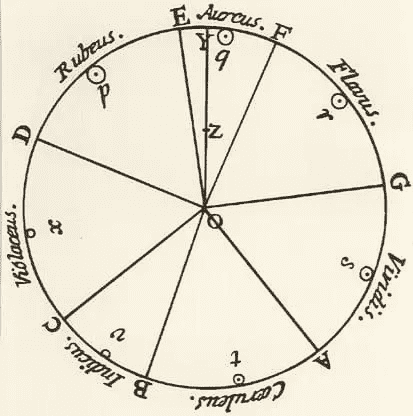

现在使用的色轮包括原色、二次色(绿色、橙色和紫色)和三次色(黄橙色、红橙色、红紫色、蓝紫色、蓝绿色和黄绿色)。

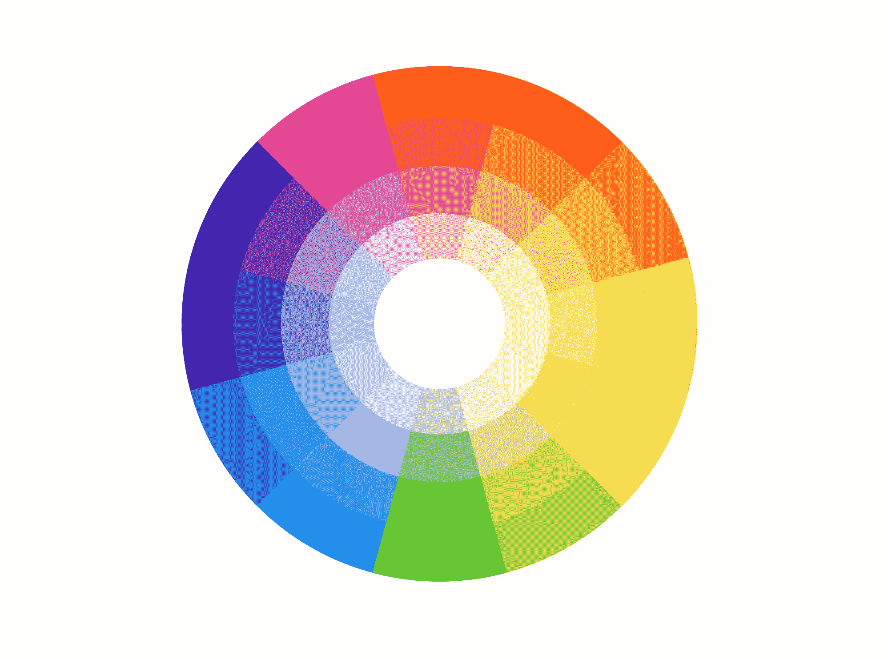

色轮帮助我们创建配色方案。我在下面列出了最常见的。

*   单色配色方案

在这个方案中，只有一种颜色及其色调。

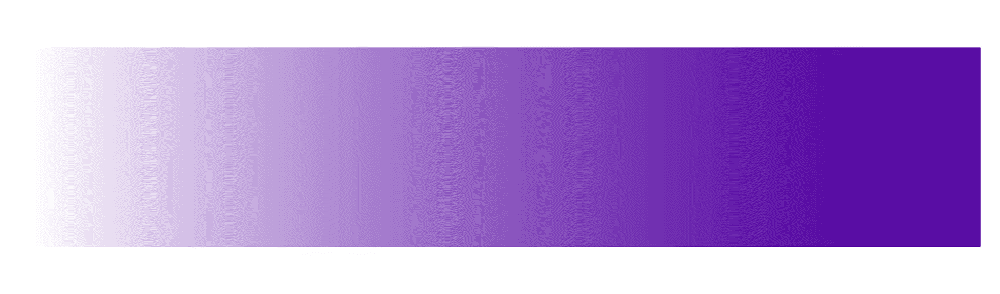

*   模拟配色方案

该方案使用 12 色轮中一个接一个的颜色。

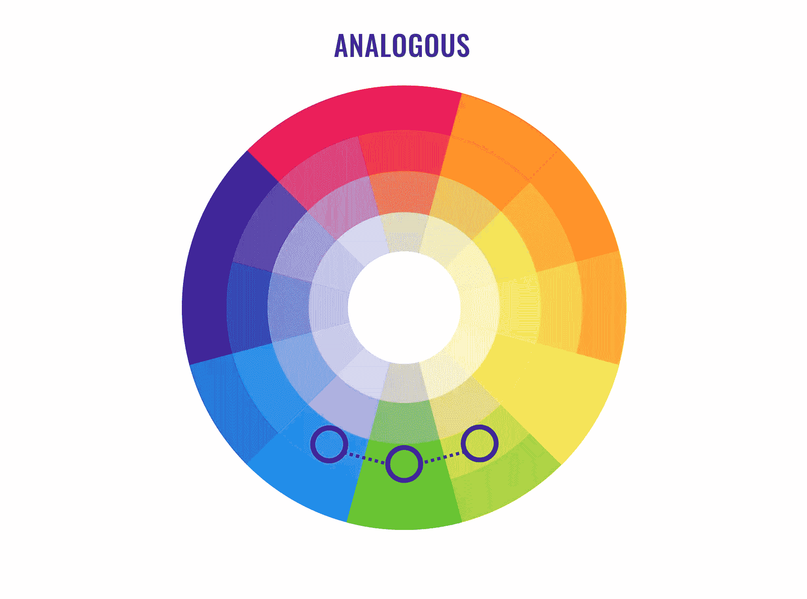

*   补色方案

该方案使用色轮上彼此相反的颜色。

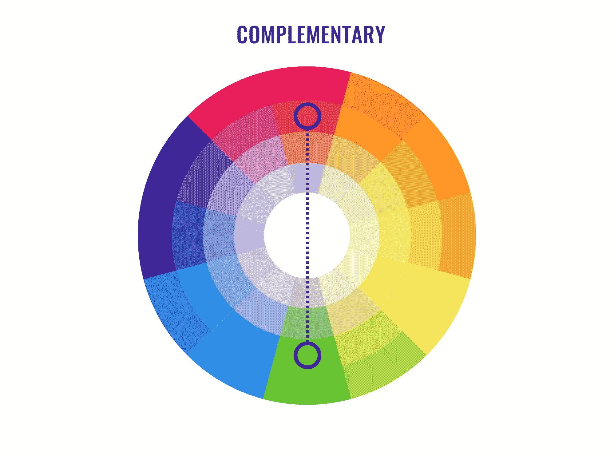

*   三色配色方案

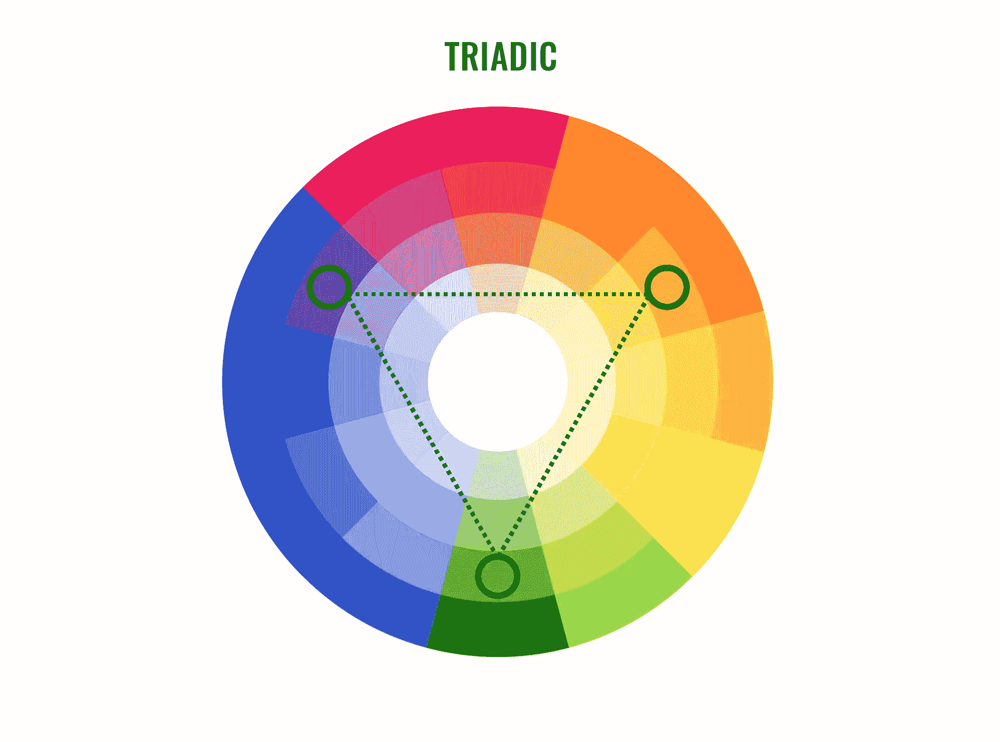

该方案组合了色轮上每四种颜色中的一种。例如，这个应用程序中使用了这样一个方案:

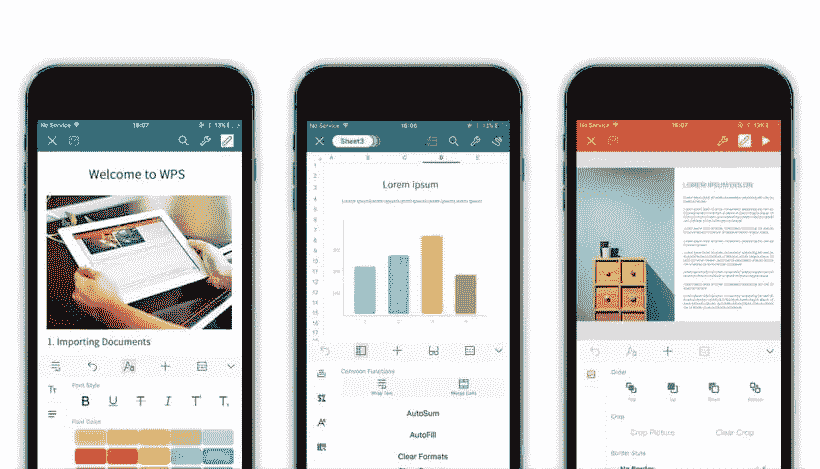

*来源: [WPS 办公室](https://itunes.apple.com/by/app/wps-office/id762263023?mt=8)*

### 颜色的文化意义和颜色象征

根据文化背景，颜色可能传达特定的含义。

例如，英国人把紫色(吉百利包装的颜色)与奢侈品联系在一起，但在台湾却有相反的含义。

红色对西方国家来说有以下含义:精力、兴奋、行动；愤怒；爱和激情；圣诞节(与绿色结合时)；停止；权力。但在东方国家的含义是不同的:新娘，繁荣，喜悦(当与白色结合)，好运。它可以变化更多:生活；愤怒和危险(日本)，泰国(星期日)，哀悼(南非)，等等。

找出下图中其他颜色的含义:

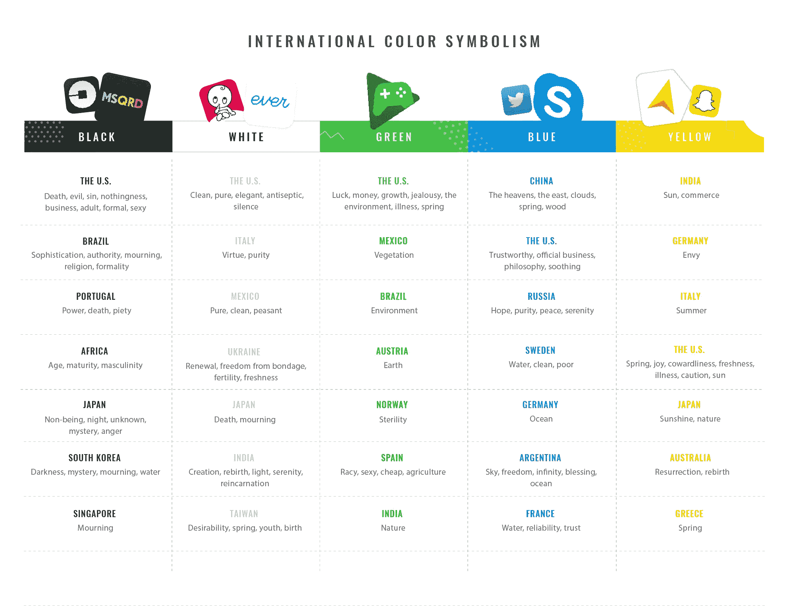

*来源:[全球宣传](http://www.globalpropaganda.com/)，[施乐公司](http://www.office.xerox.com/)，*

麦当劳是一个多品牌网站的杰出例子，根据不同的国家选择不同的颜色。

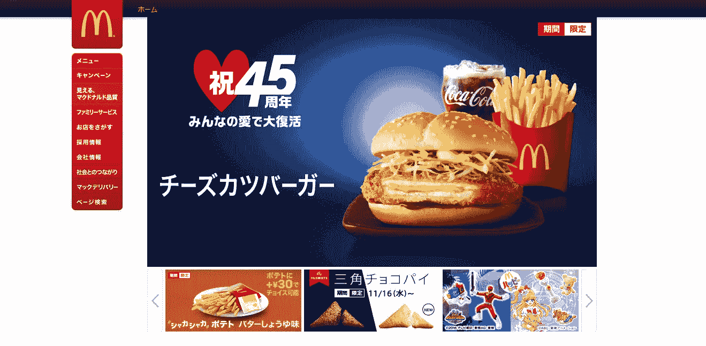

*日本网站。*

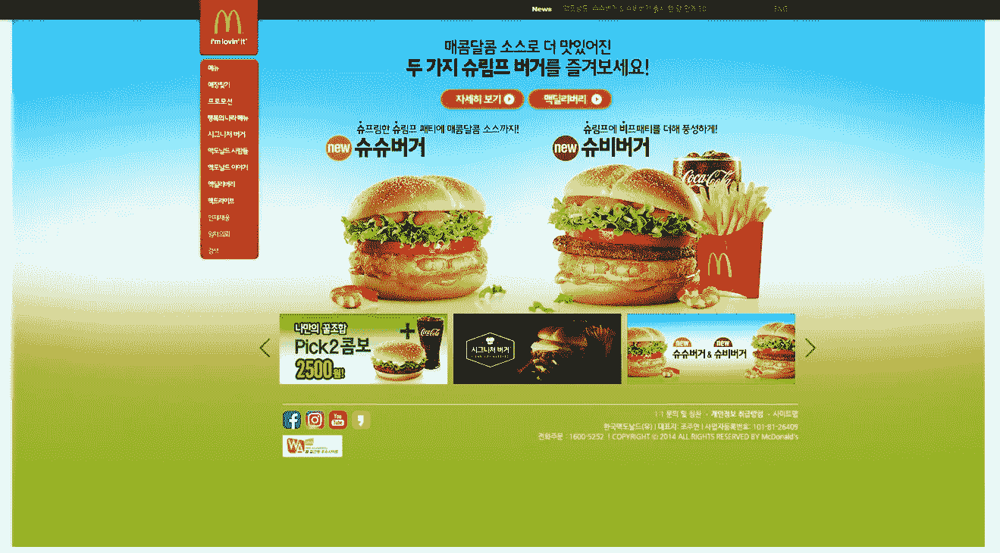

*韩国网站。*

在西方国家，金色代表财富。移动应用程序开发人员经常使用这种颜色来识别应用程序的付费版本:

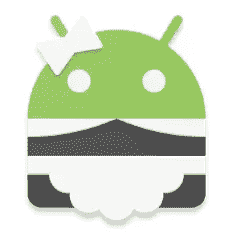

*来源: [SD 女仆](https://play.google.com/store/apps/developer?id=darken)*

### 配色方案和移动用户界面

苹果和谷歌，iOS 和 Android 的开发者，创造了一些基本的设计原则，建议移动应用开发者遵循，为用户提供一致的视觉体验。这些建议包括选择调色板、配色方案、文本颜色等。

Google 提出的[调色板](https://material.google.com/style/color.html)包括原色和次原色。建议应用程序开发人员在他们的应用程序中使用 500 种颜色中的任何一种作为原色，其他颜色作为强调色。

以下是一些配色方案的示例:

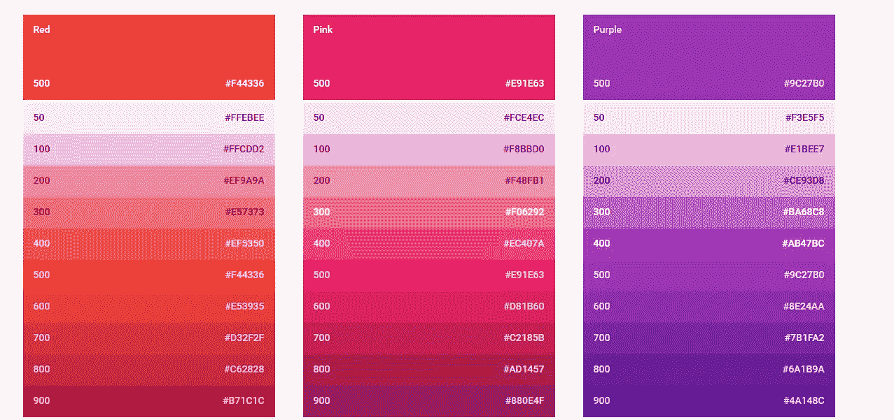

*来源:谷歌*

在选择配色方案时，谷歌建议使用上述调色板中的颜色。谷歌建议从主色调中选择 3 种色调，从次色调中选择一种强调色调。

脸书的应用程序是一个很好的例子，在这个应用程序中可以找到这个方案。

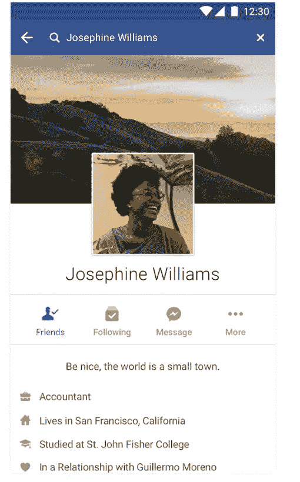

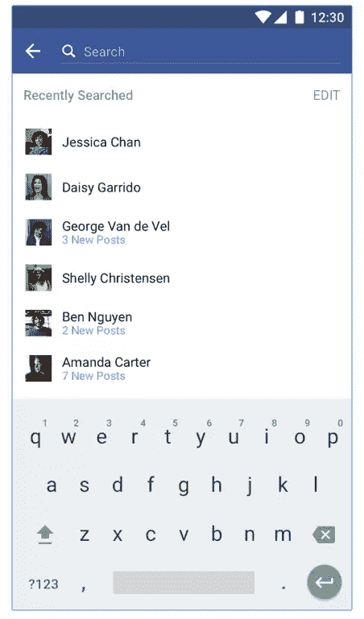

Apple 建议使用以下调色板:

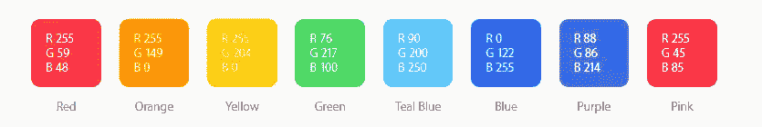

*资料来源:苹果公司*

苹果建议选择单独看起来很棒的应用程序色调，当它们组合在一起时也很棒。此外，它们在浅色和深色背景下看起来都很棒。

以下是一些其他的提示:

*   互补色的使用；
*   一种关键颜色表示交互性；
*   有限的调色板；
*   交互和非交互元素使用不同的颜色；
*   还有[更](https://developer.apple.com/ios/human-interface-guidelines/visual-design/color/)。

[Lifesum](https://itunes.apple.com/us/app/lifesum-healthier-eating-better/id286906691?mt=8) 是一款拥有出色配色方案的 iOS 应用:

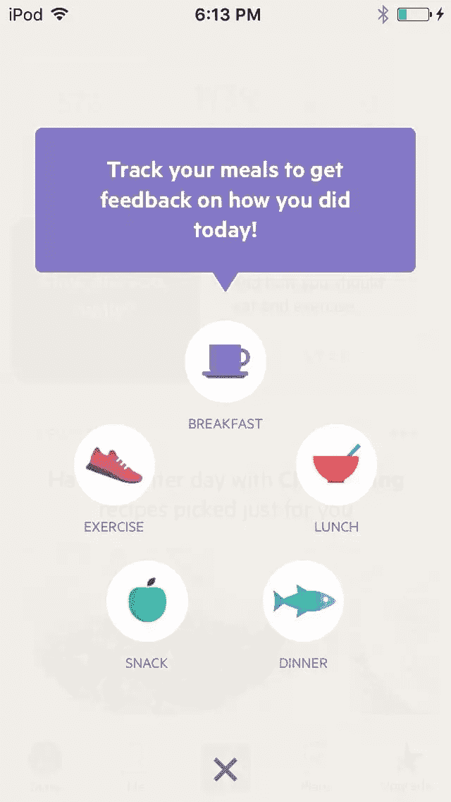

### 选择配色方案和工具的方法

人们通过第一印象来判断，一个好的应用程序设计可以将应用程序提升到应用程序商店排行榜的首位。好的设计也意味着好的配色方案。设计师可以在开发应用程序时使用不同的在线工具，以确保他们选择了正确的颜色，并且他们的应用程序看起来很棒。您可以在下面找到一些工具:

*   [土坯色 CC](https://color.adobe.com/) 。该网站允许其用户使用色轮创建酷配色方案，浏览 Kuler 社区的不同组合，并查看不同图像中使用的颜色。

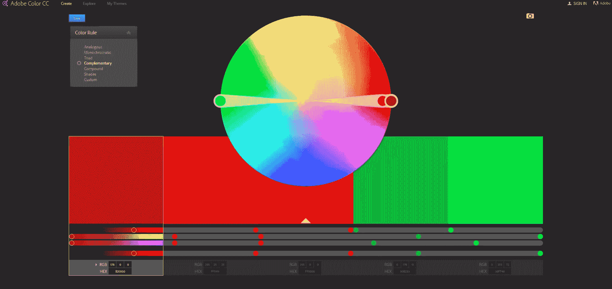

*   [佩顿](http://paletton.com/)。这个工具让设计者为布局选择一种基色，然后它会显示可以和基色一起使用的相似的阴影。那里可用的配色方案使用户能够使用 1-4 种颜色。
*   [平面 UI 颜色选择器](http://www.flatuicolorpicker.com/)。当设计师需要为平面设计选择完美的颜色时，他们会使用这个网站。
*   [材质调色板](https://www.materialpalette.com/)。设计师可以利用这个网站来选择他们最喜欢的颜色，看看他们在一个组合中看起来如何。选择的颜色组合成一个小的设计概念。

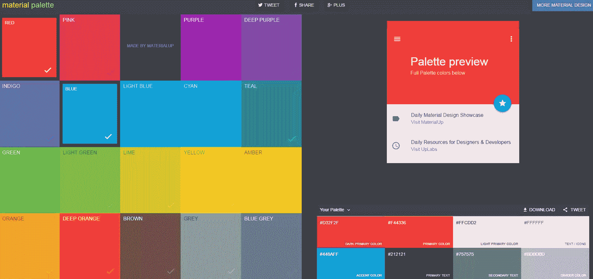

*   [材质 UI](https://www.materialui.co/) 。开发这个工具是为了在设计师和开发人员需要为项目选择颜色时提供帮助。用户还可以访问顶级材料设计颜色列表；他们可以找到平面的 UI 颜色、社交颜色、HTML 颜色等。

### 实际例子

让我们来关注一下免费的 [CALCU 时尚计算器](https://play.google.com/store/apps/details?id=com.candl.athena&utm_source=sitepoint&utm_medium=article&utm_campaign=colors)。这个 4.6 星的应用程序深受世界各地用户的喜爱。

CALCU 可以用于不同的目的，不管是简单的还是科学的。计算。用户可以自由添加/删除他们需要的函数和常量。它还通过允许用户在 20 种不同的皮肤之间进行选择来提供增强的视觉体验。

查看下图，了解一些全球最流行的皮肤:

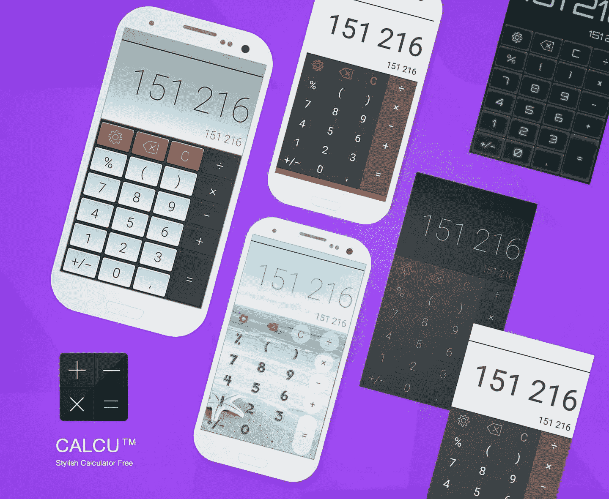

很明显，黑色与蓝色、灰色、绿色和红色的组合是最常见的。在所有这些组合中，“黑色和蓝色”是最受欢迎的。

如果我们看一下按国家统计的数据，我们会发现不同国家的用户选择了相同的皮肤。然而，各国之间也有一些差异。例如，红色配色方案在美国和俄罗斯比在日本更受欢迎。红色在日本意味着愤怒和危险，但它在美国和俄罗斯有更多积极的意义。“红色”这个词(俄语中的“krasni”)被用来形容美丽的东西。红色在美国有许多含义，但像爱、圣诞节和勇气这样积极的含义是最常见的。

这里还有一个例子:蓝色的配色方案在上述国家几乎同样受欢迎，因为蓝色有积极的意义:值得信赖(美国)、希望和纯洁(俄罗斯)以及戏剧超自然生物(日本)。

### 结论

在应用程序开发过程中，颜色可能是一个决定性因素，尤其是如果你想将你的应用程序与现有的类似应用程序区分开来。好的配色方案可以为用户提供出色的视觉体验，并为移动应用开发者提供超越对手的竞争优势。

App 设计师需要明白，颜色是有心理影响的(除了审美)；这是应该考虑的一个重要因素。不同的因素会影响我们对颜色的感知，如文化背景、年龄、性别等。

没有好的颜色选择，就没有好的设计。如果你想吸引一个忠实的用户群，颜色是你在设计应用程序时应该考虑的主要因素之一。

因此，如果你在某个国家或特定人群(如年轻人、成年人)使用的应用程序上工作，首先要进行深入研究，找出你的目标群体更喜欢哪种颜色。最后，你的努力肯定会有回报，因为你的观众会欣赏它。

## 分享这篇文章