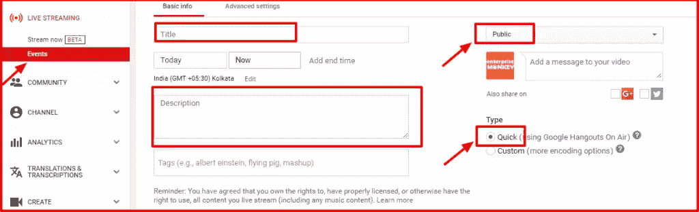
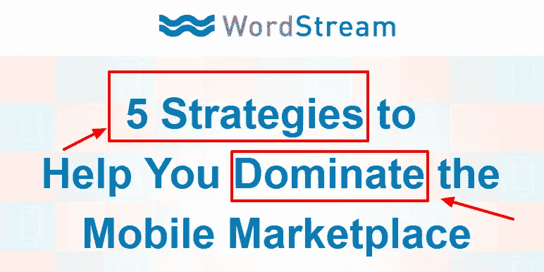
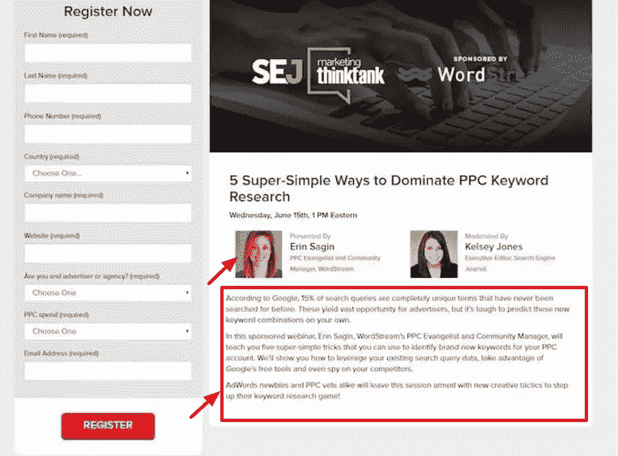
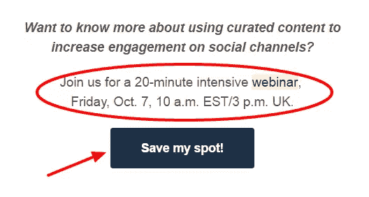

# 通过免费网络研讨会获得业务线索的 10 个技巧

> 原文：<https://www.sitepoint.com/10-tips-for-generating-business-leads-with-free-webinars/>

网上研讨会是获得合格线索的有效策略，尤其是对你的 B2B 业务。这是一个在线研讨会或会议或演示文稿，帮助您展示您的业务专长，并向全球观众推销您自己。它帮助你与你的观众面对面，让他们与你互动，帮助你建立商业信誉。

根据美国营销协会的数据，60%的营销人员在他们的营销计划中使用网络研讨会。

根据尼尔·帕特尔的这篇文章，Kissmetrics、Adobe 和 Buzzsumo 从网络研讨会中获得了高达 22%、20%和 19%的总转化率。

网上研讨会有助于你接触更大的目标群体，并建立你的企业的思想领导力。它让您有机会在定制营销活动的帮助下，获取潜在客户的详细信息，并重新与他们接触。

这里有一些组织免费网上研讨会和产生高质量销售线索的有用技巧。

## 通过 YouTube Live 主持免费视频直播

Hangouts on Air 是举办网上研讨会的免费工具。这个工具可以帮助你随时随地创建网上研讨会。所以，这意味着你可以主持一个会议，有来自世界任何一个偏远地区的全球观众。该工具不显示任何广告，也不要求付费订阅。

您可以使用您的 YouTube 频道轻松地在 Air 上创建您的常去之处。你可以访问“Creator Studio ”,从侧边栏创建一个直播活动，然后选择“Quick”选项。

[(来源)](http://www.enterprisemonkey.com.au)

您可以将相关标题和描述添加到您的活动中，并公开让观众在您的频道上看到。您可以在其他宣传材料和渠道上推广活动的链接，以获得最大的参与度。

该工具可帮助您为错过网上研讨会并希望稍后观看的人录制现场视频。在进行网上研讨会时，您可以选择与观众分享您的屏幕，或让它显示网络摄像头视图。

## 决定主题

网上研讨会由一个人向现场观众演示。但是决定网上研讨会的主题类似于决定其他内容格式的主题，如电子书或白皮书。你需要确保你的演示包括一些给观众的学习。

[(来源)](http://marketing.wordstream.com/WSReg06816GoogleMobileWebinar.html)

与会者会拿出他们宝贵的时间来听你讲话，而且必须有这样做的动机。你的主题和内容不应该是自我推销，它应该为观众当前面临的一些挑战提供解决方案。使用一个强大的标题，给用户带来可量化的好处，肯定会帮助你引起人们的兴趣。

## 计划和测试网上研讨会

对你来说，计划和测试网上研讨会的流程是很重要的。您可以为“问答”环节提供额外的时间。提前校对你的演示内容是很重要的。在演示开始时添加关于内容和你自己或演讲者的简短介绍。你需要谈论演讲者的资格和经验，并在用户中建立信心。

优化网上研讨会的播放速度。你的观众不应该感到无聊，也不应该觉得进展太快。让你的团队就演示的内容和风格给你反馈，并在需要的地方进行改进。

## 创建登录页面

登陆页面是沟通网上研讨会并向目标受众推广的最重要方式。您需要添加网上研讨会的所有细节，例如日期和时间、演讲者和演示主题。

[(来源)](https://www.searchenginejournal.com/sejthinktank-recap-6-ways-increase-life-content-kelsey-jones/168258/)

突出演讲者的个人资料，并展示潜在客户从参加网上研讨会中获得的好处。添加一个 CTA 和一个简单的联系表单，让更多的用户自己注册。

## 电子邮件促销

你需要创建一个引人注目的电子邮件活动，让越来越多的人参与你的网上研讨会。在信息中传达网上研讨会的主要吸引力。它必须包括演讲者的专业知识，主题和网上研讨会的主要好处。

突出目标受众通常面临的问题领域是有帮助的。它将网上研讨会宣传为他们找到合适解决方案的机会。添加网上研讨会将提供的主要优势的要点。

行动呼吁必须创造稀缺和紧迫感，以推动用户行动。也要提到你将专门提供给网上研讨会与会者的任何赠品或折扣。

[(来源)](http://www.buzzsumo.com)

在你的电子邮件中包含 2-3 个时区或一个时区转换器会使来自世界不同地方的潜在客户更容易理解。添加每个演讲者的头像，使你的邀请更有吸引力。

将您的活动发送给对特定网络研讨会感兴趣的目标受众。你需要自动发送“感谢”邮件给所有报名参加活动的人。

电子邮件提醒是让更多用户真正参与的关键。您可以定期创建自动提醒，比如一周一次或两次，最后一次应该在活动前一天或几小时发送。

## 社会化媒体

在脸书、Twitter 和 LinkedIn 等社交渠道上开展活动可以帮助你有效地推广网上研讨会，接触到更多的受众。在您的社交帖子中提供登录页面或活动页面的链接。你可以每天发一篇帖子，谈谈参加网上研讨会的好处。

在帖子图片中添加日期、时间和发言人的详细信息。你也可以提及并标记你的主要发言人，以联系他们。社交封面图片有助于向所有现有和新的社区成员展示您的网上研讨会。

## 博客

您的博客是推广网上研讨会的重要渠道。在帖子中谈论网上研讨会的主题。你也可以写一系列有趣的博客文章，并在每篇文章的末尾添加一个注册 CTA。在博客的侧边栏或标题部分添加横幅，以获得更多的参与。

## 网站主页

你网站的主页代表你的业务。这是有效推广网上研讨会的重要场所。它通常会吸引网站的大部分流量。您可以在主页上开辟一个区域来宣传网上研讨会及其细节。这将有助于您更轻松地实现注册目标。

## 让你的演讲引人入胜

一旦你完成了网上研讨会的推广工作，并开始着手进行，你需要确保让与会者有一个愉快的体验。让观众参与 30-45 分钟是一项你可以培养的技能。你需要和你的观众进行对话，而不是做一个正式的报告。

> “在直播网络研讨会上，82%的用户参与了问答，35%的用户参与了社交。” [*【来源】*](https://instapage.com/blog/webinar-landing-page-examples)

利用投票和问题使体验更具互动性。全神贯注于那些与你互动并交流观点的用户。与与会者一对一交谈时记下他们的名字。

让用户更容易理解正在说的和讨论的内容，让所有的东西都保持适当的间隔和放松。

## 赠品

你需要确保网上研讨会结束后观众会很开心。提供免费的内容升级，如电子书下载或产品或服务折扣。这应该只发给那些完成课程的人。

赠品也有助于提前推广你的网上研讨会。您可以在活动中谈论这些，以吸引更多潜在客户，并让他们注册和参与。向所有与会者发送跟进邮件，并附上活动反馈表。您可以将录制的视频分享给希望再次观看或完全错过的人。

## 最后的想法

如果你是 B2B 企业主或营销人员，你不能错过组织网络研讨会。他们非常有助于与你未来的客户建立密切的联系。你可以展示你在自己领域的知识和专长，并产生高质量的销售线索。网上研讨会的目标应该是帮助你的目标群体解决他们当前的问题。有了这个动机和一个明确的战略，你一定会成功实现你的销售目标，创造更多的业务。

## 分享这篇文章