# 使用 ICEcoder 在浏览器中编辑代码

> 原文：<https://www.sitepoint.com/edit-code-in-the-browser-with-icecoder/>

*本文由 [ICEcoder](https://icecoder.net/) 赞助。感谢您对使 SitePoint 成为可能的合作伙伴的支持。*


在历史上，开发网站需要您最喜欢的代码编辑器或 IDE 的帮助。无论您是在自己的机器上进行本地开发，还是在一个实时开发网站上工作，您都有可能使用传统程序来构建您的网站，例如 Sublime Text、Notepad++、Aptana Studio、Brackets 或任何其他程序。

直到最近，这还是唯一的选择。仅仅在五六年前，网络还没有现在这么强大，浏览器的使用更加分散，所有这些浏览器的行为方式也更加不一致。以前，在你的工作生活中没有真正使用基于网络的编辑器的机会，但现在它正成为一个更可行的解决方案。

## 开发人员对编辑器的要求

开发者需要工具来帮助我们构建伟大的系统，无论是网站、应用还是介于两者之间的任何东西。使用记事本等基本编辑器进行开发的日子已经一去不复返了。对于有用的代码编辑器，它需要提供很多东西:

*   易于使用，混淆最少
*   功能丰富，包含所有您认为理所当然的元素
*   反应灵敏快速
*   可靠且坚固
*   改善工作流程和提供帮助的功能
*   扩展性和定制

你对编辑器的选择会直接影响到你工作的方方面面，所以选择一个能让你的生活更轻松的编辑器是很重要的。

当开发人员谈论他们想要的编辑器特性时，他们谈论的是代码提示、去林挺和多语言语法高亮显示。

你很少听到开发者要求一个完全在线的编辑器。这种情况可能正在改变。

## 基于浏览器的代码编辑器

过去我曾经想过在网上完成所有的开发工作，但是每次我尝试的时候都会遇到太多的问题，以至于无法坚持下去。

每过一两年，我都会再试一次，看看情况是否有所改善。要被认为是一个现实的选择，编辑器必须看起来和感觉上像一个具有相同(或更好)功能的传统编辑器。大多数都没有达到这个标准。

有许多基于浏览器的编辑器，比如 [CodeAnywhere](https://codeanywhere.com/) 和 [ShiftEdit](https://shiftedit.net/) ，它们工作得相对较好。我们已经到了这些应用成为有力竞争者的地步，今天我们将看看一个拥有广泛功能的应用。

## ICEcoder:一个有效的编辑器

我小心翼翼地接近 ICEcoder，将它与我喜欢的编辑器(Aptana Studio)进行比较。我对入门如此简单印象深刻。使用其他工具时，我不得不花很大力气让它运行起来，但是使用 ICEcoder 只需要几步，我就不用编码了。

## 使用 ICEcoder 开始并运行

了解 ICEcoder 的最好方法是启动并运行它，体验它的所有特性。

您可以通过 localhost 在您的机器上运行它，或者将其安装在面向公众的域上。由于 ICEcoder 的一个主要优点是你可以在任何地方开发，我们将把它设置在一个现场。

### 下载 ICEcoder

您可以通过下载按钮从网站获得 ICEcoder(您需要提供一个电子邮件地址)，或者您可以导航到您的顶级目录并从命令行 git 克隆文件:

```
$ git clone git@github.com:mattpass/ICEcoder 
```

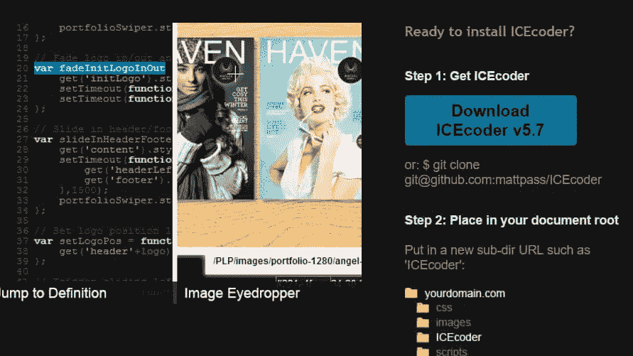

### 将文件复制到您的服务器

您需要导航到根目录(根据您的系统，可能是类似于`public_html`或`httpdocs`的目录)，然后创建一个新的子目录来存放 ICEcoder。我在我的测试服务器上创建了一个`icecoder`目录，但是你可以称它为任何东西。

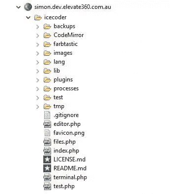

请务必将您的文件夹权限设置为`755`并将您的文件权限设置为`644`，以确保一切正常工作。

### 登录并四处游玩

现在您已经准备好了所有的部分，您需要打开您的浏览器并导航到您的站点，添加您选择的子目录的名称。以下是我在我的域名上访问它时的最初外观:

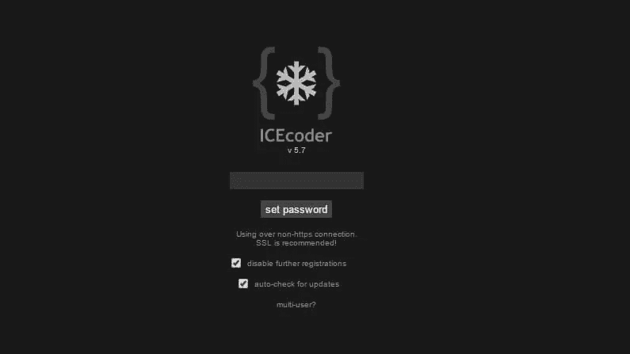

当您第一次启动它时，您会看到配置屏幕。这允许您设置密码和一些基本选项。这些可以在以后更改，但现在最好设置一个密码。

您可能想要设置的一个非常酷的特性是多用户系统，它允许多人登录编辑器。我们稍后将更深入地研究这个问题，但是现在知道它的存在是很好的。

登录后，您应该会在左侧看到您的文件目录，在右侧看到仪表板。这是我的设置——除了一个 WordPress 安装之外，它是相当空的。

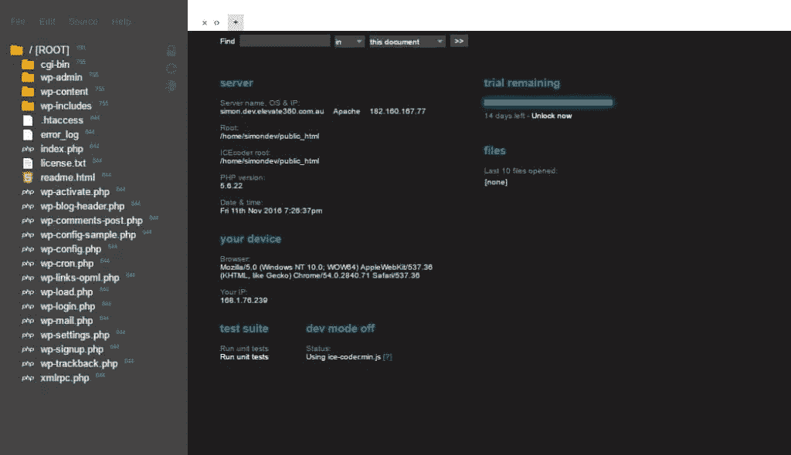

## 探索 ICEcoder 的特性

ICEcoder 在文档中概述了它的几个特性和功能。我们将会看到它的一些优点。

我在我的根目录下添加了一个 WordPress 的副本，这样你就可以看到 ICEcoer 在现实世界中是如何工作的。你绝对应该用你常用的技术来尝试一下，看看它会如何为你工作。

### 在任何地方编码的能力

ICEcoder 的一个好处(我认为是它最强的特性)是，作为一名开发人员，您可以在任何地方使用任何设备进行编码。

如果你在一个开发服务器上工作，你需要在每一个你想要连接的设备上安装你的代码编辑器。你需要把它放在家里的台式机上，放在你的笔记本电脑上，这样你就可以远程开发，也可能在你的办公室里开发。虽然拥有不同的设备并对它们进行设置很好，但更好、更具前瞻性的解决方案是只使用网络。

只要你有互联网连接，你就可以发展和生产。

顺便提一下，我已经在我的台式机、笔记本电脑和平板电脑上使用了 ICEcoder，它们都像预期的那样工作。我想说，只要你的设备足够大，你应该能够在旅途中编辑。电话和更小的设备除了修复小的错误之外，一般来说编码都很糟糕。

### 多语言支持和代码帮助

代码编辑器需要支持多种语言。无论是像 Aptana Studio 这样的通用编辑器，还是像 Android Studio 这样更专业的编辑器，编辑器都需要能够处理各种文件格式，并相应地设计它们的样式。

ICEcoder 处理所有你期望的开箱即用的不同文件，比如 HTML、CSS、SASS、JavaScript、PHP 等等。还支持实现其他语言。每种语言在编辑器中都有自己独特的颜色和样式，很容易区分它们，并在关键字、属性、元素和值之间提供足够的对比。

下面是 ICEcoder 如何使用默认主题显示样式表，这样可以很容易地看到和区分你的选择器、属性和值。

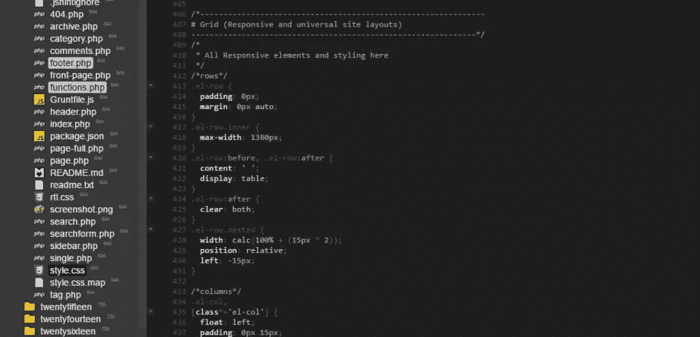

### 代码提示

另一个受欢迎的特性是代码提示或代码辅助。

这些特性在您编写代码时发挥作用，并为您提供适用于当前文档的选项或值。例如，当你编辑一个 HTML 文件时，当你输入时，ICEcoder 会动态显示一个值列表。它在默认情况下是启用的，可以在 UI 的右上角附近打开或关闭。

这里你可以看到它提供了自动完成剩余的`<article>`标签。

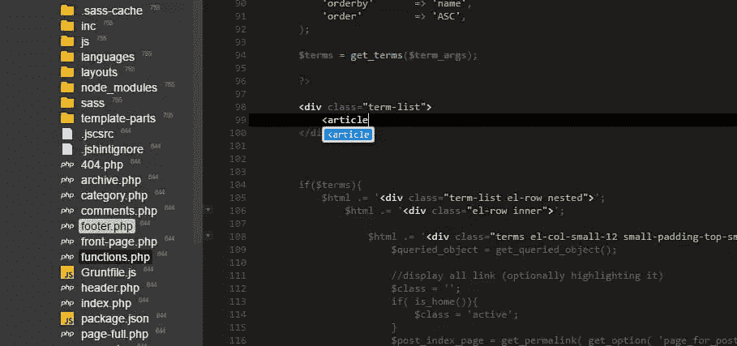

当使用 CSS 或其他具有数十或数百个选项的语言时，能够看到所有可应用的值是非常方便的。

即使没有打开代码辅助，ICEcoder 也会执行以下操作来帮助您加速开发:

*   自动关闭新打开的标签
*   自动括号校正，添加您的结束括号打开功能
*   显示尾随空格(向您显示不应该有空白的地方)
*   通过制表符或空格缩进(对于那些用空格缩进的疯狂的少数人！)
*   换行或拆分

您可以在 ICEcoder 设置的“风格”部分轻松调整这些选项。

### 主题和自定义样式

ICEcoder 的默认风格是深色主题，深色背景上有浅色文本。您可能希望根据自己的视觉偏好来更改这一点。

ICEcoder 提供了二十多个默认主题，可以在设置面板的“风格”标签中点击切换。

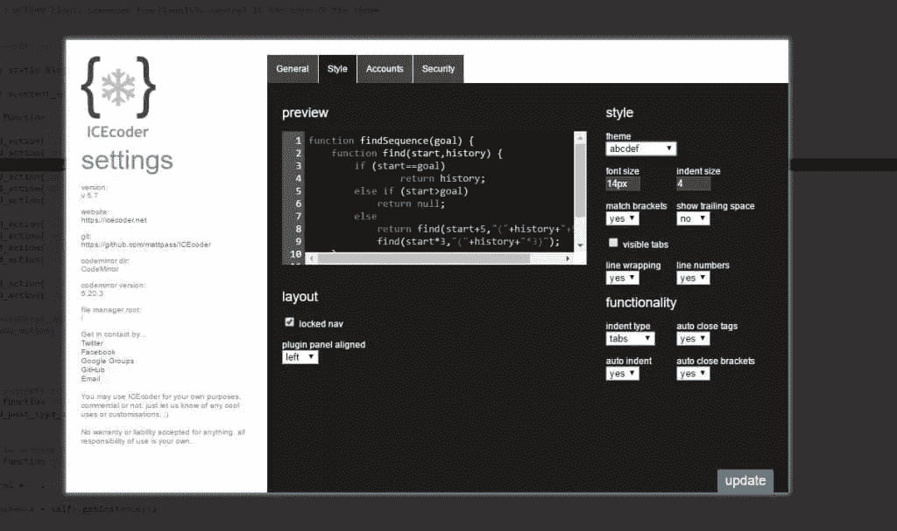

这里有一系列不同的风格。大部分都有很大的反差，间距，布局。

如果你对这些主题不感兴趣，你可以创造自己的主题。这些主题只是带有各种规则的样式表，用于指定颜色和布局。您可以在`/CodeMirror/theme/`文件夹下找到它们，每个都有自己的样式表。

您可以编辑现有的主题并保存它，或者复制现有的主题并根据您的需要调整样式。基本的方法是简单地定义颜色，但是如果你知道你在做什么，没有什么能阻止你疯狂地设计你的风格。

准备好新样式表后，可以在设置中选择新主题(记得更新样式表顶部定义的主题“名称”,以便识别它)。

### 插件和扩展性

ICEcoder 拥有一系列插件，你可以安装这些插件来提供额外的功能。

如果你将鼠标悬停在文件浏览器的左侧，插件菜单将会展开。在这里你可以看到你已经安装的所有插件的快速列表。你可以点击底部的“+ / -”图标来打开插件管理器:

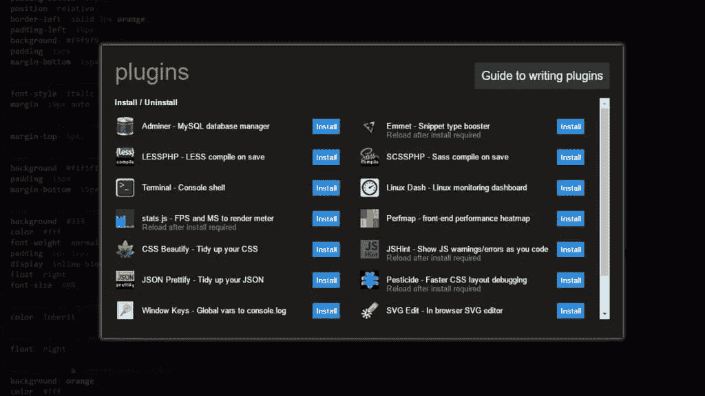

这里有几个插件可供你选择。这些插件的范围从数据库管理器、代码和语法检查器到 SVG 编辑器。

例如，如果你经常处理很多颜色，你可以使用 **Farbtastic 颜色选择器**在 CSS 中预览你的颜色，甚至是内嵌颜色选择器。

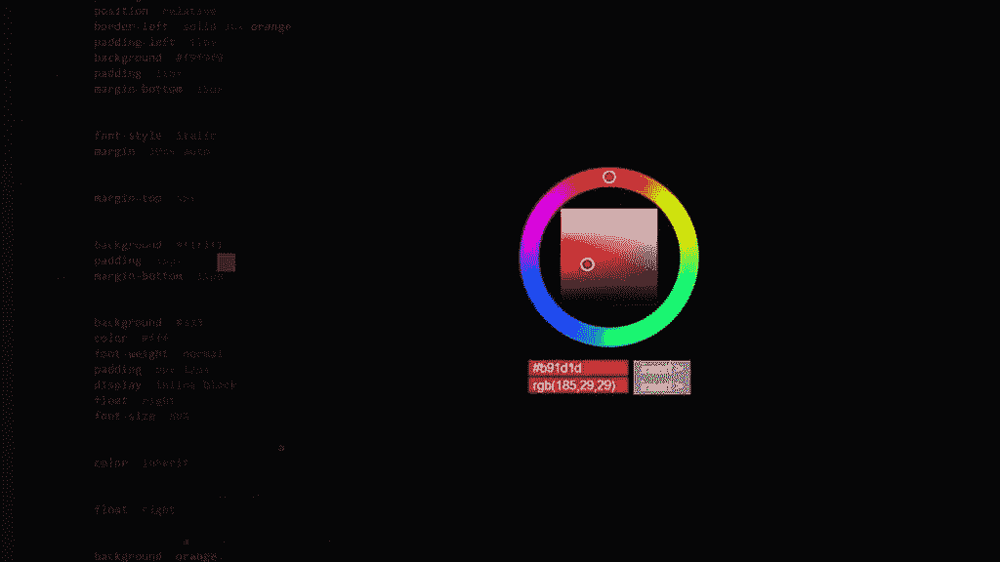

像这样的插件真的可以帮助简化你的工作流程。不需要跳转到外部 app 查找 RGB 或十六进制颜色，色轮 UI 简单易用。

JS 提示插件是另一个很棒的选择。这个插件可以帮助你去除 JavaScript 代码，找出常见的错误，比如拼写错误，遗漏的分号，不正确的关键字等等。这个插件在有错误的行上附加一个错误标记。

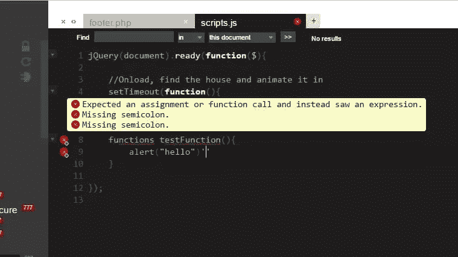

这里我拼错了关键字`function`，并省略了其中一行末尾的`;`。两次插件都发现了错误。

### 小地图滚动条/功能和类别列表导航

ICEcoder 的两个最新功能是**小地图滚动条**和**函数/类列表导航器**。这两者都为您提供了一种更容易直接跳转到函数定义或代码段的方式。

在主窗口的右边有一个小图标，可以启动小地图滚动条。启用后，您的文件的迷你版本将显示在右侧。您可以用鼠标拖动，将主代码编辑器滚动到您选择的部分，如下所示:

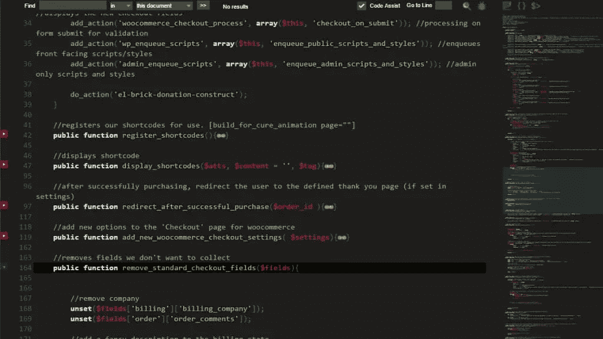

当你有一个很大的文件，你需要很容易地跳到一个部分时，这真的很有用。

一些桌面代码编辑器提供了类似的东西，这是你会喜欢的东西之一——你可以轻松地上下滚动你的大文件，并停在你需要的地方。

右上角还有一个类似两个括号的图标。如果您启用此选项，将会显示当前文件的函数和类的列表。

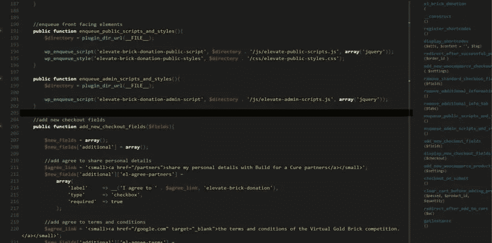

点击列表中的条目会把你带到文档的相关部分，如果你有几个包含方法的类或者一个包含一堆函数的平面 PHP 文件，这是很好的选择。我发现当我构建插件或主题时，这个选项节省了我在文档中寻找东西的大量时间。

### 终端/命令支持

从 6.0 开始，ICEcoder forward 还附带了一个内置的终端/命令行工具，让您可以更好地控制开发环境。如果您使用过 Windows 命令行或 Linux/Mac 的终端，这个终端对您来说会非常熟悉。

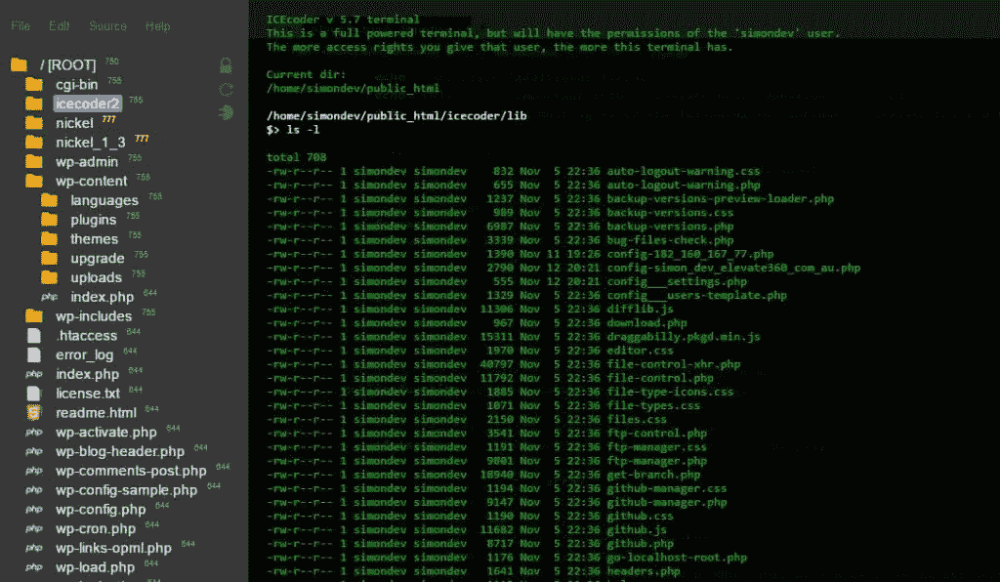

航站楼很棒，因为你可以方便地四处走动。如果您想到达最顶层的目录(甚至在`public_html`或`httpdocs`之外)，您可以通过以下命令导航:

```
cd / 
```

您可以执行的所有普通终端任务都可以在这里执行(基于您放置 ICEcoder 的位置——如果您将它放在一个 cPanel 帐户中，您将无法跳出并进入另一个帐户)。如果我想得到 WordPress 主题 215 的大小，我可以导航到正确的目录并输入下面的命令:

```
du -sh twentyfifteen 
```

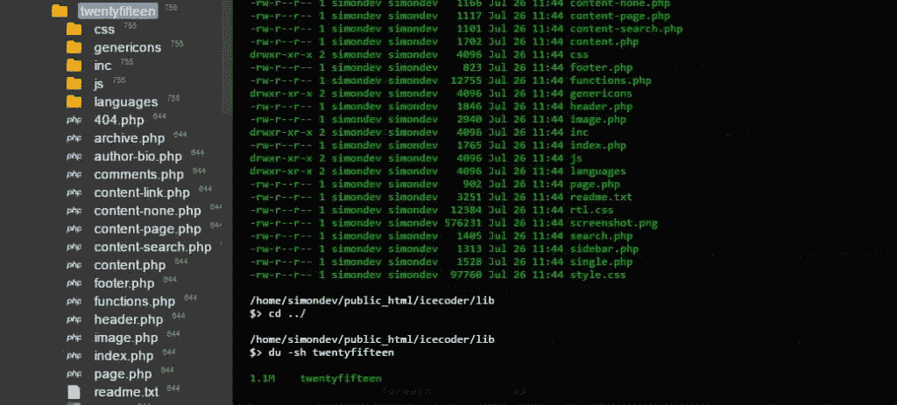

这给了我这个目录的总大小。

这对执行服务器端 JS 真的很有用。如果您使用 NPM 将 SASS 文件编译成 CSS，您可以从这个终端触发您的命令，它应该工作。您的里程数可能有所不同，但是我设法使用 Grunt 运行了几个任务，一个监视 SASS 文件中的任何变化，另一个编译它。

如果我使用我的桌面代码编辑器，我必须 SSH 到我的开发服务器(通过一个不同的应用程序)，导航到项目并在那里运行命令(来回切换以确保一切正常)。

这是一个非常棒的特性，也是您在使用编辑器时绝对应该研究的内容。

### 动态搜索/查找和替换功能

大多数编辑器都有某种搜索和查找替换功能，但是 ICEcoder 的工作方式值得一提。

您可以搜索当前文档、所有打开的文档或选定的文件。这让您可以快速检查一个函数是否被调用以及在哪里被调用。如果我想看看我的哪些模板文件中有函数`get_header`，我可以使用这个工具，它会显示引用它的文件。

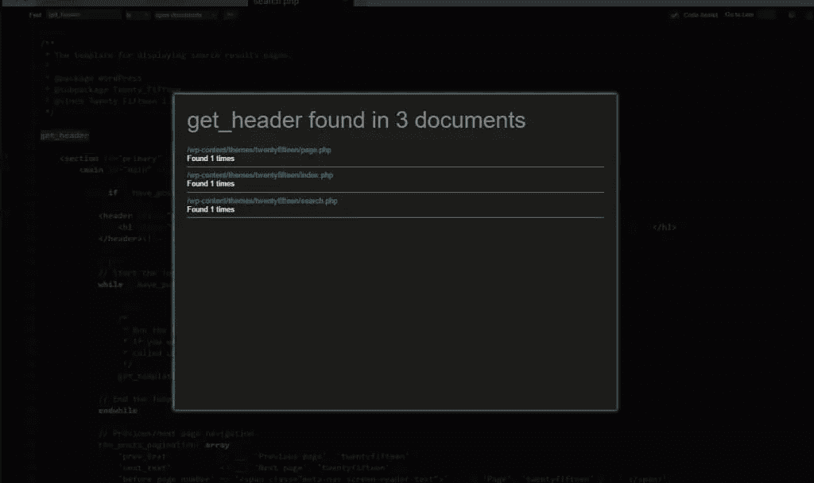

您还可以使用替换功能来查找字符串或函数，并在当前文件、所有文件或仅选定的文件中替换它。如果你在你的应用程序中进行大量的函数重命名或者移除变量，这对于节省时间是非常有用的。

### 固体稳定性

你的编辑需要坚如磐石。您不应该担心它崩溃、出错或做任何奇怪的事情(比如不保存更改或破坏您的开发环境)。在考虑基于浏览器的编辑器时，这一点更加重要。

在过去的几年里，ICEcoder 通过几次大的修改不断得到改进。不像其他编辑器那样一年更新一次，使用基于浏览器的解决方案，修复和改进的周转时间要快得多，一年中会有几次版本跳跃。

当我测试 ICEcoder 时，一切都为我工作。我在编辑文件、保存更改或处理完整项目时没有任何问题。如果您在浏览器中运行奇怪的扩展，您的里程数可能会有所不同，并且可能会受到影响。由于这是一个基于 web 的解决方案，禁用或修改 JavaScript 的扩展应该被禁用(或者 ICEcoder 应该被列入白名单)。但是除了这些边缘情况，只要你使用的是现代浏览器，你就不会有任何问题。

如果你确实遇到了问题，这个项目在 GitHub 上，所以你可以申请传票或者联系他们寻求支持，这是传统桌面编辑器所不能提供的。

### 多用户帐户/安全性

由于 ICEcoder 是一个基于浏览器的编辑器，您可以通过一个 URL(如`simon.dev.elevate360.com.au/icecoder`)直接访问它。虽然这使您可以在任何地方访问您的编辑器，但它也潜在地向外界公开了您的工具。当你第一次设置 ICEcoder 时，你可以给自己一个密码并启用自动登录——这对大多数用户来说都很好。

如果你喜欢冒险，你也可以建立多个用户账户。这个过程有点困难，但是在“安全”下的设置中，你可以启用注册和多用户支持。您可以使用此过程为您的环境创建新帐户，然后将这些详细信息提供给贡献者。

### 其他几个值得注意的方面

虽然大功能很重要，但决定一个编辑器成败的是一些小事情。谢天谢地，ICEcoder 已经确定了这些小元素，包括:

*   自动/内容感知标签
*   使用额外的颜色选择器预览图像–您可以双击图像直接在编辑器中打开它们
*   全屏编辑选项
*   多光标支持—您可以在一个页面上定义多个光标。编辑时，更改将立即应用于所有光标。
*   函数的括号匹配
*   能够看到每个文件的文件/文件夹权限(能够快速更改)
*   用于恢复或注释掉部分的 Escape 键
*   功能部分折叠

需要注意的一点是，你可以**最大限度地使用 ICEcoder 的 14 天试用版**。之后，它会提示您购买许可证密钥。虽然传统上代码编辑器是免费的，但是花几美元买一些你在工作中会花上几百甚至几千个小时使用的工具是完全合理的。如网站所述，[的定价取决于所需的按键数量。](https://icecoder.net/pricing)

如果你不想为编辑器付费，你可以一直免费使用之前的版本。Matt Pass(主要开发人员)一直在 ICEcoder 的 GitHub 帐户上解决问题并改进系统，所以你可以相信 ICEcoder 会随着时间的推移不断改进。

## 把一切都包起来

总的来说，ICEcoder 是一个强有力的竞争者，它提供了你所期望的传统代码编辑器或 ide 的大部分功能。

不管你需要做什么类型的开发工作，这个编辑器都应该有一系列的特性和插件来满足你的需求。

对我来说，ICEcoder 最吸引我的地方是能够在登录后几秒钟内完成编码。我可以在家里的台式机上，与家人一起在笔记本电脑上，甚至在平板电脑上，我可以轻松地编写代码。

如果你想拓展业务，尝试一个新的编辑器，那么 [ICEcoder](https://icecoder.net/) 绝对是一个强有力的候选人。

## 分享这篇文章