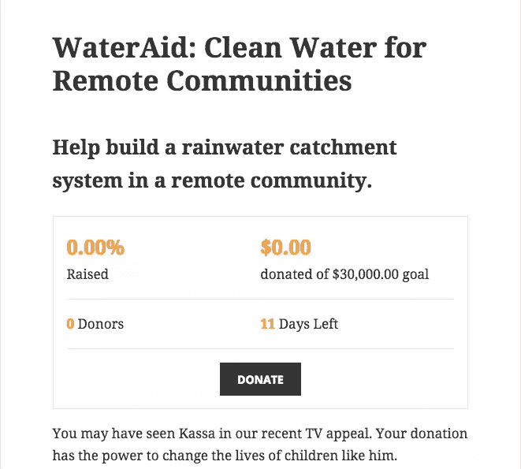
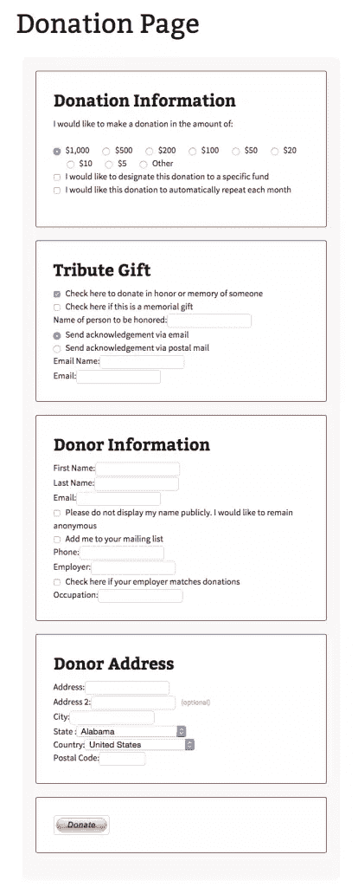
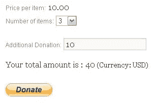

# 6 个最好的 WordPress 捐赠插件

> 原文：<https://www.sitepoint.com/best-donation-plugins-for-wordpress/>

虽然这是常识，但它总是值得一提:WordPress 最强大的特性之一在于它多样而详尽的插件列表。然而，在密密麻麻的选项森林中导航是相当耗时的。

在这篇文章中，我是来帮忙的。我们将概述一些流行且强大的插件，它们为你的网站提供了收集捐款的能力。

捐赠插件的使用正在增加，据我估计，我认为它受到了越来越多的独立内容创作者的严重影响。对于有创意的在线企业家来说，捐赠是内容货币化方式中相对较新的一种，为广告和电子商务提供了一种有趣的替代方式。当然，现在也有慈善机构和非营利机构可以轻松地接受在线捐赠。

但是有哪些最好的捐赠插件呢？

## [1。给](https://en-au.wordpress.org/plugins/give/)

Give 自称的目标是“让慷慨民主化”。多可爱啊。事实证明，他们做了一流的工作。Give 是专门为满足用户的捐赠需求而开发的一种直观、强大且灵活的解决方案。我的研究告诉我的一件事是:《给予》得到了极好的评价。在今天的世界里，这是一个非常确定的赢家标志，但是 Give 到底是如何与众不同的呢？

首先，Give 提供可通过日期范围定制的报告解决方案，可直接导出为 PDF 格式。其他一些功能包括:

*   绝对没有接受捐款的佣金。
*   包括 PayPal 标准和离线支付，免费。
*   采用免费增值模式–这意味着您可以免费启动并运行大多数核心功能。

## [2。慈善](https://wordpress.org/plugins/charitable/)

强大和可扩展的，慈善是一个众所周知的和流行的捐款插件。Charitable 可能是那些具有更高级开发技能的人的首选插件，因为它提供了对筹款和捐款模块的完全控制。慈善是很好的评价和直观的，并拥有强大的快速 5 分钟设置时间。

和 Give 一样，Charitable 每笔捐款不收取任何费用，而且完全免费设立。

*   Charitable 自带对 PayPal 捐赠的支持，但你需要付费才能包括其他类型的捐赠方式。
*   慈善机构提供了许多扩展选项。

## [3。无缝捐赠](https://wordpress.org/plugins/seamless-donations/)

五分钟的准备时间似乎风靡一时。这也是无缝捐赠的承诺之一。无缝捐赠延续了“免费”的趋势，对收到的捐赠不收取佣金，并允许捐赠者选择是否要设置重复的自动捐赠。PayPal 提供开箱即用，以及以下语言翻译:

*   德国人
*   西班牙语
*   法语
*   葡萄牙语
*   希伯来人
*   挪威的

如果你是小部件的粉丝，那么无缝捐赠可能是你的选择，因为它允许在你网站的任何位置嵌入捐赠小部件。

此外，如果您维护一个电子邮件列表，Seamless 提供了邀请用户加入您的受众的功能。

## 4.[支付宝捐款](https://wordpress.org/plugins/easy-paypal-donation/) & [支付宝捐款按钮](https://wordpress.org/plugins/donation-button/)

最受欢迎的捐赠插件是贝宝捐赠。鉴于 PayPal 或多或少地宣称自己是互联网上最受信任的在线支付方式，这可能并不令人惊讶。PayPal 捐赠提供广泛的语言支持，包括 18 种语言，支持 25 种货币。

PayPal 捐赠按钮在网站上的位置有很大的灵活性——可以添加到页眉、页面、帖子、侧边栏和页脚。

虽然 PayPal 捐赠确实提供了简单性，但它也比本文中列出的备选方案稍有局限性。它为经常性捐赠提供支持，但这是你必须支付的额外费用。也没有简单的方式来感谢捐赠者的付出。

## [5。自定义帖子捐赠](https://wordpress.org/plugins/custom-post-donations/)

当谈到捐赠插件时，客户帖子捐赠在某种程度上是一种替代选择。该插件的标准免费版本为您提供了设置 3 种小部件的能力:

*   标准捐赠
*   固定+追加捐赠
*   每件物品+额外捐赠

据我所知，自定义邮政捐款缺乏一点直观的一面。虽然它为你提供了在多个捐赠选项中进行选择的能力，但是像 Give 和 Charitable 这样的捐赠插件会为你提供更多的选择。

## [6。捐赠温度计](https://wordpress.org/plugins/donation-thermometer/)

我把这个放在这里是因为可爱。但我的说法确实对捐赠温度计有点伤害，因为它本身就是一个有用的插件。捐赠温度计利用一个简单的短代码来显示你从它的名字中所期待的:一个温度计图像，它可以根据筹集的捐款金额来调整它的“热量测量”。这有一些实际价值:有些人认为展示一个明确的捐赠“目标”的图片会鼓励访问者捐赠，所以你可以这样想！

## 包扎

现在你有了，对目前市场上最好的 6 个捐赠插件的评论。如果你是一个非营利组织，想为你的慈善机构筹集一些资金，那么这些绝对值得一看。如果你正在使用上面没有提到的捐赠插件，请在下面的评论中告诉我们。

## 分享这篇文章