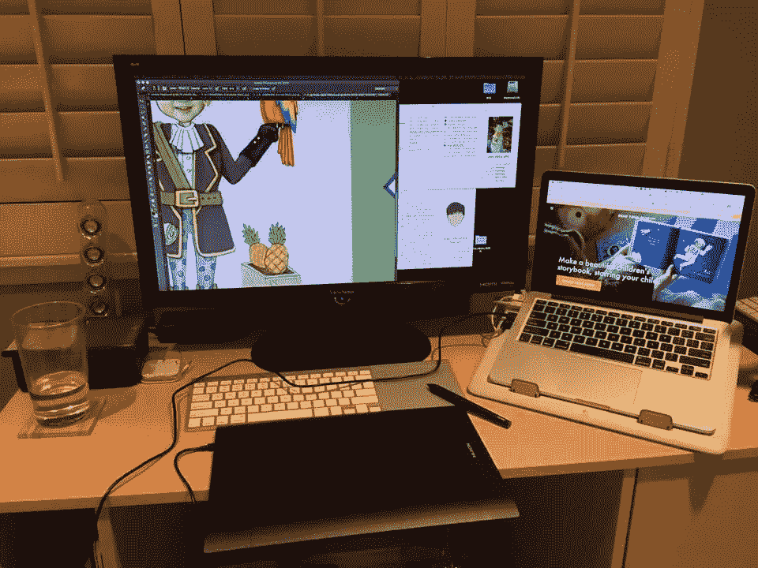
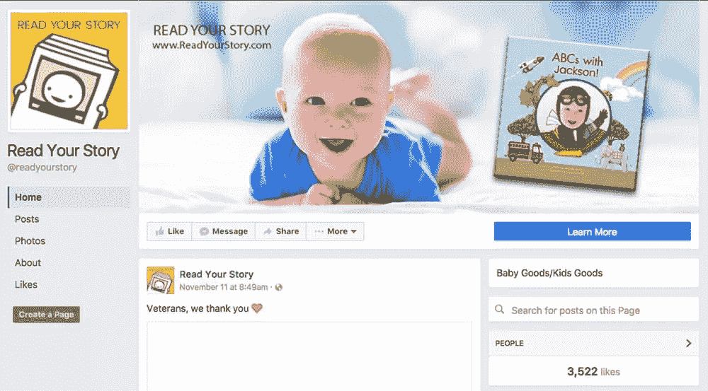
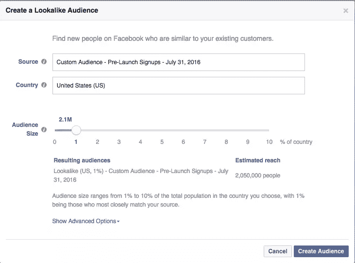
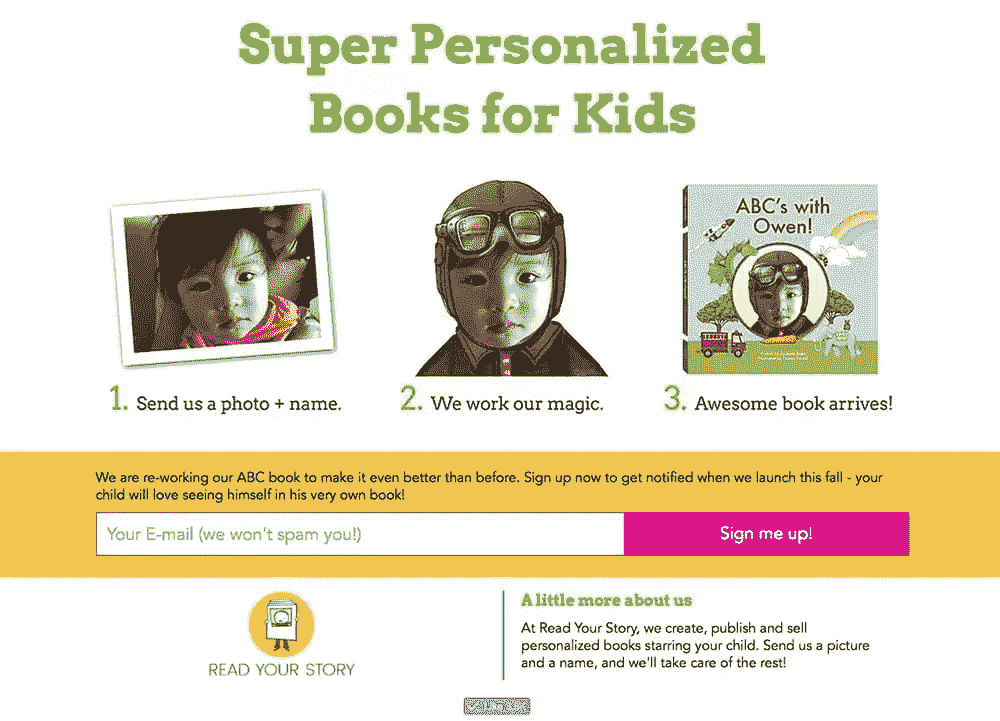

# 我们离开了脸书和谷歌，创办了一家儿童图书创业公司

> 原文：<https://www.sitepoint.com/we-quit-facebook-and-google-to-build-a-childrens-book-startup/>

我的创业故事 [Read Your Story](http://readyourstory.com) 始于 2015 年 7 月一个温暖的夏夜，当时我的家人正在加州帕洛阿尔托的姐姐家吃晚饭。

当我们享受葡萄酒时，我们看着我们的孩子在后院玩耍。当我们聊天时，话题转到了我们有多喜欢和孩子一起讲故事，因为这是一个联系和逃避科技的机会。

像许多其他父母一样，我们担心限制自己孩子的“屏幕时间”。

iPhone 和 iPad 是很棒的设备，但是当我们需要片刻安宁的时候，它们也太方便了，不能成为控制不守规矩的孩子的工具。

我的姐姐珍妮特当时是谷歌的一名营销人员，她问了一个有趣的问题:有没有可能为孩子们制作比 iPad 更吸引人的书籍？

我们开始集思广益，开始分享一些关于幼儿的有趣观察。我们一直注意到，当孩子们看到自己的名字出现在报纸上时，以及看到自己的照片时，他们会变得很兴奋。

为什么我们不能把名字和图片合并到故事书里？

从这顿晚餐开始，我和妹妹进行了几周的研究，惊讶地发现，将面孔和名字融入书中的个性化儿童图书公司少之又少。

现存的质量很差。我们认为我们可以做得更好。

作为一项实验，我们承诺进行短期图书测试来验证市场需求。

当时，我在脸书公司担任产品经理，还不准备辞职。

我们把这个项目作为一个附带项目缓慢而稳定地进行着。

## 通过第一次运行验证概念

在头脑风暴了几本书的概念后，我们决定用一本“ABC”书，因为它是一种简单明了且受父母欢迎的书籍格式。

Jeanette 通过她的网络进行了大量的努力，并与 Donna 取得了联系，Donna 是一位出色的儿童书籍插图画家，她为我们的书注入了活力。唐娜后来成为我们的第三位联合创始人。

我们第一次运行的目标不是赚钱，而是验证定向产品/市场的适合性。

我们承诺制作 50 本书。

当我们准备在 10 月份开始测试时，我们有一个非常可靠的产品可以测试——但是用户体验很糟糕。

我构建了一个简陋的 SquareSpace 网站，以糟糕的购物体验为特色。

如果你想买一本书，你必须:

1.  在表格中填写您孩子的详细信息、送货详情和您的电子邮件。
2.  请将您的信用卡信息提供给我们，以便进行购买。
3.  我们的团队会看到订单，然后通过电子邮件向客户索要他们孩子的照片。
4.  收到顾客的照片后，我们的团队会手动将这张脸裁剪到书的每一页。
5.  最后，这本书被送到一个印刷商那里，然后直接运送给顾客。

每本书花了 3 个小时在 Photoshop 中创作。

这本书的每一页都需要大量的手工绘制——事实证明，在一张真实的脸上遮盖人造毛发是相当具有挑战性的！

在创建了客户的书之后，我们会导出一个高质量的 PDF 文件并上传到 Blurb.com，这是一个非常棒但昂贵的相册工具。

我们在网站上以 35 美元的价格出售每本书，然后 Blurb 会收取 45 美元的印刷和交付费用。

最重要的是，我姐姐和我想得到真实的人想要我们的书的公正数据。因此，我们没有让任何朋友知道我们的项目。我们把这些书的消息分享给化名下的列表和家长群。

我们还投放了一些脸书广告，以提高品牌认知度和一些直接回应。我们有意避免在营销方面过于激进。

我们想知道顾客会如何处理这些书。

幸运的是，即使用户体验很差，反应还是非常积极的。我们的客户分享了我们的网站，并告诉了他们的朋友，我们的大部分销售都是通过口口相传实现的。

这次试运行没有盈利，但是我们能够证明我们的想法有一些需求。

## 如何在发布前获得 6000 名客户的注册

在我们成功的小规模测试之后，我们决定继续测试我们业务的一个更具可扩展性的版本。但首先，我们想建立一个客户名单，以进一步验证需求。

即使在手指触摸代码来开发你的酷新业务之前，我也坚信你必须确定市场验证，这样你才能销售你的产品。

建立名单是验证产品/市场契合度以及从第一天起就为客户排队的最佳手段之一。

Read Your Story 的联合创始人有一种强烈的直觉，我们定制的儿童书籍会在市场上受到欢迎。然而，我们从零开始创建一个品牌。我们到底要如何验证我们业务的可伸缩性呢？

对我们来说，我们通过脸书广告做到了这一点。

## 第一步:给你的脸书页面点赞

我们首先建立了一个简单的脸书页面。

一个漂亮的标志，漂亮的封面图片，和一些可爱的帖子。然后，我们推出了脸书广告活动，优化了人们喜欢我们的页面。

我是前脸书广告产品经理，一般不建议为喜欢而优化

基本上，当你这样做的时候，脸书的目标观众更关注那些“喜欢”的人。

也就是说，**你会得到那些喜欢他们所看到的一切的人。因此，你通过这些活动吸引的观众可能不是对你的产品感兴趣的人的真实信号，但至少是一些粗略的信号。**

但对我来说无所谓。我主要关注的是一个数字:100。

我想把对我的公司有普遍兴趣的粗略的观众集合在一起，聚集 100 个人。

一旦我达到这个数字，我就能从这些粉丝中找到一个长相相似的观众(你需要最少 100 个粉丝来运行长相相似的广告)。

## 第二步:跑得越来越像

长相相似的人是你最好的朋友。

这里的基本思想是，你可以上传一份定制的观众名单到脸书，脸书算法将解析这些人之间的共性，并推断出数千或数百万与名单上的人的个人资料相匹配的“相似”的人。

脸书为其广告商提供了一个极其强大的工具。在我看来，这是**为你的业务锁定高意向客户**的最佳方式之一。

所以当我在开发广告的时候，我不断地重建我的相似者，直到他们达到了我有一些可怕的客户作为目标的程度。

首先，它开始运行一个模仿我的脸书页面的粉丝。很粗糙，但是风扇信号足够开始了。

我开始根据最初的粉丝名单投放广告，并让人们进入登录页面注册我们的预发布。在早期，每次注册大概需要 5 美元。

然后，一旦我通过我的登陆页面找到了 100 个注册我的预发布的人，我就把这些人的名单上传到脸书，作为一个定制观众，并从中创造了另一个相似的观众。

这是一个更好的受众群体(因为他们是选择提供电子邮件的粉丝)，我开始针对这些受众投放广告。注册率提高了，我每次注册只需支付 2 美元。

我继续这个过程来运行广告，获得更多的注册，建立新的定制受众，创造新的相似者——直到我的注册成本远低于每封电子邮件 1 美元，我的目标变得非常有效。

## 第三步:不要忽略登陆页面

为长相更相似的受众进行优化对脸书广告来说非常重要，但最便宜的方法是拥有一个醒目的登陆页面。

在我的广告测试中，我对我们的登陆页面进行了近 20 种排列，最终出现了一些明显的经验，让我实现了高达 28%的注册率的 t 2。

*   **一张图片胜过千言万语**——投资于讲述公司故事或解释产品的优秀创意。
*   **巨大的注册栏和按钮**——越大越好。
*   保持简单–页面越少越好，不要分散人们的注意力。

我用一个叫做 Webflow 的伟大的 WYSIWYG 网站平台制作了我们所有的登陆页面。用这个工具起草这些页面根本不需要时间。

发布前的登陆页面并不是一个你需要投资真正技术的领域，即使 SquareSpace 或 Weebly 在这个阶段也足够了。

现在你已经有了你的大名单，开始吧！

在运行了上述流程后，我们建立了一个大约有 **6，000 名注册用户的列表。**

自从我们发布以来已经有几个星期了，我们享受到了活跃的销售，这在很大程度上要归功于我们建立的精彩的发布前列表。

这份名单将成为我们营销工作的一个重要组成部分，我期待在未来的一年里，它能增长到超过 100，000 名订户。

我们扩大名单的方法并不便宜——它花费了我们 5000 多美元，但我们现在能够通过图书销售来抵消这一成本。请记住，如果你能建立一个转化的渠道，这些邮件的价值远远超过获得它们的成本。

预发布列表对我们团队最重要的作用是验证产品/市场的适合性。当我们开发产品时，看到收集客户电子邮件是多么容易，这让我们的团队感到满意，也激励了我们。

当我们在构建我们的列表和产品时，我们也喜欢经常收到客户的电子邮件，询问我们何时上线。客户的询问给我们的团队带来了巨大的压力，让我们从第一天起就觉得有责任推出一款令人敬畏的产品。

## 我们今天在哪里

我们现在是一个七人团队:3 名联合创始人，3 名工程师和 1 名网页设计师。我们的业务已经准备好扩大规模。

我们开发了技术，允许家长在我们的网站上创建他们自己的书籍，并投资于订单处理、质量保证、印刷和交付的自动化。我有信心，即使我们的团队很小，我们也能轻松完成每月成千上万的订单。

在过去的几个月里，我姐姐离开了谷歌，我也离开了脸书，为这个项目开拓更多的带宽。我们期待着在未来的一年里扩大我们的业务，推出更多的产品和定制产品。

## 分享这篇文章