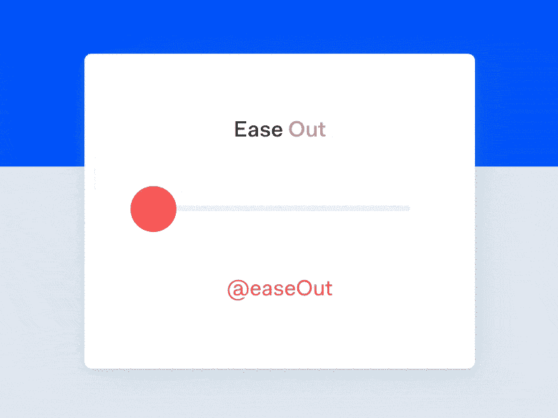
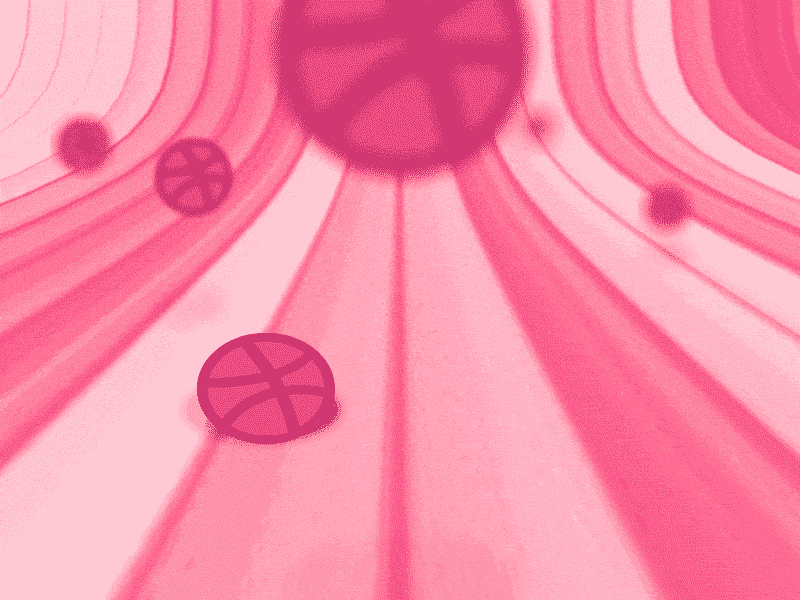
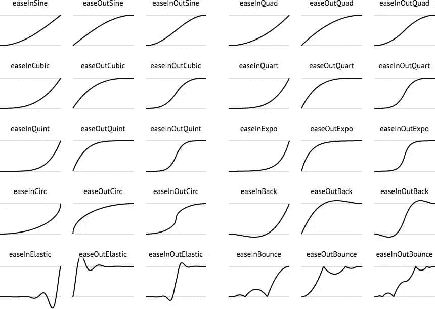
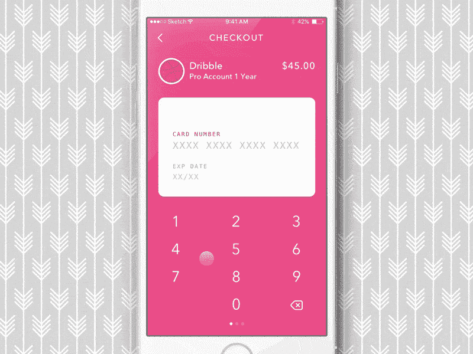
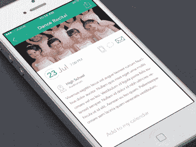
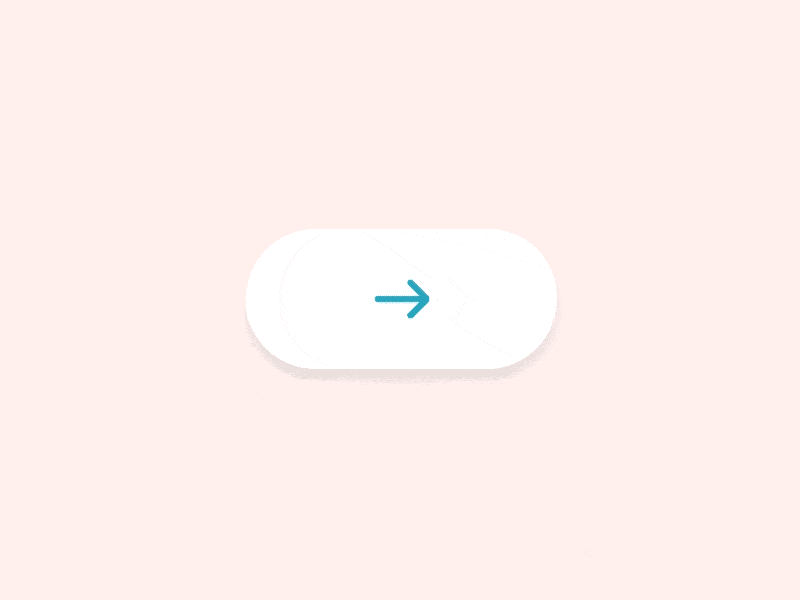

# 动画:使用动画制作更智能的交互

> 原文：<https://www.sitepoint.com/animations-using-easings-to-craft-smarter-interactions/>

麦克·德里昂的放松演示

通过改变动画的长度和速度，您可以创建一些非常独特的过渡，甚至增强用户对[微交互](https://www.sitepoint.com/how-to-lift-your-ux-out-of-the-pack-with-micro-interactions/)的体验。

一个对象动画化的方式通常被称为**放松**，当巧妙微调时，这些放松可以帮助微交互在整个 UI 中安全地陪伴用户，有助于视觉审美，甚至改变用户的情绪。

怎么会？让我们来看看。

## 耳钉可以让界面自然生动

在现实生活中，物体很少匀速运动。例如，当我们开门时，我们开始时加速，结束时减速，因为这是我们肌肉的工作方式。同样地，如果你在地板上拍球，它会先快速上升，然后慢下来，稍作停顿，然后再落到地板上。

Tidjane Tall 的 Dribbble 弹跳球

事实上，我们导航和与世界互动的方式取决于我们对物体运动方式的理解。

*   如果一个物体悬在半空中，你会不由自主地去抓它吗？大概不会。
*   你会尝试登上一辆行驶中的火车吗？希望不会。

我们的大脑被设定为理解**自然运动* *，这就是为什么以自然的方式制作动画会帮助你的用户更容易理解它们。

让我们先来看看放松。

### 季节的类型

见证季节的变化可能是理解它们的最好方式。很多编程语言(比如 CSS)和框架(比如 jQuery)都内置了一套现成的缓和函数。Easings.net 编辑了各种常见的季节。

Easings.net 的季节

考虑一个双面卡界面(也许信用卡信息在正面，安全代码在背面)，您通常会翻转卡来读取代码。你不会以恒定的速度这样做(**线性放松**)。但是你也不会用任何花哨的动作来做这件事(**弹力**或**弹跳**动作)。

Alyona Syvokobylska 的结账动画流程

一个简单的**缓和**动作就足够了，意味着一种状态简单地缓和到另一种状态。如果屏幕上的一个元素从屏幕的顶部掉到了底部，这可能会保证一个**反弹**缓解，因为一些对象在掉落时会反弹。

杰森·莱恩弹出的警报

### 缓入和缓出有什么不同？

**缓入**开始慢，结束快——**缓出**则相反。一般来说，当某物移出时，你应该使用**渐入**，当某物移入时，你应该使用**渐出**。**开始*和结束*时**减速。

事实上，谷歌有一些非常具体的想法，关于元素应该以多快的速度进出，以及速度的加速/减速。

## 季节可以安全地引导用户

一个**弹跳**缓变更加引人注目，使其适合错误消息和弹出对话框，而一个简单的**缓变**过渡不会占用用户太多的时间和注意力，使其更适合微交互。

你选择的放松类型应该取决于动画元素需要多少关注，以及用户需要的动作类型——不同的放松传达不同的东西。

安德雷·米罗诺夫的带有成功/错误状态的按钮

安全地引导用户并非易事；这是动画、色彩、甚至文字运用之间的合作成果；每一个都有助于有效地向用户传达他们下一步应该做什么，或者应该去哪里。

### 一部动画应该持续多长时间？

对于 **ease** 动画来说，200 毫秒-500 毫秒是最佳的；这就给了人脑足够的时间去“阅读”动画，决定用户下一步该怎么做，而不会过多的耽误用户。如果动画太长，用户被迫等待；太短了，会感觉不舒服，这两者都让用户很烦。

**弹性**或**反弹**动画应该有更长的持续时间(大约 800 毫秒-1200 毫秒)以使动画流畅。如果没有这些额外的时间，动画会感觉到剧烈的晃动。

## 季节会影响情绪

与颜色和排版类似，动画可以影响用户的情绪。你可以微调动画的持续时间和放松程度来影响用户*的感受*。

较慢的动画可以暗示优雅或严肃(取决于应用程序/网站的性质)，而较快的动画可以传达更乐观的东西。你的情绪会影响你的决策(例如，较慢、较严肃的语气可能会说服你向慈善机构捐款，而较快、较乐观的语气可能会让你感觉更冲动、更可能花钱)。

由于专家通常倾向于同意*微互动*的季节持续时间，在这方面没有太多的空间来应用品牌。品牌中的动画仍然是一个相对未触及的话题，但是，作为一个规则，我会为较大的组件(模态等)和插图保存复杂的动画(例如，你可以在网页设计中制作 SVG 动画！).

## 延伸阅读:原型动画和季节

你只需要看看现在市场上丰富的设计工具，提供互动和动画原型的方法，就能理解为什么运动在 UX 扮演着如此重要的角色。Principle、FramerJS、Atomic App、InVision App、漫威 App、Flinto、Proto.io 等等(你可以在[uxtools.co](http://uxtools.co/tools/#/prototyping)对比一下)都是一些大牌。就我个人而言，Atomic App 是我的首选，因为我喜欢用它们的[高级动画控制](https://www.sitepoint.com/handle-complex-animations-with-atomic-io/)来定制季节是多么容易，这是我不久前写的。

我也喜欢 InVision 应用程序，因为他们的 [Craft 插件](https://www.sitepoint.com/making-crafty-uis-sketch-photoshop/)允许我直接在 Sketch 中制作过渡和用户流的原型！

比较动画/原型工具

## 结论

动画当然很流行，尤其是在网页设计中，CSS 转换已经得到了现代浏览器的广泛支持，而不会对页面性能产生太大影响(与 CSS 转换相比，jQuery easing 函数非常依赖 GPU)。

但是——与使用颜色或字体没有什么不同——它们不应该被轻率地使用(例如，因为它们看起来“很酷”,或者因为你想为了使用现代技术而使用现代技术)。糟糕的动画使用会阻碍用户体验，就像正确使用时会增强用户体验一样。

有什么动画或者交互小技巧可以分享吗？

请在评论中告诉我们！

## 分享这篇文章