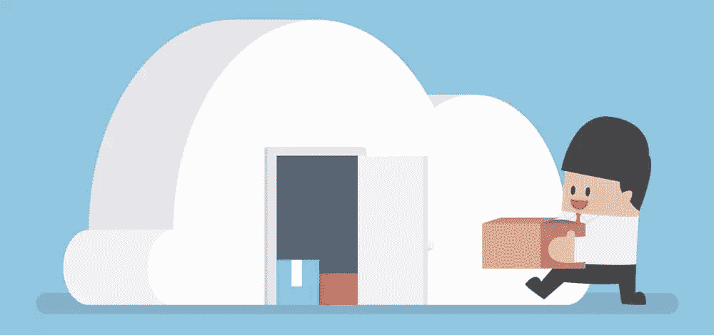
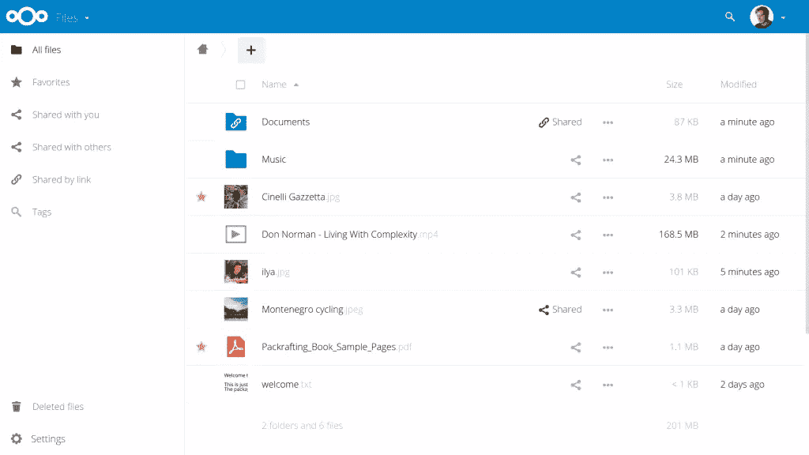
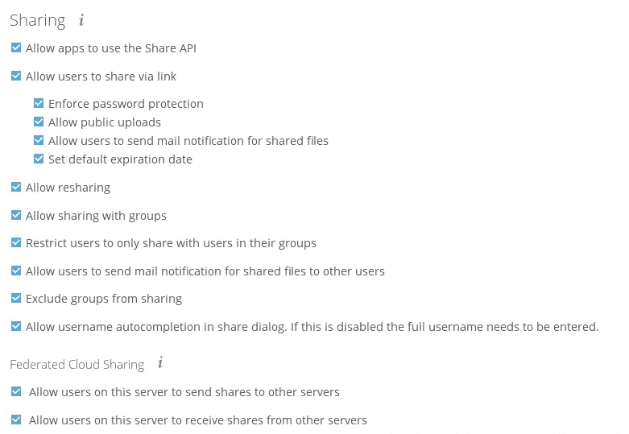
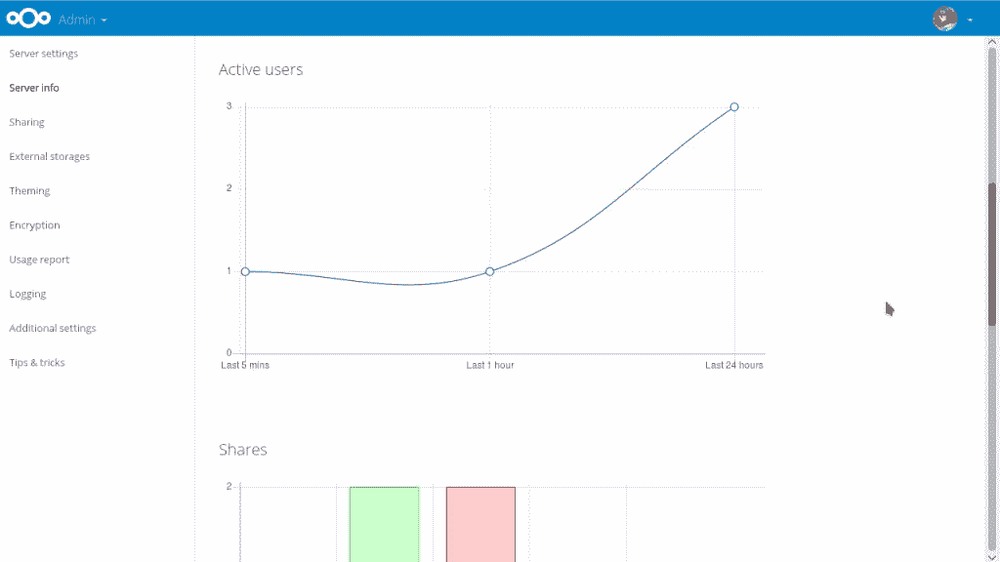
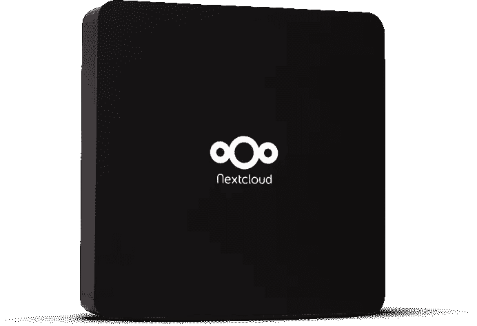

# Nextcloud:一个开源的 Dropbox，Google Drive 的替代品

> 原文：<https://www.sitepoint.com/nextcloud-an-open-source-dropbox-google-drive-alternative/>

SitePoint 的开源周到了！整整一周我们都在发布关于开源、自由软件和社区的文章，所以请继续查看 ***[OSW 标签](https://www.sitepoint.com/blog/)*** 获取最新更新。

像 [Dropbox](https://www.dropbox.com) 、 [Google Drive](https://www.google.com.au/drive/) 和 [OneDrive](https://onedrive.live.com) 这样的文件存储服务如今非常受欢迎。它们会自动将您的文件同步到云和您的各种设备，使您的数据高度可访问，并确保数据不容易丢失。

他们提供一定数量的免费存储，但如果你想在线存储大部分或全部文件，你需要付费。他们的费用不是特别高，但仍然，有一个免费的选择是很好的。

幸运的是，还有其他选择。其中之一是 [Nextcloud](https://nextcloud.com/) ，这是 Dropbox 的开源替代品，其他的你可以**在自己的服务器**上安装和维护。

让我们来看看考虑使用 Nextcloud 的一些理由。

## 大玩家怎么了？

有理由问，当 Dropbox 和 Drive 这样的服务如此容易使用时，我们为什么要费心在自己的服务器上设置一些东西呢？它们基本上是即插即用的，由大公司支持和维护，这些公司在提供安全可靠的服务方面有利害关系。

不过，它们也有不好的一面。当然，费用是固定的，不是根据每个人的需求量身定制的，而且可能随时变化。

通过使用它们，你也将你的数据委托给了那些[不完全值得你信任的公司](http://applehelpwriter.com/2016/07/28/revealing-dropboxs-dirty-little-security-hack/)。正如苹果公司的[条款和条件](http://www.apple.com/legal/internet-services/icloud/en/terms.html)中强调的那样，如果他们愿意，他们可以随时篡改你的数据:

> 苹果公司保留在任何时候确定内容是否适当的权利…并且可以在任何时候预先筛选、移动、拒绝、修改和/或删除内容，无需事先通知并自行决定…

当然，他们可以直接关闭。(这种情况不常发生，但确实会发生。)他们也可以被买断。记得日出日历吗？当微软买下他们的日历应用时，他们做了什么。

## 夺回控制权

Nextcloud 是一种云软件替代方案，可以让您完全控制自己的数据。它是为拥有大量用户的个人和组织而设计的。这是一个相对年轻的项目，是类似的 [ownCloud](https://owncloud.org/) 项目的分支，也值得检查和比较。

[图片由 Nextcloud](https://nextcloud.com/wp-content/themes/next/assets/img/features/serverwebui.png?x16328) 提供

控制自己的数据非常有吸引力，但 Nextcloud 在功能和安全性等其他方面如何与商业玩家相抗衡？让我们来看看。

### 安全和定制双因素身份认证(2FA)

在安全方面，Nextcloud 提供了[文档](https://nextcloud.com/security/)来解释安全最佳实践。不安全或有争议的功能被严格拒绝，强制性的代码由另外两个评审员评审，以确保一切都是防弹的(或尽可能地防弹)。

此外，Nextcloud 身份认证系统有两个因素。通过在管理设置中删除用户或更改密码，可以通过列表使活动会话失效。管理员可以在命令行上为用户启用或禁用双因素身份验证。

虽然 Dropbox 等其他专有服务也提供 2FA，但 Nextcloud 允许您为组织的特定成员“强制”启用或禁用 2FA。稍加调整，你也可以创建自己的 2FA 提供商，以避免被特定的 2FA 应用程序所束缚。对关心这里安全的人来说是巨大的优势。

### 加密

Nextcloud 还提供服务器端加密，这不是开箱即用的(为新人提供更好的用户体验)。Nextcloud 服务器会加密远程数据，但默认情况下，您的本地存储不会加密。重要的是要意识到加密确实会增加 35%的文件大小，如果您担心安全性，这并不一定会影响交易。

**注意:** *一旦启用，服务器端加密将无法在管理仪表板中禁用。所以一定要定期备份用户加密密钥。如果丢失了一个密钥，就无法再访问该数据。*

### 联盟共享

Nextcloud 提供的另一个功能是[联合共享](https://nextcloud.com/federation/)，它从远程 Nextcloud 服务器(或其他支持它的服务器，如 ownCloud-powered 服务器)安装文件共享，以创建您自己的云集群。想象一下，这是 Dropbox 或 Google Drive 中的文件夹，你被邀请进行协作并可以访问。然而，在这种情况下，它使用的是开放协议，与许多其他提供商(如 ownCloud)兼容。装载的共享将允许您直接访问邀请您访问的文件夹，因此您的服务器空间不会被您自己的文件副本占用。

[图片由 Nextcloud](https://nextcloud.com/wp-content/themes/next/assets/img/features/sharing_admin.png?x16328) 提供

这允许分散的文件共享，无论数据存储在哪里，并具有灵活的管理权限来设置个人用户权限。您可以使用一个联合云 ID，基于您的用户名(例如:`username@example.com/nextcloud`)与其他 Nextclouders 共享文件。

### 服务器信息应用程序

[图片由 Nextcloud](https://nextcloud.com/wp-content/themes/next/assets/img/features/monitoring.png?x16328) 提供

使用服务器信息应用程序，您还可以检查 Nextcloud 服务器的性能。这对于排除故障或改进服务器很有用。该应用程序是 Nextcloud 安装的一部分，因此您不需要手动安装任何东西来使用它。它允许您跟踪:

*   CPU 负载和内存使用
*   一段时间内的活动用户数
*   各种类别的股份数量
*   存储统计
*   服务器设置，如 PHP 版本、数据库类型和大小、内存限制等等。

### 在您自己的服务器上安装 Nextcloud

在您自己的服务器上安装 Nextcloud 实例非常容易，无论它是共享主机还是您有 root 权限。我们不会在这里深入讨论这个过程，但是如果您不习惯命令行，也可以使用用户友好的拖放选项。(这是有道理的，因为可靠的开源替代方案最好不会吓跑普通用户。)

查看简短的[安装说明](https://nextcloud.com/install)来安装你自己的云实例。这不会花费你超过几分钟的时间，因为这个过程非常简单。

之后，您可能希望为您的桌面或移动设备安装一个[客户端，它将能够访问您的 Nextcloud 实例。每个平台都有一个可用的，你甚至可以使用任何其他 WebDAV 客户端(如 ownCloud)来访问你的 Nextcloud 实例。](https://nextcloud.com/install/#install-clients)

Nextcloud 为用户提供了广泛的机会来根据他们的需求定制它。Nextcloud 应用程序的工作方式类似于浏览器扩展，只是其中一些应用程序支持核心功能(如邮件、日历、联系人等)。).你也可以尝试[开发自己的应用](https://docs.nextcloud.com/server/10/developer_manual/app/index.html)。

### Nextcloud 箱

[图片由 Nextcloud](https://nextcloud.com/wp-content/themes/next/assets/img/box/box-perspective.png?x16328) 提供

为了迎合那些希望更多地控制自己的数据，而不经历系统管理麻烦的用户，Nextcloud 与 [Canonical](http://www.canonical.com/) 和 [WDLabs](http://wdlabs.wd.com/) 合作，推出了 [Nextcloud box](https://nextcloud.com/box/) 、*一种面向家庭用户的私有云及物联网解决方案*。这个盒子由 WDLabs 的 1 TB USB3 硬盘组成，由 Raspberry Pi 2 驱动。Snappy Ubuntu Core 是安装在 microSD 卡上的默认操作系统。在服务器端，它与 Apache web 服务器、MySQL 和最新的 Nextcloud 版本一起运行。

这个盒子可以作为家庭网络的小型本地服务器。默认情况下，Nextcloud Box 只在它所连接的网络上工作(比如你的家庭局域网)。它需要配置加密(https)和路由器端口，以便从家庭网络外部访问它。

Nextcloud box 适合的一些用例是家庭内部的共享本地网络，每个人都可以从每个设备访问。对于小型创业公司或团队来说，这似乎也是一个坚实的开端，可以在他们的物理空间内相互共享文件。一个很大的优点是，人们实际上知道他们的数据在物理空间的哪里，而不是在亚马逊沙漠中的某个大数据中心。然而，这个盒子并不是一个全方位的解决方案，而是一个展示 Nextcloud 功能的参考设备。

Nextcloud 盒子花了你 80 美元(不包括 Raspberry Pi 2 ),可以从 Nextcloud 网站订购。

### 即将推出的 Nextcloud 功能

Nextcloud 11 计划于 2016 年 12 月发布，它将拥有各种新功能，与它的前身 ownCloud 有更大的区别。其中包括:

*   用户社交媒体按钮
*   评论中的用户提及
*   通过电子邮件分享
*   移动文件/文件夹
*   共享当前文件夹
*   共享预览

你可以通过观看 [GitHub repo](https://github.com/nextcloud/server) 来跟踪 Nextcloud 团队正在开发的所有功能。

## 开源提供了下一个云解决方案吗？

切换到开源文件共享选项对您或您的企业来说可能是也可能不是正确的选择。重要的是要权衡开源和商业选择的利弊，并找出什么对你最有利。可以说，对于许多个人和企业来说，开源文件共享工具是一个可行且有吸引力的选择。

Nextcloud 已经能够在 ownCloud 的基础上在许多方面进行改进。对自己和 Nextcloud 的比较仍然经常发生，但随着 Nextcloud 推出更多自己的功能，它将取代自己的位置，成为一个成熟的独立项目。希望即将推出的功能不仅是前沿的，而且是用户友好和直观的。

鉴于这些开源选项可以免费使用和试验，尝试一下没有什么危险。你觉得怎么样？这听起来像是一个有吸引力的选择吗？你会考虑做出改变吗？还是你已经冒险了？如果你有，请告诉我们你在评论中发现了什么。

## 分享这篇文章