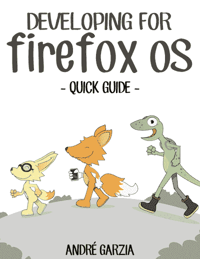

# Firefox 操作系统剖析——采访 Andre Garzia

> 原文：<https://www.sitepoint.com/firefox-os-post-mortem-interview-with-andre-garzia/>

SitePoint 的开源周到了！整整一周，我们都在发表关于开源、自由软件和社区的文章。

我很高兴今天能邀请到 Andre Garzia，他是 Mozilla 的技术发言人，Firefox OS 书籍的作者，也是过去几年 Mozilla 的贡献者。在 SitePoint，我们倾向于报道前沿话题，让开发者了解网络上的最新动态。然而，这一次，我们将回顾并谈论 Firefox OS，你可能已经听说过，它在今年早些时候已经停产了。我们将了解它所代表的东西，它对网络有什么影响，以及我们可以从中吸取什么教训。

* * *

安德烈，你能来真是太好了！也感谢你花时间来介绍一些关于 Firefox OS 的事情，这可能是一个相当困难的话题，因为我们都对它充满了热情。

安德烈:这是我的荣幸。我相信，经过这么长时间，我们可以用一种不那么偏颇的方式来看待火狐操作系统。

我想是的。如果你能告诉我更多关于你在 Mozilla 的情况，以及你最初是如何参与 Firefox OS 的，那就太好了。

Andre: 我参加了一个黑客马拉松，是在巴西的一个校园派对上。他们在那里举办了持续很多天的大型黑客马拉松。人们基本上一天 24 小时都在那里露营。我一个人去了那个活动，我没有一个团队一起出去玩，在那个活动的前几天，我去了一个 Firefox OS 应用日，在那里他们解释了系统和 API-s。

当我到达没有人一起闲逛的校园聚会时，我看到了那里的 Mozilla 人。当时我不是 Mozilla 志愿者，所以我决定加入。问题是，我有一个有点不公平的优势:我在活动前几天参加了应用日，所以我已经知道 API 和一切。我周围的人犯了很多错误。我开始帮助别人，而不是专注于自己的入口。几个小时后，我完全忘记了我的条目，我正在帮助每个人使用 API 和如何用 JavaScript 做事情。突然一个志愿者拍了拍我手上的 VIP 手环，说:*欢迎来到 Mozilla！有了这些钱，我至少可以从贵宾室得到咖啡和小吃。我就是这样成为 Mozilla 和 Firefox OS 的志愿者的。*

疯狂的故事！后来你也写了一本关于 Firefox OS 的书，这是怎么回事？

安德烈:实际上，我最后写了两本书，用葡萄牙语和英语，所以差不多有四本书。第一本书的出现是因为许多巴西开发者不会说英语，Mozilla 也没有葡萄牙语的资料。Mozilla 文档随处可见，如 GitHub、Wiki 等。没有一个单一的知识中心，人们可以说，好吧，这就是我需要开发的。我们最接近的东西是一页英文。

当时我们在巴西南部计划了一个 Firefox OS 黑客日。然而，我深深担心人们无法获得文档，我失眠了，所以当我有这个想法时我已经醒了:我想写一本书。

所以在活动前的那个周末，我写了整本书，葡萄牙语版大概有 60-70 页，就像给黑客马拉松提供参考资料一样。这本书获得了成功，我进入了谷歌代码之夏，将它翻译成英文，并进一步扩展。

Elio:火狐操作系统是如何与其他移动平台区分开来的？作为内部人士，你认为火狐操作系统有什么特别之处？

Andre: 开发人员可以重用他们 web 应用程序的代码，并用它在其他平台上交付；这是非常强大的，因为火狐操作系统非常容易开发。即使你没有发布火狐操作系统的代码，在火狐操作系统下开发、测试所有东西并把它传递给 Phone Gap 和 Android 也是很容易的。从开发者的角度来看(尤其是新手),火狐操作系统更加平易近人。Firefox OS 的开放性允许每个人加入，这导致人们从自己的市场或自己的需求出发进行开发，这很重要。另一件真正引起我共鸣的事情，也是我们失去的东西，是 Firefox 是公开开发的:你可以加入，帮助影响
平台向前甚至向后，但每个人都可以加入的想法是一件强大的事情。

Elio:那时，我们有许多来自社区的不同发布团队，我们会在每个特定的国家推出 Firefox OS。你能解释一下火狐操作系统项目治理的大致情况吗？

**Andre:** 实际上，我大概不能*(笑)*，因为事情变了。Mozilla 有时感觉像霍格沃茨，有移动的楼梯*(笑)*，你会想:好吧，这个东西叫什么来着？我能说的是，社区发布团队都是基于志愿者的，他们支持在各自国家的发布。

这个想法，即社区的人们可以开始与主要的电信运营商和营销机构在同一个领域竞争，这也是非常强大的。

埃里奥:我想这对人们来说是令人兴奋的。

安德烈:是的，令人兴奋，要求很高，有时很难证明为此付出的努力是值得的。关于治理，我能告诉你的一件事是，即使作为一个局外人，你也可以和一个联系人交谈。你可以加入对话和过程，我怀疑你能在其他任何地方找到这样的规模。

**Elio:去年，重点将从低端设备转向高端设备。人们可以看到 Firefox OS 成功的唯一细分市场是低端市场，而现在，这个市场已经被移除了。那里发生了什么？**

**Andre:** 智能手机市场非常残酷，如果你试图在低端市场竞争，你的利润会非常小。这真的很难赢，特别是因为技术在不断进步，今天的中端设备在几个月内将成为低端设备，所以继续前进变得很难，我们需要提醒自己，Mozilla 没有制造设备，Mozilla 制造了系统，硬件合作伙伴制造了设备。

Elio:我明白你的意思，但我想说的是，Mozilla 一直很难将自己与桌面浏览器之外的东西联系起来，所以对于开发人员来说，Firefox OS 是一个令人兴奋的时代，他们可以从事其他工作，并拥有一个替代的移动操作系统。在它被停止后，你认为 Mozilla 开发者的看法是什么，开发者的反应是什么，你认为会有什么影响？

Andre: 事情是这样的，Firefox OS 的取消引起了很大的争议，Mozilla 中的一些人，包括工作人员和志愿者，都认为取消是个好主意。他们基本上是通过说这个系统和这个项目是一个金钱的无底洞来为它辩护的。我们不停地往里面投钱，但什么也没出来。这是正当理由，真的很难反驳。Mozilla 的其他部分，工作人员和社区贡献者都认为这是一个糟糕的决定。我是少数几个认为这是个错误决定的人之一。我记得我解释了为什么我这样认为，它被一些人接受，而不是其他人，但仍然有一些人两极分化。我认为，如果你在一次讨论中有 4 个以上的莫桑比克人，他们就会开始战斗。

Elio:说到这里，你认为 Firefox OS 对 JavaScript 技术有什么影响？它留下脚印了吗？

**Andre:** 它向人们证明了网络平台是有能力的，我们可以访问硬件控制，我们可以构建本地应用，这太棒了，真的很有影响力。许多关于新 API 和其他东西的想法由此而来。现在困扰我的是，我们可以将网络作为一个平台向前发展，网络平台可以与原生平台竞争的整个想法，是人们移动或后退的事情，像 Mozilla 和 Google 正在删除 API。尤其是 Mozilla 删除了很多 API，这让我很困扰，因为当你删除了一个 API，你就降低了网络平台的能力。

Elio:这让人们认为网络不能做本地应用能做的事情。

安德烈:正是，当我们知道它可以。所以像移除电池 API 这样的事情困扰着我。如果我们删除这些 API，我们将永远不会再创建这样的 API。我希望网络平台能与原生平台竞争，但如果 Mozilla 和其他公司继续移除允许我们在网络之外分支的 API，那么它将永远无法竞争，这让我很困扰。

那时候，有人说 Firefox OS 将会进入联网设备，这将成为物联网的基础，很快就有人宣布它将会消亡。我个人感觉这一切都是计划好的，Mozilla 只是想给我们一点悲伤的时间，然后扔下整个炸弹。你怎么看出来的？

**Andre:** 我理解为什么有些决定是私下做出的，因为与商业合作伙伴一起做出决定不是你可以在公开场合讨论的事情，有很多合同和资金在流动，但我们与社区成员打交道的方式是错误的。我认为我们失去了一个机会。我们决定把一切都抛到九霄云外，现在，我们没有产品，我们有联网设备领域的项目，我们喜欢一些项目胜过其他项目，所以人们有他们最喜欢的，但我们没有为开发者、制造者和创造者提供服务。我们完全忽略了创客社区。

艾利欧:我明白。这似乎不太热情，但你会如何看待 Mozilla 在未来成为移动平台或物联网的玩家？

Andre: 我认为现在还不行，它不能影响市场，因为它没有基础。但是如果你想在物联网领域做点什么，Mozilla 没有什么可以帮到你。没有解决方案，没有技术框架，没有操作系统，或者任何你可以利用的东西。我认为我们失去了影响人们的机会，因为我们需要更多地关注开发者，因为最终用户会去开发者带领他们去的地方，如果所有的开发者都在使用其他供应商的解决方案，那么我们就失去了我们的影响力。

## 分享这篇文章