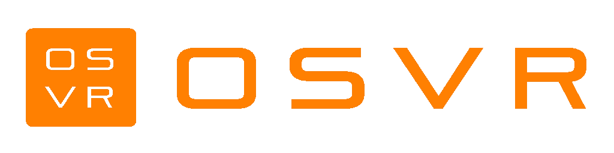
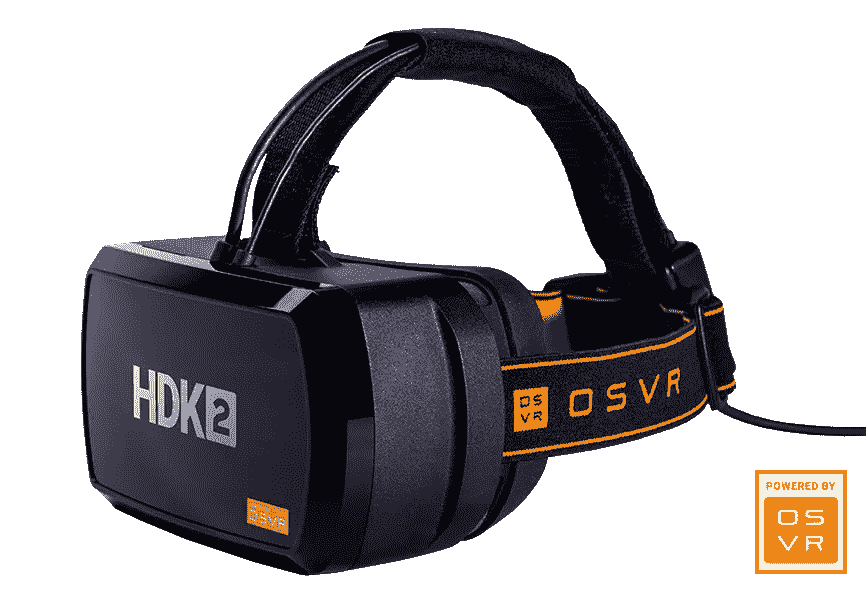
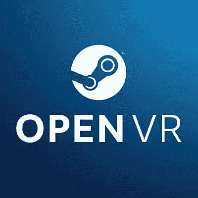

# OSVR 简介

> 原文：<https://www.sitepoint.com/an-introduction-to-osvr/>

SitePoint 的开源周到了！整整一周我们都在发布关于开源、自由软件和社区的文章，所以请继续查看 ***[OSW 标签](https://www.sitepoint.com/blog/)*** 获取最新更新。

开放源码正在主宰世界，因为它现在随处可见。直到最近，虚拟现实还是一项专有技术。但现在不是了——OSVR 努力改变这种情况，让事情有所不同。一些读者可能已经熟悉这项技术了，因为 Elio 在 SitePoint 的一篇关于新兴技术的 [Sourcehunt 文章](https://www.sitepoint.com/sourcehunt-emerging-tech-edition/)中简要地介绍了它。在本文中，我们将更详细地研究它。

OSVR 代表开源虚拟现实。该耳机和技术的主要开发商是 Razer，这是一家在游戏玩家和 Sensics 中非常知名的公司，专注于制造 VR 产品。该平台得到了超过三百个合作伙伴的支持，其中包括行业领导者，如 T4、英特尔和 T5。

## OSVR 到底是怎么回事？

OSVR 不仅仅是另一个耳机。这是一个完整的运动。据其开发者称，该平台并不旨在与竞争对手竞争。OSVR 旨在与其他几种头戴式显示器一起工作，并致力于建立一种开放标准，以便现有设备和软件可以互操作。

拥有兼容 OSVR 的 HMD 的开发者和消费者，[已经可以通过配置他们的设备开始使用](http://www.osvr.org/getting-started.html)。OSVR 网站提供了一个完美的[展示，展示了他们兼容并准备运行的软件](http://www.osvr.org/featured.html)(也称为“体验”)。已经有游戏，媒体播放器，模拟器等等！也有很多基于 SteamVR 的内容。

目前，OSVR 支持的操作系统包括 Android、GNU/Linux、Mac OS X 和微软 Windows。

## 耳机(hdk)

有兴趣试试 OSVR 吗？现在有两种不同的耳机——称为黑客开发工具包(HDKs)——可供选择。

OSVR [HDK1](http://www.osvr.org/hdk1.html) 于 2015 年 7 月首次亮相。它采用 5.5 英寸有机发光二极管显示屏，支持 1920 x 1080 像素的分辨率(每只眼睛 960 x 1080)。HDK1 与加速度计、陀螺仪和指南针等传感器捆绑在一起。有三个 USB 3.0 端口，两个内置，一个外置。价格从 300 美元起。

OSVR [HDK2](http://www.osvr.org/hdk2.html) 于去年夏天发布，与其前身非常相似，但配备了改进的显示屏。它支持 2160 x 1200 像素的分辨率(每只眼睛 1080 x 1200)，像素密度为 441 PPI，运行速度为 90 FPS，而 HDK1 为 60 FPS。基本套件的价格为 400 美元。

hdk 既不提供内置音频输出，也不提供输入；必须使用外齿轮。

至于您需要的系统要求，对于 HDK1，您最好至少配备英特尔酷睿 i5 3GHz 或同等 CPU、英伟达 GTX 660 和最低 8GB 内存。而对于 HDK2，建议使用英特尔酷睿 i5-4590 等效或更高的处理器，以及 NVIDIA GeForce GTX 970 或 AMD 镭龙 R9 280 或等效的显卡，捆绑至少 8GB RAM。

应该注意的是，该生态系统并不专属于 HDKs，并且[与第三方显示器](https://osvr.github.io/compatibility/)兼容。最精彩的部分？为 OSVR 开放标准开发的任何软件都意味着可以与所有兼容 OSVR 的硬件一起工作。开放和包容在这里发挥着关键作用。

## OSVR 在哪里？

项目代码可在 [Apache License 2.0](https://www.apache.org/licenses/LICENSE-2.0) 下的 [Github](https://github.com/OSVR/) 上获得；这允许每个人出于任何目的使用、修改和重新发布软件。HDKs 的设计和示意图也是如此——任何拥有 3D 打印机和合适材料的人都可以从头开始构建自己的 3D 打印机。

像许多其他开源项目一样，OSVR 有一个由开发者、支持者和朋友组成的广泛社区。在线资源包括 [OSVR 论坛](http://www.osvr.org/forum/)以及 [OSVR 子编辑](https://www.reddit.com/r/OSVR/)。网站上还有[开发者专区](http://developer.osvr.org/)和单独的[开发者门户](http://osvr.github.io/)。为了开发者之间的交流，OSVR 也有邮件列表。此外，社区使用 IRC 在 Freenode 上的#osvr 进行实时聊天。

只要考虑到用户支持，就存在一个[支持门户](https://support.osvr.com/)，它可以用于提交支持票并连接到[文档](https://github.com/OSVR/OSVR-Docs#readme)。

最后一点，OSVR 在社交媒体上。确保在[脸书](https://www.facebook.com/OpenSourceVR/)和[推特](https://twitter.com/opensource_vr)上查看他们的简介。

## 开发商

说到游戏引擎，各大玩家纷纷加入。 [CryEngine](http://docs.cryengine.com/display/CEPROG/VR+-+OSVR) ， [SteamVR](https://github.com/OSVR/SteamVR-OSVR) ， [Unity](https://github.com/OSVR/OSVR-Unity) ，[虚幻](https://github.com/OSVR/OSVR-Unreal)和 [WebVR](https://github.com/OSVR/OSVR-Docs/blob/master/Integrating-Game-Engines/WebVR/webvr.md) 不一而足。如果你想开始游戏开发，官方的[文档](https://github.com/OSVR/OSVR-Docs/blob/master/README.md#game-engines-and-osvr)会派上用场。扩展教程应该也指日可待。

不仅仅是开发者，拥有不同技能的虚拟现实爱好者也被强烈鼓励[参与](https://osvr.github.io/contributing/)平台的发展。他们有一个 [Waffle.io 板](https://waffle.io/osvr/osvr-core)，上面有 GitHub 问题的概述，等待人们来帮助解决。就你需要了解的编程语言而言——绝大多数项目代码都是用 C++编写的。JSON，主要出现在硬件配置上，占了另一大部分。

去年 6 月， [OSVR 开发者基金](http://www.osvr.org/fund.html)启动。底池中有多少钱？500 万美元，而且还在增加！到目前为止，Razer 已经[投资了数百款游戏中的 15 款](http://www.osvr.org/forum/viewtopic.php?f=2&t=4070)。该基金对所有人开放，注册仍在进行中。

## 额外奖励:OpenVR

[OpenVR](https://github.com/ValveSoftware/openvr) 是一个将应用链接到 VR 设备的 API。API 由[阀门软件](http://www.valvesoftware.com/)提供支持，并获得[BSD 三条款许可](https://opensource.org/licenses/BSD-3-Clause)的许可。

去年，Razer [宣布了 OpenVR 和 OSVR](http://www.razerzone.com/press/detail/press-releases/osvr-expands-content-range-and-adds-15-new-partners) 之间的合作伙伴关系，这种关系一直持续到今天。

## 前方的路

OSVR 头戴式耳机与其竞争对手短兵相接，但价格却低得多。此外，该项目并不局限于特定的设备，而是侧重于增加当前和未来技术之间的合作。

前面的路还很长。资源是丰富的，尽管它们分散在各个网站上，这对于试图入门的新爱好者来说可能有点令人不知所措和沮丧。尽管如此，开源和开放硬件的真正价值得到了自豪的体现，使个人能够做出贡献，甚至生产自己的硬件！

总而言之，OSVR 是一个非常有前途的倡议，具有伟大的使命和巨大的潜力。VR 到人民！

## 分享这篇文章